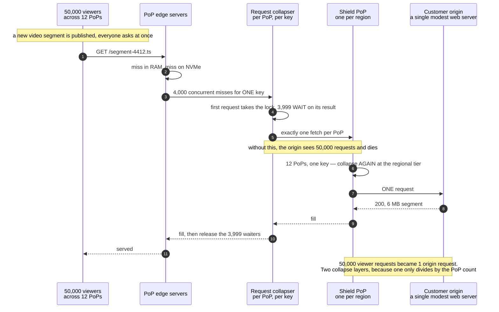

# Design a CDN

> Not *use* a CDN — **be** one. Hundreds of PoPs, a routing layer that sends each viewer to the
> right one, a cache hierarchy that protects customer origins, and a purge system that reaches
> every server on Earth in seconds.
> **The hard part:** you are designing the thing the rest of this folder treats as infinite and
> free. Every assumption other cases make about the edge is now a component you own, size and
> bill for.

## 1. Clarify

| Question | Assumed answer |
|---|---|
| Who are the customers? | Other companies' websites and video platforms. Multi-tenant from line one |
| What is cached? | Static objects and cacheable dynamic responses. Video segments are the volume |
| Routing mechanism? | **Anycast** for the majority, DNS-based steering where we need finer control |
| Purge SLA? | Under 5 seconds to every PoP, globally. This is a sold feature, not best effort |
| Do we do TLS termination? | Yes — customer certificates, SNI, and we must support their custom domains |
| Origin protection? | Yes — shield tier, request collapsing, and a WAF hook |
| Logs? | Per-request logs delivered to customers, plus real-time analytics. **This is a data pipeline bigger than the cache** |
| Scale? | 200 PoPs, 50 Tbps peak egress, 100M requests/s peak, 10k customers |

**Non-goals:** the WAF rule engine itself, video transcoding (customers arrive with segments
already made), DDoS scrubbing beyond volumetric absorption, our own DNS registrar.

## 2. Requirements

**Functional**
- Serve cacheable objects from the nearest healthy PoP
- Fill from a customer origin on miss, collapsing concurrent misses to one origin request
- Per-customer cache key configuration, TTL rules, and header manipulation
- Purge by path, by wildcard and by surrogate key
- TLS termination for customer domains, with automated certificate issuance
- Per-request logging and near-real-time analytics

**Non-functional**

| Target | Value |
|---|---|
| Cache hit latency | p50 < 10 ms, p99 < 50 ms from viewer to first byte within a metro |
| Hit ratio | > 90% of requests, > 95% of bytes, measured per customer |
| Purge propagation | p99 < 5 s to 200 PoPs |
| Availability | 99.99% per PoP-region; a single PoP loss must be invisible to viewers |
| Isolation | One customer's traffic spike must not evict another's working set |

> [!info] The number that defines the system
> **50 Tbps.** At that scale the design is decided by *where bytes are stored and how often they
> cross an expensive link*, not by request handling. Everything below is in service of not
> fetching the same object twice.

## 3. Estimates

```
Traffic:    50 Tbps peak = 6.25 TB/s
PoPs:       200, so ~250 Gbps average per PoP, ~1 Tbps at the largest
Per PoP:    1 Tbps needs ~10 servers at 100 Gbps, each with NVMe
Cache size: working set per PoP — the 90/10 rule says ~10% of the catalogue
            serves 90% of requests. 20 TB NVMe per server × 10 = 200 TB per large PoP
RAM tier:   512 GB per server for the hottest ~1% — RAM serves at line rate,
            NVMe at ~7 GB/s, so the split decides p99 more than anything else
Misses:     10% of 100M req/s = 10M req/s toward origins, BEFORE collapsing.
            After shield + request collapsing: ~100k req/s reaching customer origins
Logs:       100M req/s × ~200 B = 20 GB/s = 1.7 PB/day of raw log
            ← larger than most companies' entire data platform, and it is a SIDE EFFECT
Certificates: 10k customers × ~5 domains = 50k certs, renewing every 60-90 days
            ≈ 700 issuances/day, which must be automated or it is a full-time team
```

> [!warning] The estimate people miss
> **The log pipeline is the second system.** 1.7 PB/day of access logs is a bigger engineering
> problem than the cache. Say the number, then say you would sample, aggregate at the edge, and
> only ship raw logs for customers who pay for them.

## 4. API / contract

Two surfaces, and confusing them is a design error: the **data plane** viewers hit, and the
**control plane** customers configure.

```http
# Data plane — the viewer
GET /assets/hero.jpg  Host: cdn.customer.com
  → 200, with:
     X-Cache: HIT | MISS | REVALIDATED | STALE
     Age: 412
     Cache-Control: public, max-age=3600, stale-while-revalidate=600, stale-if-error=86400

# Control plane — the customer
PUT  /v1/properties/{id}/config
  { origins: [...], cache_rules: [ {match, ttl, key: {query: ["v"], headers: [], cookies: []}} ],
    tls: {domains: [...]}, shield_region: "eu-central" }
  → 202 { version, rollout_state: "propagating" }

POST /v1/properties/{id}/purge
  { type: "tag" | "path" | "wildcard", values: ["product-123"] }
  → 202 { purge_id, accepted_at }
GET  /v1/purges/{purge_id}  → { state, pops_acknowledged: 197, pops_total: 200 }
```

**Config propagation is versioned and monotonic.** Every PoP reports the config version it is
running, and the control plane shows the laggards by name. A config system that cannot answer
"which PoPs are on the old version" makes every incident unanswerable.

**Purge is acknowledged, not fire-and-forget.** The customer bought a 5-second SLA; that SLA is
only real if you can prove which PoPs applied it.

## 5. Data model

| Entity | Key | Where it lives | Serves |
|---|---|---|---|
| Cache object | `hash(customer, key-spec applied to request)` | Per-server: RAM tier → NVMe tier | The hit |
| Object metadata | same hash | In-memory index per server | TTL, size, ETag, surrogate keys, hotness |
| Property config | `property_id` | Globally replicated KV, versioned | Routing, key spec, TTL rules |
| Certificate | `domain` | Globally replicated, encrypted | TLS handshake |
| Surrogate-key index | `(customer, tag) → object hashes` | Per-server, in memory | Tag purge without a scan |
| Purge record | `purge_id` | Control plane store + a global pub/sub topic | Fanout and acknowledgement |
| Access log | append-only | Local buffer → regional aggregator → customer sink | Billing, analytics, customer logs |

```
Cache key = H( customer_id, host, path, allowlisted_query, normalised_accept_encoding,
               any customer-declared vary headers )

customer_id is FIRST and is not optional. It is the tenancy boundary: two customers
with the same path must never be able to collide, and a shared key space would make
that a one-character bug.
```

**Storage is two tiers, and the eviction policy differs between them.** RAM holds the hottest
objects under plain LRU. NVMe holds the long tail, and LRU is wrong there — a single large video
scan evicts the whole working set. Use a frequency-aware policy (segmented LRU, or an admission
filter that only writes an object to disk on its *second* request), so a one-time 4 GB download
cannot flush a PoP.

**Per-customer cache quotas** are the isolation mechanism. Without them, one customer's cold
catalogue evicts everyone else's working set and every other customer's hit ratio drops with no
change on their side.

## 6. Architecture

```mermaid
flowchart LR
    v["Viewers<br/>100M req/s peak"]
    any["Anycast BGP<br/>same IP announced from every PoP"]
    tls["PoP: TLS terminator<br/>SNI, customer certs"]
    ram[("RAM tier<br/>hottest ~1%, line rate")]
    nvme[("NVMe tier<br/>working set, admission-filtered")]
    coll["Request collapser<br/>one origin fetch per key"]
    sh["Shield PoP<br/>one per region"]
    o[("Customer origin")]
    cfg[("Config + cert store<br/>globally replicated, versioned")]
    pg[["Purge bus<br/>global pub/sub"]]
    lg["Log pipeline<br/>1.7 PB/day"]

    v --> |"routed to nearest PoP by BGP"| any
    any --> tls
    tls --> |"build cache key: customer + host + path + allowlist"| ram
    ram -.-> |"RAM miss"| nvme
    nvme -.-> |"disk miss — 10% of requests"| coll
    coll --> |"N concurrent misses collapse to 1"| sh
    sh --> |"one request per object per region"| o
    o --> |"fill, honouring Cache-Control"| sh
    sh --> nvme
    cfg --> |"versioned config + certs, seconds to converge"| tls
    pg ==> |"purge by tag or path, target p99 5 s"| nvme
    tls --> |"sampled + aggregated at the edge"| lg

    classDef client fill:#e8f0fe,stroke:#4285f4,color:#111
    classDef edge fill:#e6f4ea,stroke:#34a853,color:#111
    classDef service fill:#fff,stroke:#5f6368,color:#111
    classDef store fill:#fef7e0,stroke:#f9ab00,color:#111
    classDef cache fill:#fce8e6,stroke:#ea4335,color:#111
    classDef queue fill:#f3e8fd,stroke:#a142f4,color:#111
    class v client
    class any,tls,sh edge
    class coll,lg service
    class cfg,o store
    class ram,nvme cache
    class pg queue
```



### Deep dive A — getting the viewer to the right PoP

| Mechanism | How | Trade |
|---|---|---|
| **Anycast** | Announce the same prefix from every PoP; BGP picks | No client-side latency measurement, instant failover by withdrawing the route. But BGP optimises for *AS-path length, not latency* — it can route Lisbon to London past a closer PoP, and a TCP connection can in principle be re-routed mid-flow during a convergence |
| **DNS steering** | Resolve to a per-region IP based on resolver location or EDNS Client Subnet | Fine control, capacity-aware. But **TTL is a lie** — resolvers and clients over-cache, so a 60 s TTL means minutes of real drain time, and a broken PoP keeps receiving traffic |
| **Hybrid (the answer)** | Anycast for the fast path, DNS to shift whole regions during maintenance or overload | Two systems to reason about; worth it |

**Say the withdrawal story.** Draining a PoP means withdrawing its BGP announcement and waiting
for convergence — tens of seconds, not instant, and in-flight connections break. So drain in
stages: stop announcing, let existing connections finish, then take servers out.

### Deep dive B — one object, two hundred PoPs, one origin request



- **Collapsing must have a timeout.** If the origin hangs, the 3,999 waiters must not hang with
  it — fail fast, serve stale if available, and only one waiter retries.
- **Negative caching** for 404s and 5xx, short TTL. Without it, a broken path scanned by a bot
  becomes an origin DDoS you are conducting.
- **`stale-if-error` is the customer's best protection and most of them do not set it.** A CDN
  that offers "serve stale when your origin is down" as a *configuration option we apply by
  default* turns customer outages into customer non-events.

### Deep dive C — purge in five seconds to two hundred PoPs

Purge is a global broadcast with an acknowledgement, and the naive design fails in one of two
ways: too slow, or it takes the cache down.

- **Broadcast, do not poll.** A persistent pub/sub tree from the control plane to every PoP to
  every server. Polling 200 PoPs at 5-second granularity means 5 s of latency floor and constant
  load.
- **Purge is a *marker*, not a delete.** Record an invalidation epoch per key or per tag; an
  object whose stored epoch predates the marker is treated as a miss. Deleting 10 million files
  from disk takes minutes and thrashes IO; flipping an epoch is O(1) and instant.
- **Surrogate keys make tag purge O(1) too.** Maintain `tag → object` in memory at fill time. A
  tag purge without that index is a full cache scan, which is exactly the operation you must
  never do under incident load.
- **Acknowledge per PoP** and expose the laggards. "197 of 200" is an actionable answer;
  "purge submitted" is not.

### Deep dive D — multi-tenancy, which is where this differs from every other cache

- **Key namespacing by `customer_id`** — the tenancy boundary, checked once, in one place.
- **Per-customer disk quota and bandwidth quota.** One customer's 4 GB installer must not evict
  another's product images. Quotas plus the second-request admission filter do most of this.
- **Per-customer purge rate limits**, because a customer script that purges on every deploy will
  otherwise saturate the purge bus for everybody.
- **TLS: certificate per domain, loaded by SNI.** 50k certificates means automated issuance and
  renewal, a staged rollout for each, and a hard rule that a certificate failure for one
  customer cannot fail the listener for the rest.

## 7. Scale & failure

| Breaks first at 10x | Fix |
|---|---|
| Log pipeline (1.7 PB/day → 17 PB/day) | Aggregate at the edge, sample raw logs, ship only what customers pay for. It is already the largest subsystem |
| NVMe IOPS on a hot PoP | More servers per PoP; better admission control so the disk holds only re-requested objects |
| Config propagation to 200 PoPs | Version + delta propagation, not full-config pushes; PoPs pull on a hash mismatch |
| Purge fanout | Hierarchical tree (control plane → region → PoP → server), not a flat fanout |
| Certificate renewals (700/day → 7,000/day) | Fully automated issuance with staged rollout and pre-expiry alerting at 30/14/7 days |

| Component fails | Blast radius | Degraded behaviour |
|---|---|---|
| One edge server | Nothing | PoP load balancer removes it; its share of cache is lost and refills |
| One PoP | Its metro | Withdraw the BGP announcement; viewers land on the next-nearest PoP with a cold cache and higher latency. **Model the refill cost** — a large PoP's traffic arriving cold at its neighbour is a load spike, not a smooth shift |
| Shield PoP | One region's origin protection | PoPs fail open directly to origin — which means origin load jumps by the PoP count. Alert loudly; this is the moment a customer origin dies |
| Config store | No config changes | PoPs keep serving the last known good version. **Fail static, never fail closed** — a CDN that stops serving when its control plane is down has inverted its own value proposition |
| Customer origin | That customer | `stale-if-error`, then negative cache, then a branded error page. Never a bare 502 |
| Purge bus | Purges queue | Serving is unaffected. Report the backlog rather than silently dropping |

**The failure to name unprompted:** a bad config pushed globally. It reaches 200 PoPs in seconds,
which is the feature, and it is also how you take the internet down for ten thousand customers
in the same seconds. The control is **staged rollout of config exactly like code** — one PoP,
then one region, then the world, with automatic rollback on error-rate deviation. Fast global
propagation without staged rollout is a loaded weapon.

## 8. Ops & cost

- **SLO:** hit ratio > 95% of bytes per customer; p99 first-byte < 50 ms in-metro; purge p99
  < 5 s; 99.99% availability measured from outside, by synthetic probes in each metro.
- **Alert on:** hit-ratio drop per customer (the leading indicator of a cache-key regression
  they just shipped), origin fetch rate per customer, config version skew across PoPs, certificate
  expiry runway, shield bypass rate, per-PoP bandwidth headroom.
- **Rollout:** config and code both staged PoP → region → global, with automatic rollback.
  Nothing reaches all 200 PoPs in one step, ever.
- **Cost:** bandwidth and peering dominate — transit, IX ports, and the servers' NICs. Storage
  is cheap; the expensive thing is a byte crossing a paid transit link. **The whole business is
  the hit ratio**, because every point of it removes bytes from transit. Settlement-free peering
  in dense metros is why PoP placement is a commercial decision as much as a technical one.
- **First thing I'd cut:** raw per-request log delivery for customers who do not pay for it.
  It is the largest subsystem and it is a giveaway.

**Also mention, briefly:** the customer with one enormous object and no cache headers. Every CDN
has them. The answer is defaults that are safe (short TTL, no caching of authenticated
responses), plus a report that tells the customer what their configuration is costing them.

## On AWS and Azure

Building a CDN *on* a public cloud is unusual — you would be renting egress to resell egress,
which inverts the economics. What follows is what the managed services do, because the
interesting content is how their published limits expose the design decisions above.

| | AWS | Azure |
|---|---|---|
| **The service** | Amazon CloudFront, with Origin Shield as the regional tier; CloudFront Functions (viewer events) and Lambda@Edge (origin events) | Azure Front Door Standard/Premium with its rules engine; Azure Traffic Manager for DNS-level steering |
| **What you configure** | Cache policy (the key), origin request policy, Origin Shield region, TTL floor/default/ceiling, invalidation paths, WAF association | Route cache behaviour, query-string handling, rules-engine overrides, origin groups with health probes, purge paths |
| **The default that bites** | **Invalidation is capped at 150 paths or tags per second and one wildcard invalidation per second** — so the 5-second global purge this case sells is precisely what the managed service does *not* give you, and it is why the versioned-URL discipline exists. A cache policy admits only **10 query strings, 10 headers and 10 cookies** | **Front Door supports only `Last-Modified`, not `ETag`** — a customer origin that revalidates by entity tag revalidates not at all. And with no `Cache-Control` from the origin, Front Door "randomly determines a cache duration between one and three days", so the untuned customer of §8 gets three-day staleness by default |
| **What it costs you** | One distribution is capped at **250,000 requests/second and 150 Gbps**, so the 100M req/s in §3 is ~400 distributions' worth — sharding customers across distributions is forced, not chosen. Chaining distributions is limited to **2** and returns **403** beyond, which kills the obvious "our CDN in front of theirs" shortcut. Maximum cacheable object: **50 GB** | Only **`GET`** is cacheable. Large objects are fetched from origin in **8 MB chunks** and responses over 8 MB using chunked transfer encoding **are not supported at all** — the exact shape of a naive video origin. Cache expiry ceiling is **366 days** |

The shared lesson: both vendors make **purge slow and the cache key narrow**, and both push you
toward immutable, versioned URLs. When you design the CDN yourself, purge speed is a feature you
can choose to build — the epoch-marker trick in Deep dive C is what makes it affordable — and it
is genuinely differentiating precisely because the incumbents charge for the weaker version.

## In an LLM deployment

A CDN in front of a model product is doing three jobs, only one of which is caching:

- **Transport, not caching.** Terminating TLS near the user removes ~2 round trips before the
  first token, which on a 120 ms cross-ocean path is ~250 ms off time-to-first-token — a larger
  win than anything the model tier can do, and it applies to every request including the
  uncacheable ones.
- **Streaming is the awkward case.** A token stream is chunked transfer encoding with no content
  length, which is the traffic shape edge caches handle worst — and on at least one major CDN,
  chunked responses above 8 MB are explicitly unsupported. Keep the completion stream on a route
  with caching disabled and say so deliberately, rather than discovering it.
- **Absorbing abuse is the real value.** A model endpoint is the most expensive thing per request
  a company runs, which makes it the most attractive thing to scrape. Rate limiting, bot
  detection and enumeration defence at the edge stop the request before it reaches a GPU. One
  blocked request at the PoP saves several seconds of accelerator time — a ratio no other
  workload in this corpus comes close to. See [abuse-and-ddos.md](../fundamentals/abuse-and-ddos.md).

What a CDN should **not** do for a model product is decide that two prompts are similar enough
to share a response. That is a correctness decision wearing a cache's clothing, and the edge has
none of the context needed to make it.

## Referenced by

- [Backend cases index](README.md)
- [Question bank](../07-drills/question-bank.md)
- [Topic manifest](../topics/manifest.md)

## Sources

- Mechanisms in this corpus: [cdn-and-edge-caching](../fundamentals/cdn-and-edge-caching.md),
  [dns-and-anycast](../fundamentals/dns-and-anycast.md),
  [tls-and-connection-setup](../fundamentals/tls-and-connection-setup.md),
  [cache-failure-modes](../fundamentals/cache-failure-modes.md),
  [abuse-and-ddos](../fundamentals/abuse-and-ddos.md)
- Neighbouring case: [video-streaming](video-streaming.md) — the biggest consumer of a CDN, from
  the customer's side of the same boundary
- Local book: Zhiyong Tan, *Acing the System Design Interview* — "Design a Content Distribution
  Network (CDN)"

Cloud claims in §On AWS and Azure (all verified 2026-09-23):

- [AWS — CloudFront quotas](https://docs.aws.amazon.com/AmazonCloudFront/latest/DeveloperGuide/cloudfront-limits.html) — 250,000 requests/second and 150 Gbps per distribution, 150 invalidation paths or tags per second, 1 wildcard invalidation per second, 10 query strings / headers / cookies per cache policy, 50 GB maximum cacheable file per GET response, chain of 2 distributions to an origin endpoint with 403 beyond it
- [Azure — caching with Azure Front Door](https://learn.microsoft.com/en-us/azure/frontdoor/front-door-caching) — only `GET` is cacheable, 8 MB object chunking, chunked-transfer-encoding responses over 8 MB unsupported, `ETag` not supported with `Last-Modified` only, random one-to-three-day default TTL when the origin sends no `Cache-Control`, 366-day cache expiration ceiling
