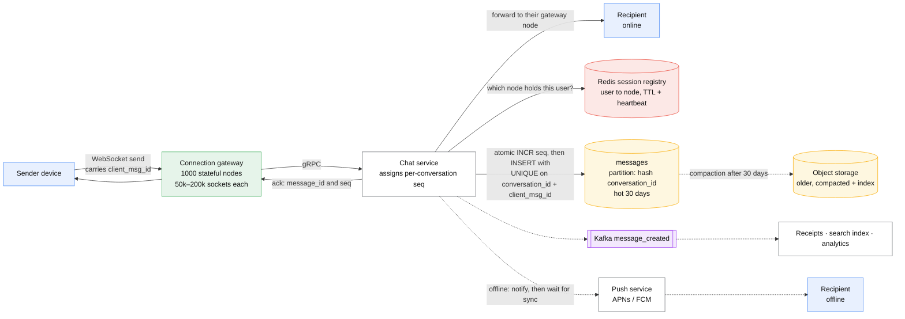
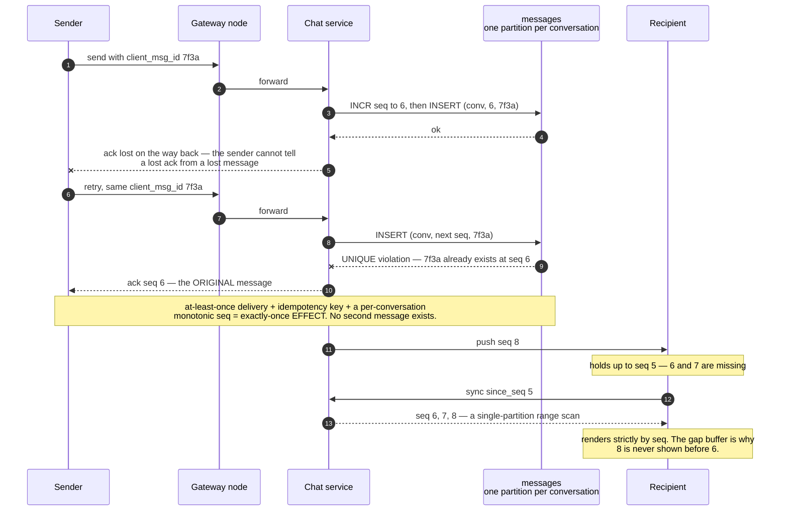

# Design a chat / messaging system

> WhatsApp/Slack/Discord: 1:1 and group messages, delivered in order, in real time, with
> offline catch-up, delivery + read receipts, and presence.
> **The hard part:** stateful connections at scale, and per-conversation ordering with
> exactly-once *display* over an at-least-once network.

## 1. Clarify

| Question | Assumed answer |
|---|---|
| 1:1, groups, or both? | Both. Group max 500 (say "channels of 100k is a different design" — it is) |
| Message history retention? | Forever, searchable |
| Delivery guarantees? | At-least-once delivery, exactly-once display (client dedup) |
| Ordering? | Per conversation, total. Global ordering not required |
| E2E encryption? | Out of scope for v1 — but say what it would change (no server-side search or ranking) |
| Media? | Yes — uploaded separately to object store, message carries a reference |
| Scale? | 500M DAU, 50 messages/user/day, 100M concurrent connections at peak |

**Non-goals:** voice/video calls (WebRTC, separate design), moderation, E2EE key management.

## 2. Requirements

**Functional**
- Send/receive 1:1 and group messages in real time
- Offline users receive everything on reconnect, in order
- Delivery ("sent/delivered/read") receipts, typing indicators, presence
- Message history, paginated backwards

**Non-functional**

| Target | Value |
|---|---|
| Message delivery p99 | < 500 ms sender→recipient when both online |
| Availability | 99.99% |
| Durability | **No message loss, ever** — this is the product |
| Ordering | Total order within a conversation |
| Concurrency | 100M simultaneous connections |

## 3. Estimates

```
500M DAU × 50 msgs = 25B messages/day ≈ 290k/s avg, ~1M/s peak
Storage: 25B × 200 B = 5 TB/day → 1.8 PB/yr → 5.5 PB with RF3   ← storage IS a problem here
Fanout: group of 50 → 50 delivery events per message

Connections: 100M concurrent
   @ 100k conns/node → 1,000 connection-tier nodes
   Memory: 100M × ~10 KB state = 1 TB across the tier
Reconnect storm after a deploy: 100M reconnects in minutes — must be staggered
```

> [!info] The scary numbers
> Two of them: **100M concurrent stateful connections** (a capacity unit that is not rps),
> and **5.5 PB/year** (which forces tiering).

## 4. API / contract

```
WebSocket (client ↔ gateway), JSON or protobuf frames:
  → {op: "send",    client_msg_id, conversation_id, body, ts}
  ← {op: "ack",     client_msg_id, message_id, seq}
  ← {op: "message", conversation_id, message_id, seq, sender, body, ts}
  ← {op: "receipt", message_id, user_id, state: "delivered"|"read"}
  → {op: "sync",    conversation_id, since_seq}      # catch-up after reconnect
  → {op: "typing",  conversation_id}                 # best-effort, never persisted

REST (non-realtime):
  GET  /v1/conversations?updated_since=          # conversation list + unread counts
  GET  /v1/conversations/{id}/messages?before_seq=&limit=50
  POST /v1/media  → presigned upload URL
```

`client_msg_id` is the client-generated idempotency key: a retried send after a flaky network
must not create a second message. This single field is what makes the whole system safe.

## 5. Data model

| Entity | Key | Partition by | Serves |
|---|---|---|---|
| `messages` | `(conversation_id, seq)` | `hash(conversation_id)` | History + sync — a single-partition range scan |
| `conversations` | `conversation_id` | `hash(conversation_id)` | Metadata, member list, last_seq |
| `user_conversations` | `(user_id, last_activity DESC)` | `user_id` | The inbox list |
| `read_state` | `(conversation_id, user_id)` | `hash(conversation_id)` | Unread counts, read receipts |
| `connections` | `user_id → {node, session}` | `hash(user_id)` | Routing: which node holds this user |

**Why partition by `conversation_id`:** every read is "the last N messages of this
conversation", every write appends to it, and ordering must be total *within* it. Colocating
the conversation makes ordering a local problem — no distributed consensus needed. Sequence
numbers come from a per-conversation counter (a single-partition atomic increment), not from
a global sequencer.

> [!warning] Trap
> Partitioning by `user_id` looks natural and is wrong: a two-person conversation would live
> on two partitions and you'd need cross-partition coordination for ordering on every message.

**Storage tiering** (needed at 5.5 PB): recent 30 days in the hot store (Cassandra/Scylla),
older messages compacted into object storage with an index. Discord's well-known evolution
(MongoDB → Cassandra → ScyllaDB) is a good reference to name.

## 6. Architecture

One socket per user, one partition per conversation:



### Deep dive A — the connection tier

- Stateful by nature: a user's socket lives on exactly one node. **Session registry** in
  Redis maps `user_id → node_id`, TTL'd and refreshed by heartbeat.
- Routing a message to an online recipient: look up their node, forward over an internal
  gRPC/pub-sub hop. (Alternative: every gateway subscribes to a pub-sub topic — simpler, but
  broadcasts to all nodes and doesn't scale to 1000 nodes.)
- **Capacity is connections, not rps** — 50k–200k per tuned node (file descriptors, memory,
  epoll). Size for 3x steady state to survive reconnect storms.
- **Deploys**: drain connections gradually with jittered "please reconnect" messages, or you
  cause a self-inflicted DDoS. Say this — it's the operational detail that shows experience.
- Heartbeat/ping every ~30 s to detect dead sockets that TCP hasn't noticed yet.

### Deep dive B — ordering and exactly-once display

The retry and the gap are the same mechanism seen from each end:



1. Client sends with `client_msg_id`.
2. Chat service atomically increments the conversation's `seq` (single partition = cheap) and
   persists `(conversation_id, seq, client_msg_id, ...)` with a uniqueness constraint on
   `(conversation_id, client_msg_id)`.
3. Ack carries `(message_id, seq)`. A retry with the same `client_msg_id` returns the
   original — no duplicate.
4. Clients render strictly by `seq`, and hold a **gap buffer**: if they receive `seq 7` while
   holding up to `seq 5`, they request the gap rather than showing messages out of order.

This is the general pattern — at-least-once delivery + idempotency key + monotonic sequence
= exactly-once *effect*. See
[../02-primitives/transactions-and-idempotency.md](../02-primitives/transactions-and-idempotency.md).

### Deep dive C — offline sync and receipts

- Each device tracks `last_seq` per conversation. Reconnect sends `sync since_seq`; the server
  replies with everything after it (paged). No per-user inbox queue needed — the conversation
  log *is* the queue, which is why the partition choice matters so much.
- **Multi-device**: `last_seq` per (user, device). Delivery isn't complete until all of a
  user's devices have caught up, but the *user-visible* receipt fires on the first device.
- **Receipts** are their own event stream, and they are 2–3x the volume of messages in a
  group chat. Batch and debounce them; never send one receipt event per member per message.
- **Typing indicators and presence** are ephemeral: pub-sub only, never persisted, best-effort,
  and the first thing to shed under load.
- **Push notifications** for offline users, via APNs/FCM: dedupe against the in-app delivery
  (a user reading on desktop shouldn't get a phone buzz — hence server-side coordination on
  read state).

## 7. Scale & failure

| Breaks first at 10x | Fix |
|---|---|
| Connection tier node count | Cheaper per-connection state, protobuf frames, connection multiplexing |
| Receipt/typing event volume | Debounce + batch; sample presence |
| Hot conversation (a 100k-member channel) | This is a different design: fan out on read, no per-member delivery events, "channel" semantics |
| Storage growth | Tier > 30 days to object store; compress; per-workspace retention policies |

| Component fails | Blast radius | Degraded behaviour |
|---|---|---|
| One gateway node dies | Its ~100k users disconnect | Clients reconnect with jitter to another node; sync fills the gap. **No message lost — the log is the truth** |
| Session registry (Redis) down | Can't route to online users | Fall back to push notifications + sync on next poll |
| Message store slow | Sends fail | Fail the send *loudly* — never ack a message you haven't durably stored |
| Kafka down | No search indexing/analytics | Messaging unaffected; backlog replays |

**The invariant to state out loud:** never acknowledge a message to the sender before it's
durably persisted with a sequence number. Everything downstream (delivery, receipts, push)
is recoverable from the log; a lost message is not.

## 8. Ops & cost

- **SLO:** 99.9% of messages delivered to an online recipient within 500 ms; zero message
  loss (measured by client-side ack reconciliation, not by server logs).
- **Alert on:** connection count per node and total, reconnect rate (storm detector), send→ack
  p99, sync-request rate (a spike means delivery is failing silently), per-conversation seq
  gaps.
- **Rollout:** connection tier deploys are the risky ones — slow rolling with drain, never
  more than ~5% of the tier at a time.
- **Cost:** the connection tier (1000 nodes ≈ $50–80k/month) and 5.5 PB of storage
  (≈ $130k/month hot, ~$10k tiered). Tiering old messages is the biggest lever by far.
- **First thing I'd cut:** presence granularity (per-second → per-30-second), which cuts a
  surprising amount of pub-sub traffic.

**If asked about E2EE:** keys per device, server stores ciphertext only, sender fans out one
encrypted copy per recipient device (fanout cost × devices), and you lose server-side search,
ranking, and spam classification. That trade — not the crypto — is the interview answer.

## On AWS and Azure

| | AWS | Azure |
|---|---|---|
| **The shape** | API Gateway WebSocket API → Lambda or ECS; `messages` in Keyspaces or DynamoDB; DynamoDB for the connection registry; SQS/SNS for delivery fan-out; S3 for media | Azure Web PubSub (or SignalR Service) → AKS/Container Apps; `messages` in Cosmos DB for NoSQL; Service Bus for delivery fan-out; Blob Storage for media |
| **What you configure** | Route selection expression, `@connections` callback URL, connection-registry TTL, per-conversation sequence via a DynamoDB atomic counter | Hubs and groups (a group *is* a conversation), event handler vs `sendToGroup` mode, Cosmos partition key on `conversation_id` |
| **The default that bites** | **A WebSocket connection is terminated at 7,200 seconds, and that quota cannot be increased.** Every client reconnects at least every two hours whether or not anything is wrong, so the reconnect storm this case worries about is not an incident — it is the steady state. Idle timeout is a separate 600 s, also fixed | A Web PubSub frame is capped at **1 MB**, and the service **stores no customer data** — history, receipts and catch-up are entirely yours to build. There is no "since_seq" the platform can replay |
| **What it costs you** | 100 M concurrent connections against a **500 new connections/second per account per Region** ceiling (adjustable, burst also 500): at 500/s a cold start of the whole fleet takes **over 55 hours**. Frames are capped at 32 KB and messages at 128 KB | Cosmos DB caps a logical partition at **20 GB** and a physical partition at **10,000 RU/s**. Partitioning by `conversation_id` — which this case argues for on ordering grounds — makes a long-lived busy channel hit the 20 GB wall; hierarchical partition keys (`conversation_id`/`month`) are the documented escape |

The reconnect arithmetic is the whole operational story on AWS: with a fixed two-hour connection
life and a default 500/s admission rate, the sustainable steady state is 500 × 7,200 = **3.6 M
connections**. Past that the managed WebSocket tier is not the answer and you are back to NLB plus
your own connection servers — which is what every system this case names actually runs.

## In an LLM deployment

Chat-with-a-model looks like this system and is not. Two things invert. First, the fan-out
disappears: a conversation has one human and one assistant, so the 50-recipient delivery
amplification is replaced by a single **streaming** response, and the connection is now held open
for the length of a generation rather than the length of a session. Second, the per-conversation
sequence number stops being cheap — each turn resends the whole history as the prompt, so a
20-turn conversation at 500 tokens/turn is a **10,000-token prefill on every message**, and the
transcript is not a log you append to, it is an input you re-pay for.

That is what makes prefix caching the load-bearing optimisation rather than a nicety. vLLM's
automatic prefix caching keeps the KV blocks for the shared prefix so turn *n+1* only prefills the
new tokens; provider-side caching does the same with a **5-minute sliding TTL** (a 1-hour option
exists), which is roughly a human's think-time — a user who steps away for a coffee pays full
prefill on their next message.

The API Gateway limits above then bite in a new place: **128 KB per message** is comfortably under
a long context window, so a client that sends its own transcript back, rather than a conversation
id the server expands, hits a transport limit before a model limit. Send the id.

## Referenced by

- [Backend cases index](README.md)
- [Design a collaborative editor (Google Docs / Figma)](../04-frontend-cases/collaborative-editor.md)
- [Engineering blogs and case studies](../10-resources/engineering-blogs.md)
- [Meta interview style](../09-company-styles/meta.md)
- [Partitioning strategies](../fundamentals/partitioning-strategies.md)
- [Question bank](../07-drills/question-bank.md)
- [Repo index](../../INDEX.md)

## Sources & further reading

- Local book: Alex Xu vol. 1 ch.12 (chat system)
- [Discord — How Discord stores trillions of messages](https://discord.com/blog/how-discord-stores-trillions-of-messages)
- [Discord — Maintaining performance in a distributed presence system](https://discord.com/blog/)
- Vendor: `10-resources/vendor/awesome-scalability/README.md` — messaging section
- Primitives: [networking-and-edge](../02-primitives/networking-and-edge.md), [transactions-and-idempotency](../02-primitives/transactions-and-idempotency.md), [replication-and-partitioning](../02-primitives/replication-and-partitioning.md)

Cloud claims in §On AWS and Azure (all verified 2026-09-21):

- [AWS — API Gateway endpoints and quotas](https://docs.aws.amazon.com/general/latest/gr/apigateway.html) — WebSocket connection duration 7,200 s (not adjustable), idle timeout 600 s, 32 KB frame, 128 KB message payload, 500 new connections/s per account per Region
- [Azure — Web PubSub service internals](https://learn.microsoft.com/en-us/azure/azure-web-pubsub/concept-service-internals) — 1 MB maximum message size, hubs and groups, `sendToGroup` mode
- [Azure — Web PubSub FAQ](https://learn.microsoft.com/en-us/azure/azure-web-pubsub/resource-faq) — the service stores no customer data
- [Azure — partitioning and horizontal scaling in Cosmos DB](https://learn.microsoft.com/en-us/azure/cosmos-db/partitioning-overview) — 20 GB per logical partition, 10,000 RU/s per physical partition, hierarchical partition keys
- [vLLM — automatic prefix caching](https://docs.vllm.ai/en/latest/features/automatic_prefix_caching.html)
- [Anthropic — prompt caching](https://docs.claude.com/en/docs/build-with-claude/prompt-caching) — 5-minute sliding TTL, 1-hour option
