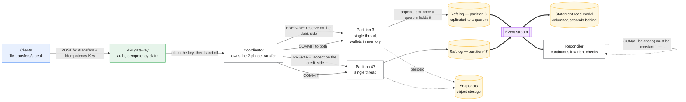
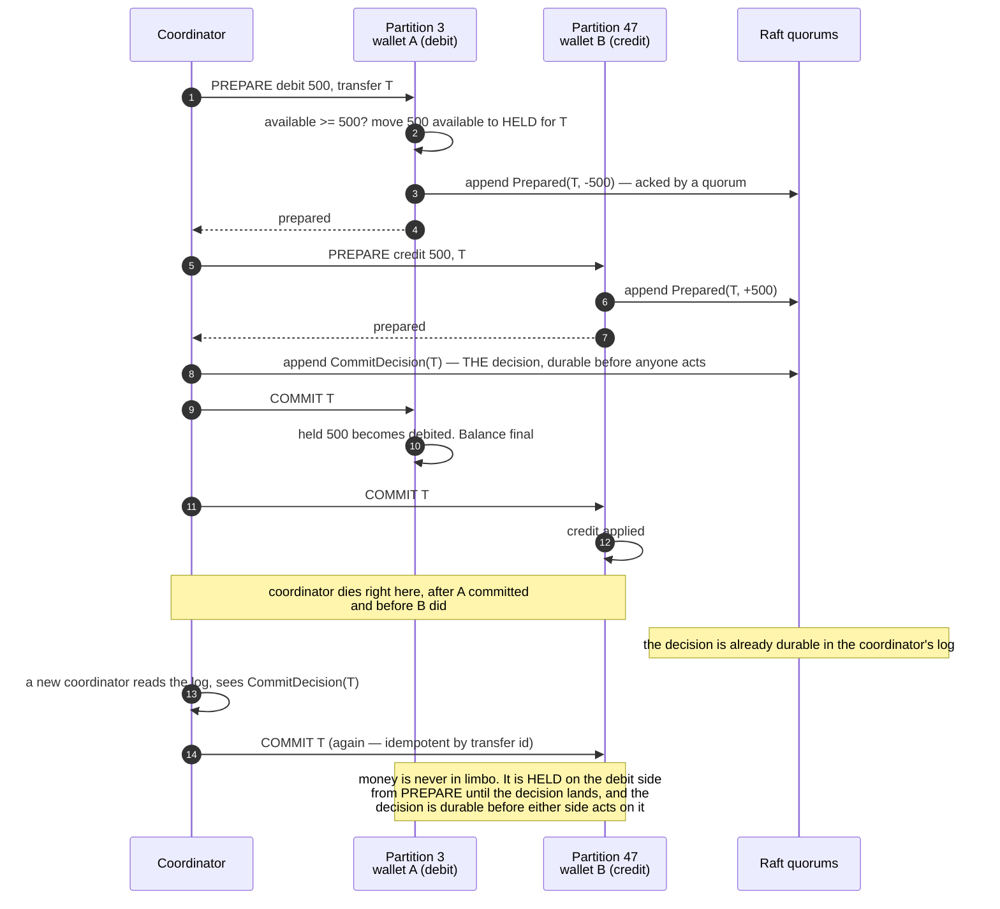

# Design a digital wallet

> Balances inside your own system, and transfers between them. PayPal balance, Alipay, an
> exchange's internal accounts, in-game currency with real value.
> **The hard part:** a transfer touches **two** balances atomically, at a million transfers per
> second, with an auditable history — and the usual answer (one database transaction) stops
> working at exactly the throughput the case specifies.

**Read [payments-ledger.md](payments-ledger.md) first.** That case is *open-loop*: money enters
and leaves through external processors, and its hard problem is the **ambiguous outcome** — a PSP
call timed out and you do not know what happened. This case is *closed-loop*: money is already
inside, no external party is involved in a transfer, every outcome is knowable — and the hard
problem moves to **throughput and determinism**. Different problem, different design, same domain.

## 1. Clarify

| Question | Assumed answer |
|---|---|
| Closed loop? | Yes. Funding in and payout out exist but are separate flows — this case is transfers *inside* |
| Transfer semantics? | Debit A, credit B, atomically. No partial transfers, ever |
| Can a balance go negative? | **No** for user wallets. Internal accounts may, by design |
| Currencies? | Multi-currency, one currency per wallet. FX is two transfers through an FX account |
| Scale? | **1M transfers/s peak.** This number is the case |
| History? | Every balance change auditable and reconstructible, kept for years |
| Latency? | p99 < 100 ms for a transfer |
| Multi-region? | Active-passive per currency. **Not active-active** — and be ready to say why |

**Non-goals:** card acquiring and PSP integration (that is [payments-ledger](payments-ledger.md)),
KYC/AML decisioning, fraud model internals, the payout rails themselves.

## 2. Requirements

**Functional**
- Transfer between two wallets, atomically, idempotently
- Read a balance, and a statement of the movements behind it
- Hold / release (reserve funds for a pending action)
- Reversal by compensating transfer
- Reconciliation against the internal ledger and external funding sources

**Non-functional**

| Target | Value |
|---|---|
| Correctness | **Money is never created or destroyed. `SUM(all balances) = constant`** |
| Durability | No acknowledged transfer is ever lost |
| Throughput | 1M transfers/s peak |
| Latency | p99 < 100 ms |
| Auditability | Any balance reconstructible at any past instant, forever |
| Availability | 99.99%; **fail closed** — refusing a transfer beats performing an ambiguous one |

> [!info] The requirement that breaks the obvious design
> **1M transfers/s across two accounts each.** A single relational database does tens of thousands
> of transactions per second. Two orders of magnitude short is not a tuning problem — it forces
> partitioning, and partitioning a *two-account* operation is where the case actually lives.

## 3. Estimates

```
Transfers:   1M/s peak, ~300k/s average
Events:      1 transfer = 2 balance events (debit + credit) + 1 transfer record
             = 3M events/s at peak
Storage:     3M/s × 86,400 × ~200 B = ~52 TB/day raw
             compressed and columnar for history: ~10 TB/day, ~3.6 PB/year
             ← the history IS the system. Budget for it from the first slide
Accounts:    500M wallets × ~100 B of hot state = 50 GB
             ← every balance in the world fits in RAM on a handful of machines.
               THIS is what makes the in-memory design viable
Partitions:  1M transfers/s ÷ ~50k/s per single-threaded partition = 20 partitions
             minimum, 64 for headroom and rebalancing
Cross-partition: with random account pairing and 64 partitions, ~98% of transfers
             are cross-partition. The two-phase path is the COMMON case, not the
             exception — design it first
Snapshot:    50 GB of state, snapshotted every few minutes; recovery = latest
             snapshot + replay of the tail
```

> [!warning] The number that decides the architecture
> **98% of transfers cross partitions.** Anyone who designs the single-partition fast path and
> treats cross-partition as an edge case has inverted the problem. With random pairing, there is
> no partitioning scheme that makes most transfers local — so the distributed path must be fast,
> not merely correct.

## 4. API / contract

```http
POST /v1/transfers
  Idempotency-Key: <caller-generated uuid>     ← required
  { from_wallet, to_wallet, amount_minor, currency, reference }
  → 201 { transfer_id, state: "completed", from_balance_after, to_balance_after, seq }
  → 409 { error: "insufficient_funds", available_minor }
  → 422 { error: "currency_mismatch" }
  → 200 with the ORIGINAL body if the key was seen before

POST /v1/holds        { wallet, amount_minor, expires_at } → hold_id
POST /v1/holds/{id}/capture   → converts the hold into a transfer
DELETE /v1/holds/{id}         → releases it

GET /v1/wallets/{id}/balance
  → { available_minor, held_minor, seq, as_of }
GET /v1/wallets/{id}/statement?from&to&cursor
```

**`available` and `held` are separate numbers and both are part of the contract.** A client that
sees only a single balance cannot explain to a user why a payment failed while the app showed
sufficient funds.

**`seq` is a monotonic per-wallet sequence**, returned on every write and readable. It is how a
client gets read-your-writes against an eventually-consistent read model — pass the `seq` you last
saw and the read side waits for it. Without this, the user makes a transfer and sees their old
balance, which in a wallet product generates a support ticket every single time.

**Idempotency key scope is `(caller, key)`, stored with the request hash.** Same key and same body
replays the response; same key with a *different* body is a `422`, never a second transfer.

## 5. Data model

| Entity | Key | Where | Serves |
|---|---|---|---|
| Wallet state | `wallet_id` | **In memory**, in its partition, replicated | The balance check on the hot path |
| Event log | `(partition, seq)` | Append-only, replicated to a quorum before ack | **The source of truth** |
| Transfer record | `transfer_id` | Derived from events | Status lookup, support |
| Idempotency key | `(caller, key)` | Partitioned with the *source* wallet | Replay protection |
| Snapshot | `(partition, up_to_seq)` | Object storage | Recovery, and new-replica bootstrap |
| Statement (read model) | `(wallet_id, time)` | Columnar store | History queries, off the hot path |

```
Partition by wallet_id:  partition = hash(wallet_id) % N
  → a wallet's state and all its events live in ONE partition, on ONE thread
  → the balance check and the debit are a local, lock-free operation
  → a transfer between two wallets is, 98% of the time, a two-partition operation

Balances are DERIVED:  balance(w) = fold(events for w)
  The in-memory number is a cache of that fold. Snapshots are a cache of the cache.
  Delete every snapshot, replay the log, get identical state — or it is not
  event-sourced, it is a mutable balance with an expensive log beside it.
```

This is [event sourcing](../patterns/event-sourcing.md) in its strict form, and the single-writer
partition is the same move as the [stock exchange](stock-exchange.md) matching engine: one thread,
no locks, state rebuilt from a replicated input log. The domain is different; the mechanism is the
same, and saying so is worth a lot.

## 6. Architecture



### Deep dive A — the two-partition transfer



The design points an interviewer is listening for:

- **The decision is logged before it is executed.** That is what makes recovery deterministic: a
  new coordinator replays its log and finishes what the old one started. Without it, a coordinator
  crash between the two commits loses money and nothing can tell you which transfer.
- **Prepare is a hold, not a debit.** `available` drops, `held` rises, and the total is unchanged.
  If the transfer aborts, the hold is released and nothing is reversed — there is no compensating
  entry, because nothing was committed.
- **Every step is idempotent on `transfer_id`.** Re-delivery is normal, not exceptional.
- **This blocks.** 2PC's participants hold a resource until the decision arrives; if the
  coordinator is unreachable, wallet A's funds stay held. That is the honest cost, and the
  mitigations are a **coordinator on a replicated log** (so it recovers in seconds, not
  human-time) and a **hold expiry** so a truly lost transfer self-releases. See
  [distributed-transactions](../patterns/distributed-transactions.md).
- **Why not a saga?** A saga would debit A, credit B, and compensate on failure — which means a
  window where the money exists in neither wallet, visible to the user. For a wallet balance that
  is unacceptable; a hold is visible and explicable, a vanished balance is not.

### Deep dive B — the single-thread partition, and why it is fast

| Move | Why |
|---|---|
| **One thread per partition, no locks** | The balance check and update are a read-modify-write on one account; a lock would be the contention. Same reasoning as the [stock exchange](stock-exchange.md) |
| **All state in memory** | 500M wallets × 100 B = 50 GB. There is no reason to read a balance from disk |
| **Append the input, not the state** | Recovery is replay. A crashed partition rebuilds from snapshot + tail in seconds |
| **Replicate before acknowledging** | A quorum holds the event before the client is told "completed". This is the durability requirement, and it is where the latency budget goes |
| **Batch the log append, never the decision** | Appending 1,000 events in one fsync is the throughput trick; batching *decisions* would reorder them |

**Determinism is a requirement, not an aesthetic.** Replicas apply the same input log and must
produce identical state, so: no wall-clock reads inside apply, no map iteration order, no floating
point, no random. Diverging replica state is how a failover changes someone's balance.

### Deep dive C — reconciliation, which is the feature

Three checks, continuously, in production:

1. **`SUM(all balances) = constant`** across the whole system, per currency. Money is neither
   created nor destroyed by an internal transfer. This single query catches almost every class of
   bug the design can have.
2. **Balance = fold(events)** per wallet, sampled continuously and in full nightly. Catches
   snapshot drift and any non-deterministic apply.
3. **Internal total = external custody** — the sum of all wallet balances must equal the money
   actually held in the bank or custody accounts backing it. This is the check that catches the
   funding and payout flows, which are *outside* this case but which move the same money.

A mismatch is an incident, not a report. The response is to **halt the affected partition** rather
than continue: in a wallet, continuing to process transfers on top of a known-wrong balance
multiplies the damage, and unwinding it later is far worse than an hour of unavailability.

### Deep dive D — holds, expiry and the hot wallet

- **Holds need an expiry and a sweeper**, and the release must be idempotent because the sweeper
  and a late explicit release will race.
- **Hot wallets are real**: a merchant settlement wallet or an exchange's fee account receives
  millions of credits a second. It is one account on one thread, and it will saturate. The fix is
  **sub-accounts** — `merchant:42:shard:0..63` — summed on read, with transfers targeting a random
  shard. Same move as the sharded counter in [leaderboard](leaderboard.md); note that it works
  only for *credits*, because a debit must see the whole balance.
- **Rebalancing partitions** is the operation nobody plans. Moving a wallet between partitions
  means stopping writes for that wallet, transferring its state and its log position, then
  resuming — feasible per wallet, a nightmare in bulk. Over-provision partitions at creation, as
  with a keyed topic in [distributed-message-queue](distributed-message-queue.md).

## 7. Scale & failure

| Breaks first at 10x | Fix |
|---|---|
| Coordinator throughput | It is stateless apart from its log — shard coordinators by `hash(transfer_id)` |
| One partition's single thread | More partitions. Linear, if you provisioned enough up front |
| Hot wallet on one thread | Sub-account sharding for credits; debits still serialise and that is correct |
| History storage (3.6 PB/year) | Tier: recent in a queryable store, older columnar in object storage, statements served from the read model |
| Read-model lag during a spike | Reads carry `seq`; degrade to reading the partition directly for that wallet |

| Component fails | Blast radius | Degraded behaviour |
|---|---|---|
| Partition leader | That partition, for an election | Quorum elects a new leader from replicas that hold the log; in-flight prepares are resolved from the coordinator's decision log |
| Coordinator | In-flight transfers | Another coordinator reads the log and completes or aborts each one. Holds protect the funds meanwhile |
| Quorum minority | None | Continue |
| Quorum majority | That partition stops | **Fail closed.** Transfers involving those wallets are refused. Correct and unpleasant |
| Read model | Statements stale | Balances still served authoritatively from the partition. Show `as_of` |
| Reconciler | The safety net is gone | Page immediately. Running without the invariant check is riskier than it looks |
| Whole region | Everything | Active-passive failover per currency, RPO 0 via quorum replication across AZs; cross-region is async and therefore **passive only** |

**Why not active-active across regions?** Because the invariant is global. Two regions accepting
transfers on the same wallet with async replication will, on partition, both allow a debit the
balance cannot cover — and there is no merge function for "this money was spent twice". Either one
region owns a currency at a time, or you partition wallets by region so no wallet is writable in
two places. Say this explicitly; it is the difference between a design and a wish.

## 8. Ops & cost

- **SLO:** transfer p99 < 100 ms; zero lost or duplicated transfers; reconciliation variance zero;
  99.99% availability per currency.
- **Alert on:** reconciliation mismatch (page instantly, any non-zero value), prepare-without-
  decision count and age, hold age distribution, partition apply lag, replica state divergence
  from the leader, per-partition throughput against its single-thread ceiling.
- **Rollout:** replay-diff before every deploy — run the last day's event log through the new
  binary and assert identical state. Determinism is what makes that test possible, and it is the
  strongest argument for the whole architecture. Partitions upgrade one at a time, never all at
  once.
- **Cost:** memory for state (small), storage for history (dominant and growing forever), and the
  replication traffic for the quorum. The history is the budget line — decide the tiering policy
  before launch, because you cannot retroactively not-store it.
- **First thing I'd cut:** the hot read model for statements older than 90 days. Serve those from
  object storage with a slower, cheaper path.

**Also mention, briefly:** regulatory. Stored value is regulated in most jurisdictions —
safeguarding requirements, segregated custody accounts, reporting. It does not change the
architecture but it does make check 3 in Deep dive C a legal obligation rather than an engineering
nicety, and it is why "halt on mismatch" is defensible to a business owner.

## On AWS and Azure

| | AWS | Azure |
|---|---|---|
| **The service** | DynamoDB with `TransactWriteItems` for a simpler wallet; self-managed partitions on EC2/EKS with a Raft library for the 1M/s design; Kinesis or MSK for the event stream; S3 for snapshots and history | Cosmos DB for NoSQL with transactional batch, or **Azure SQL ledger tables** where tamper evidence is required; self-managed partitions on AKS; Event Hubs for the stream; Blob Storage with immutability policies for history |
| **What you configure** | Partition key `wallet_id`, condition expressions enforcing `balance >= amount`, `ClientRequestToken` on every transactional write, stream view type | Partition key `/walletId`, transactional batch scoped to that key, consistency level (**Session** by default), ledger table type if used |
| **The default that bites** | **DynamoDB transactions are not supported across Regions in global tables** — replicas can observe a partially completed transaction, so a global-table wallet has no atomic transfer outside the write Region and the `SUM(all balances)` check run in a read Region is meaningless. This is the vendor stating the §7 active-active argument as a hard limitation | **A Cosmos transactional batch requires every operation to share one partition key.** A transfer touches two wallets with two different partition keys, so **the two-account transfer cannot be a batch at all** — the platform forces you into the two-phase design of Deep dive A rather than letting you pretend one commit will do |
| **What it costs you** | `TransactWriteItems` is capped at **100 actions and 4 MB**, performs **two underlying writes per item**, **consumes capacity even when cancelled**, and its `ClientRequestToken` expires after **10 minutes** — so a contended wallet burns capacity on losing transactions, and your own idempotency key must outlive theirs | A logical partition is capped at **10,000 RU/s and 20 GB** — which is the hot-wallet ceiling from Deep dive D expressed as a quota, and the sub-account sharding is how you get past it. If you use ledger tables, note they give **detection, not prevention**: ledger "can't prevent such attacks but guarantees that any tampering will be detected when the ledger data is verified" |

Both clouds refuse, in their own words, to make a two-account transfer a single cheap commit at
this scale. That refusal is the case: **the platform will not hand you atomicity across
partitions, so you build the decision log yourself** — which is also what gives you the audit
trail and the replay-diff test.

## In an LLM deployment

Token budgets behave exactly like wallets, and the analogy is load-bearing rather than cute:

- **A per-tenant token budget is a wallet, and spending is a two-account transfer** — debit the
  tenant, credit a provider-cost account. Sum-to-constant then catches usage recorded but never
  billed, and usage billed twice on a retry.
- **The amount is unknown until the response ends.** You cannot debit at request time because the
  token count does not exist yet. This is precisely the **hold** of Deep dive D: reserve an
  estimate at admission, capture the actual on completion, release the difference. A disconnected
  stream must release the hold, which is why holds need an expiry sweeper here too.
- **Agents make idempotency non-negotiable.** An agent that retries a tool call after a timeout
  and generates a fresh idempotency key each time double-spends the budget *and* performs the
  action twice. The key belongs to the intent, derived once and passed down — never minted inside
  the tool.
- **Never let a model compute or assert a balance.** It has no constraint, no arithmetic guarantee
  and no view of in-flight holds. The wallet returns the number; the model may explain it. This
  is the same rule as the corpus applies to scores and ranks, and it matters most where the number
  is money.

## Referenced by

- [Backend cases index](README.md)
- [Ledgers and double-entry](../fundamentals/ledgers-and-double-entry.md)
- [Question bank](../07-drills/question-bank.md)
- [Topic manifest](../topics/manifest.md)

## Sources

- Mechanisms in this corpus:
  [ledgers-and-double-entry](../fundamentals/ledgers-and-double-entry.md),
  [event-sourcing](../patterns/event-sourcing.md),
  [cqrs](../patterns/cqrs.md),
  [distributed-transactions](../patterns/distributed-transactions.md),
  [consensus-raft-paxos](../fundamentals/consensus-raft-paxos.md),
  [idempotency](../fundamentals/idempotency.md)
- Neighbouring cases: [payments-ledger](payments-ledger.md) — the open-loop counterpart whose hard
  problem is the ambiguous external outcome; [stock-exchange](stock-exchange.md) — the same
  single-writer, journal-the-input mechanism in a different domain
- Local book: Alex Xu, *System Design Interview* vol. 2 ch. 12 — Digital Wallet

Cloud claims in §On AWS and Azure (all verified 2026-09-23):

- [AWS — DynamoDB transactions: how it works](https://docs.aws.amazon.com/amazondynamodb/latest/developerguide/transaction-apis.html) — up to 100 actions and 4 MB aggregate, two underlying writes per item for prepare and commit, capacity consumed even when a transaction is cancelled, `ClientRequestToken` valid for 10 minutes, and transactions not supported across Regions in global tables with partially completed transactions observable in replicas
- [Azure — Cosmos DB service quotas and default limits](https://learn.microsoft.com/en-us/azure/cosmos-db/concepts-limits) — 100 operations and 2 MB per transactional batch with all operations sharing one partition key, 10,000 RU/s and 20 GB per logical partition
- [Azure — ledger overview (Azure SQL Database and SQL Server)](https://learn.microsoft.com/en-us/azure/azure-sql/database/ledger-overview) — append-only ledger tables block updates and deletions at the API level; ledger "can't prevent such attacks but guarantees that any tampering will be detected when the ledger data is verified"
- [Azure — Cosmos DB consistency levels](https://learn.microsoft.com/en-us/azure/cosmos-db/consistency-levels) — Session is the account default
