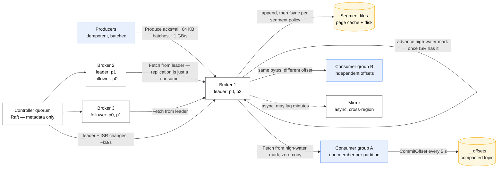
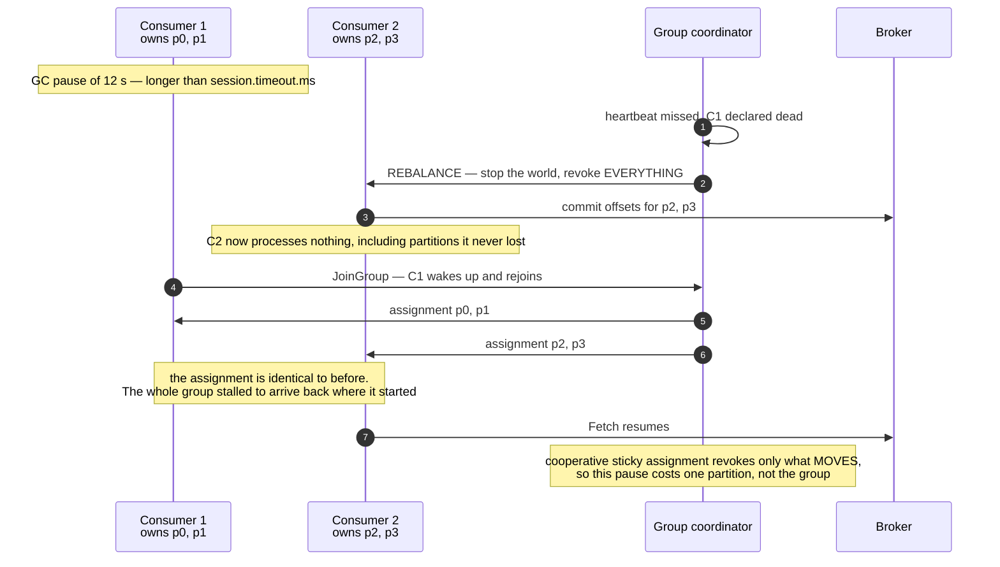

# Design a distributed message queue

> Build the broker, not the app on top of it. Producers append, consumers read at their own
> pace, nothing is lost when a machine dies.
> **The hard part:** you are asked to design the thing every other case in this folder
> *assumes*. There is nowhere to hide behind "put it on a queue" — the durability, the
> ordering and the rebalance are yours now.

## 1. Clarify

| Question | Assumed answer |
|---|---|
| Queue semantics or log semantics? | **Log.** Records persist after being read, consumers hold their own offset, replay is a first-class operation |
| Ordering guarantee? | Total order **per partition**, none across partitions. Say this out loud — it is the single most consequential sentence in the design |
| Delivery guarantee? | At-least-once by default, exactly-once *effects* available via idempotent producer + transactional commit |
| Push or pull? | **Pull.** The consumer decides its own rate, so a slow consumer cannot be knocked over by the broker |
| Retention? | Time-based (7 days default) and size-based, whichever hits first. Compacted topics keep the last value per key forever |
| Multi-tenant? | Yes — per-tenant quotas on bytes/s and request rate |
| Cross-region? | Async mirroring, not synchronous replication. A synchronous quorum across regions puts a 60 ms RTT inside every produce |

**Non-goals:** priority queues, per-message TTL, arbitrary message deletion, a query language.
Each of them breaks the sequential-IO property the whole design is built on. Say *why* you are
ruling them out, not just that you are.

## 2. Requirements

**Functional**
- Produce a batch of records to a topic, addressed by key or round-robin
- Consume from an offset, with a consumer group splitting partitions across members
- Commit offsets; seek to a timestamp; replay from the beginning
- Create/delete topics, change partition count, set retention

**Non-functional**

| Target | Value |
|---|---|
| Produce p99 (acks=all) | < 20 ms within a region |
| Durability | No acknowledged record is ever lost while a majority of replicas survive |
| Throughput | 1 GB/s ingest per cluster, 3 GB/s egress (fanout of 3) |
| Availability | 99.95% produce; a broker loss must not block writes for more than a leader election |
| Consumer lag visibility | Per-partition lag exposed as a first-class metric |

> [!info] The number that decides everything
> **Fanout ratio.** At 1 GB/s in and three consumer groups out, the network — not the disk —
> is the binding constraint, and the answer is zero-copy reads plus consumer-side batching.

## 3. Estimates

```
Ingest:      1 GB/s sustained, 2 GB/s peak
Record size: ~1 KB avg          → ~1M records/s
Partitions:  1M rec/s ÷ ~20k rec/s per partition ≈ 50 … round to 128 for headroom
Retention:   1 GB/s × 86,400 × 7 days = 604 TB, × RF3 = 1.8 PB
Per broker:  16 TB usable disk  → 1.8 PB ÷ 16 TB ≈ 113 brokers on disk alone
Network:     1 GB/s in, 3 GB/s out per cluster; a 25 Gbps NIC = ~3.1 GB/s,
             so egress alone saturates one broker's NIC if fanout lands unevenly
Page cache:  consumers reading the tail hit RAM. 256 GB RAM ≈ 256 s of buffer —
             a consumer more than ~4 minutes behind starts reading from DISK
```

> [!warning] The number people miss
> **The page-cache horizon.** A lagging consumer is not merely late; it changes the read from a
> memory hit to a random disk seek, which slows every *other* consumer on that broker. Lag is a
> performance problem before it is a correctness problem.

## 4. API / contract

```
Produce(topic, [ {key, value, headers} ], acks)
  acks=0    fire and forget — do not offer this for anything that matters
  acks=1    leader only — silently loses data on leader failure before replication
  acks=all  every in-sync replica — the only honest durable option
  → { partition, base_offset }  or  NOT_ENOUGH_REPLICAS / NOT_LEADER_FOR_PARTITION

Fetch(topic, partition, offset, max_bytes, min_bytes, max_wait_ms)
  → records from `offset`, long-polls until min_bytes or max_wait_ms

CommitOffset(group, topic, partition, offset)   — offset of the NEXT record to read
JoinGroup(group, member_id) / SyncGroup(...)    — partition assignment
ListOffsets(topic, partition, timestamp)        — seek by time, not just by position
```

**Idempotence.** The producer carries a `producer_id` and a monotonic `sequence` per partition.
The leader keeps the last sequence per producer and drops a duplicate — this is what makes a
retry after a timeout safe. Without it, "at-least-once" means every network hiccup duplicates a
batch, and the deduplication burden moves to every consumer in the company.

**The error that teaches the contract:** `NOT_LEADER_FOR_PARTITION` is not a failure, it is a
redirect. The client refreshes metadata and retries. A client that treats it as fatal will
page you during every routine leader election.

## 5. Data model

| Entity | Key | Stored as | Serves |
|---|---|---|---|
| Partition | `(topic, partition)` | append-only segment files + sparse index | The log itself |
| Segment | `(topic, partition, base_offset)` | `.log` + `.index` + `.timeindex` | Retention deletes whole segments, never records |
| Offset commit | `(group, topic, partition)` | compacted internal topic | Where a group is up to |
| Metadata | topic → partitions → replica set, ISR, leader | replicated via the consensus layer | Routing |

```
segment .log     : [len][crc][magic][attrs][timestamp][key][value] …  strictly append
segment .index   : offset → byte position, one entry per ~4 KB, binary-searched
segment .timeindex: timestamp → offset, for seek-by-time
```

**Why append-only is the whole design.** Writes are sequential, so a spinning disk keeps up with
a NIC. Reads of the tail come from page cache. Deletion is a whole-file unlink, so retention
costs nothing. Every feature people ask for later — delete this one message, reprioritise that
one — converts sequential IO into random IO and takes the throughput with it.

**Partition count is a one-way door.** Records are assigned `hash(key) % partitions`. Increase
the count and the mapping changes, so a key that used to land on partition 3 now lands on 9 and
its ordering guarantee is broken *for the records already in flight*. Over-provision partitions
at creation; never resize a keyed topic casually.

## 6. Architecture



### Deep dive A — what "durable" actually costs

`acks=all` does **not** mean "all replicas". It means all replicas *currently in the in-sync
set*, and the ISR shrinks on its own when a follower falls behind. That is the trapdoor:

| Setting | Effect | The failure it permits |
|---|---|---|
| `acks=all`, `min.insync.replicas=1` | ISR can shrink to just the leader and writes continue | Leader dies → acknowledged records gone. **This is the default-shaped mistake** |
| `acks=all`, `min.insync.replicas=2`, RF3 | Writes fail when the ISR drops to 1 | Availability loss instead of data loss — the correct trade for anything that matters |
| `unclean.leader.election=true` | An out-of-sync replica may become leader | Silent truncation of committed records |

Say the number out loud in an interview: with RF3 and `min.insync.replicas=2` you survive one
broker loss with no data loss and no write stall, and two losses stall writes rather than lose
them. That is the sentence being graded.

**fsync is a separate question from replication.** Most deployments do *not* fsync per record —
they rely on three copies in three failure domains. That is a deliberate choice, and it is wrong
in exactly one scenario: a correlated power loss across the whole rack. Name the scenario.

### Deep dive B — the rebalance, which is where availability actually goes



- **Eager rebalancing stops every consumer in the group**, including the ones whose assignment
  does not change. On a large group that is seconds of total stall for one slow member.
- **Cooperative/incremental rebalancing** revokes only partitions that actually move. Adopt it,
  and say why: the cost of a member joining should be proportional to the change, not to the
  group.
- **Static membership** (a stable `group.instance.id`) skips the rebalance entirely for a
  restart that finishes inside the session timeout — the right answer for a rolling deploy.
- The real-world trigger is almost never a crash. It is **a GC pause, a slow poll loop, or a
  deploy**. Tune `max.poll.interval.ms` against the *slowest* message your handler can meet,
  not the average.

### Deep dive C — exactly-once, told honestly

Exactly-once **delivery** over a network is impossible. Exactly-once **effect** is achievable,
and only in the closed loop where the broker owns both sides:

1. Idempotent producer removes duplicates from retries (`producer_id` + `sequence`).
2. A transaction writes the output records *and* the consumer's offset commit atomically.
3. Consumers set `read_committed` so aborted batches are never visible.

That gives read-process-write exactly-once **inside the cluster**. The moment the side effect is
an HTTP call or a row in an external database, you are back to at-least-once and the answer is
an idempotency key at the sink — [idempotency](../fundamentals/idempotency.md), the same move
the payments case makes.

### Deep dive D — backpressure and the noisy tenant

A pull model gives you backpressure for free on the consumer side, and none at all on the
producer side. Quotas are the missing half: per-principal bytes/s and request rate, enforced by
the broker *delaying the response* rather than erroring. A delay is back-pressure a client
library already understands; an error is an incident.

## 7. Scale & failure

| Breaks first at 10x | Fix |
|---|---|
| Partition count per broker — metadata, file handles, and leader-election time all scale with it | Fewer, fatter partitions; tiered storage to shrink per-broker footprint |
| One partition is hot because one key is hot | Composite key, or accept ordering loss for that key and round-robin it |
| Lagging consumer forces disk reads and slows everyone on the broker | Lag alerting long before it matters; isolate heavy consumer groups onto their own read replicas |
| Controller becomes the bottleneck during mass failover | Keep metadata small — it is the reason metadata lives in its own Raft quorum, not in the data path |

| Component fails | Blast radius | Degraded behaviour |
|---|---|---|
| Follower | None | ISR shrinks; writes continue while ≥ `min.insync.replicas` remain |
| Leader | One partition, for the election | Controller elects from ISR; clients see `NOT_LEADER_FOR_PARTITION` and retry |
| Controller quorum minority | None to the data path | Metadata changes pause, produce/consume continue |
| Controller quorum majority | Cluster-wide | No topic creation, no leader election; existing leaders keep serving until one dies |
| Whole AZ | ~1/3 of leaders | Rack-aware replica placement means every partition still has a replica elsewhere — **this only holds if you configured it** |
| Disk full | The broker | Retention is the pressure valve; a full disk with retention already at minimum is a capacity failure, not an incident to fix at 3am |

**Metastable failure to name:** brokers slow → consumers lag → lag pushes reads off page cache →
disk contention slows brokers further. It does not recover when load returns to normal. The
break is to shed: pause the lagging group, let the tail catch up, resume. See
[cascading and metastable failures](../fundamentals/cascading-and-metastable-failures.md).

## 8. Ops & cost

- **SLO:** produce p99 < 20 ms at `acks=all`; zero acknowledged-record loss; consumer lag for
  critical groups < 30 s.
- **Alert on:** under-replicated partitions (the single best leading indicator), offline
  partitions, ISR shrink rate, consumer lag by group, controller elections per hour, disk-free
  runway in days rather than percent.
- **Rollout:** rolling restart one broker at a time, waiting for under-replicated partitions to
  return to zero between each. A deploy script that does not wait is how a rolling restart
  becomes an outage.
- **Cost:** dominated by storage and cross-AZ network, not compute. 1.8 PB at RF3 is the bill;
  cross-AZ replication traffic is charged in both directions on most clouds and is routinely
  half the invoice. Tiered storage (hot segments local, cold in object storage) cuts the
  storage term by an order of magnitude and is the first thing to reach for.
- **First thing I'd cut:** retention. Seven days to three halves the storage bill, and almost
  nobody replays beyond 24 h — check the actual `ListOffsets` distribution before arguing.

**Also mention, briefly:** schema. A topic without a schema registry is an integration failure
waiting for its second consumer. Compatibility mode (backward, forward, full) is a design
decision, not a default to accept.

## On AWS and Azure

| | AWS | Azure |
|---|---|---|
| **The service** | Amazon MSK (Standard, Express or Serverless brokers); Amazon Kinesis Data Streams for the non-Kafka shape | Azure Event Hubs (Standard / Premium / Dedicated), which speaks the Kafka protocol; Azure Service Bus for true queue semantics |
| **What you configure** | Broker instance size, `min.insync.replicas`, partitions per broker, retention, tiered storage; on Kinesis it is shard count and retention instead | Throughput units (Standard) or processing units (Premium), partition count at creation, retention, capture |
| **The default that bites** | A Kinesis shard serves **5 `GetRecords` transactions per second, shared by every classic consumer on that shard** — the second consumer group halves the first one's read rate, and the fix is enhanced fan-out, not more shards. On MSK, a `t3` broker accepts **4 IAM connections per second**, so a fleet-wide restart cannot reconnect | Event Hubs **Standard caps retention at 7 days and partitions at 32 per event hub**, and only Premium/Dedicated support dynamic partition scale-out — so the "over-provision partitions at creation" advice above is *mandatory*, not prudent. Also **5 non-epoch receivers per consumer group**, cluster-wide |
| **What it costs you** | MSK Serverless caps a cluster at **2,400 leader partitions (120 for compacted topics)** and **5 MBps ingress per partition** — the 128-partition design above fits, a 4,000-partition one does not, and you will not find that out until the topic create fails. Standard brokers: **30 per cluster on ZooKeeper, 60 on KRaft** | A Standard throughput unit is **1 MB/s or 1,000 events/s ingress, 2 MB/s or 4,096 events/s egress**, maximum 40 TUs — so 1 GB/s ingest is roughly 1,000 TUs' worth and simply cannot be bought on Standard. Premium or Dedicated is not an optimisation here, it is the entry ticket |

The shape of the answer is the same on both clouds, and both of them make the *same* thing
irreversible: **partition count**. AWS lets you add shards and rehash; Azure Standard does not
let you add partitions at all. The design decision that a self-hosted cluster merely punishes,
a managed service forbids.

## In an LLM deployment

The queue in front of a model serving tier is doing a different job than the queue in front of a
web service: it is **absorbing a latency mismatch**, not a throughput spike. A generation request
occupies a GPU for 2–30 seconds, so a burst of 1,000 requests against 50 concurrent slots is a
20× queue depth, and the only useful behaviours are admission control and an honest queue-time
estimate returned to the caller.

Three things change:

- **Per-message cost is enormous and variable.** A 200-token request and a 4,000-token request
  look identical on the wire and differ 20× in GPU seconds. Partition by *estimated cost*, not
  round-robin, or one long generation head-of-lines a partition of short ones.
- **Retention means replay means re-billing.** Replaying a day of prompts through a model is a
  real invoice, not a backfill. Gate replay behind an explicit budget check.
- **Prompts are the most sensitive payload in the building.** Seven-day retention of raw prompts
  in a broker is a data-governance decision that nobody remembers making. Compact, redact at the
  producer, or shorten retention on that topic specifically.

## Referenced by

- [Backend cases index](README.md)
- [Design a digital wallet](digital-wallet.md)
- [Question bank](../07-drills/question-bank.md)
- [Topic manifest](../topics/manifest.md)

## Sources

- Mechanisms in this corpus: [kafka-internals](../fundamentals/kafka-internals.md),
  [log vs queue](../fundamentals/log-vs-queue.md),
  [delivery semantics](../fundamentals/delivery-semantics.md),
  [quorums and anti-entropy](../fundamentals/quorums-and-anti-entropy.md),
  [partitioning strategies](../fundamentals/partitioning-strategies.md)
- Local book: Alex Xu, *System Design Interview* vol. 2 ch. 4 — Distributed Message Queue
- Comparison: [messaging matrix](../comparisons/messaging-matrix.md)

Cloud claims in §On AWS and Azure (all verified 2026-09-23):

- [AWS — Kinesis Data Streams quotas and limits](https://docs.aws.amazon.com/streams/latest/dev/service-sizes-and-limits.html) — 1 MB/s or 1,000 records/s write per shard, 2 MB/s read per shard, five `GetRecords` transactions per second per shard, 20 registered enhanced fan-out consumers per stream, shard iterator expires after 5 minutes
- [AWS — Amazon MSK quota](https://docs.aws.amazon.com/msk/latest/developerguide/limits.html) — 30 brokers per ZooKeeper cluster / 60 per KRaft cluster, 100 IAM connections per second on M5 and M7g but 4 per second on t3, Serverless limits of 2,400 leader partitions (120 compacted), 5 MBps ingress and 10 MBps egress per partition, 200 MBps cluster ingress
- [Azure — Event Hubs quotas and limits](https://learn.microsoft.com/en-us/azure/event-hubs/event-hubs-quotas) — Standard: 32 partitions per event hub, 7-day maximum retention, 1 MB maximum publication, 40 TU ceiling, ingress 1 MB/s or 1,000 events/s per TU and egress 2 MB/s or 4,096 events/s per TU; 5 non-epoch receivers per consumer group across all tiers; dynamic partition scale-out on Premium and Dedicated only
