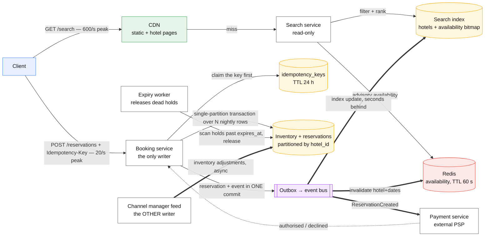
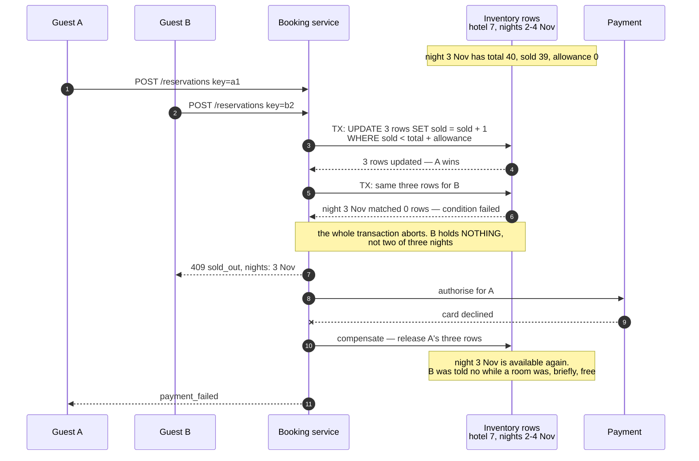
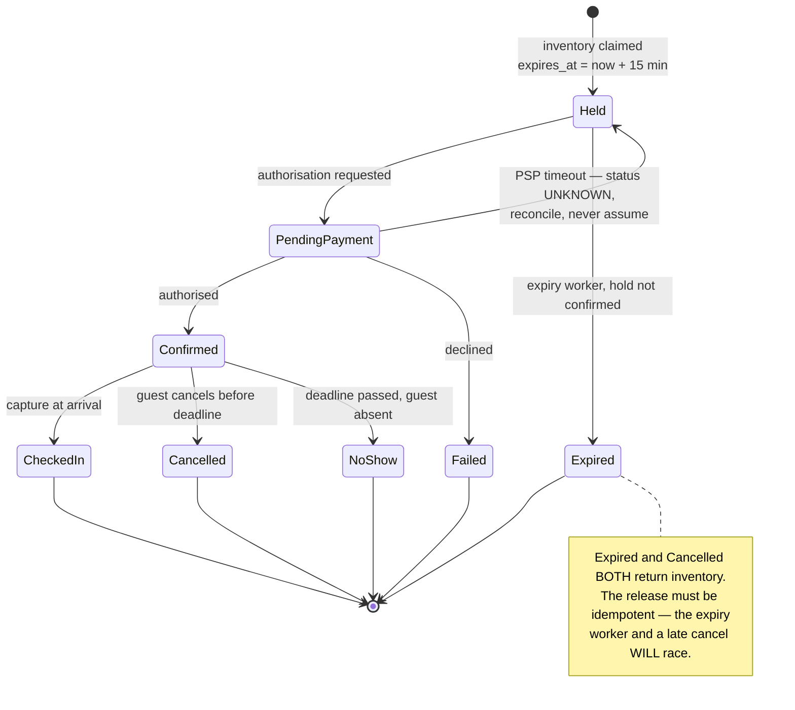

# Design a hotel reservation system

> Search hotels by city and date range, hold a room, take payment, confirm. Booking.com shaped.
> **The hard part:** the last room. Two people click Book at the same instant and exactly one of
> them may win — while the read path serving a thousand times more search traffic must never be
> made slow by the correctness the write path needs.

## 1. Clarify

| Question | Assumed answer |
|---|---|
| Inventory granularity? | **Room type per hotel per night**, not individual rooms. The guest buys "a king room", the front desk assigns 412 at check-in |
| Can we overbook? | **Yes, deliberately** — hotels do, at a configured percentage per property. This is a business rule, not a bug, and the design must express it |
| Is payment taken at booking? | Authorise at booking, capture at check-in. Two different failure stories |
| Cancellation? | Free until a per-rate deadline, then a penalty. Inventory returns on cancel |
| Multi-night? | Yes — and this is the crux: a 3-night stay must be **all or nothing across three nightly rows** |
| Scale? | 5,000 hotels, ~100k room-type-nights of inventory, 10M searches/day, 100k bookings/day |
| Who else writes this inventory? | Channel managers and the hotel's own PMS, via an async feed. **We are not the only writer** |

**Non-goals:** dynamic pricing (consumed as an input, not designed), loyalty points, the hotel's
internal PMS, fraud scoring beyond a hook.

## 2. Requirements

**Functional**
- Search: hotels in a city, available for a date range, filtered and ranked
- Reserve: hold inventory for N nights, atomically, with an idempotency key
- Pay: authorise, then confirm or release
- Cancel / modify, with inventory returned
- Admin: set inventory, rates, and the overbooking allowance per property

**Non-functional**

| Target | Value |
|---|---|
| Search p99 | < 300 ms — it is the funnel, and latency here costs conversions |
| Booking p99 | < 1 s including the payment authorisation round trip |
| Correctness | **Never sell more than allowance. Never double-charge. Never lose a paid booking** |
| Availability | Search 99.99%; booking 99.9% — a failed booking that is *clearly* failed is acceptable, an ambiguous one is not |
| Consistency | Search may be stale by seconds. Reservation must be strictly serialised per room-type-night |

> [!info] The ratio that shapes everything
> **100:1 search to booking.** The read path is a cache-and-index problem; the write path is a
> transaction problem. Designing them as one system is the mistake — they share a database and
> nothing else.

## 3. Estimates

```
Searches:   10M/day        ≈ 116/s avg, ~600/s peak
Bookings:   100k/day       ≈ 1.2/s avg, ~20/s peak          ← genuinely tiny
Inventory:  5,000 hotels × 10 room types × 365 nights
            = 18.25M rows/year. A few GB. Fits comfortably in one database
Reservations: 100k/day × 365 × ~1 KB = 36 GB/year, kept forever
Search index: 5,000 hotels × ~2 KB = 10 MB. Fits in RAM on every node
Contention: peak 20 bookings/s spread over 18M rows — average contention is ZERO.
            The design is decided entirely by the WORST row: one hotel, one night,
            during a conference, where 200 requests hit the same row in a minute
```

> [!warning] The trap in the arithmetic
> Twenty writes per second sounds like it needs nothing. It does not need scale — it needs
> **serialisability on a contended key**. Quote the average to show you did the maths, then say
> plainly that the average is irrelevant and design for the hot row.

## 4. API / contract

```http
GET /v1/search?city=paris&checkin=2026-11-02&checkout=2026-11-05&guests=2
  → 200 { hotels: [ { id, name, from_price, room_types: [...] } ] }
  Availability here is ADVISORY and labelled as such. It is read from a cache.

POST /v1/reservations
  Idempotency-Key: <client-generated uuid>          ← required, not optional
  { hotel_id, room_type_id, checkin, checkout, guests, rate_id, payment_method }
  → 201 { reservation_id, status: "pending_payment", expires_at }
  → 409 { error: "sold_out", nights: ["2026-11-03"] }   ← say WHICH night failed
  → 200 with the ORIGINAL body if the key was seen before

POST /v1/reservations/{id}/confirm    — after payment authorises
DELETE /v1/reservations/{id}          — cancel, returns inventory
GET  /v1/reservations/{id}            — status, strongly consistent read
```

**The idempotency key is the contract.** The client generates it before the first attempt and
reuses it on every retry. The server stores `key → (request_hash, response)`; a repeat with the
same hash replays the stored response, a repeat with a *different* hash is a `422`, never a
second booking. Without this, every mobile-network timeout is a duplicate reservation and a
duplicate charge. See [idempotency](../fundamentals/idempotency.md).

**`expires_at` is part of the contract, not an implementation detail.** A hold that no one
confirms must return to inventory, and the client needs to know how long it has.

## 5. Data model

| Entity | Key | Partition by | Serves |
|---|---|---|---|
| `hotels` | `hotel_id` | `hotel_id` | Detail page, replicated everywhere, changes rarely |
| `inventory` | `(hotel_id, room_type_id, date)` | `hotel_id` | **The contended row.** One per room-type per night |
| `reservations` | `reservation_id` | `hash(reservation_id)` | The booking record |
| `reservation_nights` | `(reservation_id, date)` | `reservation_id` | Which rows this booking consumed |
| `idempotency_keys` | `key` | `hash(key)` | Replay protection, TTL 24 h |
| `outbox` | `(aggregate_id, seq)` | `aggregate_id` | Events to payment/search/email, written in the booking transaction |

```
inventory: hotel_id | room_type_id | date | total | sold | overbook_allowance | version
  invariant:  sold <= total + overbook_allowance
```

**Partition by `hotel_id`, not by date.** A booking touches N consecutive nights *of one hotel*.
Partitioning by hotel puts all N rows in one partition, so the multi-night transaction is
single-partition — cheap, and available on every store worth using. Partition by date and the
same booking becomes a distributed transaction across three partitions, for no benefit at all.
This is the single highest-leverage decision in the case; make it out loud, with that reason.

**`sold` is a counter, not a row per room.** Storing one row per physical room turns "is a king
available" into a scan and makes the overbooking rule inexpressible.

## 6. Architecture



### Deep dive A — the last room



The last frame is the honest part of this design and interviewers look for it: **a conditional
write plus an external payment is a saga, and a saga has a visible window where the compensation
has not happened yet.** Options, with their costs:

| Approach | Cost |
|---|---|
| Hold inventory, authorise, then confirm (above) | A declined card briefly denied a room to someone else. Minutes, at most |
| Authorise first, then claim inventory | Now you refund strangers whose room vanished. Worse |
| Optimistic: no hold, claim at payment success | Simple and wrong at any contention — the whole case is the contended row |
| Waitlist on 409 | Recovers the lost sale. Real systems do this. Mention it; do not design it |

**Use a conditional update, not a read-then-write.** `UPDATE … WHERE sold < total + allowance`
is one round trip and is atomic at the row. `SELECT` then `UPDATE` is a lost update unless
wrapped in a transaction with the right isolation level — and "the right isolation level" is a
sentence you should be able to finish: **read committed is not enough**, you need the conditional
predicate evaluated at write time, or `SERIALIZABLE`, or a version check. See
[transaction isolation levels](../fundamentals/transaction-isolation-levels.md).

### Deep dive B — the reservation lifecycle, because the states are the design



The state nobody draws is `PendingPayment → Held` on a PSP timeout. An unknown payment outcome
is not a failure; treating it as one either double-charges on retry or strands a paid booking.
The answer is a reconciliation job against the PSP by idempotency key, and it belongs in the
design, not in the ops runbook. [Payments and ledger](payments-ledger.md) works this through.

### Deep dive C — search must not read the write path

Availability shown in search is **advisory** and derived:

- An availability bitmap per hotel — one bit per room-type-night for the next 365 days, ~45 KB
  per hotel, ~220 MB for the whole estate. It fits in memory, so a date-range filter is a
  bitwise AND over the nights requested.
- Rebuilt from the outbox stream, seconds behind. A guest occasionally sees a room that has just
  gone; the booking call is the one that tells the truth, and its 409 must name the night.
- Cache key is `(hotel, room_type, date_range)` with a 60 s TTL and event-driven invalidation on
  the hotel's dates. TTL alone is wrong at a conference; invalidation alone leaks on a missed
  event. Use both, and say why both.

**Never serve search from the inventory rows.** Six hundred reads per second of the row that 20
writes per second are fighting over is how you convert a contention problem into a latency
problem for everybody.

### Deep dive D — overbooking, stated as a rule

`allowance = round(total × property.overbook_pct)`, where `overbook_pct` comes from the hotel's
own no-show history. Two things follow, and both are design work:

- **A walk procedure.** When overbooking bites, someone is re-accommodated at a nearby property
  at your cost. That is a workflow with a state, a cost cap and an audit record.
- **The allowance must shrink as the date approaches.** Fifteen percent 60 days out is prudent;
  fifteen percent on the day is a lobby full of angry people.

## 7. Scale & failure

| Breaks first at 10x | Fix |
|---|---|
| One hotel-night row during a conference | The row is the serialisation point by design. Shard the counter into K sub-rows and claim from a random one, accepting a small false-negative rate at the tail |
| Search fanout across 5,000 hotels per query | Pre-filter by city, then bitmap. Cache the popular `(city, dates)` pairs outright |
| Expiry worker scanning all holds | Index on `expires_at`, process in time order, or a delay queue per hold |
| Idempotency table growth | TTL 24 h — long enough for every real retry, short enough to stay small |

| Component fails | Blast radius | Degraded behaviour |
|---|---|---|
| Search index | Search degraded | Serve from cache, then fall back to "call the hotel" — **never** fall back to querying inventory rows |
| Cache | Search latency ↑ | Read index directly; booking is unaffected |
| Payment PSP | No new confirmations | Keep holds, extend `expires_at`, retry with backoff; secondary PSP if the business has one |
| Event bus | Search staleness grows | Bookings still correct — the write path does not depend on it. Alert on outbox depth |
| Inventory database | **Bookings stop** | Fail closed. Read-only mode: search works, booking returns a clear 503. An ambiguous booking is worse than a refused one |

**The invariant to state explicitly:** `sold ≤ total + allowance`, enforced by a database check
constraint as well as by application logic. A constraint at the store is the only guard that
survives a new service written by someone who has not read this document — and that service is
the one that will oversell.

## 8. Ops & cost

- **SLO:** search p99 < 300 ms; booking p99 < 1 s; **zero** oversell beyond allowance; zero
  double-charges.
- **Alert on:** 409 rate by hotel (a spike is either a sell-out or a bug, and you want to know
  which), holds expiring unconfirmed (a broken payment flow shows up here first), outbox depth,
  reconciliation mismatches against the PSP, `sold > total + allowance` — which should be
  impossible and therefore pages immediately.
- **Rollout:** the inventory schema is the risky one. Expand-contract only, never an in-place
  column change on the contended table. See
  [expand-contract migration](../patterns/expand-contract-migration.md).
- **Cost:** trivially small by system-design standards — tens of GB and tens of writes per
  second. The bill is search infrastructure and the PSP's per-transaction fee, not storage. Do
  not over-engineer the write path with a distributed consensus layer it does not need.
- **First thing I'd cut:** the 365-day availability bitmap horizon. Ninety days covers the vast
  majority of bookings and quarters the index.

**Also mention, briefly:** the channel manager. You are not the only writer to inventory, and an
external feed that sets `total` while you are incrementing `sold` is a real oversell path.
Feeds set `total`; only the booking service touches `sold`; nothing else writes either.

## On AWS and Azure

| | AWS | Azure |
|---|---|---|
| **The service** | DynamoDB with `TransactWriteItems` for the nightly rows; Aurora PostgreSQL if you want real SQL constraints; EventBridge or SQS for the outbox; Step Functions for the booking saga | Azure Cosmos DB for NoSQL with transactional batch; Azure SQL Database if you want the check constraint; Service Bus for the outbox; Durable Functions for the saga |
| **What you configure** | `ClientRequestToken` on every transactional write, condition expressions on each `Update`, partition key `hotel_id`, on-demand vs provisioned capacity | Partition key `/hotelId`, batch operations grouped by that key, consistency level (**Session** is the account default and is what read-your-writes depends on), autoscale max RU/s |
| **The default that bites** | **Transactions are not supported across Regions in global tables.** A booking system that adds a second Region for latency silently loses its atomicity guarantee — replicas may observe partially completed transactions. Also: a cancelled transaction still **consumes the capacity it attempted**, so the contended conference night burns write capacity on every loser | A transactional batch requires **every operation to share one partition key**, which is exactly why `hotel_id` must be the partition key — partition by date and the multi-night booking cannot be a batch at all. And a single operation is capped at **5 seconds** of execution, so a long conditional retry loop is terminated, not queued |
| **What it costs you** | `TransactWriteItems` groups **up to 100 actions, 4 MB aggregate**, and DynamoDB performs **two underlying writes per item** (prepare + commit) — so a 3-night booking costs 6 WCU, not 3. The `ClientRequestToken` idempotency window is **10 minutes**; a retry after that is a *new* booking, which is why the application-level idempotency key above cannot be delegated to it | A logical partition is capped at **10,000 RU/s and 20 GB**. One hotel is one logical partition: a single famous property's traffic is bounded by that number no matter what the container is provisioned at. Transactional batch is likewise **100 operations, 2 MB per request** |

Both clouds will happily give you an atomic multi-row booking, and both make the *same* thing
the pivot: the partition key. AWS charges you double for the transaction and expires its
idempotency token in ten minutes; Azure refuses the batch outright if the rows are not
colocated. Either way `hotel_id` is the answer, and either way your own idempotency key outlives
the vendor's.

## In an LLM deployment

The booking transaction is exactly where a model must not be. A useful split, and the one worth
arguing in an interview:

- **Model in the funnel, deterministic code at the commit.** Natural-language search ("somewhere
  quiet near the Marais, under €200") is a genuinely good fit — it maps prose onto the same
  filters the search API already takes. The reservation call stays a typed request with a
  conditional write behind it.
- **An agent that books must carry the idempotency key across its own retries.** An agent loop
  that retries a tool call after a timeout, generating a fresh key each time, books the room
  twice and charges twice. The key belongs to the *intent*, derived once and passed down — not
  generated inside the tool.
- **Never let a model compute availability.** It has no row lock, no version and no constraint;
  it produces a plausible answer with no mechanism that could make it true. The 409 from the
  booking service is the only authority on whether a room exists.

A reasonable rule: the model may propose, the transaction disposes, and every tool that mutates
takes an idempotency key it did not invent.

## Referenced by

- [Backend cases index](README.md)
- [Question bank](../07-drills/question-bank.md)

## Sources

- Mechanisms in this corpus: [idempotency](../fundamentals/idempotency.md),
  [transaction isolation levels](../fundamentals/transaction-isolation-levels.md),
  [leases, locks and fencing](../fundamentals/leases-locks-and-fencing.md),
  [saga pattern](../patterns/saga-pattern.md),
  [outbox pattern](../patterns/outbox-pattern.md)
- Neighbouring case: [payments and ledger](payments-ledger.md) for the money half
- Local book: Alex Xu, *System Design Interview* vol. 2 ch. 7 — Hotel Reservation System

Cloud claims in §On AWS and Azure (all verified 2026-09-23):

- [AWS — DynamoDB transactions: how it works](https://docs.aws.amazon.com/amazondynamodb/latest/developerguide/transaction-apis.html) — `TransactWriteItems` groups up to 100 actions on 100 distinct items, 4 MB aggregate; two underlying writes per item for prepare and commit; capacity consumed even when the transaction is cancelled; `ClientRequestToken` valid for 10 minutes after the request finishes; transactions are not supported across Regions in global tables
- [Azure — Cosmos DB service quotas and default limits](https://learn.microsoft.com/en-us/azure/cosmos-db/concepts-limits) — 10,000 RU/s and 20 GB per logical partition, 100 operations per transactional batch, 2 MB maximum request size, 5 second maximum execution for a single operation
- [Azure — Cosmos DB consistency levels](https://learn.microsoft.com/en-us/azure/cosmos-db/consistency-levels) — Session is the account default
