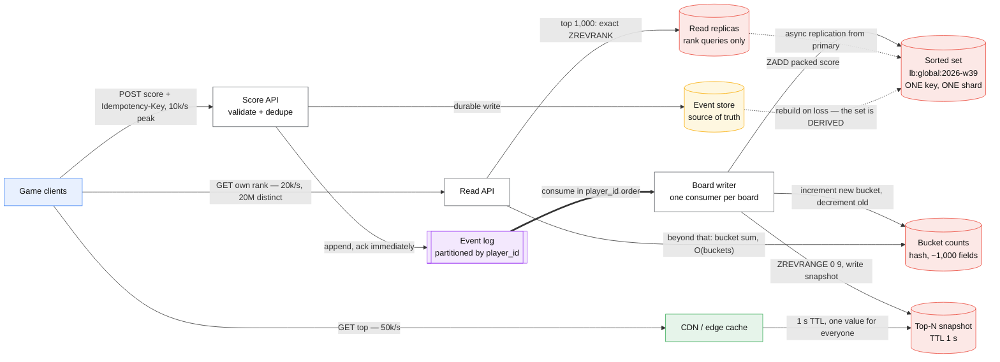
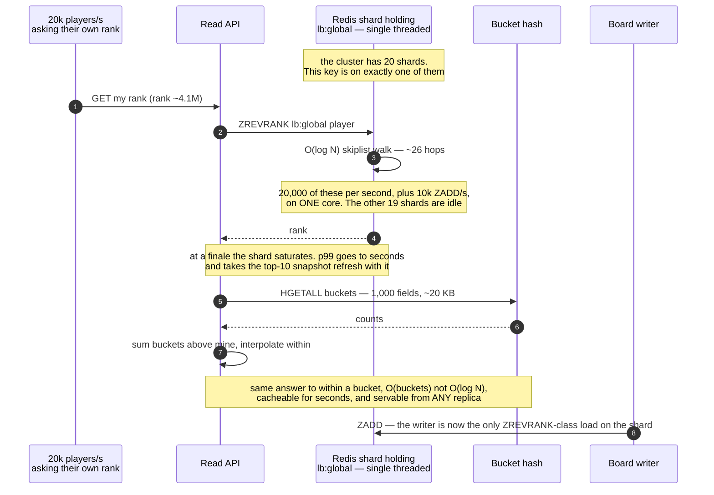

# Design a real-time leaderboard

> Top 10 players right now, plus "what rank am I?" for 50 million people who are not in the
> top 10.
> **The hard part:** the top-K is trivial and the arbitrary rank query is not. One sorted set
> answers both — and is a single key, which means a single shard, which means every scaling
> instinct you have is unavailable until you change the data model.

## 1. Clarify

| Question | Assumed answer |
|---|---|
| Scope of a board? | Global, plus per-country and per-friend-group. **Per-friend is a different problem** and worth flagging early |
| Time window? | A tournament: daily, weekly, all-time. Each is its own board |
| Score semantics? | Monotonically increasing points within a window. Absolute set, not increment, for anti-cheat replays |
| Do users see their own rank? | **Yes — and this is the requirement that costs money.** Top-10 alone would be a cache entry |
| Ties? | Broken by earliest achievement time. Say this: it changes the key, not just the sort |
| Freshness? | Top-10 within a second. A distant rank may be minutes stale and approximate |
| Scale? | 50M monthly players, 5M daily active, ~500 score updates/s average, 10k/s at a tournament finale |

**Non-goals:** the game itself, matchmaking, the anti-cheat detector (a hook, not a design),
rewards and payouts.

## 2. Requirements

**Functional**
- Submit a score for a player in a board
- Read the top N of a board
- Read a player's rank and score, plus the players immediately around them
- Boards roll over on a schedule; historical boards stay readable

**Non-functional**

| Target | Value |
|---|---|
| Top-N read p99 | < 20 ms — it is on the game's home screen |
| Own-rank read p99 | < 100 ms, and **allowed to be approximate outside the top 1,000** |
| Write p99 | < 50 ms |
| Availability | 99.9%. A leaderboard is not a ledger; stale beats down |
| Correctness | The top 100 must be exact. A wrong champion is a support incident and, where there is prize money, a legal one |

> [!info] The split that makes the case tractable
> **Exact at the top, approximate in the tail.** Nobody at rank 4,120,338 can verify their rank,
> and nothing depends on it being exact — but everybody in the top 100 can, and something does.
> Committing to one accuracy target for all 50M players is what makes this design expensive.

## 3. Estimates

```
Players:     50M total, 5M daily active
Writes:      500/s average, 10k/s at a finale
Reads:       top-10   ~50k/s  (home screen, trivially cacheable — ONE value)
             own-rank ~20k/s  (profile screen, 20M DISTINCT values)  ← the real load
Sorted set:  50M members × ~80 B (member + score + skiplist overhead) ≈ 4 GB per board
Boards:      daily + weekly + all-time + 40 countries ≈ 43 live boards
             but only all-time and a few countries are large
Ops cost:    ZADD      O(log N)  → log2(50M) ≈ 26 pointer hops
             ZREVRANGE O(log N + K) for the top 10 — cheap
             ZREVRANK  O(log N)  → 20k/s × 26 hops on ONE key, ONE thread
Rollover:    a new key per window. The old one is a TTL, not a delete loop
```

> [!warning] The number that decides the architecture
> **One sorted set is one key, and one key lives on one shard.** Buying a 20-node cluster gives
> the global board exactly one node's CPU. At 20k rank queries per second against a
> single-threaded shard, the board is the bottleneck and no amount of horizontal scaling
> touches it.

## 4. API / contract

```http
POST /v1/boards/{board}/scores
  { player_id, score, achieved_at }
  Idempotency-Key: <event uuid>        ← a replayed game event must not double-count
  → 202 { accepted: true }              ← async is fine: the board is not a ledger

GET /v1/boards/{board}/top?limit=10
  → 200 { entries: [ {rank, player_id, score} ], as_of }   ← as_of, always

GET /v1/boards/{board}/players/{id}
  → 200 { rank: 4120338, approximate: true, score, percentile: 91.7,
          neighbours: [ ... ] }
  → the `approximate` flag is part of the contract, not a detail. A client that
    renders "#4,120,338" from an approximate value is making a promise you did not
```

**Scores are set, not incremented, where anti-cheat matters.** `ZADD` with the absolute value is
idempotent under replay; `ZINCRBY` is not, and a retried event silently inflates a score. Where
increment is genuinely required, dedupe on the event id first.

**Encode the tie-break into the score, do not sort twice.** A single 64-bit score of
`points × 2^32 + (2^32 − seconds_since_window_start)` gives points-descending,
earliest-first, with one comparison — and it is why the sorted set can answer both queries.

## 5. Data model

| Entity | Key | Stored as | Serves |
|---|---|---|---|
| Board | `lb:{board}:{window}` | sorted set, member = `player_id`, score = packed int | Top-N, exact rank |
| Player score of record | `(player_id, board, window)` | durable store, partitioned by `player_id` | Rebuild, audit, disputes |
| Score bucket counts | `lb:{board}:{window}:buckets` | hash: score bucket → count | **Approximate rank in O(buckets)** |
| Top-N snapshot | `lb:{board}:{window}:top` | plain string, JSON, TTL 1 s | Absorbs the 50k/s read entirely |
| Event log | append-only | partitioned by `player_id` | The source of truth; the sorted set is a derived index |

**The sorted set is a cache, not the database.** State this explicitly. It is a derived index
that can be rebuilt from the event log, which is what makes a Redis failover a latency event
rather than a data-loss event — and what lets you change the tie-break rule without a migration.

**Bucketing is the trick that makes the tail cheap.** Maintain a count of players per score
bucket (say 1,000 buckets over the score range). A player's approximate rank is
`sum(counts of buckets above mine)` plus a linear interpolation within their own bucket: one
hash read, no `ZREVRANK`, and it is O(number of buckets) regardless of player count. Exact rank
stays available for the top 1,000, where the set is small and the query is cheap.

## 6. Architecture



### Deep dive A — the hot key, which is the whole case



The fixes, in the order you should offer them:

| Fix | Buys | Costs |
|---|---|---|
| Snapshot the top-N to a plain key with a 1 s TTL | Removes 50k/s entirely — one value serves everyone | 1 s staleness on the top 10 |
| Read replicas for rank queries | Multiplies read capacity for the exact path | Replication lag; a player may see a rank they just beat |
| Bucket counts for approximate rank | Removes the `ZREVRANK` load, and scales with buckets not players | Accuracy within one bucket. **Label it in the response** |
| Shard the board by score range | True horizontal scale: rank = sum of counts in higher ranges + local rank | Cross-shard coordination, and rebalancing when the distribution shifts |
| Per-country and per-friend boards | Smaller sets, naturally sharded, and usually what players actually care about | More keys, more rollovers |

**Do not reach for "shard the sorted set" first.** It is the most complex fix and the least
often needed — most leaderboard load is top-N reads, which a single cached value answers, plus
own-rank reads, which bucketing answers approximately. Offer the cheap two, then say what would
make you take the expensive one.

### Deep dive B — the friends leaderboard is not the same problem

A friend board is "rank these 200 specific players against each other". Against one global
sorted set that is 200 `ZSCORE` calls plus a sort — fine for 200, a disaster as a fanout. The
options are the same two the [news feed](news-feed.md) case weighs, and for the same reason:

- **Compute on read:** fetch friends' scores, sort in the service. O(friends) per request,
  always fresh, and entirely adequate up to a few hundred friends.
- **Materialise per user:** a small sorted set per player containing their friends. Fast reads,
  but one score update fans out to every friend of that player — the celebrity problem again.

Compute on read is the right default here, because friend counts are bounded in a way follower
counts are not. Saying *why* the answer differs from the feed case is the point.

### Deep dive C — rollover, ties and cheats

- **Rollover is a key change, not a mutation.** `lb:global:2026-w39` becomes
  `lb:global:2026-w40` at the boundary; the old key gets a TTL. Writers derive the key from the
  event's `achieved_at`, not from the wall clock, so an event arriving three seconds late still
  lands in the window it belongs to.
- **The boundary is a correctness question, not a scheduling one.** Name the timezone, and say
  what happens to an event that arrives after the window closed: accept into the closed window
  up to a grace period, then drop with a metric. Silently landing it in the new window is worse.
- **Ties** are already handled by the packed score. Without that, two players on 10,000 points
  swap places on every write and the top-10 flickers — a visible bug that looks like a caching
  problem and is not.
- **Cheating** is the reason scores are validated server-side from an authoritative event, never
  submitted as a trusted number by the client. A leaderboard fed by client-reported scores is a
  leaderboard of the most determined cheater, and the design work is the event pipeline, not the
  sorted set.

## 7. Scale & failure

| Breaks first at 10x | Fix |
|---|---|
| The single shard holding the global board | Snapshot + buckets first; range-sharding only if those are exhausted |
| Memory: 50M members × 80 B per board × many boards | TTL old windows; keep only the top N of historical boards in memory, the rest in the event store |
| Writer lag during a finale | Batch `ZADD` in pipelines; one consumer per board partition; drop to "best score per player per second" — the board cannot show more than that anyway |
| Bucket counts drifting from the true distribution | Rebuild periodically from the sorted set; it is a few seconds of work off the hot path |

| Component fails | Blast radius | Degraded behaviour |
|---|---|---|
| Redis primary | Board unavailable for the failover | Replica promoted; **the set is derived, so worst case is a rebuild from the event log** |
| Read replica | Rank query capacity ↓ | Route to primary, shed to approximate-only |
| Board writer | Board freezes, scores still captured | Event log holds everything; catch up on restart. Show `as_of` so the staleness is visible rather than silent |
| Event log | No new scores | Board serves last known state. This is the one that actually loses data if the API acked before appending — so append first, ack second |
| Top-N snapshot | Top-10 read load hits the sorted set | The shard absorbs 50k/s badly. Serve the last good snapshot stale rather than fall through |

**Serve stale rather than fall through.** Every degraded path in this table ends in "show older
data with a timestamp". A leaderboard has the rare property that an old answer is almost as good
as a fresh one, and a design that does not exploit that is leaving its availability on the table.

## 8. Ops & cost

- **SLO:** top-N p99 < 20 ms; own-rank p99 < 100 ms; top-100 exact; board staleness < 5 s at
  p99, published as `as_of` in every response.
- **Alert on:** writer lag per board, Redis shard CPU (the single-thread saturation shows up
  here and nowhere else), memory against `maxmemory`, bucket-count drift, the rate of rank
  queries falling back to exact.
- **Rollout:** the packed-score encoding is the migration risk. Changing the tie-break changes
  every score, so it is a rebuild from the event log into a new key and an atomic pointer swap —
  which is only possible because the set is derived. Say that out loud; it is the payoff for the
  data-model decision in §5.
- **Cost:** memory-bound. Roughly 4 GB per large board plus replicas, so a handful of cache
  nodes; the event log and durable store are cheap at this volume. The expensive mistake is
  provisioning a 20-node cluster to serve one hot key — it is the same single core either way.
- **First thing I'd cut:** the number of live country boards. Forty boards that nobody reads
  cost memory and writer throughput on every score update.

**Also mention, briefly:** cross-region. A global board with writers in three regions is a
convergence problem, not a caching one. Either one region owns the board and others read a
replica (simple, adds RTT to writes) or scores merge by max-per-player and the rank is eventually
consistent everywhere. Pick one and name the anomaly it permits.

## On AWS and Azure

| | AWS | Azure |
|---|---|---|
| **The service** | Amazon ElastiCache (Valkey or Redis OSS) for the sorted set; DynamoDB for the score of record; Kinesis Data Streams or MSK for the event log | Azure Managed Redis (Redis Enterprise based) for the sorted set; Cosmos DB for NoSQL for the score of record; Event Hubs for the event log |
| **What you configure** | Node type, `reserved-memory-percent`, cluster mode on/off, replica count per shard, `maxmemory-policy` via a **custom** parameter group — default parameter groups cannot be modified | Tier and size (Memory Optimized / Balanced / Compute Optimized), clustering policy (**OSS**, Enterprise or Non-clustered), high-availability mode |
| **The default that bites** | **`reserved-memory-percent` defaults to 25%.** A node advertising 13.5 GB gives roughly 10.1 GB of `maxmemory` — so sizing a 4 GB board plus replication buffers off the advertised figure is a quarter short, and AWS explicitly says not to reduce the reserve. On micro and small nodes the guidance is **30% and 50%** | Azure Managed Redis reserves **approximately 20% of available memory** for non-cache operations. And **scaling down is not supported** — a leaderboard provisioned for a launch spike stays provisioned at that size, so the finale that justified the tier is billed forever |
| **What it costs you** | Cluster mode does not help one key: a sorted set hashes to a single slot, so the global board gets one shard's CPU no matter how many shards you buy. Splitting it with hash tags is the range-sharding fix from §Deep dive A, done manually | Under the **OSS clustering policy "all keys in multikey commands must map to the same hash slot"**, so a range-sharded board cannot be read with a single multikey command; under Enterprise policy only `DEL`, `MSET`, `MGET`, `EXISTS`, `UNLINK` and `TOUCH` cross slots at all. **You cannot manually change the number of shards** — the SKU decides it |

Both clouds make the same two points the design already argued: the hot key is a single-shard
problem that provisioning cannot solve, and the usable memory is meaningfully smaller than the
number on the price list. The Azure detail worth carrying away is that **scale-down is not
available** — so the tournament-finale sizing decision is a durable cost commitment, which is
one more argument for the snapshot-and-buckets approach over simply buying a bigger node.

## In an LLM deployment

A leaderboard is not an LLM system, but the same shape appears the moment a model platform needs
ranked aggregates, and the failure mode is identical:

- **Model and prompt leaderboards.** An internal eval board ranking 200 prompt variants by win
  rate is this case with `N = 200` — small enough that every consideration above collapses.
  Recognising when the expensive design is unnecessary is worth as much as knowing it.
- **Per-tenant token spend rankings.** "Top 10 consumers this hour" over 50k tenants is exactly
  the hot-key problem: one sorted set, one shard, and a dashboard that refreshes every five
  seconds. The snapshot-with-TTL fix applies unchanged.
- **The one thing that genuinely differs:** LLM eval scores are *noisy and re-scored*. A judge
  model rerun changes historical scores, so the board must be rebuildable from the eval events
  rather than incrementally mutated — which is the §5 decision again, arrived at from the other
  direction. See [ML monitoring and eval](../06-ml-cases/ml-monitoring-and-eval.md).

What does not change: a model never computes the rank. Ranking is arithmetic over a set, and a
system that asks a model for a number it could have counted has invented an error source for
nothing.

## Referenced by

- [Backend cases index](README.md)
- [Design a digital wallet](digital-wallet.md)
- [Question bank](../07-drills/question-bank.md)
- [Topic manifest](../topics/manifest.md)

## Sources

- Mechanisms in this corpus: [hot shard mitigation](../fundamentals/hot-shard-mitigation.md),
  [caching strategies](../fundamentals/caching-strategies.md),
  [partitioning strategies](../fundamentals/partitioning-strategies.md),
  [materialized views and derived data](../patterns/materialized-views-and-derived-data.md),
  [idempotency](../fundamentals/idempotency.md)
- Neighbouring cases: [rate limiter](rate-limiter.md) for distributed counters,
  [news feed](news-feed.md) for the fanout trade this case deliberately declines
- Local book: Alex Xu, *System Design Interview* vol. 2 ch. 10 — Real-time Gaming Leaderboard

Cloud claims in §On AWS and Azure (all verified 2026-09-23):

- [AWS — managing reserved memory for Valkey and Redis OSS](https://docs.aws.amazon.com/AmazonElastiCache/latest/dg/redis-memory-management.html) — `reserved-memory-percent` defaults to 25%, worked example of 13.5 GB advertised giving about 10.1 GB `maxmemory`, guidance to raise it to 30% on small and 50% on micro instances, and that default parameter groups cannot be modified
- [Azure — Azure Managed Redis architecture](https://learn.microsoft.com/en-us/azure/redis/architecture) — approximately 20% of available memory reserved for non-cache operations; scaling down is not currently supported; under the OSS clustering policy all keys in multikey commands must map to the same hash slot; only `DEL`, `MSET`, `MGET`, `EXISTS`, `UNLINK` and `TOUCH` are permitted across slots under the Enterprise policy; the number of shards cannot be changed manually
