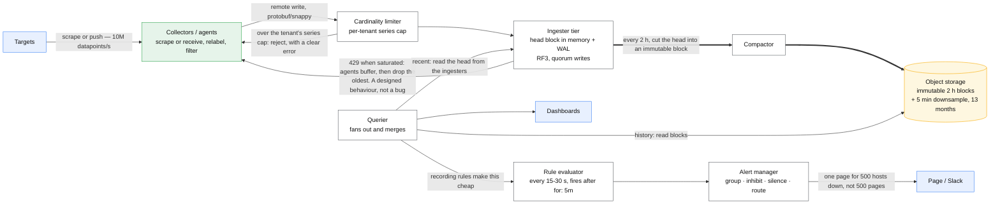
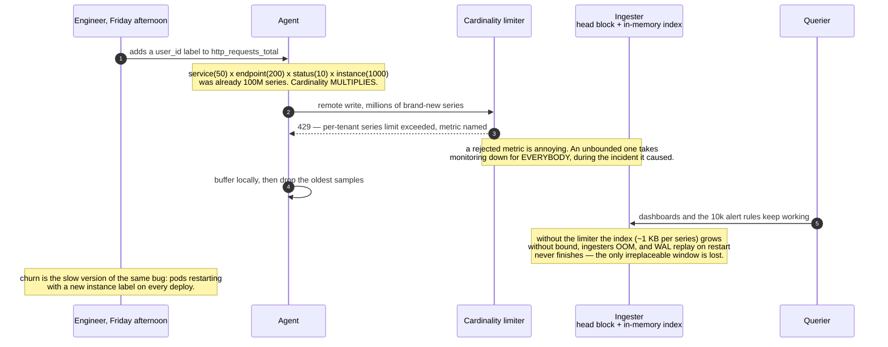

# Design a metrics and alerting system

> Prometheus/Datadog: ingest metrics from a fleet, store them cheaply, query them fast,
> evaluate alert rules.
> **The hard part:** cardinality. Every candidate designs the ingest path; the ones who pass
> talk about what happens when someone adds `user_id` as a label.

## 1. Clarify

| Question | Assumed answer |
|---|---|
| Metrics only, or logs and traces too? | Metrics. (Say the other two are different systems with different economics) |
| Push or pull collection? | Both — pull for services, push for batch jobs and edge |
| Retention? | 15 days raw, 13 months downsampled |
| Query patterns? | Dashboards (last hours, many series) + alert rules (last minutes, evaluated constantly) |
| Scale? | 10k hosts, 10k series per host = **100M active series**, 10 s resolution |
| Multi-tenant? | Yes — per-team isolation and quotas |

**Non-goals:** log search, distributed tracing storage, incident management workflow.

## 2. Requirements

**Functional**
- Ingest time-series (name + labels + timestamp + float)
- Query with aggregation over time and across labels
- Evaluate alert rules continuously; route and deduplicate notifications
- Downsample and expire old data automatically

**Non-functional**

| Target | Value |
|---|---|
| Ingest | 10M datapoints/s sustained, lossless under normal load |
| Dashboard query p99 | < 1 s for a 6-hour window |
| Alert evaluation delay | < 30 s from datapoint to fired alert |
| Availability | 99.9% — **and it must work while everything else is broken** |

## 3. Estimates

```
100M active series ÷ 10 s = 10M datapoints/s
Raw: 10M/s × 16 B (ts + value, before compression) = 160 MB/s = 14 TB/day
   → Gorilla-style compression gets ~1.3–2 bytes/point ⇒ ~1.3 TB/day, ~20 TB for 15 days
Downsampled (5 min for 13 months): 100M series × 105k points × 2 B ≈ 21 TB
Index: 100M series × ~1 KB of labels ≈ 100 GB — must be in memory for query speed
Alert rules: 10k rules × every 30 s = 333 evaluations/s, each a small range query
```

> [!info] The scary number
> **100M active series** and its index. Compression makes the *points* cheap; it's the
> **series cardinality** that costs memory, and it grows multiplicatively with labels.

## 4. API / contract

```
# ingest
POST /api/v1/write        (protobuf/snappy, Prometheus remote-write style)
  [{labels: {__name__:"http_requests_total", service:"api", code:"500"}, samples:[{ts, v}]}]

# query
GET /api/v1/query_range?query=sum(rate(http_requests_total{service="api"}[5m])) by (code)
                        &start=&end=&step=

# rules
POST /api/v1/rules
  { expr: "...", for: "5m", labels: {severity: "page"}, annotations: {runbook: "..."} }
```

## 5. Data model

```
series_id = hash(metric_name + sorted(labels))
series_index:  label pair → posting list of series_ids   (inverted index — same as search!)
blocks:        (series_id, time_window) → compressed chunk of (timestamp, value) pairs
```

| Entity | Key | Partition by | Serves |
|---|---|---|---|
| Series index | label pairs | `hash(series_id)` | Which series match this query |
| Sample chunks | `(series_id, 2h window)` | `hash(series_id)` | Range reads for one series |
| Downsampled blocks | `(series_id, 5m, day)` | `hash(series_id)` | Long-range queries |
| Rules | `rule_id` | tenant | Evaluation |

**Why partition by series, not by time:** a query reads a few series over a long time range,
so colocating one series' history makes it a sequential read. Time-partitioning would make
every query touch every shard. (Blocks are still cut into time windows *within* a series for
compaction and retention.)

**Compression** is the reason this is affordable: delta-of-delta on timestamps (regular
intervals compress to almost nothing) + XOR on float values (consecutive values share most
bits). Gorilla-style, ~1.3 bytes per point — a **10x+ saving**. Naming this is a strong signal.

## 6. Architecture



### Deep dive A — cardinality, the thing that kills these systems

Cardinality = number of distinct label combinations. It is **multiplicative**:
`service(50) × endpoint(200) × status(10) × instance(1000)` = 100M series from one metric.

Rules to state:
- **Never put unbounded values in a label**: user ID, request ID, email, full URL path, error
  message. That's not a metric; that's a log or a trace.
- Enforce **per-tenant series limits** at ingest and reject with a clear error. A rejected
  metric is annoying; an unbounded one takes down monitoring for everybody — during an
  incident, which is exactly when you need it.
- Watch **churn**: pods restarting with a new `instance` label every deploy create new series
  continuously. High churn is worse than high static cardinality because the index keeps growing.
- Use **histograms** for latency, not one series per bucket boundary you invented; and prefer
  native/exponential histograms where available.



> [!tip] Say this
> "The first thing I'd build after ingest is a cardinality limiter and a per-tenant
> top-cardinality report, because the most likely outage of this system is a well-meaning
> engineer adding a user ID label on a Friday."

### Deep dive B — ingest path

- **Pull** (Prometheus-style) gives you target discovery, a natural health signal ("scrape
  failed" *is* the down alert), and no client-side buffering. **Push** is required for
  short-lived jobs and anything behind NAT.
- Ingesters hold a **head block in memory** plus a **WAL on disk**, so a crash loses nothing
  and restart replays. Every 2 hours the head is cut into an immutable block and shipped to
  object storage.
- Replication factor 3 across ingesters with quorum writes, so one node's loss doesn't lose
  recent data — the only truly irreplaceable window.
- **Backpressure**: when ingesters are saturated, reject with 429 and let agents buffer
  locally. Agents dropping the oldest samples is a *designed* behaviour, not a bug — say so.

### Deep dive C — query and alerting

- Queriers fan out to ingesters (recent) + object storage blocks (historical) and merge.
  Query cost is bounded by limiting series touched, time range, and step.
- **Recording rules** precompute expensive expressions (dashboard queries and common alert
  subexpressions) so dashboards and rules read a cheap derived series. This is how you make a
  100M-series system feel fast.
- **Alert evaluation**: rules run every 15–30 s; a rule fires only after `for: 5m` of
  continuous breach, which kills most flapping.
- **Alert manager** does grouping (one page for 500 hosts down, not 500 pages), inhibition
  (don't page for a service being down when the whole AZ is down), silences during
  maintenance, and routing by severity/team.
- **Burn-rate alerts** on SLOs rather than raw thresholds — see
  [../02-primitives/observability-and-delivery.md](../02-primitives/observability-and-delivery.md).

## 7. Scale & failure

| Breaks first at 10x | Fix |
|---|---|
| Index memory in ingesters | Shard by series hash; more ingesters; stricter limits |
| Query fan-out latency | Recording rules, query result cache, downsampled tiers, per-query limits |
| Compaction IO | Off-peak compaction, more compactor parallelism |
| Cardinality churn | Drop high-churn labels at the agent via relabeling |

| Component fails | Blast radius | Degraded behaviour |
|---|---|---|
| Ingester node | Recent data for its shard | RF3 quorum covers it; WAL replay on restart |
| Object storage slow | Historical queries slow | Recent data (the incident-relevant part) still served from ingesters |
| Querier down | No dashboards | **Alerting must not depend on the query tier being healthy** — evaluate rules on a separate path |
| The whole monitoring system down | You're blind | An independent, dumb, out-of-band heartbeat check with a separate alert path. **Monitoring must not share fate with what it monitors** — different account, different region, ideally a different vendor |

## 8. Ops & cost

- **SLO:** 99.9% ingest success; alert delivery p99 < 60 s from breach; query p99 < 1 s.
- **Alert on (meta-monitoring):** ingest rejection rate, series count and growth rate per
  tenant, WAL replay time, rule evaluation delay, alert delivery failures, and a dead-man's
  switch (a rule that fires *always*; if the page stops arriving, monitoring is dead).
- **Rollout:** ingester changes one shard at a time; rule changes reviewed like code, since a
  bad rule either pages everyone or silences a real outage.
- **Cost:** object storage is cheap; **ingester memory dominates**, and it scales with series
  count, not datapoint count. Cardinality control *is* cost control here. Downsampling gets
  13-month retention for a fraction of raw.
- **First thing I'd cut:** raw retention 15 → 7 days, and default scrape interval 10 s → 30 s
  (3x saving across the board, and almost nobody needs 10-second resolution beyond a day).

## On AWS and Azure

| | AWS | Azure |
|---|---|---|
| **The shape** | ADOT collectors → Amazon Managed Service for Prometheus (remote-write); Amazon Managed Grafana for dashboards; alert rules and Alertmanager inside the AMP workspace | Azure Monitor agent / managed Prometheus scrape → an **Azure Monitor workspace**; Azure Managed Grafana for dashboards; Prometheus rule groups on the managed Ruler |
| **What you configure** | Workspace active-series and ingestion-rate quotas, `labelset_limits`, rule groups and evaluation interval (**30 s minimum**, adjustable) | Data collection rules (scrape config), rule groups and evaluation interval (**1 minute to 24 hours**, default 1 minute) |
| **The default that bites** | Samples **older than 1 hour are refused**, and out-of-order samples get a window that **defaults to 60 seconds** (configurable to 600). A collector that buffers through an outage and replays loses everything past the hour — the "lossless under normal load" requirement has a hard edge | **20 rules per rule group, and that limit cannot be increased.** Ten thousand alert rules means 500 rule groups, which is exactly the **500 rule groups per Azure Monitor workspace** default. This case's rule count sits precisely on both ceilings at once |
| **What it costs you** | The cardinality story has an actual number: **50,000,000 active series per workspace by default**, adjustable to a documented **maximum of 1.5 billion**, with ingestion pinned to 1/30 of it (up to 1,666,666 samples/s). Capacity also auto-scales, and **throttles if you more than double your 30-minute baseline** — a bad deploy that adds a label is throttled, not absorbed | **1,000,000 active time series per Azure Monitor workspace** (increase on request) — **fifty times smaller than AWS's default**, and this case's 100 M series needs a hundred workspaces or a hundred-fold increase. Queries are also capped at a **32-day time range**, which makes the 13-month retention unqueryable in one span |

The honest read: this case's 100 M series is above the default on both clouds and above Azure's
documented per-workspace shape by two orders of magnitude. Cardinality is not a thing you monitor
here, it is the thing the platform prices and partitions on — and the 50 M vs 1 M default gap is
the single biggest architectural difference between the two.

## In an LLM deployment

The label that kills you changes identity but not behaviour. Nobody adds `user_id` any more; they
add `model_version`, `prompt_template_id`, `tenant` and `finish_reason`, and the product of those
four is the same cardinality explosion with a respectable name. Four labels at 20 × 50 × 500 × 5
values is 2.5 M series **per metric**, which on Azure's 1 M-series workspace default is one metric.

Two measurements are genuinely new and neither is a counter. **Token counts are a distribution**,
not a rate: input and output tokens are wildly skewed, and a mean tokens-per-request is useless
where a p99 is 100× the median — histograms, and AMP caps a native histogram at **200 buckets**,
reducing resolution past that. **Quality is not observable from the serving path at all.** A
model that starts answering wrongly emits perfect latency, perfect error rate and perfect
saturation; see [ml-monitoring-and-eval](../06-ml-cases/ml-monitoring-and-eval.md) for the system
that catches it, because this one structurally cannot.

The alerting rule of thumb inverts too. Metrics here are cheap relative to the workload — a
GPU-hour dwarfs a million samples — so the instinct to trim cardinality for cost is usually wrong,
and the instinct to trim it because a *single* bad label can 100× your series count overnight is
right.

## Referenced by

- [Backend cases index](README.md)
- [Books already on this machine](../10-resources/books-on-this-machine.md)
- [Consensus — Raft and Paxos](../fundamentals/consensus-raft-paxos.md)
- [Design a real-time dashboard (frontend)](../04-frontend-cases/realtime-dashboard.md)
- [Design ML monitoring, evaluation and retraining](../06-ml-cases/ml-monitoring-and-eval.md)
- [Design real-time analytics (ad click aggregation)](../05-data-cases/realtime-analytics.md)
- [Engineering blogs and case studies](../10-resources/engineering-blogs.md)
- [Google interview style](../09-company-styles/google.md)
- [Question bank](../07-drills/question-bank.md)

## Sources

- Local book: Alex Xu vol. 2 — metrics monitoring and alerting chapter (`AI/ML-Foundations/`)
- [Gorilla: A fast, scalable, in-memory time series database (Facebook, VLDB 2015)](https://www.vldb.org/pvldb/vol8/p1816-teller.pdf)
- [Prometheus — storage and TSDB design](https://prometheus.io/docs/prometheus/latest/storage/)
- Local book: `DevOps/Observability/Observability with Grafana ...pdf`
- Primitives: [observability-and-delivery](../02-primitives/observability-and-delivery.md), [storage-and-databases](../02-primitives/storage-and-databases.md)

Cloud claims in §On AWS and Azure (all verified 2026-09-21):

- [AWS — Amazon Managed Service for Prometheus service quotas](https://docs.aws.amazon.com/prometheus/latest/userguide/AMP_quotas.html) — 50 M default active series and 1.5 B maximum, ingestion rate 1/30 of active series, 150 labels per series, 30 s minimum rule interval, samples older than 1 hour refused, 60 s default out-of-order window, 200 native-histogram buckets, auto-scaling and throttling behaviour
- [Azure — Azure Monitor service limits](https://learn.microsoft.com/en-us/azure/azure-monitor/fundamentals/service-limits) — 1,000,000 active time series and 1,000,000 events/minute per Azure Monitor workspace, 500 rule groups, 20 rules per rule group (not increasable), 1 min–24 h evaluation interval, 32-day query time range, 18-month retention
- [Azure — overview of Azure Monitor with Prometheus](https://learn.microsoft.com/en-us/azure/azure-monitor/metrics/prometheus-metrics-overview) — the Azure Monitor workspace as the Prometheus store
