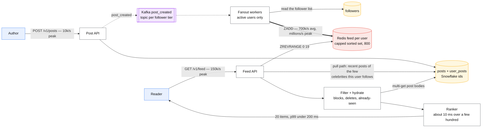
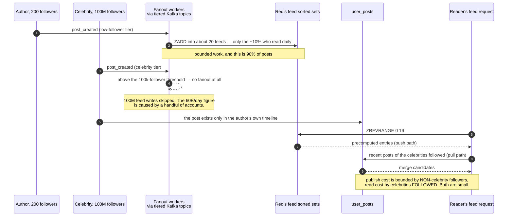

# Design a news feed

> [!info] The fan-out decision now has its own page
> [patterns/fanout-write-vs-read.md](../patterns/fanout-write-vs-read.md) carries the three
> thresholds, the storage arithmetic and Twitter's published numbers. This case study keeps the
> end-to-end design; go there for the mechanism.

> Twitter/Instagram/LinkedIn home timeline: posts from people you follow, ranked, paginated,
> fresh.
> **The hard part:** fanout-on-write vs fanout-on-read, and the celebrity account that breaks
> whichever one you picked.

## 1. Clarify

| Question | Assumed answer |
|---|---|
| Chronological or ranked? | Ranked (say you'd start chronological and add ranking — it's a whole second system) |
| How fresh? | Seconds of staleness fine |
| Follow graph size? | Median 200 following; max ~10k. Followers: median 100, max **100M (celebrity)** |
| Media? | Yes — images/video, served from object store + CDN, not through this service |
| Feed depth? | ~800 items retained; infinite scroll paginates back |
| Edits/deletes? | Yes — must disappear from already-built feeds |

**Non-goals:** the ranking model itself (see [../06-ml-cases/feed-ranking.md](../06-ml-cases/feed-ranking.md)),
ads insertion, moderation.

## 2. Requirements

**Functional**
- Publish a post; it appears in followers' feeds within seconds
- Read my feed, paginated, ranked, without duplicates across pages
- Deletes/blocks/mutes reflected on read

**Non-functional**

| Target | Value |
|---|---|
| Feed read p99 | < 200 ms |
| Publish → visible | < 5 s for normal users; < 60 s acceptable for celebrities |
| Availability | 99.99% reads; 99.9% writes |
| Consistency | Eventual, plus read-your-writes (you always see your own post immediately) |

## 3. Estimates

```
150M DAU × 2 posts/day       = 300M posts/day ≈ 3.5k/s avg, 10k/s peak
150M DAU × 30 feed views/day = 4.5B reads/day ≈ 52k/s avg, ~150k/s peak
Read:write ≈ 15:1

Fanout amplification: 300M posts × 200 avg followers = 60B feed-entry writes/day
                      ≈ 700k/s average, millions/s peak       ← the real number
Feed cache: 150M users × 800 entries × 20 B (post_id + score) ≈ 2.4 TB in Redis
Post storage: 300M × 500 B × 365 × 3 = ~165 TB/yr (boring)
```

> [!info] The scary number
> **60 billion feed-entry writes per day** from fanout-on-write. That, not post storage, is
> the design. And it's caused by a handful of accounts.

## 4. API / contract

```http
POST /v1/posts            { text, media_ids[], visibility }   Idempotency-Key
  → 201 { post_id, created_at }

GET /v1/feed?cursor=<opaque>&limit=20
  → 200 { items: [{post_id, author, text, media, score, created_at}], next_cursor }

POST /v1/follow/{user_id}      DELETE /v1/follow/{user_id}
```

**Cursor, not offset.** Offset pagination duplicates and skips items when the feed changes
under you. The cursor encodes `(last_score, last_post_id)` so the page boundary is stable.

## 5. Data model

| Entity | Key | Partition by | Serves |
|---|---|---|---|
| `posts` | `post_id` (Snowflake — time-sortable) | `hash(post_id)` | Post hydration |
| `user_posts` | `(user_id, post_id DESC)` | `user_id` | Author's own timeline; pull-path source |
| `follows` | `(follower_id, followee_id)` | `follower_id` | Who I follow |
| `followers` | `(followee_id, follower_id)` | `followee_id` | Fanout target list |
| `feed:{user_id}` | Redis sorted set, score = rank, capped 800 | `user_id` | **The feed read** |

Both directions of the follow graph are stored. Denormalisation is deliberate: fanout needs
`followers`, feed-building needs `follows`, and neither can afford to derive the other at
request time.

**Why the feed cache is a capped sorted set:** reads become `ZREVRANGE feed:{uid} 0 19` — one
O(log N) operation, sub-millisecond, and the cap bounds memory at 2.4 TB fleet-wide.

## 6. Architecture

The two halves of the hybrid, and the amplification between them:



### Deep dive A — fanout on write vs read (the whole case)

The same event, taken down two different paths by one threshold:



| | **Fanout on write** (push) | **Fanout on read** (pull) |
|---|---|---|
| Publish | Expensive: N follower writes | Cheap: one write |
| Read | Cheap: one sorted-set range | Expensive: fetch from M followees and merge |
| Latency | Read fast, publish slow | Read slow, publish fast |
| Dies on | **Celebrity** (100M follower writes for one post) | **Users following thousands** of active accounts |
| Wasted work | Inactive users' feeds built and never read | None |

**The answer is hybrid, and this is the sentence that scores:**

> [!tip] Say this
> "Push for normal accounts, pull for celebrities. On read I take the precomputed feed and
> merge in the recent posts of the few celebrity accounts this user follows. Fanout cost
> becomes bounded by the *non-celebrity* follower count, and read cost by the *number of
> celebrities followed* — both small. The threshold (say 100k followers) is a tunable knob,
> not a constant."

Further refinements to volunteer:
- **Only fan out to active users.** ~10% of users check the feed daily. Building feeds for
  the other 90% is wasted work — build theirs lazily on their next login, from the pull path.
  This alone cuts the 60B writes by roughly 10x.
- **Fanout is async and lagging is acceptable** — so it can be rate-limited and backpressured.
  Priority-tier the queue: a post from an account with 50 followers shouldn't queue behind a
  celebrity's 10M-row fanout job. Separate topics per follower-count tier.
- Celebrity posts get chunked fanout (batches of 10k) if you ever must push them.

### Deep dive B — ranking without blowing the latency budget

Two stages, the standard shape (same as any recommender):
1. **Candidate generation** — a few hundred items from the feed cache + pull sources + a
   small "interesting to you" injection.
2. **Ranking** — score candidates with a model on features (author affinity, recency, media
   type, predicted engagement). Feature fetch is the latency risk: batch it, cache user
   features, keep the model small enough for ~10 ms inference on a few hundred items.

Say: precompute scores at fanout time for the cheap signals, re-rank at read time with the
fresh ones. Details in [../06-ml-cases/feed-ranking.md](../06-ml-cases/feed-ranking.md).

### Deep dive C — deletes, blocks and "already seen"

- **Deleted post**: don't chase 100M feed entries. Filter at hydration — if the post is gone
  or the viewer is blocked, drop it from the page and fetch one more. **Filter on read** is
  almost always cheaper than fanout-delete.
- **Already seen**: a per-user Bloom filter or a capped set of recently-shown post IDs, so
  refreshes don't show the same three posts forever.
- **Blocks/mutes**: read-time filter from a small cached set per user.

## 7. Scale & failure

| Breaks first at 10x | Fix |
|---|---|
| Fanout write volume | Active-user-only fanout, tiered queues, higher celebrity threshold |
| Redis feed memory (2.4 TB → 24 TB) | Shorter feed cap (800 → 200), tier inactive users out, int packing |
| Post hydration multi-get | Aggressive post cache; feed stores denormalised minimal render data |
| Ranking latency at higher candidate counts | Tighter candidate cap, two-stage with a cheap pre-filter |

| Component fails | Blast radius | Degraded behaviour |
|---|---|---|
| Fanout workers lag | Feeds go stale | Serve stale feed + merge pull path for recency; alert on lag seconds |
| Redis feed cache down | Reads fall to pull path | Pull-path fallback (slower, capped fan-in of 200); shed to "latest posts" |
| Ranking service down | No personalisation | **Fall back to reverse-chronological** — a degraded feed beats no feed |
| Post store slow | Hydration times out | Return the items that hydrated, drop the rest, backfill next page |

## 8. Ops & cost

- **SLO:** 99.9% of feed reads < 200 ms; 95% of posts visible to followers within 5 s
  (fanout lag is a product SLI, not an infra metric).
- **Alert on:** fanout queue lag, feed cache hit ratio, ranking timeout rate, publish→visible
  p95, empty-feed rate (the sneaky one: a bug that silently returns nothing looks healthy).
- **Rollout:** ranking changes behind flags with holdback cohorts and online metrics; fanout
  changes shadowed against the pull path before switching.
- **Cost:** Redis feed cache 2.4 TB ≈ $25–40k/month is the dominant line; fanout compute next;
  post storage is noise. Active-user-only fanout is the biggest single saving.
- **First thing I'd cut:** feed depth 800 → 300 (most users never scroll past 50).

## On AWS and Azure

| | AWS | Azure |
|---|---|---|
| **The shape** | ALB or API Gateway → ECS/EKS; `posts` + `followers` in DynamoDB; `post_created` onto Kinesis Data Streams; fan-out workers `ZADD` into ElastiCache; media via CloudFront | Front Door → AKS/Container Apps; `posts` + `followers` in Cosmos DB for NoSQL; `post_created` onto Event Hubs; fan-out workers into Azure Managed Redis; media via Front Door |
| **What you configure** | Shard count on the fan-out stream, DynamoDB partition-key design, Redis `maxmemory-policy` and cluster mode | Event Hubs partition count and throughput units, Cosmos partition key, Redis clustering policy and SKU |
| **The default that bites** | **One DynamoDB partition is capped at 1,000 write units/s and 3,000 read units/s.** The celebrity's `followers` partition is exactly this case's hot shard, and adaptive capacity does not lift a single partition above it — the fix is the same write-sharding you would do by hand | **Azure Cache for Redis "announced its retirement timeline for all SKUs"**; Microsoft's guidance is to move to Azure Managed Redis. The feed cache on Azure is a migration decision before it is a sizing one |
| **What it costs you** | 700 k feed writes/s needs ~700 Kinesis shards at 1,000 records/s each. The default shard quota is **20,000 per account** only in N. Virginia, Oregon and Ireland — **1,000 or 6,000 in every other Region**, so outside those three the fan-out topic alone can consume the Region's quota | Event Hubs Standard is fixed at **32 partitions per event hub and 40 TUs** (1 TU = 1 MB/s *or* 1,000 events/s), i.e. 40 MB/s — celebrity fan-out needs Premium (200 partitions per PU, 16 PUs max) or Dedicated. And the 2.4 TB feed cache exceeds every generally available Azure Managed Redis size: **350 GB is the largest GA in-memory SKU**, everything above it is in preview |

Both clouds make the hybrid mandatory rather than optional. The push path is bounded by a
per-partition write ceiling on the store *and* a per-shard record ceiling on the stream, so the
celebrity tier is not a refinement you add later — it is the only way the numbers fit.

## In an LLM deployment

Only the ranker changes, and it changes the whole latency budget. The case allows ~10 ms to rank a
few hundred candidates; a cross-encoder or an LLM re-ranker is 50–500 ms for a handful, so the
model can only ever see the top ~20 after a cheap first-pass scorer. That is the standard
retrieve-then-rerank split, and it is forced by arithmetic, not taste: at 150 k feed reads/s, one
model call per read is 150 k inferences/s.

The quota is what actually stops you. Azure OpenAI Standard deployments allocate throughput as
tokens per minute with a fixed requests-per-minute ratio attached — for `gpt-chat-latest` versions
`2026-05-05` through `2026-06-24` it is **10 RPM per 1,000 TPM**, and version `2026-08-06` is
**1 RPM per 1,000 TPM** — so a feed that needs many small ranking calls burns its RPM long before
its TPM, and the fix is a Provisioned Throughput deployment rather than a bigger token quota.
Amazon Bedrock splits quotas the same way, per model and per endpoint, and tracks the
`bedrock-runtime` and `bedrock-mantle` endpoints **against separate quotas even for the same
underlying model**.

The other change is the cache. A ranked feed cached in Redis is a *model output* cached in Redis,
so a model version bump invalidates 2.4 TB at once — the invalidation storm from
[cache-failure-modes](../fundamentals/cache-failure-modes.md), triggered on purpose by a deploy.
Version the key namespace with the model version and let the old generation age out.

## Referenced by

- [Backend cases index](README.md)
- [Design an infinite feed (frontend)](../04-frontend-cases/infinite-feed.md)
- [Design feed ranking (engagement prediction)](../06-ml-cases/feed-ranking.md)
- [Fan-out on write vs read](../patterns/fanout-write-vs-read.md)
- [Hot shard mitigation](../fundamentals/hot-shard-mitigation.md)
- [Materialized views and derived data](../patterns/materialized-views-and-derived-data.md)
- [Meta interview style](../09-company-styles/meta.md)
- [Question bank](../07-drills/question-bank.md)
- [Replication lag and session guarantees](../fundamentals/replication-lag-and-session-guarantees.md)
- [Repo index](../../INDEX.md)

## Sources & further reading

- Local book: Alex Xu vol. 1 ch.11 (news feed)
- Vendor: `10-resources/vendor/system-design-primer/` — Twitter timeline exercise
- Vendor: `10-resources/vendor/awesome-scalability/README.md` — feed architectures
- [Twitter — the infrastructure behind Timelines](https://blog.twitter.com/engineering/en_us/topics/infrastructure)
- Primitives: [caching](../02-primitives/caching.md), [messaging](../02-primitives/messaging-and-streams.md), [replication-and-partitioning](../02-primitives/replication-and-partitioning.md)

Cloud claims in §On AWS and Azure (all verified 2026-09-21):

- [AWS — best practices for partition keys in DynamoDB](https://docs.aws.amazon.com/amazondynamodb/latest/developerguide/bp-partition-key-design.html) — 3,000 read units/s and 1,000 write units/s per partition
- [AWS — Kinesis Data Streams quotas and limits](https://docs.aws.amazon.com/streams/latest/dev/service-sizes-and-limits.html) — 1 MB/s or 1,000 records/s per shard; regional shard quotas
- [Azure — Event Hubs quotas and limits](https://learn.microsoft.com/en-us/azure/event-hubs/event-hubs-quotas) — throughput unit definition, 32 partitions and 40 TUs on Standard, 200 partitions per PU on Premium
- [Azure — What is Azure Cache for Redis?](https://learn.microsoft.com/en-us/azure/azure-cache-for-redis/cache-overview) — retirement announced for all SKUs
- [Azure — What is Azure Managed Redis?](https://learn.microsoft.com/en-us/azure/redis/overview) — tier sizes; in-memory tiers above 350 GB are in preview
- [Azure OpenAI quotas and limits](https://learn.microsoft.com/en-us/azure/ai-foundry/openai/quotas-limits) — RPM-per-1,000-TPM ratios
- [AWS — quotas for Amazon Bedrock](https://docs.aws.amazon.com/bedrock/latest/userguide/quotas.html) — separate quotas per inference endpoint
