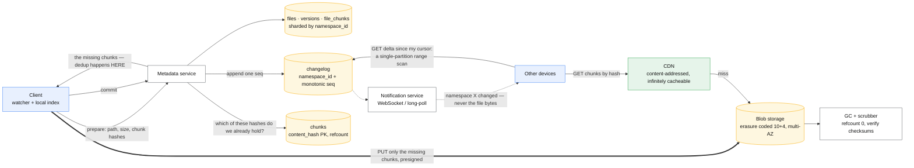
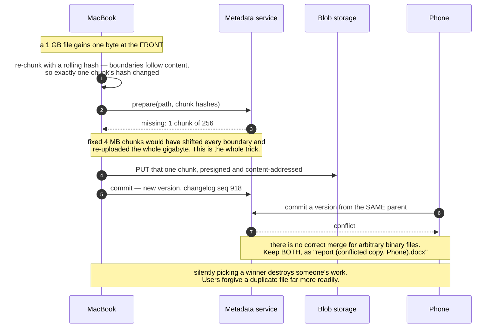

# Design file sync / object storage

> Dropbox/Drive: files sync across a user's devices and are shareable; underneath, an
> S3-like object store.
> **The hard part:** never transfer a byte you don't have to (chunking, dedup, delta sync),
> and separating the **metadata plane** from the **data plane**.

## 1. Clarify

| Question | Assumed answer |
|---|---|
| Max file size? | 50 GB |
| Sync model? | Full sync + selective sync; offline edits allowed |
| Sharing? | Yes — per-file/folder permissions, public links |
| Versioning? | Yes — 30 days of history |
| Conflicts? | Possible (two devices edit offline) — resolve by keeping both |
| Scale? | 100M users, 50M DAU, avg 100 GB stored each |
| Compliance? | Encryption at rest, regional residency for enterprise |

**Non-goals:** collaborative real-time editing (that's
[../04-frontend-cases/collaborative-editor.md](../04-frontend-cases/collaborative-editor.md)),
full-text search of contents.

## 2. Requirements

**Functional**
- Upload, download, delete, rename, move; resumable uploads for big files
- Changes propagate to a user's other online devices within seconds
- Share with permissions; public links
- Version history and restore

**Non-functional**

| Target | Value |
|---|---|
| Durability | **11 nines** — losing a file is unforgivable |
| Metadata op p99 | < 100 ms |
| Sync notification | < 5 s device-to-device |
| Availability | 99.99% |

## 3. Estimates

```
Storage: 100M users × 100 GB = 10 EB logical
   Dedup + compression typically 30–50% saving → ~5–7 EB physical    ← dedup is worth billions
Uploads: 50M DAU × 10 file changes = 500M changes/day ≈ 6k/s avg
Bytes:   500M × 1 MB avg delta = 500 TB/day ingest ≈ 6 GB/s
Egress:  downloads ≈ 2× uploads → ~12 GB/s ≈ 1 PB/day ≈ $50–90M/month at list egress
         → your own PoPs/peering, not retail cloud egress. Say this.
Metadata: 100M users × 10k files = 1T file records × 500 B = 500 TB of metadata
```

> [!info] The scary number
> Egress. At this scale bandwidth is the business, which is why the real companies build
> their own storage and peering rather than renting it.

## 4. API / contract

```http
# metadata plane
POST /v1/files/prepare  { path, size, chunk_hashes[] }
  → 200 { upload_id, missing_chunks: ["sha256:...", ...] }   # dedup happens HERE
PUT  /v1/chunks/{hash}   (direct to storage via presigned URL, resumable)
POST /v1/files/commit   { upload_id, chunk_hashes[] }  → { file_id, version }

GET  /v1/delta?cursor=<opaque>      # what changed since I last synced
  → { entries: [{path, file_id, version, deleted, chunk_hashes[]}], next_cursor }

# data plane
GET  /v1/chunks/{hash}   → bytes (served from CDN/edge, content-addressed = infinitely cacheable)
```

The `prepare → upload missing chunks only → commit` shape is the whole design in three calls.

## 5. Data model

**Two planes, and saying this is the point of the case:**

| Plane | Stores | Store type | Scaling |
|---|---|---|---|
| **Metadata** | Paths, versions, permissions, chunk lists | Sharded relational / KV | By `user_id` (or namespace) |
| **Data** | Content-addressed chunks | Object store / blob store | By `hash(chunk)` |

| Entity | Key | Partition by | Serves |
|---|---|---|---|
| `files` | `(namespace_id, path)` | `namespace_id` | Listing, lookup |
| `versions` | `(file_id, version DESC)` | `file_id` | History, restore |
| `file_chunks` | `(file_id, version, idx)` | `file_id` | Reassembly |
| `chunks` | `content_hash` (PK), refcount | `hash` | **Global dedup** |
| `changelog` | `(namespace_id, seq)` | `namespace_id` | Delta sync — a per-namespace log |
| `shares` | `(resource_id, principal)` | `resource_id` | Permission checks |

**Why the changelog:** sync is "give me everything after my cursor". A per-namespace monotonic
sequence makes that a single-partition range scan and makes the client's cursor a single
integer. Do not compute diffs by comparing file trees.

## 6. Architecture

Two planes that scale on different axes, and only small facts cross between them:



### Deep dive A — chunking and dedup

- **Fixed-size chunks (4 MB)**: simple, but inserting one byte at the start of a file shifts
  every chunk boundary and re-uploads everything.
- **Content-defined chunking (rolling hash / Rabin fingerprint, ~4 MB average)**: boundaries
  follow content, so an insert changes one chunk. This is what makes delta sync of a big
  document cheap. Say it by name.
- **Content addressing**: chunk ID = SHA-256 of its content. Gives you free global dedup,
  free integrity checking, and immutable, infinitely cacheable objects.
- **Dedup scope**: global (best saving, but a cross-user privacy consideration — an attacker
  can probe whether a chunk exists by observing "already uploaded") vs per-user (safe,
  smaller saving). Mention the trade — interviewers like it.
- **Refcounting** for deletion: a chunk is only removable when no version references it.
  Deletion is a background GC job, and it must be conservative (leaked storage is much
  cheaper than a wrongly deleted chunk).

### Deep dive B — sync and conflicts



- Client keeps a local index (path → version → chunk hashes) and watches the filesystem.
- Upload: hash chunks locally → `prepare` → upload only what the server says is missing →
  `commit`. Typical edited-document upload transfers one chunk, not the file.
- Download: pull the delta since the cursor, fetch missing chunks from the CDN, assemble.
- **Conflicts**: two devices commit versions from the same parent. There is no correct merge
  for arbitrary binary files, so: keep both — `report.docx` and
  `report (conflicted copy, Sathish's MacBook).docx`. Say *why*: silently picking a winner
  destroys someone's work, and users forgive a duplicate file far more readily.
- **Notification**: a lightweight long-poll/WebSocket saying "namespace X changed" — the
  client then pulls the delta. Never push file contents over the notification channel.

### Deep dive C — durability

- **Erasure coding** (e.g. 10 data + 4 parity) instead of 3x replication: same or better
  durability at ~1.4x storage instead of 3x. That's a 2x cost saving at exabyte scale — the
  single biggest number in this design.
- Trade: reconstructing a lost fragment costs CPU and cross-node reads, so hot data may still
  use replication while cold data is erasure-coded.
- Continuous **scrubbing** — background verification of stored checksums to catch bit rot
  before both copies are bad.
- Cross-region replication for the metadata (small) and lifecycle-tiered replication for the
  data (large).

## 7. Scale & failure

| Breaks first at 10x | Fix |
|---|---|
| Metadata shard hotspots (one huge shared team folder) | Split namespaces; separate hot enterprise tenants |
| Changelog scan for a user with millions of files | Bounded pages + a compaction/snapshot cursor |
| Chunk GC falling behind | Rate-limited continuous GC; monitor unreferenced bytes |
| Egress cost | Own PoPs, peering, client-side p2p LAN sync for offices |

| Component fails | Blast radius | Degraded behaviour |
|---|---|---|
| Metadata DB shard | Those users can't sync | Reads from replica; uploads queue client-side and retry |
| Blob storage AZ | Reads/writes slower | Erasure coding survives it; reconstruct on read |
| Notification service | Sync becomes polling | Clients fall back to a 60 s poll — degraded, not broken |
| Client clock wrong | Ordering confusion | Server-assigned versions and sequence numbers only; never trust client time |

## 8. Ops & cost

- **SLO:** 99.99% metadata availability; p99 sync notification < 5 s; **zero** data loss
  (verified by continuous scrubbing + restore drills).
- **Alert on:** upload failure rate, chunk GC backlog, scrub error rate, changelog lag,
  conflicted-copy creation rate (a spike means the sync logic regressed).
- **Rollout:** clients are the risk — staged rollout by version cohort, kill switch, and the
  server must support N-2 client versions.
- **Cost:** storage dominates. 5 EB with erasure coding ≈ hundreds of millions/year, which is
  why dedup + erasure coding + tiering are existential, not optimisations. Egress next.
- **First thing I'd cut:** version history 30 → 7 days for free tiers; cold-tier anything
  untouched for 90 days.

## On AWS and Azure

| | AWS | Azure |
|---|---|---|
| **The shape** | **Data plane:** S3 with presigned URLs, fronted by CloudFront. **Metadata plane:** Aurora or DynamoDB for `files`/`versions`/`chunks`, a per-namespace `changelog`, and an API tier issuing the presigns | **Data plane:** Blob Storage with SAS URLs, fronted by Front Door. **Metadata plane:** Azure SQL / Cosmos DB for the same tables, same changelog |
| **What you configure** | Multipart part size, prefix layout (content-addressed hashes spread perfectly by construction), storage class transitions, `x-amz-checksum-*` on upload | Block size on `Put Block`, blob naming (see below), access-tier lifecycle rules, `Content-MD5` on upload |
| **The default that bites** | The **3,500 PUT / 5,500 GET per second per partitioned prefix** limit is per *prefix*, and S3 scales to a new rate **"gradually and not instantaneously" — you will see 503 (Slow Down) while it does.** A dedup-driven upload burst against a freshly created prefix is throttled on the way up, which reads as a client bug | Blob Storage's partition key **is the account + container + blob name concatenated**, so "sequential or append-only naming schemes can concentrate traffic on a single partition" and you get 503/500 **before the account approaches its documented limits**. Content-addressed chunk names are accidentally the right answer; a `{namespace}/{seq}` changelog blob is accidentally the wrong one |
| **What it costs you** | Multipart is **10,000 parts, 5 MiB–5 GiB each, 48.8 TiB maximum object** — a 50 GB file is comfortable, but a chunk size chosen for dedup (4 MB) is *below* the 5 MiB part minimum, so chunking for dedup and parting for upload are two different splits | A storage account defaults to **5 PiB capacity, 40,000 requests/s and 60 Gbps ingress** in the larger Regions (**20,000/s and 25 Gbps elsewhere**), all raisable by support request. At 10 EB logical, this design is thousands of storage accounts, and the account becomes a sharding unit with its own directory |

The two-plane split this case insists on is enforced by the platform: neither object store will hold
your metadata at these rates, and neither metadata store will hold your bytes. What changes between
clouds is where the sharding unit lives — an S3 *prefix* on AWS, a whole *storage account* on Azure.

## In an LLM deployment

Sync a corpus and you have signed up for a second, derived plane: every committed version has to be
chunked, embedded and upserted into a vector index, and that pipeline has its own failure modes and
its own bill. The delta-sync design pays off enormously here — **only changed chunks are
re-embedded**, and content-addressed chunk hashes make the embedding cache trivially correct, since
the same bytes under the same model version always produce the same vector. Key the vector on
`(content_hash, model_version)` and re-embedding becomes idempotent for free.

The staleness that results is not a consistency-level problem and cannot be fixed with one. A
document commits, the row is correct, and retrieval keeps returning the old text because the
*vector* is still the old vector. Azure AI Search's indexer has a **minimum schedule interval of
5 minutes** and a **2-hour maximum run** in the shared execution environment, so a scheduled
refresh has a staleness floor three orders of magnitude above the 5-second device-to-device
notification this case promises. If "I uploaded it and it must be findable now" is a requirement,
the commit path pushes to the index synchronously; a schedule will never get there.

And permissions get harder, not easier. The `shares` table is enforced per request today; a
retrieval system that has already embedded everything must filter **at query time by the caller's
ACL**, or the index becomes a way to read documents you cannot open.

## Referenced by

- [Backend cases index](README.md)
- [Engineering blogs and case studies](../10-resources/engineering-blogs.md)
- [Question bank](../07-drills/question-bank.md)
- [Repo index](../../INDEX.md)

## Sources

- Local book: Alex Xu vol. 1 ch.15 (Google Drive); vol. 2 has the S3-like object storage
  chapter — `AI/ML-Foundations/Alex Xu_ Sahn Lam - System Design Interview ... Volume 2.epub`
- Repo note: [../../basic/advanced/designs%20%28needs%20update%20as%20we%20go%29/Video%20Stream/how%20we've%20scaled%20Dropbox.md](../../basic/advanced/designs%20%28needs%20update%20as%20we%20go%29/Video%20Stream/how%20we've%20scaled%20Dropbox.md)
- [Dropbox — Inside the Magic Pocket](https://dropbox.tech/infrastructure/inside-the-magic-pocket)
- Primitives: [storage-and-databases](../02-primitives/storage-and-databases.md), [cost-engineering](../02-primitives/cost-engineering.md)

Cloud claims in §On AWS and Azure (all verified 2026-09-21):

- [AWS — best practices design patterns: optimizing S3 performance](https://docs.aws.amazon.com/AmazonS3/latest/userguide/optimizing-performance.html) — 3,500 PUT/COPY/POST/DELETE and 5,500 GET/HEAD per partitioned prefix per second; gradual scaling and 503 (Slow Down)
- [AWS — Amazon S3 multipart upload limits](https://docs.aws.amazon.com/AmazonS3/latest/userguide/qfacts.html) — 48.8 TiB object, 10,000 parts, 5 MiB–5 GiB part size
- [Azure — Blob Storage scalability and performance targets](https://learn.microsoft.com/en-us/azure/storage/blobs/scalability-targets) — 50,000 blocks × 4,000 MiB, hot-partition behaviour and the account+container+blob partition key
- [Azure — scalability targets for standard storage accounts](https://learn.microsoft.com/en-us/azure/storage/common/scalability-targets-standard-account) — 5 PiB capacity, 40,000/20,000 requests per second, 60/25 Gbps ingress
- [Azure AI Search — schedule indexer execution](https://learn.microsoft.com/en-us/azure/search/search-howto-schedule-indexers) — 5-minute minimum interval
- [Azure AI Search — service limits](https://learn.microsoft.com/en-us/azure/search/search-limits-quotas-capacity) — 2-hour maximum indexer run in the public execution environment
