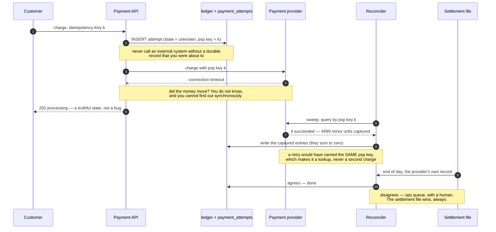

# Design a payments system / ledger

> Take money from a customer, record it correctly forever, pay out, handle refunds and
> disputes.
> **The hard part:** correctness under retries and partial failure. This is the case where
> "eventually consistent, it's fine" is a wrong answer, and where saying **idempotency key**,
> **double-entry ledger** and **reconciliation** unprompted marks you as senior.

## 1. Clarify

| Question | Assumed answer |
|---|---|
| Are we the payment processor or using one? | Using external PSPs (Stripe/Adyen), but we own the ledger |
| Currencies? | Multi-currency, no FX conversion inside a transaction |
| Payouts? | Yes — marketplace model, hold then pay out on a schedule |
| Refunds/partial refunds/disputes? | Yes, all three |
| Scale? | 10M transactions/day, peak 5x on sale days |
| Compliance? | PCI (tokenise, never store PANs), audit retention 7 years |

**Non-goals:** fraud model internals, tax calculation, the checkout UI.

## 2. Requirements

**Functional**
- Authorise, capture, refund, void; multiple payment methods
- Immutable ledger of every money movement, queryable balances
- Payouts to sellers with holds and fees
- Webhook ingest from PSPs; reconciliation against their settlement files

**Non-functional**

| Target | Value |
|---|---|
| Correctness | **Zero double-charges. Zero lost money. Non-negotiable** |
| Auditability | Every cent traceable to a source event, forever |
| Payment API p99 | < 2 s (a PSP call dominates) |
| Availability | 99.99% — and *degrade to queued* rather than lose an intent |

## 3. Estimates

```
10M txn/day ≈ 116/s avg, ~600/s peak       ← low volume; this case is NOT about scale
Ledger entries: double-entry → ≥ 2 rows per transaction, more with fees/taxes/FX
   10M × 6 = 60M rows/day → 22B rows/year × 200 B ≈ 4.4 TB/year, retained 7 years ≈ 30 TB
Webhooks in: ~3 per transaction = 30M/day ≈ 350/s, bursty and out-of-order
PSP latency: 200 ms – 2 s, and occasionally it just times out with unknown outcome
```

> [!info] The scary number
> There isn't one — the volume is small. **The difficulty is entirely correctness**, and
> saying that out loud early ("this isn't a scale problem, it's a consistency problem") is
> itself a strong signal.

## 4. API / contract

```http
POST /v1/payment_intents
  Idempotency-Key: <required>
  { amount_minor: 4999, currency: "USD", customer_id, payment_method_id, metadata }
  → 201 { id: "pi_...", status: "requires_confirmation" }

POST /v1/payment_intents/{id}/confirm     Idempotency-Key
  → 200 { status: "succeeded" | "requires_action" | "processing" | "failed", ... }

POST /v1/refunds  { payment_intent_id, amount_minor }   Idempotency-Key
GET  /v1/balances/{account_id}          → { available, pending, currency }
POST /v1/payouts  { account_id, amount_minor }          Idempotency-Key
POST /webhooks/psp/{provider}                            (signed, verified, idempotent)
```

Every mutating endpoint takes an idempotency key. Retrying with the same key returns the
**same stored response**, never a new charge. Amounts are integers in minor units — never
floats, ever.

## 5. Data model

```sql
-- append-only, never UPDATE, never DELETE
ledger_entries(
  id, account_id, amount_minor,     -- signed: + credit, - debit
  currency, transaction_id,         -- entries of one transaction sum to zero
  entry_type, created_at, metadata
)
accounts(id, type, owner_id, currency)        -- customer, platform, seller, fee, escrow
transactions(id, kind, external_ref, state, idempotency_key UNIQUE, created_at)
payment_attempts(id, transaction_id, psp, psp_ref, state, request, response, created_at)
idempotency_keys(key PK, scope, response_json, state, created_at)   -- TTL 7d+
balance_snapshots(account_id, as_of, balance_minor)   -- materialised, rebuildable
```

**Double-entry:** every movement writes at least two rows summing to zero.
A $49.99 charge with a $1.50 fee:

| account | amount |
|---|---|
| customer_receivable | −4999 |
| seller_payable | +4849 |
| platform_fee_revenue | +150 |

Sum = 0. **This invariant is checkable, continuously, in production** — and "I'd run a job
that asserts every transaction's entries sum to zero and alerts on any that don't" is one of
the highest-signal sentences you can say in this interview.

**Balance = SUM(amount) over the account**, materialised into snapshots for speed and
recomputable from scratch at any time. Never a mutable `balance` column as the source of truth.

## 6. Architecture

Every path that can write a ledger entry, including the three that run after the request is gone:

```mermaid
flowchart LR
    co["Checkout"]
    api["Payment API<br/>idempotency_keys lookup first"]
    led[("ledger_entries<br/>append-only, each txn sums to zero")]
    att[("payment_attempts<br/>written BEFORE the call out")]
    psp["PSP adapter"]
    ext["Payment provider"]
    rec["Reconciler<br/>sweeps unknown attempts"]
    stl["Daily settlement file<br/>the final arbiter"]
    ops["Ops queue<br/>a human"]
    wh["Webhook handler<br/>verify signature, dedupe by event id"]
    k[["Kafka payment events"]]
    pay["Payout saga<br/>orchestrated, queryable"]

    co --> |"POST with Idempotency-Key"| api
    api --> |"pending entries"| led
    api --> |"record the attempt first"| att
    api --> psp
    psp --> |"charge, our key passed through"| ext
    ext --> |"captured or failed — failures are data too"| led
    att -.-> |"state = unknown"| rec
    rec --> |"query by our reference"| ext
    rec --> |"resolve, then write the entries"| led
    ext ==> |"end of day"| stl
    stl --> |"discrepancies"| ops
    ext -.-> |"webhooks: out of order, redelivered"| wh
    wh --> |"state machine drops stale transitions"| led
    led -.-> |"notifications, analytics, seller balances"| k
    pay --> |"reserve, transfer, then confirm or compensate"| led
    pay --> ext

    classDef client fill:#e8f0fe,stroke:#4285f4,color:#111
    classDef edge fill:#e6f4ea,stroke:#34a853,color:#111
    classDef service fill:#fff,stroke:#5f6368,color:#111
    classDef store fill:#fef7e0,stroke:#f9ab00,color:#111
    classDef cache fill:#fce8e6,stroke:#ea4335,color:#111
    classDef queue fill:#f3e8fd,stroke:#a142f4,color:#111
    classDef external fill:#f1f3f4,stroke:#9aa0a6,color:#111,stroke-dasharray:4 3
    class co client
    class api,psp,rec,wh,pay,ops service
    class led,att,stl store
    class k queue
    class ext external
```



### Deep dive A — the ambiguous outcome (the actual hard problem)

You call the PSP; the connection times out. Did the charge happen? **You do not know, and
you cannot find out synchronously.**

Handling:
1. Record `payment_attempts` row as `unknown` **before** calling out, with the exact
   idempotency key you sent. Never call an external system without a durable record that
   you were about to.
2. Never blindly retry a charge. Retry **with the same PSP idempotency key** — every serious
   PSP supports this, and it makes the retry a lookup rather than a second charge.
3. If the key isn't supported: query the PSP for the transaction by your reference before
   retrying.
4. A **reconciler** sweeps `unknown` attempts on a schedule, queries the PSP, resolves the
   state, and writes the ledger entries. Until resolved, the user sees "processing" — a
   truthful, deliberate state, not a bug.
5. The daily settlement file is the final arbiter. Anything that disagrees goes to an ops
   queue with a human.



> [!tip] Say this
> "The system is at-least-once end to end. Correctness comes from idempotency keys at every
> boundary plus a reconciliation loop that treats the provider's settlement file as the
> source of truth. I'd never rely on a webhook arriving, or arriving once, or arriving in order."

### Deep dive B — payout saga

Payouts span your ledger and the PSP, so no single transaction covers it:

```
1. Reserve   — ledger: debit seller_payable, credit payout_pending  (local, atomic)
2. Create    — PSP transfer with idempotency key                    (external)
3. Confirm   — on PSP webhook: payout_pending → paid_out            (local)
   Compensate — on PSP failure: reverse step 1, notify, retry later
   Stuck      — timeout alarm: if no terminal state in 24 h, alert a human
```

Orchestrated (Temporal/Step Functions), not choreographed, because you need visibility of
every in-flight payout and a queryable "what is stuck" list. Compensations must themselves be
idempotent.

### Deep dive C — webhooks

- **Verify the signature** — an unauthenticated webhook endpoint that moves money is a
  vulnerability, not an integration.
- Dedupe on the provider's event ID (they *will* redeliver).
- Events arrive **out of order** — `succeeded` can land after `refunded`. The handler must be
  a state machine that ignores illegal or stale transitions, keyed by the PSP's own sequence
  or timestamp, not by arrival order.
- Return 200 fast and process async, or the provider's retries pile up on a slow handler.

## 7. Scale & failure

| Breaks first at 10x | Fix |
|---|---|
| Ledger table size | Partition by month; archive to cold storage; snapshots for balance reads |
| Balance reads (SUM over millions of rows) | `balance_snapshots` + delta since snapshot |
| Reconciliation job runtime | Incremental by day, parallel by account range |
| Webhook burst after a PSP outage | Queue and process async; never process inline |

| Component fails | Blast radius | Degraded behaviour |
|---|---|---|
| PSP down | Can't charge | Queue intents, show "processing", retry with backoff; **never** silently fail a payment the user believes succeeded |
| Ledger DB down | No new payments | **Fail closed.** Refusing a payment is recoverable; recording it wrongly is not |
| Kafka down | Downstream stale | Payments unaffected — the ledger is the source of truth, events are derived |
| Reconciler broken | Discrepancies accumulate silently | Alert on reconciler *not running* — a silent reconciler is the most dangerous failure here |

## 8. Ops & cost

- **SLO:** 99.99% payment API availability; **0** unreconciled transactions older than 48 h;
  0 ledger imbalances.
- **Alert on:** ledger imbalance (any), unknown-state attempts older than 1 h, reconciliation
  discrepancy count and value, PSP error rate by method, webhook lag, payout stuck count.
- **Rollout:** money paths get shadow mode and dual-run comparison, not canaries alone. New
  ledger logic runs alongside the old, results compared, before it becomes authoritative.
- **Cost:** negligible infrastructure; **PSP fees (~2.9% + $0.30) dwarf everything.** The
  engineering levers that matter are payment-method routing (ACH vs card), retry strategy for
  soft declines, and reducing chargebacks — all business outcomes, not infra ones. Saying this
  shows you understand what the system is *for*.
- **First thing I'd cut:** nothing on the correctness path. Cut analytics retention instead.

## On AWS and Azure

| | AWS | Azure |
|---|---|---|
| **The shape** | API Gateway → ECS/Lambda; `ledger_entries` and `idempotency_keys` in Aurora PostgreSQL; Step Functions for the payout saga; EventBridge + SQS for PSP webhooks; S3 + Athena for settlement-file reconciliation | APIM → Container Apps; the same tables in Azure SQL Database, **with ledger tables**; Durable Functions or Logic Apps for the saga; Event Grid + Service Bus for webhooks; Blob + Fabric for reconciliation |
| **What you configure** | A `UNIQUE` constraint on `idempotency_key` and `SERIALIZABLE`/`REPEATABLE READ` where balances are computed; saga timeouts and compensations as Step Functions states | Append-only or updatable **ledger tables** per table, and automatic digest publication to immutable Blob Storage or Azure Confidential Ledger |
| **The tamper-evidence** | Yours to build: append-only by convention, enforced by permissions and review. Nothing in the managed store stops a privileged user rewriting a row | **Built in.** Ledger tables hash modified rows into a Merkle tree per transaction, chain the blocks, and publish a **database digest** outside the database; verification recomputes and "reports all inconsistencies that it has detected." It protects "from any attacker or high-privileged user, including database administrators… and cloud administrators" |
| **The default that bites** | A Step Functions Standard execution stops at **25,000 history events** and *fails* — a saga that polls a PSP in a retry loop can hit it. And **state transitions are throttled at 5,000/s in N. Virginia, Oregon and Ireland but 800/s everywhere else**, a 6× regional difference in the same state machine | A ledger database **cannot be converted back to a regular database**, and in a ledger *database* every table is a ledger table with no opt-out. That is the right default for this case and a trap for the reporting tables that end up in the same schema |
| **What it costs you** | Nothing about volume — 600 tps is small. The cost is that correctness is entirely in your schema and your review process, and the audit story is "read the code" | The digest storage is a second system with its own retention and its own access policy; tamper-evidence that anyone can rewrite is tamper-evidence you do not have |

This is the rare case where the two clouds genuinely differ in kind rather than in naming. Azure
ships a tamper-evident ledger as a table property; AWS expects you to build append-only semantics
yourself on Aurora. Say that, and say which you would pick and why — the answer is usually "still
Postgres, because double-entry and reconciliation are the controls that matter, and a Merkle tree
does not catch a wrong journal entry, only a rewritten one."

## In an LLM deployment

**It changes very little, and the reason is the interesting part.** Everything on this page is
about a deterministic, auditable, exactly-once money movement, and a model is none of those things.
The rule that falls out is worth saying in a room: **a model may never be on the write path of a
ledger.** It can classify a dispute, draft a chargeback narrative, summarise a reconciliation break
or rank which of 4,000 unmatched rows a human should look at first — all reads, all advisory, all
reversible.

Two places it does touch the design. **Reconciliation is the genuine fit**: matching your ledger
against a PSP settlement file is fuzzy string-and-amount matching, and a model proposes matches
that a deterministic rule then confirms and a human approves above a threshold. **Idempotency
covers the model call too** — an LLM call is a billed, non-idempotent side effect, so the
`idempotency_keys` table this case already has should store the model's response the same way it
stores the API's, or a retried webhook re-bills you for the same summary.

The audit obligation extends rather than changes. If a model influenced a decision a regulator can
ask about, the prompt, the model version and the output are part of the record for the same seven
years as the entries.

## Referenced by

- [Backend cases index](README.md)
- [Consistency models](../fundamentals/consistency-models.md)
- [Design a hotel reservation system](hotel-reservation.md)
- [Design a stock exchange](stock-exchange.md)
- [Design real-time fraud detection](../06-ml-cases/fraud-detection.md)
- [Design ride-hailing / proximity matching (Uber)](ride-hailing.md)
- [Engineering blogs and case studies](../10-resources/engineering-blogs.md)
- [Idempotency](../fundamentals/idempotency.md)
- [Leases, locks and fencing](../fundamentals/leases-locks-and-fencing.md)
- [Microsoft, Apple, Netflix and other big tech](../09-company-styles/microsoft-apple-netflix.md)
- [Question bank](../07-drills/question-bank.md)
- [Saga pattern](../patterns/saga-pattern.md)
- [Transaction isolation levels](../fundamentals/transaction-isolation-levels.md)
- [Transactions, sagas and idempotency](../02-primitives/transactions-and-idempotency.md)

## Sources

- [Stripe — Designing robust and predictable APIs with idempotency](https://stripe.com/blog/idempotency)
- [Stripe — Online migrations at scale](https://stripe.com/blog/online-migrations)
- [Martin Kleppmann — Designing Data-Intensive Applications](https://dataintensive.net/) — local copy at `DE/System-Design/`
- [microservices.io — Saga pattern](https://microservices.io/patterns/data/saga.html)
- Primitives: [transactions-and-idempotency](../02-primitives/transactions-and-idempotency.md), [consistency-and-consensus](../02-primitives/consistency-and-consensus.md)

Cloud claims in §On AWS and Azure (all verified 2026-09-21):

- [Azure — ledger overview](https://learn.microsoft.com/en-us/sql/relational-databases/security/ledger/ledger-overview) — updatable and append-only ledger tables, SHA-256 Merkle tree and block chaining, database digests in immutable storage or Azure Confidential Ledger, protection from high-privileged users, ledger databases cannot be converted back
- [AWS — Step Functions service quotas](https://docs.aws.amazon.com/step-functions/latest/dg/limits-overview.html) — 25,000 execution-history events, 1-year Standard execution limit, 5,000 vs 800 state transitions per second by Region, 256 KiB maximum input/output
