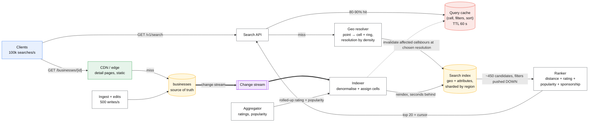
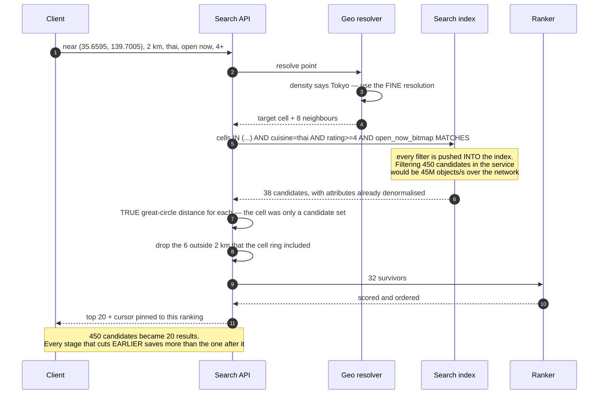

# Design a proximity service

> "Restaurants near me, open now, Thai, rated 4+, sorted by distance." Yelp, Google Maps places,
> store locators.
> **The hard part:** it is not a geo problem. The geo lookup is the cheap step; the expensive
> steps are *filtering*, *ranking* and *paginating* a result set that is 99.9% read and must be
> stable while the user scrolls.

**Read [ride-hailing.md](ride-hailing.md) first if you have not.** The two cases share a
vocabulary and share almost no design, because that one indexes **moving** objects at 1.25M
writes/s and this one indexes **static** objects with essentially no writes. Being able to say why
they diverge is most of what this case tests.

## 1. Clarify

| Question | Assumed answer |
|---|---|
| What is being searched? | Businesses — a fixed address, rich attributes, editorial and user content |
| How often does the data change? | **Rarely.** A business moves or closes a few times in its life. Hours and ratings change daily |
| Query shape? | Point + radius (or viewport), plus attribute filters, plus a ranking, paginated |
| Ranking? | Blend of distance, rating, popularity and sponsorship. **Not pure distance** |
| Radius? | User-adjustable, 500 m to 50 km, with an "expand search" fallback when results are thin |
| Freshness? | Minutes is fine for content. "Open now" must be correct to the minute |
| Scale? | 200M businesses worldwide, 100k searches/s peak, 500 writes/s |
| Geographies? | Global, so density varies by four orders of magnitude between Tokyo and rural Australia |

**Non-goals:** the ranking model itself (a scoring input, not designed here), reviews and photos
storage, routing/ETA, ads auction mechanics.

## 2. Requirements

**Functional**
- Search businesses near a point or within a viewport, with filters and a ranking
- Stable pagination through a result set
- Business CRUD for owners; bulk ingest from data partners
- "Open now" evaluated against local time and holiday hours

**Non-functional**

| Target | Value |
|---|---|
| Search p99 | **< 200 ms** end to end — it is the product |
| Availability | 99.99% for search; 99.9% for writes |
| Freshness | Business edits visible within ~5 minutes; hours and closures within 1 minute |
| Correctness | The nearest matching business must never be missing. A silent omission is unfalsifiable by the user |
| Scale | 100k QPS read, 500 writes/s |

> [!info] The ratio that decides everything
> **200,000:1 read to write.** This is a search and caching problem wearing a geospatial hat.
> Precompute aggressively, denormalise without guilt, and treat the write path as a background
> pipeline rather than an online system.

## 3. Estimates

```
Businesses:  200M × ~2 KB (attributes, hours, denormalised aggregates) = 400 GB
             Plus a search index of similar size. Fits on a modest cluster.
Searches:    100k/s peak. Each touches ~9 cells and returns ~20 of ~500 candidates
Candidates:  at a cell resolution holding ~50 businesses, 9 cells ≈ 450 candidates
             → 45M candidate evaluations/second across the fleet  ← THE number
Writes:      500/s. Utterly negligible. Do not design for it
Cache:       query locality is extreme — "restaurants near Shibuya Station" is
             asked thousands of times an hour. A (cell, filter-hash) cache with a
             60 s TTL should absorb 80-90% of traffic outright
Hot skew:    Manhattan holds ~4 orders of magnitude more businesses per km² than
             rural Australia. ONE cell resolution cannot serve both
Tiles:       a viewport search at zoom 15 covers ~20 cells; at zoom 10, ~2,000.
             Cap the zoom at which point results are returned at all
```

> [!warning] The estimate that reframes the case
> **45 million candidate evaluations per second.** The geo index is not the cost; *scoring and
> filtering candidates* is. Every design decision below is about making that number smaller —
> caching, pre-filtering, and cutting candidates before they are scored.

## 4. API / contract

```http
GET /v1/search
  ?lat=35.6595&lng=139.7005&radius_m=2000
  &q=thai&open_now=true&min_rating=4&price=1,2
  &sort=relevance|distance
  &limit=20&cursor=<opaque>
  → 200 {
      results: [ { id, name, distance_m, rating, open_now, ... } ],
      next_cursor: "<opaque>",   ← ABSENT means the end. Never infer from an empty page
      search_id: "...",           ← pins the ranking snapshot for this session
      as_of: "..."
    }

GET /v1/businesses/{id}          → full detail, cached hard
PUT /v1/businesses/{id}          → owner edit; async reindex
POST /v1/businesses/bulk         → partner ingest, idempotent by external id
```

**The cursor pins the ranking, not just the position.** Ranking inputs change continuously —
ratings, popularity, sponsorship. Paging with a naive offset over a shifting ranking shows
duplicates and skips exactly as
[pagination-patterns](../patterns/pagination-patterns.md) describes. The cursor carries
`{search_id, last_score, last_id, filter_hash}`, signed; `search_id` identifies the snapshot the
first page was computed against.

**`radius_m` is a request, not a promise.** If fewer than N results match, the service expands the
radius and says so in the response — otherwise every rural query returns an empty page and looks
broken.

## 5. Data model

| Entity | Key | Partition by | Serves |
|---|---|---|---|
| `businesses` | `business_id` | `hash(business_id)` | Detail page; source of truth |
| `business_cells` | `(cell_id, business_id)` | `cell_id` | The geo lookup |
| Search index | document per business, with `geo` + attributes | by geo region | **The actual query path** |
| `hours` | `(business_id, dow)` | `business_id` | "Open now", evaluated in local time |
| Aggregates | `business_id` → rating, review count, popularity | `business_id` | Denormalised into the index |
| Query cache | `(cell, filter_hash, sort)` | — | Absorbs the head of the distribution |

```
Businesses are indexed at THREE cell resolutions (coarse / medium / fine).
A query picks the finest resolution whose expected occupancy is ~50, using a
per-cell density statistic maintained by the indexer.

Tokyo  → fine cells    (dense: many businesses per km²)
Rural  → coarse cells  (sparse: a fine cell would be empty and force
                        many ring expansions, each a round trip)
```

**One global resolution is the mistake this case is built to catch.** It is either too coarse for
Tokyo (thousands of candidates per cell, scoring blows the latency budget) or too fine for the
countryside (empty cells, repeated ring expansion, a round trip per expansion). Store at several
and choose per query. The mechanics are in
[geospatial-indexing](../fundamentals/geospatial-indexing.md).

**The search index is the query path; the database is the source of truth.** This is
[CQRS](../patterns/cqrs.md) with one read model, and it must be rebuildable from `businesses` — a
property you exercise, because you *will* change the schema of a 200M-document index.

## 6. Architecture



### Deep dive A — the query, and where the candidates die



Two rules that this diagram exists to make unmissable:

- **Push filters into the index, never into the service.** Returning 450 candidates to filter them
  down to 32 in application code is 45M objects/s crossing the network at peak. The index must
  hold every filterable attribute, which is why the write path denormalises.
- **Cell membership is not distance.** The ring includes corners outside the radius; a true
  great-circle check after retrieval is mandatory. Skipping it returns results that are *nearly*
  right, which is the worst failure mode because nobody reports it.

### Deep dive B — why this is not ride-hailing

| | This case (static) | [Ride hailing](ride-hailing.md) (moving) |
|---|---|---|
| Writes | ~500/s | ~1.25M/s |
| Data lifetime | Years | ~30 seconds |
| Index home | Durable search index, rebuildable | **In-memory** cell → member map, replicated, never persisted |
| Query | Filter + rank + paginate | "Which few are near, right now" |
| Dominant cost | Candidate scoring at read | The write path |
| Ranking | A blended business score | ETA and fairness |
| Pagination | Essential and hard | Meaningless — you want the best 5, once |

Using this case's design for moving objects means paying durability and indexing cost for data
that expires in half a minute. Using ride-hailing's design here means an in-memory structure with
no attribute filtering, no ranking and no persistence for data that must survive a restart. Saying
this trade out loud is the strongest single answer available in this case.

### Deep dive C — "open now", which is harder than the geo

It is a timezone problem disguised as a filter:

- Hours are **local** to the business, which means its timezone, not the user's and not UTC.
- Overnight hours (`22:00–02:00`) span two days and break naive comparisons.
- Holidays, temporary closures and seasonal hours are exceptions on top of a weekly pattern.
- It changes **every minute**, so it cannot be a static index field.

The workable answer: precompute a **per-business open-interval bitmap** for the next 7 days at
15-minute granularity (672 bits, 84 bytes) in the business's local time, stored in the index.
"Open now" becomes a bit test at a computed offset — cheap, pushable into the index, and
refreshed nightly plus on edit. Exceptions are applied when the bitmap is built, not at query time.

### Deep dive D — caching a geo query

The cache key is `(cell_id, resolution, filter_hash, sort, page)`. Three things make it work:

- **Snap the user's point to a cell before caching.** Raw coordinates have effectively infinite
  cardinality, so every request is a unique key and the hit rate is zero. Snapping to the cell
  centre makes thousands of nearby users share one entry, at the cost of a small ranking
  inaccuracy — re-rank the cached candidate set by the user's true distance at the edge.
- **Short TTL plus event-driven invalidation.** TTL alone serves a closed restaurant; invalidation
  alone leaks on a missed event. Both, as with any cache
  ([cache-invalidation](../fundamentals/cache-invalidation.md)).
- **Cache the candidate set, not the final page.** Then a different `limit`, a different sort, or
  page 2 reuses the same expensive retrieval.

## 7. Scale & failure

| Breaks first at 10x | Fix |
|---|---|
| Candidate scoring at 45M/s | Cache the candidate set; push more filters into the index; cut resolution finer in dense areas |
| A dense cell (Shibuya) | Finer resolution there specifically; cap candidates per cell and accept a documented recall trade |
| Index shard for a popular region | Shard by geographic region but replicate hot regions more; regions are *not* uniformly loaded and never will be |
| Reindex of 200M documents | Blue/green index with an alias swap. Never reindex in place |
| Query cache key cardinality | Snap to cells; hash the filter set; cap the number of distinct sorts offered |

| Component fails | Blast radius | Degraded behaviour |
|---|---|---|
| Query cache | Latency ↑, index load ×5 | Index sized for ~30% of peak; shed to a coarser resolution under pressure |
| Search index shard | One region's search | Serve from a replica; if none, return a clear error for that region rather than silently empty results. **An empty result set is indistinguishable from "nothing nearby"** — never fail that way |
| Ranker | Ranking quality | Fall back to pure distance ordering. Degraded, honest, still useful |
| Indexer pipeline | Freshness decays | Search still works on older data; surface `as_of`. Alert on lag, not errors |
| Aggregator | Ratings go stale | Last known values; they move slowly anyway |
| Source database | No writes | Search unaffected — the index is the read path. This is the CQRS payoff |

**The failure mode to name unprompted:** returning an empty list when the backend is broken. In
search, "no results" is a *valid answer*, so an outage looks like a quiet neighbourhood. Every
degraded path must return an explicit error or a flag, and the monitoring must alert on
**result-count distribution**, not just on error rate — a sudden collapse in mean results per
query is the only signal that will fire.

## 8. Ops & cost

- **SLO:** search p99 < 200 ms; index freshness p99 < 5 minutes; zero-result rate within its
  normal band per region.
- **Alert on:** zero-result rate by region (the only detector for a silently broken shard),
  indexer lag, cache hit ratio, p99 by region, candidate-count distribution (a spike means the
  resolution chooser is picking wrong).
- **Rollout:** index schema changes are blue/green with an alias swap and a shadow-traffic
  comparison of result sets before the switch — not a canary on write, because a bad mapping is
  not visible until you query it.
- **Cost:** dominated by the search tier's memory and CPU — 200M documents with rich attributes
  held hot. The query cache is the single largest cost saving available and should be built first.
  Storage is trivial; the write path is free at 500/s.
- **First thing I'd cut:** the finest cell resolution outside dense metros. It triples index size
  for cells that hold two businesses.

**Also mention, briefly:** data quality. A business at the wrong coordinates is invisible, and
nobody reports a result they never saw. Validate on ingest (address geocoding must agree with
supplied coordinates within a tolerance), and run a periodic audit for businesses whose cell
assignment disagrees with their geocoded address.

## On AWS and Azure

| | AWS | Azure |
|---|---|---|
| **The service** | OpenSearch Service with `geo_point` and `geo_distance` as the read model; DynamoDB or Aurora as the source of truth; DynamoDB Streams or DMS to the indexer; ElastiCache for the query cache | Azure AI Search with geo fields (`Edm.GeographyPoint`, `geo.distance`) as the read model; Cosmos DB for NoSQL with **spatial indexes** as the source of truth; change feed to the indexer; Azure Managed Redis for the query cache |
| **What you configure** | Index mappings with every filterable attribute, shard count and routing by region, refresh interval, alias for blue/green | Search index fields and scoring profiles; Cosmos indexing policy with `spatialIndexes` on the location path; change-feed processor lease container |
| **The default that bites** | If you keep the geo lookup in DynamoDB rather than a search engine, remember it has **no two-dimensional range query** — the cell id exists precisely because of that, and the 9-cell ring is **9 separate queries you issue and merge**. Worse, a `Query` page is capped at **1 MB applied before any `FilterExpression`**, so a page can come back with zero matching items and a `LastEvaluatedKey`; stopping there silently drops results — in a search product, as a quiet neighbourhood | Cosmos says **"All containers include a default indexing policy that will successfully index geospatial data"**, so `ST_DISTANCE` works out of the box and people ship on it. A hand-written indexing policy that omits the location path removes that index silently: the same query returns the same answers at a wildly different RU cost, because it became a scan |
| **What it costs you** | Sharding an OpenSearch index by geographic region gives you locality and guarantees uneven shards — Tokyo is not Wyoming. Plan replica counts per region rather than uniformly, and expect the hot region to define your instance size | A Cosmos **logical partition is capped at 10,000 RU/s and 20 GB**. Partitioning by cell id therefore puts a hard ceiling on a dense city; the partition key ends up being cell id **plus** a discriminator, which is the geographic-skew problem from §7 made concrete by a vendor limit |

Both clouds push you to the same architecture: **source of truth in a database, query path in a
search engine, kept in sync by a change stream.** The geo index is a filter inside the search
engine, not a system of its own — and the vendor limits above are all about what happens when you
try to make the database do the search engine's job.

## In an LLM deployment

- **Natural-language place search is a genuinely good fit, and it belongs in front of this API,
  not inside it.** "Somewhere quiet near the Marais that's open late and does vegetarian" maps
  onto the filters this service already takes. The model's job is parameter extraction; the
  service's job is the answer. Keep the boundary there, because the service can prove its results
  and the model cannot.
- **Do not put coordinates in a vector index.** A 2-D metric space has an exact answer; an
  approximate-nearest-neighbour structure over embeddings does not, and "within 2 km" stops being
  a guarantee. Filter geographically first, then search semantically over the survivors — and
  check that your vector store can push the geo filter *into* the search rather than applying it
  afterwards, because post-filtering destroys recall.
- **Review summaries are a read model**, produced by a projection, versioned by prompt and model
  id, and regenerable. They must not be written back into `businesses` as authoritative — that
  would put a non-deterministic function in the write path. Same argument as
  [cqrs](../patterns/cqrs.md).
- **A model must never rank by distance.** It has no arithmetic guarantee and will produce a
  fluent ordering that is subtly wrong. Compute the distance, sort, then let the model write the
  sentence explaining why the top result suits the request.

## Referenced by

- [Backend cases index](README.md)
- [Question bank](../07-drills/question-bank.md)
- [Topic manifest](../topics/manifest.md)

## Sources

- Mechanisms in this corpus:
  [geospatial-indexing](../fundamentals/geospatial-indexing.md),
  [pagination-patterns](../patterns/pagination-patterns.md),
  [cqrs](../patterns/cqrs.md),
  [cache-invalidation](../fundamentals/cache-invalidation.md),
  [hot-shard-mitigation](../fundamentals/hot-shard-mitigation.md)
- Neighbouring cases: [ride-hailing](ride-hailing.md) — the moving-object counterpart this case
  deliberately contrasts itself with; [search-typeahead](search-typeahead.md) for the index side
- Local book: Alex Xu, *System Design Interview* vol. 2 ch. 1 — Proximity Service

Cloud claims in §On AWS and Azure (all verified 2026-09-23):

- [AWS — paginating table query results in DynamoDB](https://docs.aws.amazon.com/amazondynamodb/latest/developerguide/Query.Pagination.html) — 1 MB page cap applied to items read before a `FilterExpression` is applied, "a page can return zero matching items and still include a `LastEvaluatedKey`", and only an absent `LastEvaluatedKey` means the end of the result set
- [Azure — index and query GeoJSON location data in Cosmos DB](https://learn.microsoft.com/en-us/azure/cosmos-db/nosql/query/geospatial-index) — "All containers include a default indexing policy that will successfully index geospatial data"; `spatialIndexes` policy with `path` and `types`; `ST_DISTANCE` / `ST_WITHIN`
- [Azure — Cosmos DB service quotas and default limits](https://learn.microsoft.com/en-us/azure/cosmos-db/concepts-limits) — 10,000 RU/s and 20 GB per logical partition
