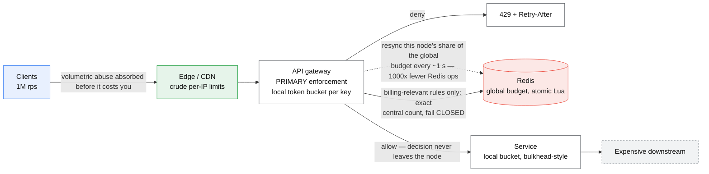
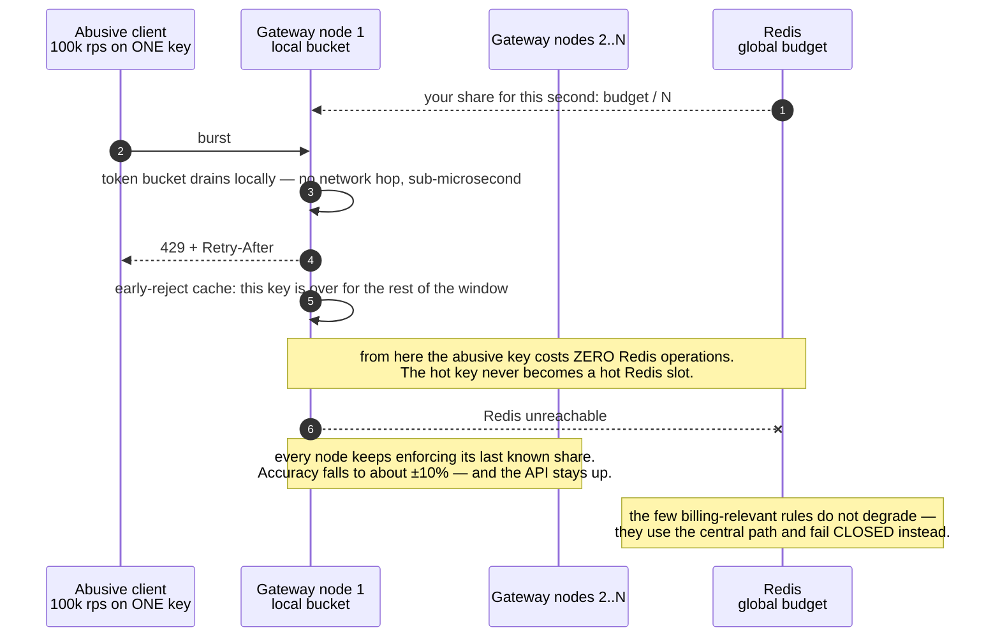

# Design a distributed rate limiter

> Cap how many requests a caller may make per unit time, across a fleet of servers.
> **The hard part:** enforcing a global limit without a global bottleneck, and deciding how
> much inaccuracy you'll accept to keep it fast.

## 1. Clarify

| Question | Assumed answer |
|---|---|
| Limit by what? | API key, user ID, IP, and endpoint class — multiple dimensions, composable |
| Hard or soft limit? | Hard for abuse protection; soft (queue/throttle) for internal traffic |
| Accuracy required? | Approximate is fine (±10%) for quotas; exact for billing-relevant limits |
| Where enforced? | Gateway/edge, before any expensive work |
| What on breach? | 429 + `Retry-After` + `X-RateLimit-*` headers |
| Scale? | 1M rps across the fleet, 10M distinct keys |
| Multi-region? | Yes — and per-region limits are acceptable |

**Non-goals:** billing/metering (adjacent but different — that one must be exact), bot
detection.

## 2. Requirements

**Functional**
- Enforce N requests per window per key, with different rules per tier and endpoint
- Return standard headers: `X-RateLimit-Limit/Remaining/Reset`, `Retry-After`
- Rules configurable without a deploy

**Non-functional**

| Target | Value |
|---|---|
| Added latency | < 1 ms p99 (it's on every request) |
| Availability | Must **fail open or closed by policy**, per rule |
| Accuracy | ±10% acceptable for quotas |
| Scale | 1M rps, 10M keys |

## 3. Estimates

```
1M rps × 1 counter op = 1M Redis ops/s        → ~10–20 Redis nodes (100k ops/s each)
                                                or far fewer with local buckets + sync
10M keys × ~100 B     = 1 GB of counter state → trivial
Hot key: one abusive client at 100k rps hits ONE key → single-node hotspot   ← the design
```

> [!info] The scary number
> Not the total ops — the **hot key**. A distributed rate limiter's failure mode is that
> the thing you're limiting is by definition concentrated on one key.

## 4. API / contract

```
Internal: allow(key, rule_id, cost=1) -> {allowed: bool, remaining: int, reset_at: ts}

Response on breach:
  HTTP 429
  Retry-After: 12
  X-RateLimit-Limit: 1000
  X-RateLimit-Remaining: 0
  X-RateLimit-Reset: 1735689600
```

Rules as config (hot-reloaded):
```yaml
- id: api_v1_write
  match: {tier: free, endpoint_class: write}
  limit: 100
  window: 60s
  algorithm: token_bucket
  burst: 20
  on_error: fail_open        # or fail_closed for abuse-critical rules
```

## 5. Data model

| Entity | Key | Where | Serves |
|---|---|---|---|
| Counter/bucket | `rl:{rule_id}:{key}:{window}` | Redis (or local memory) | The decision |
| Rules | `rule_id` | Config store + in-process cache | Which limit applies |
| Overrides | `(customer_id, rule_id)` | Config store | Enterprise customers with custom limits |

Counter TTL = window length × 2. Never let counters accumulate.

## 6. Architecture

Three placements, and you should name all three:



### Deep dive A — algorithm choice

| Algorithm | State | Behaviour | Verdict |
|---|---|---|---|
| Fixed window counter | 1 int | Allows 2× the limit across a window boundary | Only for rough quotas |
| Sliding window log | Sorted set of timestamps | Exact | Memory O(N) per key — too expensive at 1M rps |
| **Sliding window counter** | 2 ints (this window + previous, weighted) | Good approximation, tiny state | **Great default for quotas** |
| **Token bucket** | tokens + last-refill timestamp | Allows bursts up to bucket size, smooth steady rate | **Best for API limits** — matches how clients actually behave |
| Leaky bucket (queue) | Queue | Constant outflow, smooths spikes | Traffic shaping toward a fragile downstream |

Pick **token bucket** for user-facing API limits (clients burst legitimately: a page load
fires 20 requests) and say why fixed-window is wrong (the boundary doubling).

Redis implementation must be **atomic** — a Lua script (or `INCR`+`EXPIRE` pipelined
carefully), otherwise concurrent servers race and the limit leaks:

```lua
-- token bucket, atomic: returns {allowed, remaining}
local tokens = tonumber(redis.call('HGET', KEYS[1], 'tokens')) or capacity
local last   = tonumber(redis.call('HGET', KEYS[1], 'ts')) or now
tokens = math.min(capacity, tokens + (now - last) * refill_rate)
local allowed = tokens >= cost
if allowed then tokens = tokens - cost end
redis.call('HSET', KEYS[1], 'tokens', tokens, 'ts', now)
redis.call('EXPIRE', KEYS[1], ttl)
return {allowed and 1 or 0, math.floor(tokens)}
```

### Deep dive B — centralised vs local, the real trade

| Approach | Accuracy | Latency | Failure behaviour |
|---|---|---|---|
| **Central Redis, every request** | Exact-ish | +0.5–1 ms per request, and Redis is now on your critical path | Redis down = every request must fail open or closed |
| **Local buckets, no coordination** | Up to N× the limit (N = node count) | 0 | Perfect availability |
| **Local buckets + periodic sync** (each node gets a share of the budget, rebalanced every ~1 s) | ±10% | ~0 | Degrades to local-only |

**Recommendation:** local token buckets holding a per-node share of the global budget,
resynchronised every second against Redis. That's ~1000x fewer Redis operations, sub-microsecond
decisions, and it degrades gracefully to "each node enforces its own share" when Redis is
unreachable. Reserve exact central counting for the few rules where over-admitting costs money.



> [!tip] Interview line
> "I'll trade exactness for availability: 10% over-admission on a 1000/min limit is
> harmless, but a rate limiter that takes the API down when Redis blips is a much worse
> outcome. For the billing-relevant limit I'd use the central path and fail closed."

### Deep dive C — hot key

The abusive client *is* a hot key by definition. Mitigations:
- Local buckets already absorb this — the decision never leaves the node.
- If central: shard the key (`rl:{key}:{node_shard}`) with each shard holding budget/N.
- Add an **early-reject cache**: once a key is over limit, remember it locally for the rest
  of the window and reject without touching Redis at all.

## 7. Scale & failure

| Breaks first at 10x | Fix |
|---|---|
| Redis ops volume | Local buckets + sync (already the design) |
| One key's traffic | Local early-reject cache |
| Rule evaluation cost per request | Compile rules into a lookup keyed by (tier, endpoint class) |

| Component fails | Blast radius | Degraded behaviour |
|---|---|---|
| Redis | Loses global coordination | Local enforcement continues at per-node share (fail-open per policy) |
| Config store | Rules can't update | Last-known-good rules stay in memory; alert |
| Clock skew between nodes | Windows misalign | Use Redis server time for central path; monotonic clocks locally |

**Fail open vs fail closed is a product decision, per rule.** Free-tier abuse protection:
fail closed. Paying customer's normal traffic: fail open. Say that you'd tag each rule.

## 8. Ops & cost

- **SLO:** limiter adds < 1 ms at p99; false-rejection rate < 0.1%.
- **Alert on:** 429 rate by tier (a spike = either an attack or a misconfigured rule that's
  hurting real customers), Redis latency, sync failure rate, rule reload failures.
- **Rollout:** every new rule ships in **shadow mode** first — evaluate and log what *would*
  have been rejected, look at the numbers, then enforce. Never enable a new limit blind.
- **Cost:** trivial. A dozen Redis nodes ≈ $3–5k/month, and it *saves* far more by shedding
  abusive load before it reaches expensive services.
- **First thing I'd cut:** central sync frequency (1 s → 5 s), which trades accuracy for cost.

## On AWS and Azure

| | AWS | Azure |
|---|---|---|
| **The shape** | CloudFront + WAF rate-based rules at the edge; API Gateway usage plans and account throttle in the middle; your own token bucket over ElastiCache for anything business-shaped | Front Door + WAF custom rate-limit rules at the edge; API Management `rate-limit-by-key` in the middle; your own bucket over Azure Managed Redis |
| **What you configure** | Evaluation window (60/120/300/600 s, **default 300**), rate limit (minimum 10), aggregation key (IP, header, custom keys); API Gateway account throttle **10,000 RPS with a 5,000 burst bucket** | `calls` and `renewal-period` (**maximum 300 seconds**) with an arbitrary `counter-key` expression; Front Door WAF threshold with a window of **one minute or five minutes only** |
| **The default that bites** | AWS WAF "is not intended for precise request-rate limiting": it estimates the rate, so **"it's possible for requests to be coming in at too high a rate for up to several minutes before AWS WAF detects and rate limits them."** Worse, editing any rate setting **resets the counts and pauses limiting for up to a minute** — tuning a limit under attack removes it | APIM "tracks calls independently at each gateway where it is applied… It doesn't aggregate call data across the entire instance." A multi-region APIM deployment therefore enforces N × your limit, silently. The docs say plainly: **"rate limiting is never completely accurate"** |
| **What it costs you** | Nothing global. Every managed option is per-edge or per-account, so the "global budget" half of this design is still a Redis cluster you run, and the hot key is still yours | Front Door counts per edge server: **"for a low threshold (for example, less than about 200 requests per minute), you might see some requests above the threshold get through."** It is also a *fixed* window — once breached, all matching traffic is blocked for the remainder, so a 5-minute window is a 5-minute ban |

This is the case where the managed answer is weakest, and naming why is the point: both clouds give
you an approximate, edge-local limiter tuned for volumetric abuse, and neither gives you a global
counter. That is deliberate — a globally exact limiter is a globally shared bottleneck — and it is
the same trade this case makes in §Deep dive B, arriving as a product decision instead of yours.

## In an LLM deployment

The unit stops being the request. A model endpoint's real budget is **tokens per minute**, and both
clouds enforce it that way: Azure OpenAI Standard deployments allocate TPM with a fixed
requests-per-minute ratio bolted on — **10 RPM per 1,000 TPM** for `gpt-chat-latest` versions
`2026-05-05` through `2026-06-24`, **1 RPM per 1,000 TPM** for `2026-08-06` — so the same quota
supports a tenth as many calls depending on a model *version* you did not choose. Amazon Bedrock
meters on token usage too, and notes that "some models use tokens at a higher rate."

Three consequences for the design on this page. **The cost is not known at admission.** A request's
token count is only known after generation, so the token bucket has to be debited on an *estimate*
at entry and reconciled on completion — which means a limiter that can go negative, and a policy
for what happens when it does. **A single request can exhaust a window.** One 100 k-token prompt is
worth ten thousand ordinary API calls, so a per-request limit is not a limit at all; cap input
tokens as a separate rule. **Fail-open is the wrong default here.** The case's `on_error:
fail_open` is right when the downstream is cheap; when a breach means billed GPU-seconds, an
unavailable limiter should fail *closed*, and that flip is the one line worth saying out loud.

## Referenced by

- [Backend cases index](README.md)
- [Design a notification system](notification-system.md)
- [Design a real-time leaderboard](leaderboard.md)
- [Engineering blogs and case studies](../10-resources/engineering-blogs.md)
- [Question bank](../07-drills/question-bank.md)
- [Reliability patterns](../02-primitives/reliability-patterns.md)

## Sources

- Local book: Alex Xu vol. 1 ch.4 (rate limiter)
- [AWS Builders' Library — Using load shedding to avoid overload](https://aws.amazon.com/builders-library/using-load-shedding-to-avoid-overload/)
- [Stripe — Scaling your API with rate limiters](https://stripe.com/blog/rate-limiters)
- [Cloudflare — How we built rate limiting capable of scaling to millions of domains](https://blog.cloudflare.com/counting-things-a-lot-of-different-things/)
- Primitives: [reliability-patterns](../02-primitives/reliability-patterns.md), [caching](../02-primitives/caching.md)

Cloud claims in §On AWS and Azure (all verified 2026-09-21):

- [AWS — rate-based rule high-level settings](https://docs.aws.amazon.com/waf/latest/developerguide/waf-rule-statement-type-rate-based-high-level-settings.html) — evaluation windows 60/120/300/600 s with 300 default, minimum limit 10
- [AWS — rate-based rule caveats](https://docs.aws.amazon.com/waf/latest/developerguide/waf-rule-statement-type-rate-based-caveats.html) — estimation, multi-minute detection delay, counts reset on a settings change
- [AWS — API Gateway quotas](https://docs.aws.amazon.com/apigateway/latest/developerguide/limits.html) — 10,000 RPS account throttle with a 5,000-request burst bucket
- [Azure — `rate-limit-by-key` policy reference](https://learn.microsoft.com/en-us/azure/api-management/rate-limit-by-key-policy) — 300-second maximum renewal period; counters are per gateway, never aggregated; accuracy caveat
- [Azure — WAF rate limiting for Azure Front Door](https://learn.microsoft.com/en-us/azure/web-application-firewall/afds/waf-front-door-rate-limit) — one- or five-minute windows, per-edge counters, fixed-window blocking
- [Azure OpenAI quotas and limits](https://learn.microsoft.com/en-us/azure/ai-foundry/openai/quotas-limits) — TPM allocation and RPM-per-1,000-TPM ratios
- [AWS — quotas for Amazon Bedrock](https://docs.aws.amazon.com/bedrock/latest/userguide/quotas.html) — inference controlled by token-usage quotas
