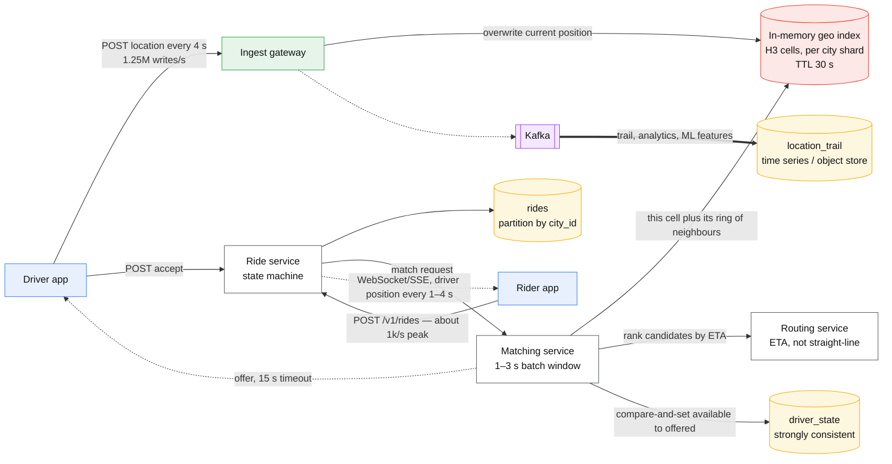
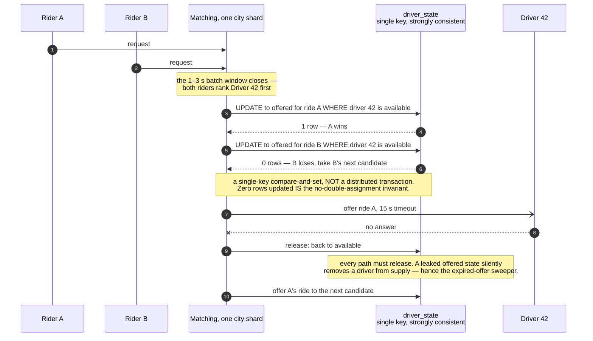

# Design ride-hailing / proximity matching

> Uber/Lyft/DoorDash: find nearby drivers, match a rider to one, track the trip.
> **The hard part:** geospatial indexing over objects that move (a location write per driver
> every few seconds) and a matching step that must not double-assign.

## 1. Clarify

| Question | Assumed answer |
|---|---|
| Scale? | 5M active drivers, 20M rides/day, peak 3x |
| Location update frequency? | Every 4 s per online driver |
| Matching objective? | ETA-optimal with fairness constraints; batch matching, not pure greedy |
| Pricing? | Surge exists — a separate service consuming demand/supply signals |
| Geography? | Global, but **matching is inherently local** — city-level partitioning is natural |
| Consistency? | A driver must never be assigned to two rides. Location data can be stale-ish |

**Non-goals:** payments (see [payments-ledger.md](payments-ledger.md)), routing/ETA model
internals, fraud.

## 2. Requirements

**Functional**
- Drivers publish location; riders request a ride from A to B
- Find candidate drivers near the rider, rank by ETA, offer, handle accept/decline/timeout
- Track the trip through its lifecycle; both parties see live position

**Non-functional**

| Target | Value |
|---|---|
| Match latency | < 5 s from request to driver offer |
| Location write path | Must absorb 1.2M writes/s without backing up |
| Correctness | **No double assignment** — this is the hard invariant |
| Availability | 99.99%; degraded matching beats no matching |

## 3. Estimates

```
Location writes: 5M drivers ÷ 4 s = 1.25M writes/s              ← dominant write load
   Each ~50 B → 62 MB/s ingest, 5 TB/day if you keep it all (you don't — keep a trail, not a history)
Ride requests: 20M/day ≈ 230/s avg, ~1k/s peak                  ← tiny by comparison
Read fan: each request queries "drivers within ~3 km" → a spatial lookup over a live index
Storage: current position is 5M rows overwritten constantly → ~1 GB, fits in memory
         trip records 20M/day × 2 KB = 40 GB/day
```

> [!info] The scary number
> 1.25M location writes/s against **230 matching requests/s**. The write path and the read
> path have wildly different shapes — so they get different systems. That observation is the
> case.

## 4. API / contract

```http
# driver
POST /v1/drivers/location   { lat, lng, heading, speed, ts }   → 204   (fire and forget)
POST /v1/offers/{id}/accept                                     → 200 | 409 (already taken)

# rider
POST /v1/rides  { pickup, dropoff, product }  Idempotency-Key
  → 202 { ride_id, state: "matching" }
GET  /v1/rides/{id}          → { state, driver?, eta_s, driver_position? }
     (or a WebSocket/SSE stream for live position)
POST /v1/rides/{id}/cancel
```

Ride state machine — draw it, they always ask:
```
requested → matching → offered → accepted → arriving → in_progress → completed
                ↓          ↓         ↓                                    ↓
            no_drivers  declined  cancelled ─────────────────────────→ cancelled
```
Only legal transitions, each with a timeout and a compensating action.

## 5. Data model

| Entity | Key | Where | Serves |
|---|---|---|---|
| `driver_location` | `driver_id` | Redis / in-memory grid, TTL 30 s | Current position, overwritten |
| Spatial index | `cell_id → set(driver_id)` | Redis / in-memory, per city shard | "who is near here" |
| `rides` | `ride_id` | Sharded DB, partition by `city_id` | Trip lifecycle |
| `driver_state` | `driver_id` | Strongly consistent store | available / offered / on_trip — **the assignment lock** |
| `location_trail` | `(ride_id, ts)` | Time-series / object store | Trip replay, disputes, billing |

**Why partition by city:** matching never crosses cities. City sharding gives natural
locality, bounded blast radius (a bad deploy hits one city), and lets you scale hot cities
independently. It's also how the real systems do it.

## 6. Architecture

The write path and the match path are different systems, each sized for its own number:



### Deep dive A — geospatial indexing

| Technique | How | Notes |
|---|---|---|
| **Geohash** | Interleave lat/lng bits into a base32 string; a prefix = a rectangle | Simple, sortable, works in any KV store. Edge problem: neighbours can differ in prefix, so query the 8 adjacent cells too |
| **Quadtree** | Recursive subdivision, denser where objects are dense | Adapts to density (Manhattan vs a desert); in-memory structure, needs rebuilding |
| **S2 (Google)** | Sphere → cube → Hilbert curve cells | Handles sphere geometry correctly, good locality. Used widely in production |
| **H3 (Uber)** | Hexagonal cells | Uniform neighbour distance (hexagons have 6 equidistant neighbours, squares don't), which makes "expand the search ring" clean. **Say H3 for this case** |
| PostGIS / R-tree | Real spatial DB | Great for static geometry, too slow for 1.25M writes/s of moving points |

Query pattern: resolve the rider's position to a cell, take that cell plus its ring of
neighbours, collect driver IDs, expand the ring if too few candidates. Cell resolution is
tuned so a typical cell holds tens of drivers.

**Why in-memory, not a database:** at 1.25M writes/s with a 30 s useful lifetime, this data
is *ephemeral*. Persisting every position to a durable store would be the most expensive and
least useful thing in the design. Keep current position in memory (replicated for failover),
stream the trail to Kafka for anything that needs history.

### Deep dive B — matching without double assignment

Two riders, one driver, one key — the invariant decided in a single statement:



- Naive greedy (nearest driver, immediately) is fast but globally worse: it can strand two
  riders while a better global assignment existed.
- **Batch matching**: accumulate requests for a short window (1–3 s) per city, solve a small
  assignment problem (Hungarian algorithm or a greedy approximation with ETA costs), then
  offer. Better outcomes, bounded added latency. Say the window is a tunable
  latency-vs-quality knob.
- **The invariant** — a driver is offered to one ride at a time — is enforced with a
  **compare-and-set** on `driver_state`: `UPDATE driver_state SET state='offered',
  ride_id=? WHERE driver_id=? AND state='available'`. Zero rows updated means someone else
  won; pick the next candidate. This is a single-key transaction, not a distributed one.
- Offer has a **timeout** (~15 s). On decline or timeout, release the driver (compensating
  action) and offer the next. Every path must release — a leaked "offered" state removes a
  driver from supply, so add a sweeper for expired offers.
- **ETA must come from a routing service**, not from straight-line distance: a driver 200 m
  away across a river is not close.

### Deep dive C — the live tracking path

- Rider watches driver position: WebSocket/SSE from the ride service, updated at 1–4 s.
- Only push to the ~1 subscriber per active ride — this is small, unlike the ingest side.
- Snap-to-road and interpolate client-side so the marker moves smoothly at a low update rate.
  That's a bandwidth optimisation worth mentioning: smoothing on the client lets you cut
  server updates several-fold.

## 7. Scale & failure

| Breaks first at 10x | Fix |
|---|---|
| Location ingest | Adaptive update rate (slower when stationary/parked), binary encoding, per-city shards |
| Geo index memory/CPU on a hot city shard | Split the city into sub-shards; higher-resolution cells |
| Matching solver time in a dense city | Cap candidate set, approximate solver, shorter batch window |
| Kafka trail volume | Sample; keep full fidelity only for active trips |

| Component fails | Blast radius | Degraded behaviour |
|---|---|---|
| Geo index node | That city's matching stalls | Replicated index + rebuild from the last 30 s of Kafka — cheap, because state is ephemeral |
| Routing/ETA service | Can't rank well | **Fall back to straight-line distance ranking** — worse matches, still a working product |
| Ride DB shard | That city can't start rides | Trips in progress continue from client + cache state; new requests fail with a clear message |
| Surge pricing service | No surge | Default to base pricing — never block a ride on a pricing optimisation |

## 8. Ops & cost

- **SLO:** 99% of requests matched within 5 s; double-assignment rate exactly 0 (a correctness
  invariant, alert on any occurrence); location ingest lag p99 < 2 s.
- **Alert on:** match rate and time by city, unfulfilled request rate, driver-state leak count
  (offers that never resolved), ingest lag, geo index memory.
- **Rollout:** per-city canary — matching changes go to one small city first. Cell-based
  architecture makes this natural, and it's the answer to "how do you avoid a global outage".
- **Cost:** the ingest + geo index tier dominates (memory and network), then Kafka. Adaptive
  location update rates (don't ping every 4 s while parked) are the biggest lever and also
  save driver phone battery — a rare win-win worth naming.
- **First thing I'd cut:** location trail retention, and update frequency for idle drivers.

## On AWS and Azure

| | AWS | Azure |
|---|---|---|
| **The shape** | **Write path:** location posts → API Gateway/ALB → ECS → ElastiCache (Valkey) geo index, with a Kinesis tee to S3 for the trail. **Match path:** ECS matcher reading the geo index, DynamoDB conditional write for `driver_state`, rides in DynamoDB partitioned by `city_id` | **Write path:** → Container Apps/AKS → Azure Managed Redis geo index, with an Event Hubs tee to Blob. **Match path:** matcher over Redis, Cosmos DB `_etag` optimistic concurrency for `driver_state`, rides in Cosmos partitioned by `city_id` |
| **What you configure** | TTL on the position key (30 s), Redis cluster mode and shard count per city, and the `ConditionExpression` that *is* the assignment lock | Position TTL, Redis clustering policy, and the `If-Match` ETag on the driver-state document that *is* the assignment lock |
| **The default that bites** | A DynamoDB conditional write is the only cheap way to make "no double assignment" true, and it is bounded by **1,000 write units/s on one partition** — fine for 230 matches/s, but the same partition also carries retries and declines. The location trail via Kinesis hits **1 MB/s or 1,000 records/s per shard**: 1.25 M writes/s is over a thousand shards, against a default quota of **1,000 or 6,000 shards per account outside N. Virginia, Oregon and Ireland** | **Azure Cache for Redis "announced its retirement timeline for all SKUs"** — the live geo index goes on Azure Managed Redis (Redis 7.4.x), and its in-memory SKUs above **350 GB are in preview**. Event Hubs Standard is **32 partitions and 40 TUs** (1 TU = 1 MB/s *or* 1,000 events/s), i.e. 40 MB/s: the 62 MB/s location firehose does not fit on Standard at all |
| **What it costs you** | Neither cloud has a managed "moving objects" index. Amazon Location Service does trackers and geofences; the 3 km nearest-driver query at 230/s against 5 M moving points is still Redis `GEOSEARCH` in a cache you run | Same. Azure Maps does geocoding, routing and geofencing; the live proximity index is yours |
| **Durability of the position state** | ElastiCache node-based **Valkey clusters can enable durability**, persisting to a distributed Multi-AZ transactional log so "data is protected even if all cache nodes fail" — unusual for a cache, and directly relevant to a tier holding assignment-adjacent state | Azure Managed Redis offers data persistence and active geo-replication on the in-memory tiers |

City sharding survives contact with both clouds and is the reason they work: it caps a Redis
cluster, a Kinesis/Event Hubs topic and a DynamoDB/Cosmos partition set per city, so the 1.25 M
writes/s is never one number — it is a hundred cities' worth of small numbers. Present it that way
or the shard math looks impossible.

## In an LLM deployment

Nothing on the hot path should be a model, and saying why is the answer. Matching is a 5-second
budget over a bounded candidate set with a hard "no double assignment" invariant — it is an
assignment problem, not a language problem, and a probabilistic ranker on the critical path buys
nothing and risks the invariant.

Where a model genuinely lands is the parts of this system that are already fuzzy and already slow.
**Address and destination resolution** — "the Starbucks near the bridge" — is a retrieval problem
over a POI index, run once at request time, cached, and confirmed by the rider before the ride
state machine starts. **Support and dispute handling** reads the `location_trail` this design
already keeps for exactly that purpose; a 45-minute trip at one point per 4 seconds is ~675 points,
which is a small enough context to hand a model directly. **Demand forecasting** feeding the surge
service is a batch model whose output is a number per cell per interval, not an inference per
request.

The economics point is the same one the write path already makes: 1.25 M location events/s is
1.25 M events you must never send to a model. Aggregate to cells and intervals first — the model
sees a grid, not a firehose — or the inference bill is the largest line in the system by an order
of magnitude.

## Referenced by

- [Backend cases index](README.md)
- [Engineering blogs and case studies](../10-resources/engineering-blogs.md)
- [Microsoft, Apple, Netflix and other big tech](../09-company-styles/microsoft-apple-netflix.md)
- [Question bank](../07-drills/question-bank.md)
- [Repo index](../../INDEX.md)

## Sources

- Local book: Alex Xu vol. 2 — proximity service, nearby friends chapters
  (`AI/ML-Foundations/Alex Xu_ Sahn Lam - System Design Interview ... Volume 2.epub`)
- [Uber H3 — hexagonal hierarchical spatial index](https://www.uber.com/en-US/blog/h3/)
- [Uber engineering blog — marketplace and matching](https://www.uber.com/en-US/blog/engineering/)
- Primitives: [replication-and-partitioning](../02-primitives/replication-and-partitioning.md), [transactions-and-idempotency](../02-primitives/transactions-and-idempotency.md)

Cloud claims in §On AWS and Azure (all verified 2026-09-21):

- [AWS — what is Amazon ElastiCache?](https://docs.aws.amazon.com/AmazonElastiCache/latest/dg/WhatIs.html) — Valkey/Redis OSS/Memcached engines, serverless and node-based clusters, Valkey durability via a distributed Multi-AZ transactional log
- [AWS — best practices for partition keys in DynamoDB](https://docs.aws.amazon.com/amazondynamodb/latest/developerguide/bp-partition-key-design.html) — 1,000 write units/s per partition
- [AWS — Kinesis Data Streams quotas and limits](https://docs.aws.amazon.com/streams/latest/dev/service-sizes-and-limits.html) — per-shard write limits and regional shard quotas
- [Azure — Event Hubs quotas and limits](https://learn.microsoft.com/en-us/azure/event-hubs/event-hubs-quotas) — throughput units, 32 partitions and 40 TUs on Standard
- [Azure — What is Azure Cache for Redis?](https://learn.microsoft.com/en-us/azure/azure-cache-for-redis/cache-overview) — retirement announced for all SKUs
- [Azure — What is Azure Managed Redis?](https://learn.microsoft.com/en-us/azure/redis/overview) — Redis 7.4.x, tier sizes, persistence and active geo-replication, preview above 350 GB
