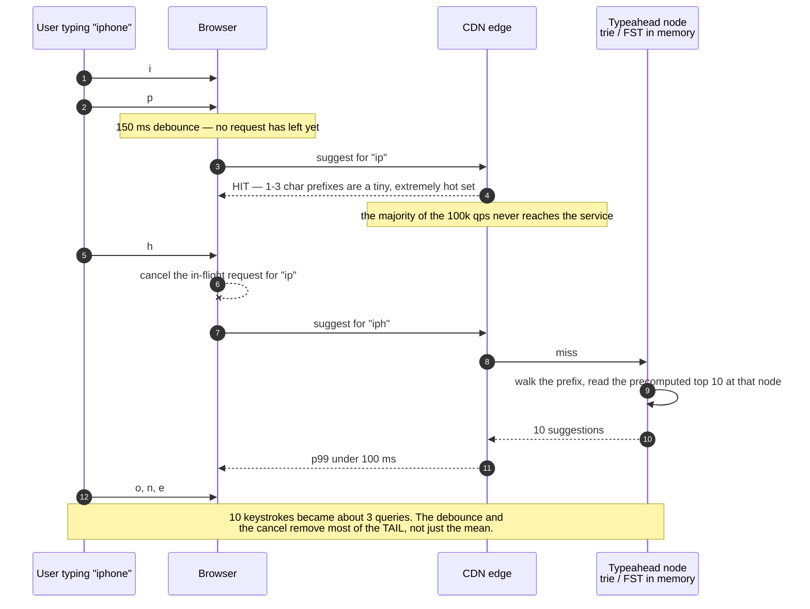

# Design search and typeahead

> Two related systems: **autocomplete** (sub-100 ms suggestions as the user types) and
> **full-text search** (rank documents by relevance).
> **The hard part:** the index build/refresh path — everyone designs the query path and
> forgets that a search system is 80% an indexing pipeline.

## 1. Clarify

| Question | Assumed answer |
|---|---|
| What are we searching? | 1B documents (products/posts), text + structured filters |
| Freshness requirement? | New documents searchable within ~1 min; typeahead within minutes |
| Personalised results? | Typeahead: lightly (recent + location). Search: yes, as a re-rank stage |
| Typo tolerance? | Yes, edit distance ≤ 2 |
| Filters/facets? | Yes — category, price range, availability |
| Scale? | 100k queries/s peak for typeahead; 10k/s for full search |
| Multi-language? | Yes — per-language analyzers |

**Non-goals:** crawling, the relevance ML model itself (touched, not designed), ads.

## 2. Requirements

**Functional**
- Typeahead: top 10 completions for a prefix, ranked by popularity + personalisation
- Search: ranked results, paginated, with filters and facets
- Index new/updated/deleted documents continuously

**Non-functional**

| Target | Value |
|---|---|
| Typeahead p99 | **< 100 ms end to end** (it fires on every keystroke) |
| Search p99 | < 300 ms |
| Index freshness | < 60 s |
| Availability | 99.99% (search down = site feels down) |

## 3. Estimates

```
Typeahead: 100k qps peak; each keystroke is a query → a 10-char search = 10 queries
           Debounce 150 ms client-side → ~3 queries per search instead of 10
Documents: 1B × 1 KB text = 1 TB raw
Inverted index ≈ 30–50% of raw → ~400 GB, replicated ×3 → ~1.2 TB
   → ~20 nodes at 64 GB each so the hot index fits in page cache
Updates: 10M doc changes/day ≈ 120/s → trivial volume, but refresh cost is the constraint
Prefix data: top 10M prefixes × 10 suggestions × 30 B ≈ 3 GB → fits in RAM everywhere
```

> [!info] The scary number
> 100k qps at a 100 ms p99 budget. Typeahead cannot touch a general search cluster — it needs
> its own precomputed, memory-resident structure.

## 4. API / contract

```http
GET /v1/suggest?q=iph&limit=10&locale=en-US
  → 200 { suggestions: [{text: "iphone 17", score, type: "query"|"product"}] }
    Cache-Control: public, max-age=60      # short-prefix results are highly cacheable

GET /v1/search?q=wireless+headphones&filters=cat:audio,price:50-200&sort=relevance
             &cursor=<opaque>&limit=20
  → 200 { hits: [...], facets: {...}, total_estimate, next_cursor }
```

## 5. Data model

**Typeahead** — a trie is the textbook answer; say what you'd actually run:

| Structure | Notes |
|---|---|
| **Trie with top-K cached at each node** | Classic. Lookup is O(prefix length), then read the precomputed top 10 at that node. Rebuilt offline, shipped as a read-only artefact |
| **Finite state transducer (FST)** | What Lucene actually uses — compressed, memory-mapped, supports fuzzy matching |
| **Redis sorted set per prefix** | Simplest to operate: `ZREVRANGE ta:{prefix} 0 9`. Memory heavier but you already run Redis |

Recommendation: precompute top-K per prefix offline from the query log, ship it as an
immutable artefact to every typeahead node (or into Redis), rebuild every N minutes. Reads
never touch a database.

**Search** — inverted index:
```
term → posting list [(doc_id, term_freq, positions...), ...]
docs → stored fields (title, price, ...) for display
```
Sharded by `hash(doc_id)` (**document partitioning**): each shard holds a slice of documents
and a full index over them; a query fans out to all shards, each returns its top K, and a
coordinator merges. The alternative — term partitioning — has better per-query IO but
appalling load balance and painful updates. Say you chose document partitioning and why.

## 6. Architecture

Indexing is 80% of the system and never touches the query path:

```mermaid
flowchart LR
    src[("Source DB")]
    cdc[["CDC / Kafka"]]
    enr["Enrichment<br/>attributes, ML features"]
    ana["Analysis<br/>tokenize, stem, synonyms, n-grams"]
    iw["Index writers<br/>immutable segments, ~1 s refresh"]
    ql[("Query log")]
    tb["Top-K per prefix<br/>offline build"]
    ta["Typeahead nodes<br/>trie / FST, memory-resident"]
    cdn["CDN<br/>prefixes of 1-3 chars, TTL 60 s"]
    c["Client<br/>150 ms debounce"]
    sa["Search API<br/>spellcheck, synonyms, intent"]
    sh[("Search shards<br/>document-partitioned, BM25")]
    rr["Re-rank top ~200<br/>learning-to-rank, ~10 ms"]

    src ==> cdc
    cdc ==> enr
    enr ==> ana
    ana ==> iw
    iw ==> |"replicate segments, flip the alias"| sh
    ql ==> tb
    tb ==> |"immutable artefact, rebuilt every N minutes"| ta
    c --> |"100k qps peak"| cdn
    cdn --> |"miss"| ta
    ta --> |"p99 under 100 ms, no database on the path"| c
    c --> |"GET /v1/search"| sa
    sa --> |"scatter to N shards"| sh
    sh --> |"per-shard top K, gather and merge"| rr
    rr --> |"hydrate + facets, p99 under 300 ms"| c

    classDef client fill:#e8f0fe,stroke:#4285f4,color:#111
    classDef edge fill:#e6f4ea,stroke:#34a853,color:#111
    classDef service fill:#fff,stroke:#5f6368,color:#111
    classDef store fill:#fef7e0,stroke:#f9ab00,color:#111
    classDef cache fill:#fce8e6,stroke:#ea4335,color:#111
    classDef queue fill:#f3e8fd,stroke:#a142f4,color:#111
    classDef external fill:#f1f3f4,stroke:#9aa0a6,color:#111,stroke-dasharray:4 3
    class c client
    class cdn,cdc edge
    class enr,ana,iw,tb,ta,sa,rr service
    class src,sh,ql store
```



### Deep dive A — indexing pipeline

- **Near-real-time** indexing: documents go into an in-memory buffer, flushed to a new
  immutable segment on a refresh interval (~1 s in Lucene). Segments merge in the background.
  Refresh interval is a direct **freshness vs throughput** knob — say it.
- **Deletes are tombstones**: segments are immutable, so a delete marks the doc and it's
  filtered at query time; space is reclaimed at merge. This is why heavy update workloads
  need merge headroom.
- **Full reindex must be a routine operation**, not a crisis: build a new index alias-side,
  verify, flip the alias. You will need this every time the analyzer or schema changes —
  which is often.
- **Backfill + streaming from the same source**: CDC gives you both. The search index is a
  *derived* store, rebuildable from the log; that's what makes bugs in it survivable.

### Deep dive B — ranking

1. **Retrieval**: BM25 (term frequency × inverse document frequency, length-normalised) over
   the inverted index, plus filters. Cheap, gets a few hundred candidates per shard.
2. **Re-rank**: a learning-to-rank model over the merged top ~200 with richer features —
   historical CTR, conversion, freshness, personalisation, price. ~10 ms budget.
3. **Business rules last**: pinned results, out-of-stock demotion, diversity constraints.

Also mention **hybrid retrieval** — BM25 (lexical) combined with vector/embedding search
(semantic), fused with reciprocal rank fusion. That's the 2026 default and it links directly
to [../06-ml-cases/rag-assistant.md](../06-ml-cases/rag-assistant.md).

### Deep dive C — making 100 ms achievable for typeahead



- Client debounce ~150 ms + cancel in-flight requests on the next keystroke (cuts query
  volume ~3x and removes most of the tail).
- Short prefixes (1–3 chars) are a tiny, extremely hot set → CDN-cacheable with a 60 s TTL.
  This absorbs the majority of traffic before it reaches you.
- Everything in memory, no network hop to a database on the query path.
- Personalisation only as a cheap final blend (recent queries from a local/session cache),
  never a model call.

## 7. Scale & failure

| Breaks first at 10x | Fix |
|---|---|
| Query fan-out to all shards (tail latency = slowest shard) | Fewer, bigger shards; hedged requests to a second replica; per-shard timeouts with partial results |
| Segment merge IO during peak | Throttle merges, schedule off-peak, more merge headroom |
| Index size beyond page cache | More nodes; tier cold documents to a slower index |
| Re-rank model latency | Smaller model, fewer candidates, cache features |

| Component fails | Blast radius | Degraded behaviour |
|---|---|---|
| Re-ranker down | Worse ordering | **Serve BM25 results** — degraded relevance beats no results |
| One shard down | Missing results | Return partial results with a "results may be incomplete" flag, or serve from replica |
| Indexing pipeline stalls | Stale results | Alert on index lag; the query path is unaffected |
| Typeahead artefact build fails | Stale suggestions | Keep serving the last good artefact — it's immutable, so staleness is the only risk |

## 8. Ops & cost

- **SLO:** typeahead 99% < 100 ms; search 99% < 300 ms; index lag p95 < 60 s.
- **Alert on:** index lag, shard-level p99 skew, merge backlog, zero-result rate (a jump means
  a broken analyzer or a bad deploy — the highest-signal search metric there is), CTR on
  position 1 (relevance regression detector).
- **Rollout:** relevance changes go through offline evaluation (NDCG on a judged set) then an
  online A/B test. Never ship relevance on intuition.
- **Cost:** ~20–40 memory-heavy nodes ≈ $30–60k/month, dominated by RAM. Typeahead is nearly
  free by comparison and serves most of the query volume.
- **First thing I'd cut:** replica count on the cold index tier, and the re-rank candidate
  set (200 → 100).

## Referenced by

- [Backend cases index](README.md)
- [Design a RAG assistant over company documents](../06-ml-cases/rag-assistant.md)
- [Google interview style](../09-company-styles/google.md)
- [Question bank](../07-drills/question-bank.md)
- [Repo index](../../INDEX.md)

## Sources & further reading

- Local book: Alex Xu vol. 1 ch.13 (search autocomplete)
- [Elasticsearch — near real-time search](https://www.elastic.co/guide/en/elasticsearch/reference/current/near-real-time.html)
- [Lucene FST / suggesters](https://lucene.apache.org/)
- Primitives: [storage-and-databases](../02-primitives/storage-and-databases.md), [messaging-and-streams](../02-primitives/messaging-and-streams.md)
