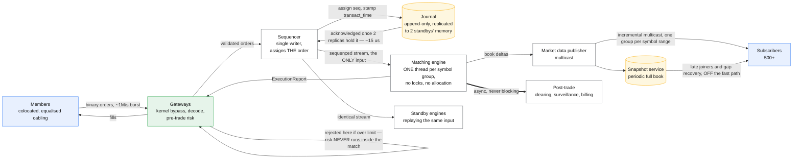
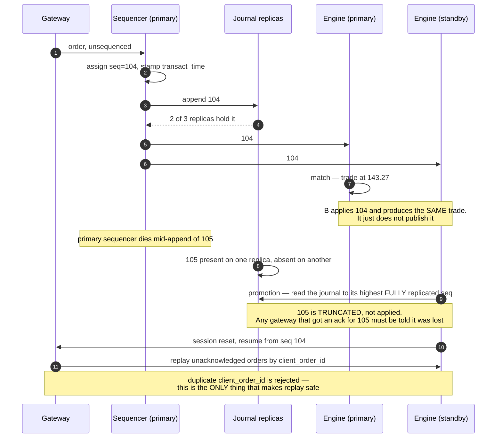

# Design a stock exchange

> Orders in, trades out, price-time priority, and a market data feed everyone trusts.
> **The hard part:** every instinct the rest of this folder trained — shard it, replicate it,
> make it eventually consistent — is wrong here. Correctness is a *total order* over one
> symbol's orders, and the fastest way to get a total order is one thread that never shares
> anything.

## 1. Clarify

| Question | Assumed answer |
|---|---|
| Order types? | Limit, market, immediate-or-cancel, fill-or-kill, plus cancel and cancel-replace. Stop orders live *outside* the matching engine |
| Matching rule? | **Price-time priority**: best price first, then earliest arrival. Pro-rata exists in some markets — ask, do not assume |
| Latency target? | **Tick-to-trade p99 under 100 µs** inside the exchange, measured gateway-in to gateway-out |
| Fairness? | Same-priced orders match in arrival order, and arrival is defined by the **sequencer**, not by a wall clock on a gateway |
| Durability? | No acknowledged order may be lost. A trade, once published, is final |
| Market data? | Level 2 (aggregated book) public feed, plus full order-by-order for members who pay |
| Hours? | Continuous session with opening and closing auctions. Auctions use a different algorithm |
| Regulatory? | Full audit trail, clock sync to a stated tolerance, kill switches, post-trade reporting |

**Non-goals:** clearing and settlement (T+1, a separate system), custody, market surveillance
beyond capturing the data it needs, the broker's own risk engine.

## 2. Requirements

**Functional**
- Accept, amend and cancel orders over a session-based protocol
- Match continuously under price-time priority; emit executions
- Publish market data: incremental updates plus periodic snapshots
- Pre-trade risk: per-member limits, price collars, self-trade prevention
- Halts, auctions, and a kill switch per member

**Non-functional**

| Target | Value |
|---|---|
| Tick-to-trade | p99 < 100 µs, p99.99 < 1 ms. **The tail is the product** |
| Determinism | The same input sequence must produce byte-identical output on any replica |
| Durability | Journal the sequenced input before acting on it |
| Fairness | No member may gain priority through connection placement beyond published, equalised cabling |
| Throughput | 1M orders/s burst on the busiest symbol group; 100M orders/day |
| Recovery | Standby promoted and caught up in seconds, with no gap and no duplicate |

> [!info] The requirement that kills the usual answer
> **Determinism.** It rules out thread pools, wall-clock reads inside matching, hash-map
> iteration order, floating-point prices and anything that consults a network during a match.
> Every one of those is a source of divergence between the primary and the replica that is
> supposed to be able to take over.

## 3. Estimates

```
Orders:      100M/day over a 6.5 h session ≈ 4,300/s avg
Peak:        open and close carry ~30% of volume in ~5% of the time
             → ~1M/s burst on the hottest symbol group
Order size:  ~100 B binary (not FIX text — FIX is ~10x and parses slower)
Ingress:     1M/s × 100 B = 100 MB/s = 800 Mbps. Comfortable on a 25 Gbps NIC
Book memory: 5,000 symbols × ~10k resting orders × ~64 B = ~3.2 GB. Fits in RAM.
             THIS is why the engine is in-memory: the entire market is small
Market data: 1 update per book change, fanned out to ~500 subscribers
             1M/s × 500 = 500M messages/s if done naively  ← multicast, or you are dead
Journal:     100 MB/s sequenced input, 6.5 h = 2.3 TB/day, kept for years
Latency budget at 100 µs:
             NIC + kernel bypass    ~5 µs
             gateway decode + risk  ~10 µs
             sequencer              ~10 µs
             match                  ~1 µs      ← the actual matching is the cheap part
             journal (to memory of 2 replicas) ~15 µs
             encode + egress        ~10 µs
             ——— leaves ~50 µs of slack, which one GC pause eats entirely
```

> [!warning] The number that reframes the problem
> **Matching costs about a microsecond.** Everything else in the budget is IO, serialisation and
> coordination. A candidate who optimises the matching algorithm has misread the case; the work
> is in never touching the kernel, never allocating, and never blocking.

## 4. API / contract

```
NewOrderSingle   { client_order_id, symbol, side, qty, price, tif, member_id }
CancelRequest    { client_order_id, orig_client_order_id, symbol }
CancelReplace    { ... }  — treated as cancel + new, LOSING time priority.
                            Say this: members design around it

→ ExecutionReport { exec_type, order_id, exec_id, seq, symbol, last_qty,
                    last_px, leaves_qty, cum_qty, transact_time }

Market data (separate feed, separate multicast group):
  Incremental { seq, symbol, side, price_level, qty, action: add|change|delete }
  Snapshot    { seq, symbol, full book }   — published periodically for late joiners
```

**Every message carries a sequence number, and the sequence number is the contract.** A client
detecting a gap does not ask for a repeat inline — it switches to the snapshot feed and
re-synchronises. Building recovery into the primary feed would put a slow subscriber's problem
on the fast path for everyone.

**`client_order_id` is the idempotency key.** A duplicate is rejected, never matched twice.
`transact_time` is stamped by the sequencer, never by the gateway — two gateways disagree by
more than a matching interval.

## 5. Data model

| Entity | Key | Stored as | Serves |
|---|---|---|---|
| Order book | `symbol` | price levels in an array indexed by ticks; FIFO intrusive list per level | The match. **In memory only** |
| Resting order | `order_id` | node in that list + open-addressed index | Cancel in O(1) |
| Sequenced input | `seq` | append-only journal, replicated | The source of truth, and the only one |
| Execution | `exec_id` | derived — emitted, journalled downstream | Post-trade, audit |
| Member state | `member_id` | in memory, rebuilt from the journal | Risk limits, kill switch |

```
Prices are INTEGER TICKS, never floats. 143.27 is 14327.
A float price is a fairness bug: two engines can disagree about equality.

Price level array: index = (price - min_price) / tick_size
  → best bid/ask is a scan from a cached pointer, not a tree walk
  → the whole book for one symbol fits in a few cache lines' worth of hot levels
```

**The database is not in the request path, and that is the design.** The order book is state
derived from the sequenced input log. Persist the *input*, not the *state*
([event sourcing](../patterns/distributed-transactions.md) in its strictest form). Recovery is
replay; a standby is a replica replaying the same input; an audit is the log itself. If you find
yourself writing "and then we write the order to Postgres", you have added 200 µs and a
divergence source to save nothing.

## 6. Architecture



### Deep dive A — one thread, and why that is the fast answer

The matching engine for a symbol group is **a single thread with no locks, no allocations and no
syscalls in the hot loop**. This is counterintuitive until you write down what the alternatives
cost:

| Approach | Why it loses |
|---|---|
| Lock the book, many threads | Uncontended lock ~20 ns, contended ~1 µs+, and the tail is unbounded. The book is the contention |
| Shard by symbol across threads | This *is* the answer — but each shard is still single-threaded. Symbols are independent; orders within a symbol are not |
| Lock-free data structures | Still shares cache lines. False sharing on a hot price level costs more than the match |
| Actor model / queues between stages | Each hop is a cache miss. The design already has exactly one hop, the sequencer |

The supporting discipline is what actually gets you the tail:

- **Pre-allocate everything.** Object pools for orders and executions. A GC pause of 10 ms is
  100× the entire latency budget, so on a managed runtime the goal is zero garbage in the loop,
  not a faster collector.
- **Busy-spin, do not block.** A thread that parks costs microseconds to wake. Pin it to an
  isolated core and burn the CPU — you are buying determinism with electricity, and it is cheap.
- **Mechanical sympathy.** Contiguous arrays over pointer-chasing trees; the hot price levels
  stay in L1/L2. A tree-based book is asymptotically fine and practically slower.
- **No wall-clock reads in matching.** Time comes from the sequencer, in the input. Read the
  clock inside the loop and two replicas diverge.

### Deep dive B — the sequencer, and what failover really costs



The uncomfortable answer an interviewer is looking for: **you cannot have zero-gap failover and
sub-100 µs acknowledgement without replicating before acknowledging.** Acknowledge after two
replicas hold the input and failover is clean. Acknowledge locally first and you are fast until
the day you are wrong, publicly, about a trade.

**Only the primary publishes.** Standbys compute identical output and discard it — which is also
your continuous correctness check: diverging output between primary and standby means a
non-determinism bug, and you want to find it on a Tuesday rather than during a failover.

### Deep dive C — market data fanout without melting

- **One multicast group per symbol range**, so a subscriber joins only what it wants. Unicast
  fanout to 500 subscribers turns one book change into 500 sends inside the latency budget; it
  is not survivable.
- **Conflation for slow consumers is a product decision, not a network one.** A Level 1 feed may
  conflate to "latest top of book"; a Level 2 incremental feed may not, because gaps break the
  reconstruction.
- **Snapshots on a separate channel**, published on a cycle. Recovery never touches the
  incremental path.
- **Publish to every subscriber in the same instant, as far as the hardware allows.** Staggered
  fanout is a fairness complaint and, in several jurisdictions, a regulatory one. Switch-level
  replication, equal cable lengths, published methodology.

### Deep dive D — the things that are not the matching engine

- **Pre-trade risk in the gateway**, never in the match. Per-member notional and rate limits,
  price collars (reject an order 20% through the book — the fat-finger guard), self-trade
  prevention. A risk check that calls a service is a risk check in the wrong place: limits are
  replicated to the gateway and refreshed out of band.
- **Stop and trailing orders live in an order-management layer** that watches market data and
  injects a plain limit order when triggered. Putting conditional logic in the book makes the
  book non-deterministic with respect to time.
- **Auctions are a different algorithm.** Collect orders without matching, compute the single
  price that maximises executable volume, cross at that price. Say this; do not attempt it at a
  whiteboard.

## 7. Scale & failure

| Breaks first at 10x | Fix |
|---|---|
| One symbol group's single thread | Split the group. Symbols are independent, so this scales linearly — up to one thread per symbol |
| Sequencer throughput | It does almost nothing per message by design; the limit is the replicated append. Batch the journal write, never the sequencing |
| Market data fanout | More multicast groups, finer symbol ranges, hardware replication in the switch |
| Journal disk | Sequential and predictable. 2.3 TB/day is a capacity plan, not an engineering problem |

| Component fails | Blast radius | Degraded behaviour |
|---|---|---|
| A gateway | Its members disconnect | Reconnect to another; unacknowledged orders replayed by `client_order_id` |
| Sequencer | The whole venue, briefly | Standby promoted at the highest fully replicated seq; sessions reset |
| Matching engine | One symbol group | Standby already at the same seq takes over; no replay of external input needed |
| A journal replica | None | Continue on the remaining majority; repair in the background |
| Market data publisher | Subscribers blind | Snapshot channel carries them until incrementals resume. Trading does **not** halt — but say clearly that a venue matching while participants cannot see it is a regulatory conversation, not a technical one |
| Network partition between primary and standbys | Split-brain risk | **Fail closed.** Two matching engines publishing conflicting trades for one symbol is unrecoverable. Halt the symbol group and resolve from the journal |

**The halt is a feature.** Every other case in this folder degrades; an exchange stops. A venue
that keeps matching in an ambiguous state produces trades it must later bust, which is worse for
every participant than five minutes of closure.

## 8. Ops & cost

- **SLO:** tick-to-trade p99 < 100 µs and p99.99 < 1 ms, measured with hardware timestamps at
  the network tap — not with application logs, which cost more than the thing they measure.
- **Alert on:** latency percentiles per gateway (a single slow member is often a single bad
  connection), sequence gaps on the market data feed, journal replication lag, standby output
  divergence from the primary, risk rejections by member and reason.
- **Rollout:** no rolling upgrade of the matching engine during a session. Deploy between
  sessions, and validate by **replaying yesterday's full journal through the new binary and
  diffing every execution**. Determinism is what makes that test possible, and it is the single
  strongest argument for the whole architecture.
- **Cost:** small fleet, expensive per node. Dozens of machines, not thousands — colocated, with
  kernel-bypass NICs, isolated cores and precision time. The dominant costs are the data centre
  cross-connects and the regulatory apparatus, not compute.
- **First thing I'd cut:** the order-by-order public feed. Level 2 aggregated covers most
  subscribers at a fraction of the bandwidth.

**Also mention, briefly:** clock synchronisation. Regulators specify a maximum divergence from
UTC and require timestamps at a stated granularity. PTP with hardware timestamping, not NTP —
and the timestamp that matters legally is the sequencer's, which is one more reason the
sequencer exists.

## On AWS and Azure

An exchange is the case where "run it in the cloud" deserves a straight answer: **the core
matching engine of a regulated venue is normally colocated bare metal**, because the tail
latency, the NIC, the clock and the cable lengths are all product. What follows is what you get
if you build it in a cloud anyway — which is exactly what a crypto venue, an internal crossing
network or a simulation environment does.

| | AWS | Azure |
|---|---|---|
| **The service** | EC2 in a **cluster placement group**, ideally nested under a **precision time placement group**; ENA with enhanced networking; FSx or instance store for the journal; a self-managed multicast overlay, since VPC does not carry multicast | VMs in a **proximity placement group** with **accelerated networking**; premium SSD v2 or local NVMe for the journal; likewise no native multicast |
| **What you configure** | Placement group strategy, instance type (identical across the group), an On-Demand Capacity Reservation *inside* the placement group, enhanced networking, core isolation in the guest | Proximity placement group with an explicit `intent` listing every VM size, an optional single `zone`, accelerated networking, availability set or zone choice |
| **The default that bites** | **A cluster placement group cannot span Availability Zones.** The colocation that buys the latency is the same thing that removes multi-AZ availability — you are choosing between p99 and AZ redundancy, and the standby that survives an AZ loss is by definition not in the fast group. Adding instances later, or mixing instance types, "increases your chances of getting an insufficient capacity error" | **A single proximity placement group cannot span zones** — the same trade, stated by Microsoft as "if latency is your first priority, put VMs in a proximity placement group and the entire solution in an availability zone. But, if resiliency is your top priority, spread your instances across multiple availability zones." Worse, **planned maintenance can silently un-align a group**: colocation status becomes `Not aligned`, latency degrades, and nothing errors |
| **What it costs you** | Enhanced-networking instances inside a cluster placement group get **up to 10 Gbps for single-flow traffic, versus 5 Gbps outside one** — so the gain is real but per-flow, and traffic to the internet or over Direct Connect is **capped at 5 Gbps regardless**. Microsecond-accurate timestamping needs a precision time placement group for PTP hardware clock access; the standard NTP endpoint is not in the same league | An `intent` that no single datacentre can satisfy fails with **`OverconstrainedAllocationRequest`**, and elastic scaling inside a PPG can fail with **`AllocationFailure`** — capacity, not throughput, is the operational risk. Intent "does not provide any capacity reservation or guarantee" |

Both clouds hand you the same bargain in the same words: **colocation or zone redundancy, pick
one.** That is the honest cloud answer for this case, and stating it is worth more than a
plausible-sounding architecture that quietly assumes you can have both.

## In an LLM deployment

Nothing a language model does belongs within a microsecond of the matching engine — the budget
is 100 µs end to end and a single forward pass is four orders of magnitude larger. The places it
genuinely fits are all *around* the venue, reading the journal rather than sitting in the path:

- **Surveillance.** Spoofing, layering and wash trading are pattern-recognition problems over
  the order-by-order stream. A model flags candidates for human review; it does not halt a
  member. The same discipline this corpus applies to
  [the review queue](../06-ml-cases/ml-monitoring-and-eval.md) applies here — a hallucinated
  market-abuse finding has a legal consequence.
- **Member support and post-trade reconciliation.** "Why was my order rejected at 14:03:12?" is
  answerable from the journal, and a model reading a deterministic audit log is on firm ground
  precisely because the log is complete.
- **Replay test generation.** Determinism means yesterday's journal is a perfect regression
  suite; a model is useful for *generating adversarial order sequences* to replay against a
  candidate build, where a wrong guess costs a failed test and nothing else.

The rule worth stating: an exchange is built so that its behaviour is reproducible from an
input log. Anything whose output is not reproducible from that log — a model included — belongs
outside the boundary, consuming the log rather than contributing to it.

## Referenced by

- [Backend cases index](README.md)
- [Question bank](../07-drills/question-bank.md)

## Sources

- Mechanisms in this corpus: [tail latency](../fundamentals/tail-latency.md),
  [consensus — Raft and Paxos](../fundamentals/consensus-raft-paxos.md),
  [queueing theory basics](../fundamentals/queueing-theory-basics.md),
  [idempotency](../fundamentals/idempotency.md),
  [log vs queue](../fundamentals/log-vs-queue.md)
- Neighbouring case: [payments and ledger](payments-ledger.md) — the other case where a wrong
  answer is a financial event rather than a retry
- Local book: Alex Xu, *System Design Interview* vol. 2 ch. 13 — Stock Exchange

Cloud claims in §On AWS and Azure (all verified 2026-09-23):

- [AWS — placement strategies for your placement groups](https://docs.aws.amazon.com/AWSEC2/latest/UserGuide/placement-strategies.html) — a cluster placement group cannot span multiple Availability Zones; enhanced-networking instances inside one get up to 10 Gbps single-flow versus 5 Gbps outside; internet and Direct Connect traffic limited to 5 Gbps; adding instances later or mixing instance types increases the chance of an insufficient capacity error
- [AWS — placement groups for your Amazon EC2 instances](https://docs.aws.amazon.com/AWSEC2/latest/UserGuide/placement-groups.html) — precision time placement groups provide PTP hardware clock access for microsecond-accurate synchronisation and hardware packet timestamping
- [Azure — proximity placement groups](https://learn.microsoft.com/en-us/azure/virtual-machines/co-location) — a single proximity placement group cannot span zones; `OverconstrainedAllocationRequest` and `AllocationFailure` conditions; intent provides no capacity reservation or guarantee; planned maintenance can leave a group `Not aligned`; use with accelerated networking for lowest latency
