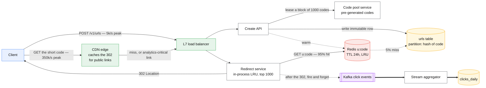
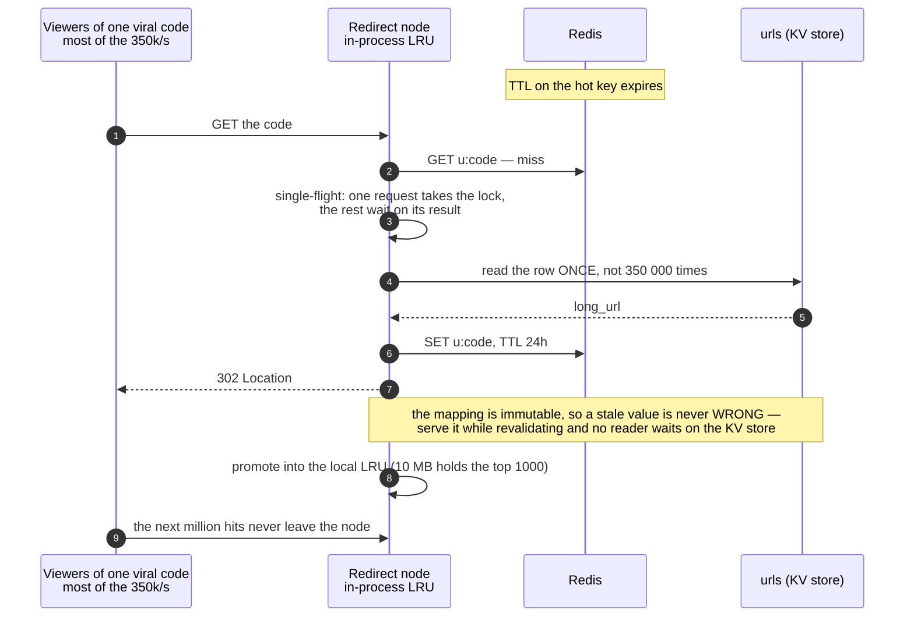

# Design a URL shortener

> TinyURL/bit.ly: long URL in, short code out, redirect on visit.
> **The hard part:** it looks trivial, so you're graded on rigour — ID generation, cache
> strategy, and whether you spot that this is a 100:1 read-heavy problem with a hot-key tail.

## 1. Clarify

| Question | Assumed answer |
|---|---|
| Custom aliases? | Yes, optional, must be unique |
| Expiry? | Optional TTL; default never |
| Analytics on clicks? | Yes — count + basic dimensions, async, eventual |
| Scale? | 100M new URLs/day, 100:1 read:write |
| Short code length/charset? | Base62, as short as possible |
| Can codes be guessable? | Not for private links — need unguessable option |
| Redirect type? | 302 by default (keeps analytics), 301 as an option |

**Non-goals:** link preview/unfurling, spam classification (mentioned, not designed), billing.

## 2. Requirements

**Functional**
- Create short URL (optionally custom alias, optionally TTL)
- Redirect short → long
- Click analytics (counts by day, referrer, country)

**Non-functional**

| Target | Value |
|---|---|
| Redirect p99 | < 50 ms (it's on the critical path of someone else's page) |
| Availability | 99.99% for redirects; 99.9% for creation |
| Durability | A lost mapping is a permanently broken link — no data loss |
| Consistency | Read-your-writes for creation; redirects may be eventually consistent |

## 3. Estimates

```
Writes: 100M/day        ≈ 1,160/s avg,   ~5k/s peak
Reads:  10B/day         ≈ 116k/s avg,   ~350k/s peak      ← the design
Storage: 100M × ~500 B  = 50 GB/day → 18 TB/year → ~55 TB with RF3
Codes:   62^7 = 3.5e12  → 7 chars covers 100 years at this rate (62^6 = 5.7e10 = ~2 years)
Cache:   hot 20% of a day's links ≈ 10 GB. Trivially fits in RAM
Egress:  redirects are tiny (~300 B headers) → 350k/s × 300 B ≈ 100 MB/s. Cheap
```

> [!info] The scary number
> 350k redirects/s. Everything else is small. This is a **cache-and-CDN problem**, not a
> database problem.

## 4. API / contract

```http
POST /v1/urls
  { "long_url": "...", "custom_alias": "sathish", "ttl_days": 30, "unguessable": false }
  → 201 { "short_url": "https://sho.rt/aB3xK9z", "code": "aB3xK9z", "expires_at": ... }
  Idempotency-Key header → same long_url + same key returns the same code

GET /{code}
  → 302 Location: <long_url>     (Cache-Control: private, max-age=0 for analytics)
  → 404 if unknown/expired
  → 410 if deliberately removed (takedown)

GET /v1/urls/{code}/stats?from&to  → counts by day/referrer/country
```

## 5. Data model

| Entity | Key | Partition by | Serves |
|---|---|---|---|
| `urls` | `code` (PK) | `hash(code)` | The redirect — a single-key lookup |
| `user_urls` | `(user_id, created_at)` | `user_id` | "my links" listing |
| `clicks_raw` | append-only events → Kafka | `hash(code)` | Analytics pipeline |
| `clicks_daily` | `(code, day)` | `code` | Stats API (precomputed) |

```
urls: code(PK) | long_url | user_id | created_at | expires_at | flags
```

**Why this partition key:** redirects are 99% of traffic and are always a point lookup by
code. Hashing the code spreads writes and reads perfectly evenly, and no query ever needs
a range scan over codes. A KV store (DynamoDB/Cassandra) is a natural fit; Postgres also
works to surprisingly high scale here because the query is a primary-key hit.

## 6. Architecture

Two paths that share nothing, drawn at the ratio they actually run at:



### Deep dive A — generating the code

| Option | How | Verdict |
|---|---|---|
| **Hash(long_url) truncated** | MD5/SHA → base62, take 7 chars | Collisions need a check-and-retry loop; same URL→same code (may be undesirable per-user) |
| **Random 7 chars** | CSPRNG, insert with `IF NOT EXISTS` | Simple, unguessable, retry on collision. Collision probability stays negligible until the space is ~1% full |
| **Counter + base62** | Global counter, encode | Shortest codes, sequential → **guessable and leaks volume** |
| **Snowflake-style ID** | timestamp + machine + seq | No coordination, sortable, but ~11 base62 chars |
| **Pre-generated key pool** | Offline generator fills a table of unused codes; API pops one | **Best of both**: short, unguessable, no collision at request time, no coordination in the hot path |

Recommendation: **pre-generated pool** for the default path, plus a random-16-char mode for
"unguessable" links. Say the pool needs a refill job with a low-watermark alert, and that
popping is a single atomic operation (or a per-node lease of a block of 1000 codes, which
removes the hot row entirely).

> [!warning] Trap
> Sequential counters. An interviewer will ask "can I enumerate everyone's links?" — with a
> counter, yes, and that's a privacy incident. Volunteer this before they ask.

### Deep dive B — the read path

One viral link is one key, and its TTL expiry is the whole risk:



- **Redis** in front, key `u:{code}` → long_url, TTL 24 h, LRU. Expected hit rate 95%+
  because link popularity is heavily Zipfian.
- **Stampede protection** on the hot link: single-flight/lock-and-refresh, plus
  stale-while-revalidate. One viral link is millions of requests to one key.
- **Hot key**: replicate the entry across N Redis slots (`u:{code}:{0..9}`) or hold the top-1000
  links in an in-process LRU on every redirect node — a 10 MB local cache absorbs most of it.
- **Edge caching**: for public links, let the CDN cache the 302 for a short TTL. That moves
  the majority of traffic off your infrastructure entirely — but it also *removes the click
  event*, so either accept CDN log-based analytics or mark analytics-critical links
  no-store. State this trade explicitly; it's the interesting part of the case.
- **Negative caching** for unknown codes with a short TTL, plus a Bloom filter of existing
  codes, to stop scanning attacks from hitting the database.

### Deep dive C — analytics without slowing the redirect

Redirect responds first, then emits the event. Fire-and-forget to a local buffer → Kafka →
stream aggregator → `clicks_daily`. Never write analytics synchronously on the redirect path;
never let analytics failure fail a redirect.

## 7. Scale & failure

| Breaks first at 10x | Fix |
|---|---|
| Single hot link saturating one cache node | Key replication + local in-process LRU |
| Redis tier down → 350k/s onto the KV store | KV store sized for ~30% of peak + admission control; degrade to 503 with Retry-After rather than melt |
| Code pool exhausted | Low-watermark alert, auto-refill, length bump to 8 chars |
| Analytics pipeline lag | Redirects unaffected by design; stats page shows "as of" timestamp |

| Component fails | Blast radius | Degraded behaviour |
|---|---|---|
| Cache | Latency ↑, DB load ↑ | Serve from KV store, shed with 429 if needed |
| KV store region | Redirects fail in region | Multi-region read replicas; mappings are immutable so replication is trivially safe |
| Kafka | No analytics | Redirects unaffected; buffer locally, drop after N minutes with a metric |
| ID pool service | No new links | Redirects unaffected — the two paths share nothing on purpose |

**Immutability is the superpower here:** a mapping never changes after creation, so replicas
can never be *wrong*, only missing. That is why you can cache it forever and replicate it
everywhere without a consistency story.

## 8. Ops & cost

- **SLO:** 99.99% of redirects < 50 ms at p99, measured at the edge.
- **Alert on:** redirect error rate, cache hit ratio (< 90% is an incident), code pool depth,
  Kafka lag, 404 rate spike (scanning attack).
- **Rollout:** stateless services, canary at 1%; the KV store schema never changes because
  the row is immutable.
- **Cost:** dominated by request volume, not storage. 55 TB ≈ $5k/month; the redirect fleet
  at 350k/s is maybe 40–60 instances ≈ $10–20k/month; egress is negligible. Putting public
  links behind the CDN is the single biggest saving.
- **First thing I'd cut:** per-click raw event retention — keep 7 days raw, aggregates forever.

**Also mention, briefly:** abuse. Short links are a phishing vector. Needs a takedown path
(410), a malware/phishing check on creation (async, with a quarantine state), and rate limits
per account. Interviewers notice when you bring this up unasked.

## On AWS and Azure

| | AWS | Azure |
|---|---|---|
| **The shape** | CloudFront + a CloudFront Function for the redirect; DynamoDB for `urls`; Lambda or ECS behind API Gateway for creation; Kinesis → S3 → Athena for clicks | Front Door + Functions for the redirect; Cosmos DB for NoSQL (or Table storage) for `urls`; Functions behind APIM for creation; Event Hubs → Blob → Fabric/Synapse for clicks |
| **What you configure** | Cache policy and TTL on the 302, `ConsistentRead` on the lookup (leave it off — this is the textbook eventually-consistent read), DynamoDB on-demand vs provisioned | Front Door caching rules, Cosmos consistency level (**Session by default**; Eventual is enough here), partition key `/code` |
| **The default that bites** | A CloudFront Function is capped at **10 KB of code and 2 MB of memory**, and "restricts access to the network, file system, environment variables, and timers" — so the edge can rewrite and redirect but **cannot look a code up**. Either the mapping lives in a CloudFront KeyValueStore (**5 MB per store**, 1 KB per value) or the request goes to the origin | Cosmos DB's per-request consistency override **can only relax, never strengthen** — fine here, but it means read-your-writes on creation depends on the account-level default being Session, which it is. Don't set the account to Eventual to save RUs and then wonder why a creator gets a 404 |
| **What it costs you** | 350 k redirects/s against a **250,000 requests/second per distribution** default (adjustable) and **150 Gbps** per distribution: peak traffic needs a quota increase or a second distribution, which nobody plans for on the case that "looks trivial" | A single Cosmos logical partition is **10,000 RU/s**, so the hot-key tail this case warns about is capped per code, not per account — a viral link is a hot logical partition and the answer is the same in-process LRU the design already has |

The whole design collapses into "cache and CDN" on both clouds, exactly as the case argues — and
then the edge turns out to be the one place that cannot do a key lookup for free. That constraint,
not the database, is what decides whether the 302 is served at the edge or at the origin.

## In an LLM deployment

**It does not meaningfully change.** A URL shortener serving a model-backed product is still a
point lookup behind a CDN. The one thing worth saying: if short codes are ever *generated* by a
model — vanity aliases, say — the uniqueness check stays in the database with a conditional write,
because a model that has seen the existing codes is not an index and will collide.

## Referenced by

- [Backend cases index](README.md)
- [Question bank](../07-drills/question-bank.md)

## Sources

- Local book: Alex Xu, *System Design Interview* vol. 1 ch.8 (not in the local library — vol. 2 is at `AI/ML-Foundations/`)
- Vendor: `10-resources/vendor/system-design-primer/solutions/system_design/pastebin/`
- Primitives: [caching](../02-primitives/caching.md), [storage](../02-primitives/storage-and-databases.md), [networking](../02-primitives/networking-and-edge.md)

Cloud claims in §On AWS and Azure (all verified 2026-09-21):

- [AWS — restrictions on CloudFront Functions](https://docs.aws.amazon.com/AmazonCloudFront/latest/DeveloperGuide/cloudfront-function-restrictions.html) — no network, file system, environment variable or timer access
- [AWS — CloudFront quotas](https://docs.aws.amazon.com/AmazonCloudFront/latest/DeveloperGuide/cloudfront-limits.html) — 10 KB function size, 2 MB function memory, 5 MB key value store, 250,000 requests/s and 150 Gbps per distribution
- [Azure — Cosmos DB consistency levels](https://learn.microsoft.com/en-us/azure/cosmos-db/consistency-levels) — Session is the account default
- [Azure — manage consistency in Cosmos DB](https://learn.microsoft.com/en-us/azure/cosmos-db/how-to-manage-consistency) — per-request overrides can only relax
- [Azure — partitioning and horizontal scaling in Cosmos DB](https://learn.microsoft.com/en-us/azure/cosmos-db/partitioning-overview) — 10,000 RU/s per logical partition
