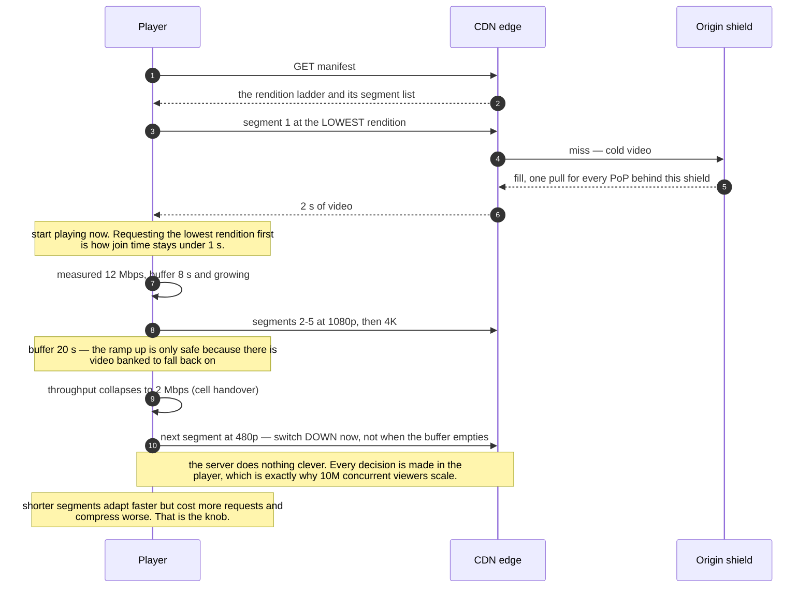

# Design video streaming

> Upload, process and stream video to millions of concurrent viewers.
> **The hard part:** it's two systems glued together — a batch **transcoding pipeline** and
> a **CDN economics** problem. The application servers are the least interesting part.

## 1. Clarify

| Question | Assumed answer |
|---|---|
| VOD, live, or both? | VOD primary; live as an extension (say how it differs) |
| Upload volume? | 500 hours/minute (YouTube-scale) |
| Viewers? | 100M DAU, 30 min average, peak 10M concurrent streams |
| Devices? | Mobile, web, TV — so multiple codecs and resolutions |
| DRM? | Yes for licensed content |
| Global? | Yes — and this decides everything |

**Non-goals:** recommendations ([../06-ml-cases/recommender.md](../06-ml-cases/recommender.md)),
comments, monetisation, content moderation.

## 2. Requirements

**Functional**
- Resumable upload of large files
- Transcode to an adaptive bitrate ladder + thumbnails + captions
- Stream with adaptive bitrate; seek; resume where you left off
- Publish/unpublish, visibility rules

**Non-functional**

| Target | Value |
|---|---|
| Start-up time (join latency) | < 1 s to first frame |
| Rebuffer ratio | < 0.5% of playback time |
| Upload → playable | < 10 min for a 10-min video |
| Availability | 99.99% playback |

## 3. Estimates

```
Ingest: 500 h/min = 30,000 h/day
   at ~1 GB/h source → 30 TB/day raw upload ≈ 350 MB/s sustained
Transcoding: ~1–2× realtime per rendition on CPU; 6 renditions per video
   30,000 h/day × 6 = 180,000 CPU-hours/day ÷ 24 = ~7,500 cores continuously  ← big
   (hardware encoders / GPU cut this several-fold)
Storage: 30 TB/day source + ~3× for all renditions ≈ 120 TB/day → 44 PB/year

Delivery: 10M concurrent × 3 Mbps avg = 30 Tbps peak                ← THE number
   30 Tbps sustained ≈ 300+ PB/month.
   At retail CDN pricing that is hundreds of millions per month, which is exactly why
   Netflix built Open Connect and put appliances inside ISPs.
```

> [!info] The scary number
> **30 Tbps of egress.** Every serious design decision here is downstream of bandwidth cost.

## 4. API / contract

```http
POST /v1/videos                 { title, visibility }  → { video_id, upload_url }
PUT  <upload_url>               (resumable, chunked, direct to object storage)
POST /v1/videos/{id}/complete   → 202  (kicks off the pipeline)
GET  /v1/videos/{id}            → { status: "processing"|"ready", renditions[], manifest_url }

GET  <manifest_url>             → HLS .m3u8 / DASH .mpd  (player picks a rendition)
GET  <segment_url>              → 2–6 s media segment    (served by CDN; this is 99.9% of traffic)
POST /v1/videos/{id}/progress   { position_s }           (batched, best-effort)
```

## 5. Data model

| Entity | Key | Partition by | Serves |
|---|---|---|---|
| `videos` | `video_id` | `hash(video_id)` | Metadata, status |
| `renditions` | `(video_id, profile)` | `video_id` | Manifest generation |
| `segments` | Object keys in blob storage | — | Content-addressed, CDN-cacheable |
| `watch_progress` | `(user_id, video_id)` | `user_id` | Resume playback |
| `view_events` | Kafka → OLAP | `hash(video_id)` | Counts, analytics, ranking signals |

Source, renditions and segments all live in object storage. The database holds only small
facts — the classic "big bytes in the object store, small facts in the database" split.

## 6. Architecture

Batch work on the left, 30 Tbps of egress on the right, and almost nothing in between:

```mermaid
flowchart LR
    up["Uploader"]
    obj[("Object store<br/>raw source, 30 TB/day")]
    orch["Pipeline orchestrator<br/>DAG per video, priority queues"]
    ck["Split by GOP<br/>independently decodable chunks"]
    tr["Transcode workers<br/>spot instances, ~7500 cores<br/>6 renditions per video"]
    pkg["Concatenate · package HLS/DASH · DRM<br/>thumbnails · captions"]
    seg[("Segments + manifests<br/>content-addressed, ~120 TB/day")]
    db[("videos · renditions<br/>small facts only")]
    sh["Origin shield"]
    cdn["CDN edge PoPs<br/>95%+ of bytes must hit"]
    pl["Player<br/>adaptive bitrate"]

    up --> |"presigned resumable upload"| obj
    obj -.-> |"object-created event"| orch
    orch --> ck
    ck ==> |"hundreds of parallel tasks, output keyed by<br/>video + rendition + chunk + pipeline version"| tr
    tr ==> pkg
    pkg --> seg
    pkg --> |"mark ready"| db
    pkg -.-> |"pre-position before a premiere"| cdn
    pl --> |"manifest, small"| cdn
    pl --> |"2-6 s segments — 30 Tbps peak, 99.9% of traffic"| cdn
    cdn --> |"miss"| sh
    sh --> |"one pull per shield, not one per PoP"| seg
    pl -.-> |"measure throughput and buffer,<br/>pick the next segment's rendition"| pl

    classDef client fill:#e8f0fe,stroke:#4285f4,color:#111
    classDef edge fill:#e6f4ea,stroke:#34a853,color:#111
    classDef service fill:#fff,stroke:#5f6368,color:#111
    classDef store fill:#fef7e0,stroke:#f9ab00,color:#111
    classDef cache fill:#fce8e6,stroke:#ea4335,color:#111
    classDef queue fill:#f3e8fd,stroke:#a142f4,color:#111
    classDef external fill:#f1f3f4,stroke:#9aa0a6,color:#111,stroke-dasharray:4 3
    class up,pl client
    class cdn,sh edge
    class orch,ck,tr,pkg service
    class obj,seg,db store
```



### Deep dive A — the transcoding pipeline

- **Split by GOP (group of pictures)** so chunks are independently decodable, then transcode
  chunks in parallel and concatenate. A 1-hour video becomes hundreds of tasks that finish in
  minutes instead of hours. This is the core trick.
- **DAG orchestration** with per-task retries, idempotent tasks (output keyed by
  `(video_id, rendition, chunk, pipeline_version)`), and a dead-letter path. Re-running a
  failed chunk must be free and safe.
- **Priority queues**: a 30-second short from a large creator ahead of a 4-hour archive
  upload. Otherwise one big job blocks the queue.
- **Spot instances** for transcoding — it's interruptible batch work, so 60–90% cheaper.
  Checkpoint at chunk granularity so an interruption loses seconds.
- **Codec ladder**: H.264 for compatibility, plus HEVC/AV1 for bandwidth savings on devices
  that support them. AV1 is ~30% smaller than H.264 at the same quality — at 30 Tbps that's
  an enormous saving, paid for in encoding CPU. **That trade is the interesting cost decision
  in this case**, and it's worth stating explicitly: spend compute once, save bandwidth
  forever.
- **Per-title / per-scene encoding**: an animated cartoon needs far fewer bits than a sports
  broadcast. Optimising the ladder per title saves double-digit percentages of total egress.

### Deep dive B — adaptive bitrate delivery



- Video is cut into 2–6 s segments at each quality level; the manifest lists them.
- The **player** decides: measure recent throughput and buffer occupancy, pick the next
  segment's rendition. Server does nothing clever — the intelligence is at the edge, which is
  why this scales.
- Start-up: request the lowest rendition first for instant playback, then ramp up. That's how
  you hit < 1 s join time.
- Trade-off: shorter segments = faster adaptation and lower live latency, but more requests
  and worse compression efficiency.

### Deep dive C — CDN economics

- **95%+ of bytes must come from cache.** Popularity is extremely long-tailed (Zipf), so a
  small hot set serves most traffic — cache hit rates are naturally high if you don't fragment
  the cache key.
- **Origin shield**: a mid-tier between edge PoPs and origin, so a cold popular video doesn't
  pull from origin once per PoP.
- **Pre-positioning**: for predictable demand (a big premiere), push content to edges *before*
  release. Netflix's model taken to its conclusion is putting appliances inside ISP networks,
  where the marginal delivery cost approaches zero.
- **Multi-CDN** with a steering layer: cost arbitrage plus resilience against one CDN having
  a bad day.

**Live streaming differs on:** ingest via RTMP/SRT, transcode in real time (no batch
parallelism available — latency is the constraint), LL-HLS/WebRTC for low latency, and DVR
windows. Say those four differences and you've covered it.

## 7. Scale & failure

| Breaks first at 10x | Fix |
|---|---|
| Transcoding fleet cost | Hardware/GPU encoders, per-title ladders, transcode-on-demand for the cold tail |
| Egress | More AV1, better ABR ladder, ISP-embedded caches, multi-CDN arbitrage |
| Origin load on a viral video | Origin shield, pre-warm, request coalescing at the edge |
| Storage of unwatched renditions | Generate the long tail lazily on first request |

| Component fails | Blast radius | Degraded behaviour |
|---|---|---|
| One CDN degraded | Rebuffering in a region | Steer to a second CDN (multi-CDN is the mitigation, not a luxury) |
| Transcoding backlog | Uploads take longer to publish | Priority queues; publish the 720p rendition first and add the rest later |
| Metadata service down | Can't browse | Playback of an already-loaded manifest continues — decoupling wins |
| DRM licence server down | Protected content unplayable | Cache licences client-side with a validity window |

## 8. Ops & cost

- **SLO:** join time p95 < 1 s; rebuffer ratio < 0.5%; upload→ready p95 < 10 min.
  Note these are **player-side** metrics — server-side metrics cannot see them.
- **Alert on:** rebuffer ratio by CDN/region/ISP, join time, transcode queue depth and
  failure rate, cache hit ratio, playback error codes by device class.
- **Rollout:** ladder/codec changes are A/B tested on QoE metrics (rebuffer + join time +
  bitrate delivered), never shipped on theory.
- **Cost:** egress ≫ transcoding ≫ storage. A 1% improvement in compression efficiency is
  worth more than the entire application tier.
- **First thing I'd cut:** the highest rendition for content nobody watches at 4K, and
  renditions for the cold tail generated on demand instead of eagerly.

## On AWS and Azure

| | AWS | Azure |
|---|---|---|
| **The shape** | S3 (source) → AWS Elemental MediaConvert on a queue → S3 (renditions) → MediaPackage for packaging/DRM → CloudFront. Step Functions or your own orchestrator drives the per-video DAG | Blob Storage (source) → **a partner encoder** (Bitmovin, MediaKind or Ravnur, all Azure Marketplace) → Blob → Front Door. Durable Functions drives the DAG |
| **What you configure** | Queue type (on-demand vs reserved), the ABR ladder as output groups, segment duration, cache policy and TTLs at the edge | Whatever the partner exposes; on Azure the encoding tier is a vendor contract, not a service configuration |
| **The default that bites** | CloudFront's **150 Gbps and 250,000 requests/second per distribution** are per-distribution defaults. 30 Tbps is **200 distributions' worth of the default quota** before you ask for an increase — the egress number is not just a bill, it is a quota conversation | **Azure Media Services was retired on 30 June 2024.** "Media Services will stop streaming on all your Azure Media Services accounts and your accounts will become read-only for approximately 90 days until they are automatically deleted", and "the creation of new Media Services accounts is blocked in all Azure regions." Azure Media Player was retired the same day |
| **What it costs you** | The 50 GB maximum cacheable file size means segments, not files — which you were doing anyway; and Origin Shield is the thing that keeps a cold popular title from stampeding the origin | **There is no first-party Azure equivalent for encode, package or DRM.** The answer is a partner product, and Microsoft's own retirement guide says partner solutions "will be available in a more limited set of regions than Media Services." Azure Video Indexer survived the retirement and covers analysis, not delivery |

This is the sharpest "no direct equivalent" in the whole set, and it is worth knowing cold: a video
pipeline on Azure in 2026 is Blob + Front Door + a third party, and an interviewer who last touched
this in 2023 will expect you to name a service that no longer exists. On AWS the pipeline is
first-party end to end, and the design question is still the one this case makes — the CDN
economics, not the encoder.

## In an LLM deployment

Video is where the model work is *batch and enormous*, and the pipeline this case already describes
is the right place to put it. Every upload already fans out into six renditions; add transcription,
translation, chapter segmentation, thumbnail selection and moderation, and you are running five
models per video on the same GOP-split, spot-instance, priority-queued fabric. The arithmetic is
brutal in a familiar way: **30,000 hours/day of ingest** means 30,000 hours/day of ASR even at
faster-than-realtime, and that cost lands next to the 7,500 cores of transcoding rather than
instead of it.

Two structural consequences. **The transcode DAG becomes the ML DAG** — same orchestrator, same
retries, same idempotency key (the content hash), and the same rule that a failed stage must not
block publication, because "processing" with captions pending is a better product than no video.
And **the derived artefacts are the search index**: transcripts are what make a 44 PB/year video
library retrievable at all, which is the only place in this design where a model changes what the
product *is* rather than what it costs.

Nothing about delivery changes. Segments are still bytes on a CDN, and 30 Tbps of egress is
untouched by any of it.

## Referenced by

- [Backend cases index](README.md)
- [Engineering blogs and case studies](../10-resources/engineering-blogs.md)
- [Question bank](../07-drills/question-bank.md)
- [Repo index](../../INDEX.md)

## Sources & further reading

- Local book: Alex Xu vol. 1 ch.14 (YouTube)
- Repo notes: [../../basic/advanced/designs%20%28needs%20update%20as%20we%20go%29/Video%20Stream/](../../basic/advanced/designs%20%28needs%20update%20as%20we%20go%29/Video%20Stream/)
- [Netflix Open Connect](https://openconnect.netflix.com/en/)
- [Netflix — per-title encode optimization](https://netflixtechblog.com/per-title-encode-optimization-7e99442b62a2)
- Primitives: [networking-and-edge](../02-primitives/networking-and-edge.md), [cost-engineering](../02-primitives/cost-engineering.md)

Cloud claims in §On AWS and Azure (all verified 2026-09-21):

- [AWS — CloudFront quotas](https://docs.aws.amazon.com/AmazonCloudFront/latest/DeveloperGuide/cloudfront-limits.html) — 150 Gbps and 250,000 requests/second per distribution (both adjustable), 50 GB maximum cacheable file size
- [AWS — CloudFront Origin Shield](https://docs.aws.amazon.com/AmazonCloudFront/latest/DeveloperGuide/origin-shield.html) — request consolidation at the origin
- [Azure — Azure Media Services retirement guide](https://learn.microsoft.com/en-us/previous-versions/azure/media-services/latest/azure-media-services-retirement) — 30 June 2024 retirement, read-only then deletion after ~90 days, new account creation blocked in all Regions, partner migration path (Bitmovin, MediaKind, Ravnur), Azure Media Player retired, Video Indexer not retired
