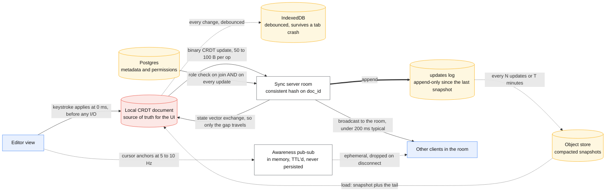
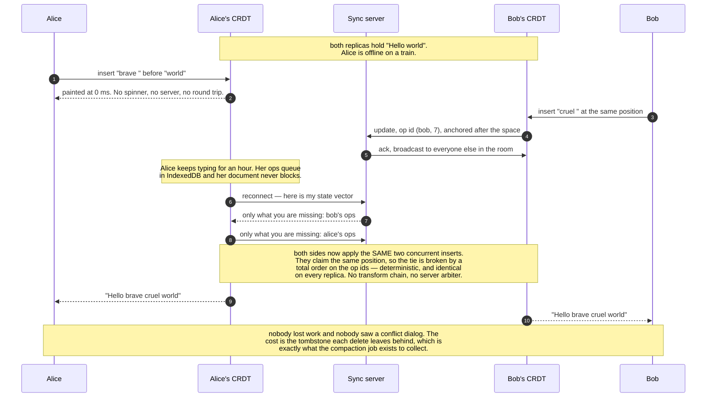

# Design a collaborative editor

> Multiple people editing the same document simultaneously, seeing each other's cursors,
> working offline and merging cleanly.
> **The hard part:** concurrent edits converging to the same state on every client, with no
> lost work — CRDT vs OT, and everything that follows from the choice.

## 1. Clarify

| Question | Assumed answer |
|---|---|
| Document type? | Rich text (say how a design canvas differs — object tree, not a sequence) |
| Concurrent editors per doc? | Typically 2–10; support up to ~50 |
| Offline editing? | Yes, then merge on reconnect |
| History/undo? | Per-user undo (not global), plus version history |
| Comments/presence? | Yes — cursors, selections, avatars |
| Access control? | Per-document roles: owner/editor/commenter/viewer |

**Non-goals:** the rendering engine, file export, real-time video/audio.

## 2. Requirements

**Functional**
- Concurrent editing converges: all clients end at the same document
- Live cursors and selections
- Offline edits merge on reconnect without loss
- Per-user undo/redo; version history

**Non-functional**

| Target | Value |
|---|---|
| Local edit → visible locally | **0 ms — always optimistic and local-first** |
| Edit → other clients | < 200 ms typical |
| Convergence | Guaranteed, not best-effort |
| Document size | Up to ~10 MB of content; history bounded |

## 3. Estimates

```
Per keystroke: 1 op ≈ 50–100 B. Typing at 5 chars/s → ~500 B/s per editor
10 editors × 500 B/s = 5 KB/s per document — trivial bandwidth
   BUT: 10 editors × 10 recipients = 100 messages/s of fan-out per doc
Cursor/presence updates at 20 Hz would be 200 msg/s per doc → throttle to 5–10 Hz
Server: 1M concurrent docs × 3 avg editors = 3M WebSocket connections → ~30–60 nodes
Storage: doc + ops log. Ops grow forever → periodic snapshot + compaction is REQUIRED
```

> [!info] The scary number
> Not bandwidth — **CRDT metadata growth**. A naive sequence CRDT stores an entry per
> character ever inserted, including deleted ones (tombstones). A document typed and edited
> for a year can be 10–100x its visible size without compaction.

## 4. API / contract

```
WebSocket:
  → {type:"update",   doc_id, update: <binary CRDT update>, client_id}
  ← {type:"update",   doc_id, update, origin_client}
  → {type:"awareness", cursor:{anchor, head}, user:{name,color}}   # ephemeral, never stored
  ← {type:"sync",     state_vector}                                # what I have / what I need

REST:
  GET  /v1/docs/{id}/snapshot          → latest compacted state + version
  GET  /v1/docs/{id}/history?from=&to= → named versions for restore
  POST /v1/docs/{id}/permissions
```

**Sync protocol** (Yjs-style, worth naming): client sends its *state vector* (what it has);
the peer replies with only the missing updates. That's how a client that was offline for a
week reconnects in one round trip instead of replaying everything.

## 5. Data model

**CRDT vs OT — the decision the whole case rests on:**

| | **OT** (Operational Transform) | **CRDT** |
|---|---|---|
| How | Ops are transformed against concurrent ops so order stops mattering | Data types mathematically designed so any order converges |
| Needs a server? | **Yes** — a central authority to order and transform | No — peer-to-peer capable |
| Offline | Hard: long divergence means deep transformation chains | Natural — merge whenever |
| Complexity | Transform functions are notoriously easy to get subtly wrong | Complexity is in the library, not your code |
| Metadata | Small | Larger (IDs and tombstones per element) |
| Used by | Google Docs (historically), older editors | Figma, Linear, Yjs/Automerge ecosystem, most new products |

> [!tip] Say this
> "I'd take a CRDT — specifically a Yjs-style sequence CRDT — because offline support is a
> hard requirement and OT's central-server assumption fights that. The cost is metadata
> growth, which I'd control with snapshots and tombstone GC. If offline weren't required and
> the document were plain text, OT with a central server is lighter."

**Rich text specifics:** text is a sequence CRDT (YATA/RGA family); formatting is stored as
marks/attributes over ranges rather than nested nodes, because nested-tree merges are far
harder to converge sensibly. Block-level structure (paragraphs, lists) is a separate
list CRDT of blocks.

**Design canvas (Figma-style)** differs: objects in a map CRDT keyed by object ID, with
last-write-wins per property. Two people moving the same rectangle → one wins, and that's
acceptable; two people typing in the same paragraph → both must survive. **Different data,
different CRDT.** Making that distinction unprompted is a senior signal.

**Storage:**
```
docs(doc_id, snapshot_binary, snapshot_version, updated_at)
updates(doc_id, seq, update_binary, client_id, ts)     -- append-only since last snapshot
versions(doc_id, version_id, label, snapshot_ref)      -- named restore points
```
Compaction: every N updates or T minutes, merge updates into a new snapshot and drop the
merged updates. Without this, load time grows linearly forever.

## 6. Architecture

The same picture with what crosses each edge. Note that nothing on the render path waits
on the network:



Routing: all clients of one document must reach the **same room** — consistent hashing on
`doc_id` to a sync node, with the session registry pattern from
[../03-backend-cases/chat-messaging.md](../03-backend-cases/chat-messaging.md).

### Deep dive A — local-first rendering

The local CRDT is the UI's source of truth. A keystroke applies locally and paints
immediately; the network is a background replication detail. This is why these apps feel
instant even on bad connections — and it's the architectural point, not a performance tweak.

Consequences: no request/response spinner for edits, no "saving..." blocking state, and the
server can be down for a minute without the user noticing (offline queue drains later).

### Deep dive B — offline and reconnect

- Persist the local CRDT to IndexedDB on every change (debounced) so a browser crash loses
  nothing.
- On reconnect: exchange state vectors, apply the diff both ways, converge. No conflict
  dialog — that's the entire promise of the CRDT. What that actually looks like for two
  people who typed into the same gap an hour apart:


- Edge case to raise: **permission revoked while offline.** The client happily merged edits it
  is no longer allowed to make. The server must reject the update and the client must show a
  meaningful "your changes couldn't be saved — export a copy" path. Volunteering this
  scenario scores well because it's the case CRDTs *don't* solve.

### Deep dive C — presence and cursors

- Separate channel, ephemeral, never written to durable storage.
- Throttle to 5–10 Hz and interpolate client-side; 60 Hz cursor updates are 6x the traffic
  for no perceptible gain.
- Cursor positions must be expressed as **CRDT positions (relative anchors)**, not integer
  offsets — an offset is wrong the instant someone types above you, and that's the bug that
  makes remote cursors jump around.

### Deep dive D — frontend performance

- Virtualize long documents: render only the visible blocks + overscan.
- Batch CRDT updates per animation frame rather than re-rendering per keystroke.
- Keep the CRDT work off the main thread (web worker) for large documents — this is an **INP**
  problem, and INP is what a heavy editor fails.
- Undo is per-user: track your own origin IDs and invert only your own operations. Global
  undo (undoing someone else's typing) is a product bug, not a feature.

## 7. Scale & failure

| Breaks first at 10x | Fix |
|---|---|
| CRDT document size (tombstones) | Snapshot + GC tombstones older than the offline window |
| Broadcast fan-out on a busy doc | Batch updates per 50 ms window; cap editors per doc |
| Sync node memory (docs held in memory) | Evict idle docs to storage; rehydrate on join |
| Presence traffic | Throttle harder, aggregate server-side |

| Component fails | Blast radius | Degraded behaviour |
|---|---|---|
| Sync server down | No collaboration | **Editing continues offline**; queue drains on reconnect. The killer feature of local-first |
| Persistence down | Updates not durable | Warn the user, keep IndexedDB copy, block only on explicit "publish" |
| Two clients diverge (library bug) | Silent corruption — the worst outcome | Periodic checksum of document state across clients; alert and force resync on mismatch |

## 8. Ops & cost

- **SLO:** local edit latency ~0; remote propagation p95 < 200 ms; **zero divergence
  incidents** (measured by state checksums, not by user reports).
- **Alert on:** divergence checksum mismatches, snapshot compaction lag, document load time
  p95 (the symptom of un-compacted history), WebSocket reconnect rate.
- **Rollout:** CRDT format changes are the dangerous ones — updates must stay
  backward-compatible for at least as long as your offline window, because an offline client
  will reconnect with old-format updates.
- **Cost:** sync nodes (memory per open document) and storage of snapshots + history.
  Compaction cadence is the main cost knob.
- **First thing I'd cut:** history retention depth and presence update frequency.

## On AWS and Azure

| | AWS | Azure |
|---|---|---|
| **The shape** | AppSync Events (or an API Gateway WebSocket API) as the update bus, one channel per document; snapshots in S3; the op log and `permissions` in DynamoDB; Lambda/ECS for auth and compaction | Azure Web PubSub as the update bus, **one group per document**; snapshots in Blob Storage; op log and permissions in Cosmos DB; Container Apps for auth and compaction |
| **What you configure** | Channel namespace per document, publish authorisation, and whether awareness rides the same channel as updates (it should not) | Group membership on connect via the `connect` event handler, `sendToGroup` mode so cursor traffic never round-trips to your server |
| **The default that bites** | **25 publish requests per second per WebSocket connection, and that quota is not adjustable.** A client that emits one message per keystroke plus awareness at 20 Hz exceeds it on its own — which is why Yjs-style clients batch updates on a debounce. The platform makes batching mandatory, not optional | Web PubSub **stores no customer data**, and a frame is capped at **1 MB**. Snapshot, history, state-vector sync and replay are entirely yours; the service is a fan-out pipe with groups and nothing else. A client back from a week offline gets its diff from *your* store, never from the bus |
| **What it costs you** | Outbound is metered in **5 kB units** and capped at **1,000,000 metered events/second per API** (adjustable); subscription payload is capped at **240 KB** and a publish payload at **1.2 MB**, so a compacted snapshot cannot be pushed down the update channel — it is a signed URL to object storage | A Cosmos logical partition is capped at **20 GB**. An op log keyed by `doc_id` therefore has a hard ceiling, and this case's tombstone-growth problem stops being a performance concern and becomes a write failure. Compaction is a correctness requirement, not an optimisation |

The awareness/update split that the protocol section recommends on semantic grounds is enforced by
the platform on both clouds: cursor traffic at 20 Hz against a 25 publish/s per-connection limit
cannot share a channel with edits. Throttle presence to 5–10 Hz and put it on its own channel —
which is what the case already says, arriving as a quota rather than as taste.

## In an LLM deployment

An AI collaborator in a CRDT document is **just another client with a client ID**, and that is the
whole design. It connects, receives updates, and applies its own ops through the same merge
function — so its suggestions converge with a human's concurrent typing for free, undo is scoped
to its client ID like anyone else's, and "revert the AI's changes" is a per-origin undo you already
built. Bolting a model onto the server as a privileged writer that rewrites the document throws all
of that away.

Two properties of a model client break assumptions the human case does not have. **It is slow and
bursty**: a generation takes seconds and then arrives as a large insert, so the 25 publish/s and
1.2 MB payload limits above are hit by *one* client producing a page of text, and the op must be
chunked. **It reads the whole document every time**: at 10 MB of content that is far past a
comfortable prompt, so the model sees a window — the current block plus a retrieved summary — and
a 10 MB document is never one context.

The operational trap is presence. An assistant that appears as a cursor is a cursor that can move
while a human is typing in the same paragraph; both edits survive, which is exactly right for a
sequence CRDT and exactly wrong for the user's mental model. Show its work as *suggestions* in a
separate layer until accepted, and only then merge — a product decision the data structure will
happily let you skip.

## Referenced by

- [Consistency and consensus](../02-primitives/consistency-and-consensus.md)
- [Design file sync / object storage (Dropbox, S3-like)](../03-backend-cases/object-storage-sync.md)
- [Engineering blogs and case studies](../10-resources/engineering-blogs.md)
- [Frontend cases index](README.md)
- [Question bank](../07-drills/question-bank.md)
- [Quorums and anti-entropy](../fundamentals/quorums-and-anti-entropy.md)

## Sources

- [Figma — How Figma's multiplayer technology works](https://www.figma.com/blog/how-figmas-multiplayer-technology-works/)
- [Yjs docs](https://docs.yjs.dev/) · [Automerge](https://automerge.org/)
- [Martin Kleppmann — CRDTs: the hard parts](https://martin.kleppmann.com/2020/07/06/crdt-hard-parts-hydra.html)
- Primitives: [consistency-and-consensus](../02-primitives/consistency-and-consensus.md), [networking-and-edge](../02-primitives/networking-and-edge.md)

Cloud claims in §On AWS and Azure (all verified 2026-09-21):

- [AWS — AppSync endpoints and quotas](https://docs.aws.amazon.com/general/latest/gr/appsync.html) — 25 publish requests/s per connection (not adjustable), 2,000 connections/s per API, 10,000 inbound events/s, 1,000,000 outbound metered events/s at 5 kB each, 1.2 MB publish payload, 240 KB subscription payload, 200 subscriptions per client connection
- [Azure — Web PubSub service internals](https://learn.microsoft.com/en-us/azure/azure-web-pubsub/concept-service-internals) — groups, `sendToGroup` mode, 1 MB maximum frame size
- [Azure — Web PubSub FAQ](https://learn.microsoft.com/en-us/azure/azure-web-pubsub/resource-faq) — the service stores no customer data
- [Azure — partitioning and horizontal scaling in Cosmos DB](https://learn.microsoft.com/en-us/azure/cosmos-db/partitioning-overview) — 20 GB per logical partition
