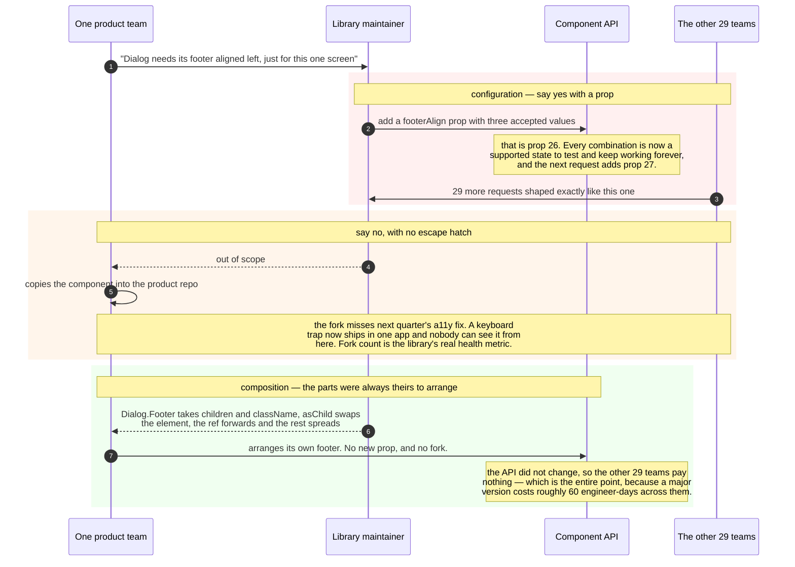

# Design a component library / design system

> A shared UI library used by 30 teams across 5 products.
> **The hard part:** API design and versioning. The code is easy; the contract is forever,
> and every escape hatch you don't provide becomes a fork.

## 1. Clarify

| Question | Assumed answer |
|---|---|
| Consumers? | 30 teams, one framework (React), multiple products with different brands |
| Theming? | Yes — multi-brand, light/dark, density modes |
| Release model? | Independent versioning, consumers upgrade on their own schedule |
| A11y target? | WCAG 2.2 AA, guaranteed by the library so product teams inherit it |
| SSR support? | Required |
| Design tool integration? | Tokens shared with Figma |

**Non-goals:** the visual design language itself, a component-per-page-layout catalogue.

## 2. Requirements

**Functional**
- ~40 primitives (button, input, select, dialog, table, toast…) that compose
- Themeable by token override, not by CSS overrides in consumer code
- Documented with live examples and accessibility notes
- Codemods for breaking changes

**Non-functional**

| Target | Value |
|---|---|
| Tree-shakeable | Importing `Button` must not pull in `DataTable` |
| Bundle cost | Each component's cost documented and budgeted |
| A11y | Every component keyboard-operable and screen-reader tested |
| Stability | Semver, deprecation window ≥ 2 minor versions |

## 3. Estimates

Not a traffic problem — the numbers that matter are organisational:

```
40 components × 30 teams = the blast radius of any breaking change
Upgrade cost: if a major version takes each team 2 days → 60 engineer-days per major.
   → Ship majors rarely; ship codemods; keep old APIs working through a deprecation window.
Bundle: a 40-component barrel export without tree-shaking can add 300 KB to every app.
```

> [!info] The real constraint
> **Migration cost across 30 teams.** Design the API so you rarely need a breaking change,
> because each one costs more than the feature that motivated it.

## 4. Interface — the actual deliverable

**Composition over configuration.** A component with 25 boolean props is a component nobody
can extend:

```tsx
// bad: every new need adds a prop, forever
<Dialog title="..." showClose hasFooter footerAlign="right" size="lg" ... />

// good: compound components — consumers arrange the parts
<Dialog>
  <Dialog.Trigger asChild><Button>Open</Button></Dialog.Trigger>
  <Dialog.Content>
    <Dialog.Title>Delete project?</Dialog.Title>
    <Dialog.Description>This cannot be undone.</Dialog.Description>
    <Dialog.Footer>
      <Dialog.Close asChild><Button variant="ghost">Cancel</Button></Dialog.Close>
      <Button variant="danger" onClick={onDelete}>Delete</Button>
    </Dialog.Footer>
  </Dialog.Content>
</Dialog>
```

Rules for every component API:

| Rule | Why |
|---|---|
| **Controlled and uncontrolled** both supported (`value` / `defaultValue` + `onChange`) | Consumers' state models differ; forcing one causes forks |
| **Forward the ref and spread the rest** (`...props`) | Without it, nobody can attach analytics, tooltips, or a test id |
| **`asChild` / render prop escape hatch** | Lets a consumer swap the rendered element instead of forking the component |
| **Styling hook** (`className`, data-attributes for states) | Overrides without `!important` wars |
| States are props (`loading`, `error`, `empty`) | The states exist whether you model them or not |
| No business logic, no data fetching | The moment a component fetches, it's coupled to one product |
| Polymorphic `as` only where genuinely needed | Types get expensive fast |

Those rules exist because of one recurring conversation, and its three possible endings:



## 5. Data model — design tokens

```
primitive tokens   →  semantic tokens        →  component tokens
--blue-600            --color-action-primary    --button-primary-bg
--space-4             --space-inline-md         --button-padding-x
```

Three layers so a rebrand changes the *primitive* layer and everything downstream follows.
Consumers reference **semantic** tokens only; referencing a primitive (`--blue-600`) directly
is the thing that breaks dark mode and multi-brand.

- Source of truth in JSON, generated into CSS custom properties + TS types + Figma variables
  (Style Dictionary-style pipeline). One source, three outputs — no drift between design and
  code.
- Theming at runtime via CSS custom properties on a `[data-theme]` root, not by shipping N
  compiled stylesheets. Dark mode then costs zero JavaScript and no flash of wrong theme.

## 6. Architecture

One source, three outputs, and two gates:

```mermaid
flowchart LR
    tok[("tokens.json<br/>primitive, then semantic, then component")]
    bld["Style Dictionary build"]
    css["CSS custom properties<br/>on a data-theme root"]
    ts["TS constants and types"]
    fig["Figma variables"]
    hl["Headless layer<br/>focus trap, roving tabindex, ARIA"]
    st["Styled components<br/>~40 primitives"]
    ci["CI gates<br/>axe, visual diff, bundle budget, SSR test"]
    pkg[["Published package<br/>subpath exports, sideEffects false"]]
    docs["Docs site and Storybook<br/>live examples, a11y notes"]
    teams["30 teams, 5 products"]

    tok ==> |"one source of truth"| bld
    bld --> |"runtime theming, zero JS, no wrong-theme flash"| css
    bld --> |"typed token names"| ts
    bld --> |"so design and code cannot drift"| fig
    css --> |"semantic tokens only, never a primitive"| st
    hl --> |"wrap it, do not reimplement it"| st
    st --> |"every interactive component"| ci
    ci ==> |"a11y or size regression blocks the release"| pkg
    st --> docs
    pkg --> |"importing Button must not pull in DataTable"| teams
    pkg -.-> |"a codemod ships with every breaking change"| teams
    teams -.-> |"fork count is the health metric"| st

    classDef service fill:#fff,stroke:#5f6368,color:#111
    classDef store fill:#fef7e0,stroke:#f9ab00,color:#111
    classDef queue fill:#f3e8fd,stroke:#a142f4,color:#111
    classDef client fill:#e8f0fe,stroke:#4285f4,color:#111
    class bld,hl,st,ci,docs service
    class tok,css,ts,fig store
    class pkg queue
    class teams client
```



**Build a headless layer or adopt one?** Reimplementing focus traps, roving tabindex, dialog
semantics and combobox keyboard behaviour correctly is months of work and a permanent
maintenance cost. Wrapping an established headless primitive library and owning the styling
is the lazy, correct answer — say so, and say what would make you build your own
(a genuinely unusual interaction model, or a hard no-dependency policy).

**Packaging:** one package with proper `exports` and `sideEffects: false` (tree-shaking
works) is simpler than 40 packages; 40 packages give finer versioning at high release
overhead. Recommend one package + subpath exports unless teams genuinely need independent
component versions.

## 7. Adoption & failure (the "scale" section for a library)

| Breaks first as adoption grows | Fix |
|---|---|
| Teams fork components to add one prop | Escape hatches (`asChild`, `className`, slots) so forking is never the cheapest path |
| Version skew — 30 teams on 12 versions | Long deprecation windows, codemods, an adoption dashboard per team/version |
| Bundle bloat in consumer apps | Per-component size budgets enforced in CI, tree-shaking verified by test |
| Design and code drift | Tokens generated from one source; visual regression tests in CI |
| Breaking change lands badly | Semver + changesets, canary releases, a migration guide with a codemod for every breaking change |

| Failure | Symptom | Mitigation |
|---|---|---|
| A11y regression | Keyboard trap in a dialog reaches production in 30 apps | axe in CI + manual screen-reader test on every interactive component before release |
| Visual regression | Subtle spacing change across all products | Snapshot/visual diffs gating merges |
| SSR mismatch | Hydration errors in consumer apps | SSR test app in CI; no `window` access at module scope |

## 8. Ops & cost (governance)

- **SLO-equivalent:** ≥ 90% of teams within 2 minor versions of latest; zero known a11y
  defects in released components.
- **Track:** adoption by team and version, fork count (the health metric — forks mean your
  API is too rigid), issue response time, bundle size trend.
- **Release:** changesets → automated versioning, canary on `next`, majors at most 1–2 per
  year with codemods.
- **Cost:** engineering time, and it's justified only by what it *removes* — 30 teams each
  building their own accessible dialog is the alternative. Say that: a design system is a
  cost-avoidance argument, and you should be able to make it in one sentence.
- **First thing I'd cut:** the number of components. A 40-component library nobody maintains
  is worse than 15 excellent ones.

## On AWS and Azure

| | AWS | Azure |
|---|---|---|
| **The shape** | CodeBuild/CodePipeline builds the library → **CodeArtifact** as the private npm registry with an upstream to npmjs → **Amplify Hosting** (or S3 + CloudFront) for the docs site and Storybook, one branch deployment per PR | Azure Pipelines builds → **Azure Artifacts** npm feed with an upstream to npmjs → **Azure Static Web Apps** for docs and Storybook, with preview environments per PR |
| **What you configure** | Domain and repository layout, upstream ordering (your repo first, npmjs behind it), the auth token TTL your CI uses | Feed scope (project vs organization), upstream sources, retention policies, preview-environment count |
| **The default that bites** | **1,200 requests per second using a single authentication token, and that quota is not adjustable.** Thirty teams' CI sharing one CodeArtifact token is a throttle waiting for your busiest morning; 800 read req/s from a single AWS account is the account-level companion. `PublishPackageVersion` is **10/s** — irrelevant until a monorepo release publishes 40 packages at once | **Azure Artifacts gives 2 GiB of free storage per organization**, and "when your organization reaches the 2 GiB free-tier storage limit, you won't be able to publish new packages." Forty components × every version ever published crosses that quietly, and the failure mode is a blocked release, not a bill |
| **What it costs you** | Amplify Hosting: **25 apps per Region**, **50 branches per app**, 5 GB build artifact. One preview deployment per open PR against 50 branches is a real ceiling for a library 30 teams send PRs to | Static Web Apps: **15,000 files per app on every plan**, **500 MB per environment**, and **10 preview environments** on Standard. A Storybook static build for 40 components with per-story assets reaches 15,000 files faster than it reaches 500 MB — a file *count* limit is the unusual one to plan for |
| **The odd specific** | Asset file size 5 GB, 350 assets per package version, 10 upstreams per repository | npm packages are capped at **500 MiB**, with "an additional hard limit of **375 KB** for the `package.json` file" — a generated exports map for 40 components with per-entry `types`/`import`/`require` conditions can approach it |
| **Versions** | Not documented as a count limit | **5,000 versions per package ID**, unlimited package IDs per feed — use retention policies or a long-lived library eventually stops publishing |

Neither cloud has anything to say about the actual hard part. Registry, CI and a docs host are
commodities; the API contract, the deprecation window and the codemods are not purchasable and are
where all the cost is. The one genuinely useful cloud fact is the *token* rate limit on AWS and the
*storage* limit on Azure — both are the shared-service failure this case's whole thesis is about,
arriving in the delivery pipeline instead of the API.

## In an LLM deployment

**This case does not meaningfully change for a model**, and the reason is worth one line: a
component library is a compile-time artefact, not a runtime service, so there is no inference
anywhere in it.

Two second-order effects are real enough to name. **Your API is now training data and prompt
context.** Assistants generating UI code will reach for whatever shape is most common in public
corpora, which means a consumer team's first draft uses the props your library deliberately does
*not* have. Publishing machine-readable usage — accurate TypeScript types, JSDoc on every prop, and
an `llms.txt`-style usage doc next to the Storybook — is the cheapest way to make the generated
code compile. **Codemods get easier, and migration does not.** A model is good at the mechanical
half of a breaking change and unreliable at the judgement half; the deprecation window exists
because 30 teams have to *read* the change, and that does not compress.

If a component ever does call a model — an AI-powered `<Combobox>` that ranks options — it has
violated this case's own rule that a component never fetches. Keep the model call in the consumer's
data layer and let the component take `options` like everything else.

## Referenced by

- [Frontend cases index](README.md)
- [Question bank](../07-drills/question-bank.md)
- [Repo index](../../INDEX.md)

## Sources & further reading

- [WAI-ARIA Authoring Practices Guide](https://www.w3.org/WAI/ARIA/apg/) — the reference for every interactive pattern
- [WCAG 2.2](https://www.w3.org/WAI/WCAG22/quickref/)
- Vendor: `10-resources/vendor/front-end-interview-handbook/`
- Related repo skills: `shadcn`, `frontend-design:frontend-design`, `ui-ux-pro-max:design-system`

Cloud claims in §On AWS and Azure (all verified 2026-09-21):

- [AWS — CodeArtifact endpoints and quotas](https://docs.aws.amazon.com/general/latest/gr/codeartifact.html) — 1,200 requests/s per authentication token (not adjustable), 800 read and 100 write requests/s per account, `PublishPackageVersion` 10/s, 5 GB asset size, 350 assets per package version, 10 direct upstreams, 1,000 repositories per domain, 10 domains per account
- [AWS — Amplify Hosting service quotas](https://docs.aws.amazon.com/amplify/latest/userguide/quotas-chapter.html) — 25 apps per Region, 50 branches per app, 5 domains per app, 5 GB build artifact
- [Azure — size and count limits in Azure Artifacts](https://learn.microsoft.com/en-us/azure/devops/artifacts/reference/limits) — 2 GiB free storage per organization and the publish block on reaching it, 5,000 versions per package ID, 500 MiB npm package with a 375 KB `package.json` hard limit, 20 upstreams per package type
- [Azure — quotas in Azure Static Web Apps](https://learn.microsoft.com/en-us/azure/static-web-apps/quotas) — 15,000 file count, 500 MB per environment, 2 GB total storage, 10 preview environments and 100 apps on Standard, 100 GB included bandwidth per month
