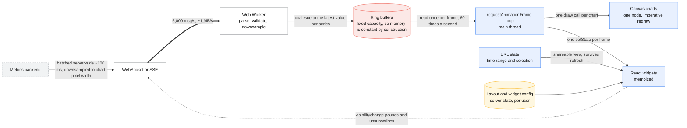
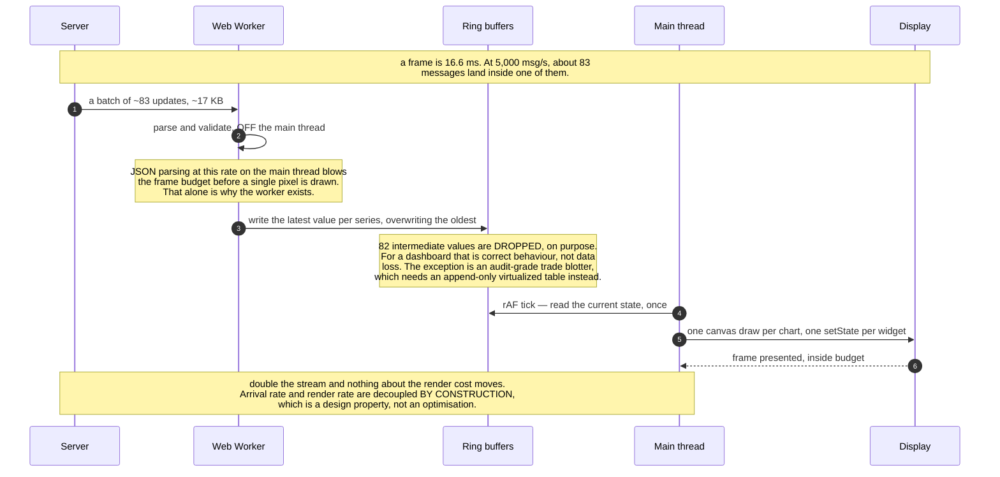

# Design a real-time dashboard (frontend)

> A trading/observability/ops dashboard: many live-updating widgets, charts over streaming
> data, thousands of updates per second arriving in a browser.
> **The hard part:** backpressure *in the browser*. The server can push far faster than the
> main thread can render, and the naive implementation locks the tab.

## 1. Clarify

| Question | Assumed answer |
|---|---|
| Update rate? | Up to 5,000 messages/s across all widgets at peak |
| Widgets per screen? | 20–50, user-arrangeable |
| History depth? | Last 1 hour live, older via query |
| Perceptual freshness needed? | ~1 s is fine for humans; sub-100 ms only for a trading price ticker |
| Multi-tab? | Yes — users open several |
| Devices? | Desktop primary, large screens, but must not melt a laptop fan |

**Non-goals:** the metrics backend
([../03-backend-cases/metrics-monitoring.md](../03-backend-cases/metrics-monitoring.md)),
alert routing.

## 2. Requirements

**Functional**
- Live-updating widgets: line/area charts, counters, tables, status grids
- Time-range control; pause/resume the stream; drag-to-zoom
- Layout persists per user; widgets configurable
- Degrade gracefully when the connection drops

**Non-functional**

| Target | Value |
|---|---|
| Frame rate | 60 fps sustained (16.6 ms budget/frame) |
| INP | < 200 ms while streaming |
| Perceived freshness | < 1 s |
| Memory | Bounded — an 8-hour session must not leak to 2 GB |

## 3. Estimates

```
5,000 msg/s × 200 B = 1 MB/s over the wire      → fine as bandwidth
   BUT: 5,000 React state updates/s = 5,000 renders/s → catastrophic
   At 60 fps you have 60 render opportunities/s. Batch ~83 messages per frame.  ← the design

Chart points: 50 charts × 3,600 points (1 h @ 1 s) = 180,000 points in memory
   SVG: one DOM node per point → 180k nodes → dead tab
   Canvas: one draw call per chart → fine                                       ← the choice
Ring buffer per series: fixed capacity, overwrite oldest → memory is constant by construction
```

> [!info] The scary number
> 5,000 updates/s against 60 frames/s. **The whole design is the decoupling between arrival
> rate and render rate.**

## 4. API / contract

```
WebSocket (or SSE if server→client only — simpler, auto-reconnects, works over plain HTTP):
  → {op:"subscribe", widgets:[{id, metric, filters, resolution}]}
  ← {op:"batch", ts, updates:[{widget_id, points:[[ts,v],...]}]}   # server batches too
  ← {op:"snapshot", widget_id, series}                             # on subscribe / resubscribe

REST: GET /v1/query?metric=&from=&to=&step=     # historical, on zoom-out
      GET/PUT /v1/dashboards/{id}               # layout persistence
```

Ask the server to **batch on its side** (one frame's worth per message, ~100 ms) and to
**downsample to the pixel width of the chart** — sending 3,600 points to a 600 px-wide chart
is 6x waste. Both are backend asks that the frontend design should drive; saying that shows
you think across the boundary.

## 5. Data model

| State | Where | Notes |
|---|---|---|
| Live series | Ring buffers in a plain module/store, **outside React state** | Mutated at 5k/s; React must not see every mutation |
| Render snapshot | Component state, updated once per animation frame | The only thing that triggers renders |
| Layout, widget config | Server state + local cache | Persisted per user |
| Time range, selected widget | **URL** | Shareable link to "what I'm looking at" — the killer feature of ops dashboards |

## 6. Architecture

With the rates on the edges, the decoupling is the whole diagram:



### Deep dive A — backpressure in the browser

Four layers, all needed:

1. **Server-side batching + downsampling** — cheapest fix; never send more than the client can
   use.
2. **Worker thread parses** — JSON parsing of 5k msg/s on the main thread alone blows the
   frame budget. The worker keeps the main thread free for rendering and input.
3. **Coalesce into ring buffers** — the worker writes the latest value per series; if 80
   updates arrive between frames, only the last (or an aggregate) matters. **Dropping stale
   intermediate values is correct behaviour** for a dashboard, not data loss — say this
   explicitly, and note the exception: an audit-grade trade blotter must show every tick, so
   that widget gets a different (append-only, virtualized-table) treatment.
4. **rAF render loop** — the main thread pulls the current state once per frame. Render rate
   is now bounded by the display, not by the network.

> [!tip] Say this
> "The update rate and the render rate are decoupled by design: a worker absorbs the stream
> into ring buffers, and a `requestAnimationFrame` loop samples them 60 times a second. If
> the stream doubles, nothing about the rendering cost changes."

Also: `document.visibilityState` — pause rendering (and ideally unsubscribe) for a hidden tab.
A user with six dashboard tabs open should cost you one tab's worth of work.

One frame, at 5,000 messages a second:



### Deep dive B — chart rendering

| Technique | Points | Verdict |
|---|---|---|
| SVG (D3-style) | < ~1,000 | Great DX, accessible/inspectable, dies past a few thousand nodes |
| **Canvas 2D** | 10k–100k | **The default for live charts.** One node, imperative redraw |
| WebGL | 100k+ | Only when Canvas measurably isn't enough; big complexity cost |

Downsample for display with **LTTB (largest-triangle-three-buckets)**, which preserves the
visual shape (spikes survive) far better than naive every-Nth sampling. Naming LTTB is a
small, very specific credibility win.

Accessibility of a canvas chart: it is invisible to a screen reader. Provide a
`role="img"` with a text summary, plus a keyboard-accessible data table alternative
(`<table>` behind a "view as data" toggle). Interviewers notice when a candidate remembers
that a chart has an a11y story.

### Deep dive C — reconnection and correctness

- Exponential backoff **with jitter** on reconnect (10k dashboards reconnecting in lockstep
  after a deploy is a self-inflicted DDoS — same trap as the chat connection tier).
- On reconnect, request a **snapshot**, not a replay: for live metrics, the current state is
  what matters and gap-filling is usually wrong.
- Show connection state in the UI, and **stamp the data with "as of"**. A dashboard silently
  showing frozen numbers during an incident is worse than one showing an error — people make
  decisions from it.
- Clock skew: always render server timestamps, never `Date.now()` on the client.

## 7. Scale & failure

| Breaks first at 10x | Fix |
|---|---|
| Message parse cost | Binary protocol (protobuf/msgpack) instead of JSON; already in a worker |
| Charts on screen | Virtualize widgets — only render visible ones; pause off-screen |
| Memory growth | Fixed-capacity ring buffers (constant by construction) |
| Main-thread work | Move downsampling to the worker; OffscreenCanvas for drawing off the main thread |

| Failure | User sees | Handling |
|---|---|---|
| WebSocket drops | Stale numbers | Visible "disconnected — data as of HH:MM:SS" banner, auto-reconnect with jitter |
| One widget's query fails | Whole dashboard broken (bad) | **Per-widget error boundary** — one dead widget, not a dead page |
| Server floods faster than expected | Frozen tab | The worker + rAF architecture makes this structurally impossible; add a drop counter metric to prove it |
| Tab in background for hours | Memory/CPU burn | Pause on `visibilitychange`, resubscribe with a snapshot on return |

## 8. Ops & cost

- **SLO:** 60 fps at p95 during streaming; INP < 200 ms; data freshness indicator accurate.
- **Monitor (RUM):** dropped-frame rate, worker queue depth, messages dropped by coalescing,
  reconnect rate, memory after 1 h of use, INP by widget count.
- **Rollout:** per-widget flags; a new chart renderer ships to internal users first, gated on
  frame-rate telemetry.
- **Cost:** mostly the streaming backend (connections × message rate). The frontend's lever is
  **subscribing only to visible widgets** — an unsubscribe on scroll-away can cut server
  fan-out by more than half.
- **First thing I'd cut:** update resolution (1 s → 5 s) for widgets that aren't focused.

## On AWS and Azure

| | AWS | Azure |
|---|---|---|
| **The shape** | AppSync Events (channel per widget subscription) or an API Gateway WebSocket API for the live stream; API Gateway + Lambda for the historical `/query`; dashboards in DynamoDB; the SPA on CloudFront | Azure Web PubSub (group per widget subscription) for the live stream; APIM + Functions for `/query`; dashboards in Cosmos DB; the SPA on Static Web Apps or Front Door |
| **What you configure** | Channel namespaces, per-connection subscription set, and **how much the server batches before it publishes** | Groups joined on connect, `sendToGroup` for server-pushed batches, event handler only for control messages |
| **The default that bites** | **Outbound is metered in 5 kB units**: "one metered event equals 5 kB of delivered event." Sending 5,000 unbatched 200-byte messages per second bills as 5,000 metered events; batching a frame's worth into one 16 KB message bills as 4. The batching this case does for the *main thread* turns out to be the same batching that governs the bill | An API Gateway WebSocket connection is killed at **7,200 seconds** and that quota cannot be raised, so an 8-hour dashboard session reconnects at least four times. Every reconnect needs the `snapshot` path in §4 — it is not an edge case, it is scheduled |
| **What it costs you** | **10,000 inbound events/second per API** and 1,000,000 outbound metered events/s (both adjustable), **2,000 connections/second per API**, and **25 publish requests/second per client connection** — the last one caps interactive widgets that publish, not just subscribe | Web PubSub caps a frame at **1 MB** and **stores no customer data**, so the snapshot a reconnecting client needs comes from your query API, never from the bus. Replay is not a feature you can turn on |
| **Where the design already agrees** | Server-side batching and downsampling to the chart's pixel width are asks the platform rewards twice: fewer metered events out, fewer messages for the Worker to parse | Same, plus 1 MB per frame is a real cap on "send me the last hour on resubscribe" — page it |

The case argues for server-side batching on frontend grounds (5,000 renders/s is fatal) and both
clouds independently make it a cost and a quota decision. That convergence is the thing to say: the
batching boundary is not a client optimisation, it is the contract between three systems.

## In an LLM deployment

Nothing about the 5,000 msg/s hot path should involve a model — the whole design exists to keep the
main thread free, and an inference call is orders of magnitude slower than a frame. Where it lands
is the parts that are already human-paced.

**Natural-language query** is the obvious one and the one with a real failure mode: the model
translates "p99 latency for checkout, last 4 hours, by region" into a PromQL/SQL query, and then
that query has to be *validated and cost-bounded* before it runs, because a generated
`query_range` over 13 months is a denial of service against the backend in
[metrics-monitoring](../03-backend-cases/metrics-monitoring.md). Parse it, cap the time range and
the series count, and show the user the query you are about to run.

**Anomaly narration** — "error rate tripled at 14:02, correlated with the deploy" — is a batch job
whose output is a small annotation on a chart, generated at most every few seconds and streamed
through the same widget channel as everything else. It reuses the ring buffers, which is the point:
the model sees the downsampled series a chart already computed, not the 5,000 msg/s firehose. At
one summary per widget per 30 seconds across 50 widgets that is 100 calls/minute, which fits a
modest quota; per-message inference at 5,000/s does not fit any.

The honest caveat for an ops tool: a narrated anomaly that is wrong during an incident costs more
than no narration. Show the evidence next to the sentence, and never let it move a threshold.

## Referenced by

- [Frontend cases index](README.md)
- [Question bank](../07-drills/question-bank.md)

## Sources

- [web.dev — optimize long tasks](https://web.dev/articles/optimize-long-tasks), [Web Workers](https://developer.mozilla.org/en-US/docs/Web/API/Web_Workers_API)
- [LTTB downsampling paper (Steinarsson, 2013)](https://skemman.is/handle/1946/15343)
- [MDN — OffscreenCanvas](https://developer.mozilla.org/en-US/docs/Web/API/OffscreenCanvas)
- Backend counterpart: [../03-backend-cases/metrics-monitoring.md](../03-backend-cases/metrics-monitoring.md)

Cloud claims in §On AWS and Azure (all verified 2026-09-21):

- [AWS — AppSync endpoints and quotas](https://docs.aws.amazon.com/general/latest/gr/appsync.html) — outbound metered in 5 kB events, 1,000,000 outbound/s and 10,000 inbound/s per API, 2,000 connections/s per API, 25 publish requests/s per connection (not adjustable)
- [AWS — API Gateway endpoints and quotas](https://docs.aws.amazon.com/general/latest/gr/apigateway.html) — WebSocket connection duration 7,200 s (not adjustable), 600 s idle timeout
- [Azure — Web PubSub service internals](https://learn.microsoft.com/en-us/azure/azure-web-pubsub/concept-service-internals) — groups, `sendToGroup`, 1 MB maximum frame
- [Azure — Web PubSub FAQ](https://learn.microsoft.com/en-us/azure/azure-web-pubsub/resource-faq) — the service stores no customer data
