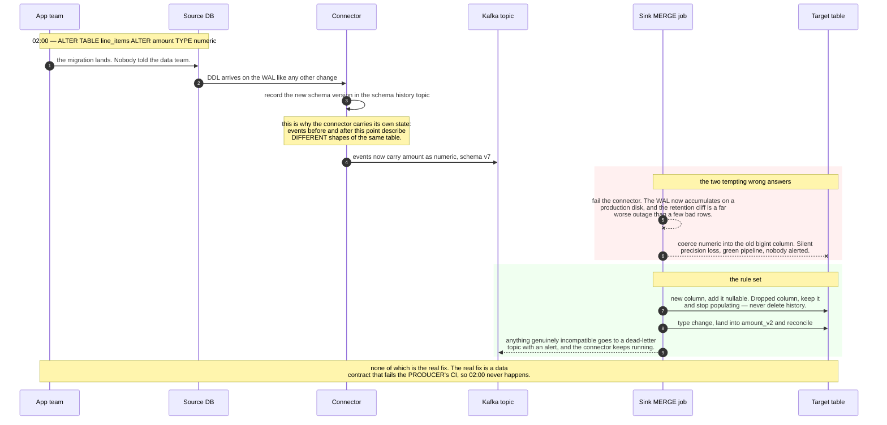

# Design a CDC pipeline

> Replicate 200 tables from production Postgres/MySQL into the lakehouse, continuously,
> without touching the application and without breaking when someone runs a migration.
> **The hard part:** the snapshot-to-stream handover, upsert semantics on an append-oriented
> lake, and surviving schema changes you don't control.

## 1. Clarify

| Question | Assumed answer |
|---|---|
| Sources? | 20 Postgres + 5 MySQL databases, ~200 tables total |
| Freshness? | < 5 min for analytics; < 1 min for a few operational tables |
| Deletes? | Must propagate (GDPR + correctness) |
| Load on production? | **Strictly bounded** — this is someone else's production database |
| Schema changes? | Frequent, and we don't control them |
| History? | Keep the full change history, not just current state |

**Non-goals:** the application, dual-writes, replacing the source database.

## 2. Requirements

**Functional**
- Initial snapshot of every table, then continuous change capture
- Inserts, updates and deletes reflected in target tables within the SLA
- Handle schema evolution without a pipeline outage
- Re-snapshot a single table on demand (correction path)

**Non-functional**

| Target | Value |
|---|---|
| Freshness | p95 < 5 min end to end |
| Source impact | < 5% additional load; **zero blocking locks** |
| Correctness | Target matches source; verifiable by row-count and checksum reconciliation |
| Availability | Recover from any component failure without data loss |

## 3. Estimates

```
200 tables, 5B rows total, 50M changes/day ≈ 580 changes/s avg, ~5k/s peak
Change event ~2 KB (before + after images + metadata) → ~100 GB/day into Kafka
Initial snapshot: 5B rows × 500 B = 2.5 TB, at 50 MB/s ≈ 14 hours   ← plan for it, chunk it
WAL retention on source: must exceed max connector downtime.
   At 100 GB/day of WAL, a 24 h buffer = 100 GB of disk on a production DB — negotiate this
   with the DBA before designing anything else.
```

> [!info] The scary number
> **WAL retention.** If the connector is down longer than the source retains its log, you
> cannot resume — you must re-snapshot. That single operational constraint drives the whole
> reliability design.

## 4. API / contract

Debezium-style change event (know this shape):

```json
{
  "op": "c|u|d|r",                  // create, update, delete, read(=snapshot)
  "before": { ...row... },          // null for inserts
  "after":  { ...row... },          // null for deletes
  "source": { "db":"orders","table":"line_items","lsn":42983,"ts_ms":...,"snapshot":"false" },
  "ts_ms": 1735689600000
}
```

Kafka topic per table (`cdc.orders.line_items`), **key = primary key** — which gives per-row
ordering, and makes log compaction produce a current-state snapshot for free.

## 5. Data model

| Layer | Table | Semantics |
|---|---|---|
| Bronze | `cdc_raw.<table>` | Every change event, append-only, partitioned by ingest day |
| Silver | `dw.<table>` | **Current state** — upsert/merge target, mirrors the source |
| Silver | `dw.<table>_history` | SCD Type 2: `valid_from`, `valid_to`, `is_current` |

Keeping both is deliberate: analysts want current state, but "what was this customer's plan
on the day they churned" needs history, and you cannot reconstruct history you didn't keep.

**Iceberg merge-on-read vs copy-on-write** — the key operational choice:

| | Copy-on-write | Merge-on-read |
|---|---|---|
| Write | Rewrites whole data files on update | Writes small delete + data files |
| Read | Fast | Slower — merges deletes at query time |
| Fits | Low update rate, read-heavy | **High update rate — CDC** |

Use merge-on-read for CDC targets, with **frequent compaction** to keep read amplification
bounded. That compaction schedule is not optional.

## 6. Architecture

Drawn out, the reconciliation loop back to the connector is the piece that makes this operable:

```mermaid
flowchart LR
    pg[("Postgres x 20<br/>logical replication slot")]
    my[("MySQL x 5<br/>binlog, ROW format")]
    dbz["Debezium connectors<br/>Kafka Connect cluster"]
    sh[["Schema history topic<br/>the connector's own state"]]
    k[["Kafka, one topic per table<br/>key = primary key, 200 topics"]]
    br["Bronze sink"]
    sl["MERGE job"]
    bronze[("cdc_raw tables<br/>append-only, by ingest day")]
    silver[("dw tables + SCD2 history<br/>merge-on-read")]
    cmp["Compaction + snapshot expiry"]
    rec["Nightly reconciliation<br/>row counts + sampled checksum"]
    q["Trino, warehouse, ML feature pipelines"]

    pg ==> |"WAL, under 5% added load, zero blocking locks"| dbz
    my ==> |"binlog"| dbz
    dbz -.-> |"one entry per DDL, versioned"| sh
    dbz --> |"op c/u/d/r, before + after, LSN — ~2 KB, 5k/s peak"| k
    k ==> |"every event, unchanged"| br
    br --> |"raw, replayable"| bronze
    k ==> |"keyed by PK, so per-row order holds"| sl
    sl --> |"upsert current state, close the SCD2 row"| silver
    silver --> |"read amplification stays bounded"| cmp
    cmp --> |"p95 freshness under 5 min"| q
    silver -.-> |"counts and checksums against the source"| rec
    rec -.-> |"drift over threshold triggers a per-table re-snapshot"| dbz

    classDef service fill:#fff,stroke:#5f6368,color:#111
    classDef store fill:#fef7e0,stroke:#f9ab00,color:#111
    classDef queue fill:#f3e8fd,stroke:#a142f4,color:#111
    classDef external fill:#f1f3f4,stroke:#9aa0a6,color:#111,stroke-dasharray:4 3
    class dbz,br,sl,cmp,rec,q service
    class bronze,silver store
    class k,sh queue
    class pg,my external
```



### Deep dive A — snapshot to stream, without losing or duplicating

The classic failure is a gap or an overlap between the initial snapshot and the stream.

- **Naive**: lock the table, snapshot, start streaming. Correct, and unacceptable — you just
  locked production.
- **Standard**: open the replication slot **first** (so changes accumulate from LSN X), then
  snapshot with a consistent read, then replay the stream from X. Changes during the snapshot
  are applied on top. Requires upsert-idempotent targets, which you have.
- **Incremental snapshotting (Debezium DDD-3 / watermark-based)**: chunk the table by primary
  key and interleave chunks with the live stream, using low/high watermarks to resolve
  conflicts between a chunk row and a concurrent change. **No long transaction, no lock,
  resumable, and re-snapshottable per table on demand.** This is the answer for a 2.5 TB
  source.

> [!tip] Say this
> "Incremental snapshotting by key range, interleaved with the live stream and resolved with
> watermarks. It never holds a long transaction on production, it resumes after a failure,
> and it lets me re-snapshot one table without touching the other 199."

### Deep dive B — schema evolution you don't control

Someone drops a column at 2am. The pipeline must not page you.

- Debezium keeps a **schema history topic**; events carry their schema version.
- Sink rules: **new column → add it (nullable)**; dropped column → keep it, stop populating
  (never delete history); **type change → the dangerous one**: land into a new column
  (`col_v2`) and reconcile, rather than failing or silently coercing.
- Incompatible changes route to a **dead-letter topic** with an alert instead of crashing the
  connector. A stopped connector risks the WAL-retention cliff, which is far worse than a few
  quarantined rows.
- **Data contracts** are the real fix: schema changes on replicated tables go through a review
  that includes the data team, and the producer's CI checks compatibility. Say this — it's an
  organisational answer to an organisational problem, and staff-level candidates give it.

Following one such change through, with the two tempting wrong answers marked:



### Deep dive C — deletes, tombstones and GDPR

- A delete event carries `before` and a null `after`. Apply as a delete in the current-state
  table; in the history table, close the SCD2 row (`valid_to = now`, `is_current = false`).
- **Hard delete for GDPR erasure** must reach: bronze raw events, silver current, history,
  every downstream mart, the search index, and backups. Design the deletion path *before* you
  need it — this is where append-only lakes hurt most, and Iceberg row-level deletes plus a
  documented backup expiry policy are the answer.
- **Soft deletes in the source** look like updates — don't assume `op:"d"` is the only way a
  row dies.

### Deep dive D — verification

CDC that silently drifts is worse than no CDC, because people trust it.

- Nightly reconciliation: row counts per table, plus a checksum over a sampled key range
  (`sum(hash(pk || updated_at))`) compared source vs target.
- Alert on drift; auto-trigger a per-table incremental re-snapshot when drift exceeds a
  threshold. **Having a cheap re-snapshot button is the single most valuable operational
  feature of a CDC platform.**
- Track end-to-end lag as `now - source.ts_ms` at the sink, not connector-internal metrics.

## 7. Scale & failure

| Breaks first at 10x | Fix |
|---|---|
| Single Kafka Connect worker per DB | Distributed Connect cluster, tasks per table group |
| MERGE cost on wide tables | Merge-on-read + compaction; batch merges every N minutes |
| Replication slot lag on the source | Alert on slot lag **in bytes** (this can fill the production disk and take down the app — the highest-severity failure in this whole design) |
| Topic count (200+) | Group small tables into shared topics with a table field |

| Component fails | Blast radius | Degraded behaviour |
|---|---|---|
| Connector down < WAL retention | Lag grows | Resume from stored offset; no loss |
| Connector down > WAL retention | **Cannot resume** | Re-snapshot that table (incremental, hours) — and treat as an incident |
| Source failover to a replica | LSN/binlog position changes | Connector must handle failover (`pg_failover_slots`, GTID for MySQL); may need a re-snapshot |
| Sink job fails | Target stale | Restart from checkpoint; bronze retains everything |
| Bad schema change | Quarantined events | DLQ + alert; fix mapping, replay from bronze |

## 8. Ops & cost

- **SLA:** freshness p95 < 5 min per table, published; drift = 0 verified nightly.
- **Alert on:** replication slot lag in bytes (page-worthy — it threatens production),
  end-to-end lag per table, DLQ depth, reconciliation drift, snapshot job progress.
- **Rollout:** new tables onboard through a template (connector config + sink job + tests +
  SLA entry). Onboarding a table should be a config change, not a project.
- **Cost:** Kafka storage and merge compute dominate. Levers: exclude columns nobody queries
  (especially large JSON/blob columns — often most of the bytes), longer merge intervals for
  cold tables, compaction tuning.
- **First thing I'd cut:** history (SCD2) for tables where nobody has ever queried it —
  measure before assuming.

## Referenced by

- [Cache invalidation](../fundamentals/cache-invalidation.md)
- [Data platform cases index](README.md)
- [Log vs queue](../fundamentals/log-vs-queue.md)
- [Materialized views and derived data](../patterns/materialized-views-and-derived-data.md)
- [Outbox pattern](../patterns/outbox-pattern.md)
- [Question bank](../07-drills/question-bank.md)
- [Repo index](../../INDEX.md)

## Sources & further reading

- [Debezium — incremental snapshots (DDD-3)](https://debezium.io/documentation/reference/stable/connectors/postgresql.html)
- [Netflix — DBLog: a generic change-data-capture framework](https://netflixtechblog.com/dblog-a-generic-change-data-capture-framework-69351fb9099b)
- Local book: `DE/System-Design/Designing Data Intensive Applications.pdf` — ch.11 (change data capture)
- [Apache Iceberg — row-level deletes, merge-on-read](https://iceberg.apache.org/docs/latest/)
