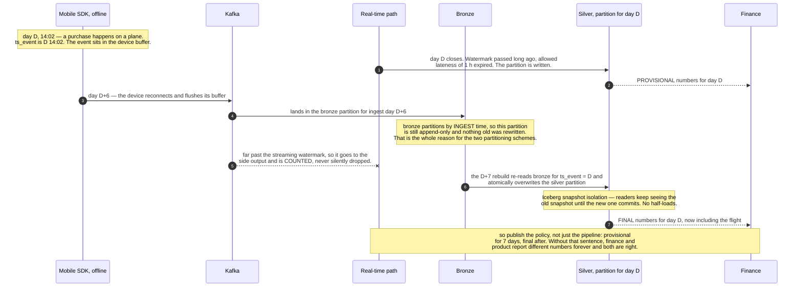

> [!info] Reprocessing now has its own page
> [patterns/backfill-and-reprocessing.md](../patterns/backfill-and-reprocessing.md) carries the
> replay recipe, idempotent partitions, restatement policy and throttling. This case study keeps
> the end-to-end pipeline.

# Design a clickstream pipeline into a lakehouse

> Every page view, click and impression from web and mobile, landing in queryable tables for
> analytics, ML features and product dashboards.
> **The hard part:** exactly-once into the table, late events, and not drowning in small files.

## 1. Clarify

| Question | Assumed answer |
|---|---|
| Volume? | 50B events/day (~600k/s average, 2M/s peak) |
| Freshness? | Dashboards: 5 min. ML training: daily. Real-time product features: seconds |
| Retention? | Raw 90 days, aggregates 3 years |
| Late events? | Mobile offline buffering — up to 7 days late |
| Consumers? | BI, ML training, real-time personalisation, finance (revenue attribution) |
| Correctness bar? | Finance needs exact counts; product analytics tolerates ±0.1% |

**Non-goals:** the SDKs, consent management UI, the ML models themselves.

## 2. Requirements

**Functional**
- Ingest events from web/mobile/server SDKs; validate against a schema registry
- Land raw immutable events; produce cleaned and aggregated tables
- Support backfill and reprocessing without double counting
- Serve seconds-fresh aggregates for real-time features

**Non-functional**

| Target | Value |
|---|---|
| Ingest availability | 99.99% — a dropped event is unrecoverable |
| Completeness | ≥ 99.99% of accepted events land in the table, provably |
| Freshness | Bronze < 1 min; silver < 5 min; gold hourly/daily |
| Cost | < $X per billion events (make it an explicit budget) |

## 3. Estimates

```
50B events/day ≈ 600k/s avg, 2M/s peak
Event ~1 KB JSON → 50 TB/day raw
   Parquet + zstd typically 5–10× → 5–10 TB/day stored, ~500 TB–1 PB for 90 days
Kafka: 600k/s × 1 KB = 600 MB/s → ~10–20 brokers with headroom, RF3
   7-day retention = 50 TB × 7 × 3 = ~1 PB of broker storage (or tiered to object storage)
Files: if we commit to Iceberg every minute × 200 partitions = 288,000 files/day
   → 250 KB average files. Query planning dies.        ← compaction is mandatory, not optional
Cost: object storage ~1 PB ≈ $23k/month, plus compute. Egress internal, so cheap.
```

> [!info] The scary number
> **288,000 files/day** from naive streaming commits. Small-file management is the operational
> heart of a streaming lakehouse, and it's what separates people who've run one from people
> who've read about one.

## 4. API / contract

```
SDK → POST /v1/collect  (batched, gzipped, ~100 events per request)
      { events: [{event_id, event_name, ts_event, user_id, session_id, props{}, sdk_version}] }
      → 202 (accept fast; validate async)  — never make the client wait on the pipeline

Schema registry: every event_name has a registered Avro/Protobuf schema.
   Producers fail CI on an incompatible change (backward compatibility enforced).
```

`event_id` is client-generated (UUID) — the deduplication key. `ts_event` is client time,
`ts_ingest` is server time; **store both**, always. Client clocks are wrong and you'll need to
detect it.

## 5. Data model

```
bronze.events_raw      -- exactly as received + ingest metadata, append-only
   partition: days(ts_ingest)          -- ingest time: guarantees a partition is "done"
silver.events          -- deduplicated, typed, PII-handled, bot-filtered
   partition: days(ts_event), bucket(user_id, 64)
gold.sessions          -- sessionised
gold.daily_metrics     -- DAU/MAU, funnels, revenue attribution
```

**Why bronze partitions by ingest time and silver by event time:** ingest-time partitions are
append-only and immutable once the hour passes, so raw is a clean, replayable log. Silver
partitions by event time because every analytical query filters on when the event *happened* —
which means a late event rewrites an old partition, and that's exactly what Iceberg's
snapshot isolation and merge-on-read exist for.

Bucketing silver by `user_id` gives cheap user-level joins and a bounded file count per
partition.

## 6. Architecture

The same pipeline with the volumes and the freshness SLA on each hop:

```mermaid
flowchart LR
    sdk["Web, mobile and server SDKs"]
    col["Edge collector<br/>validate, geo and UA enrich, consent"]
    k[["Kafka raw topic<br/>600 MB/s average, RF3"]]
    fb["Flink bronze sink<br/>checkpoint + 2PC"]
    fr["Flink real-time aggregates"]
    bronze[("bronze.events_raw<br/>partitioned by ingest day")]
    dedup["Dedupe, clean, PII<br/>event_id state, 7-day TTL"]
    silver[("silver.events<br/>by event day, bucketed on user_id")]
    gold[("gold.sessions and daily_metrics")]
    olap[("ClickHouse / Pinot")]
    maint["Compaction, snapshot expiry,<br/>orphan cleanup, manifest rewrite"]
    q["Trino and BI, ML training"]

    sdk --> |"batched gzip, ~100 events, answered 202 immediately"| col
    col ==> |"2M/s peak, ~1 KB events"| k
    k ==> |"commit IS the checkpoint, so no duplicate rows"| fb
    fb --> |"bronze under 1 min"| bronze
    k --> |"watermark ~5 min, lateness ~1 h"| fr
    fr --> |"windowed counts, seconds fresh"| olap
    bronze ==> |"immutable, so replay is always available"| dedup
    dedup --> |"silver under 5 min"| silver
    silver ==> |"dbt or Spark, incremental, gold by 06:00"| gold
    maint -.-> |"250 KB files rewritten to ~256 MB"| silver
    maint -.-> |"snapshot expiry keeps 7 days"| bronze
    silver --> q
    gold --> q

    classDef client fill:#e8f0fe,stroke:#4285f4,color:#111
    classDef service fill:#fff,stroke:#5f6368,color:#111
    classDef store fill:#fef7e0,stroke:#f9ab00,color:#111
    classDef queue fill:#f3e8fd,stroke:#a142f4,color:#111
    class sdk client
    class col,fb,fr,dedup,maint,q service
    class bronze,silver,gold,olap store
    class k queue
```



### Deep dive A — exactly-once into Iceberg

- Flink checkpoints periodically; the Iceberg sink is **transactional**: files are written
  during the interval, and the Iceberg commit happens as part of the checkpoint's two-phase
  commit. A failure before commit leaves orphan files (cleaned by an orphan-file job), never
  duplicate rows.
- Checkpoint interval is the **freshness vs file-count knob**: 1 minute gives 1-minute
  freshness and lots of small files; 5 minutes gives fewer, bigger files. Say this trade —
  it's the design decision, not a config detail.
- Kafka consumer offsets are part of the same checkpoint, so restart resumes exactly where
  the last committed snapshot ended.
- **Dedup for at-least-once producers**: the SDK retries, so the same `event_id` can arrive
  twice. Deduplicate in the bronze→silver step over a bounded window (7 days, matching the
  late-arrival window) using a state store keyed by `event_id`, with TTL.

### Deep dive B — late and out-of-order events

- Mobile clients buffer offline for up to 7 days. Watermark for real-time aggregates is
  minutes (you cannot wait 7 days for a dashboard), so:
  - Real-time path: watermark ~5 min, allowed lateness ~1 h, anything later goes to a **side
    output**.
  - Batch path: the daily silver rebuild for day D re-runs at D+1, D+3 and D+7, restating the
    partition. Iceberg makes this an atomic partition overwrite.
- **Publish a restatement policy**: "numbers for a day are provisional for 7 days, final
  after." Consumers who care (finance) read the final table; dashboards read the provisional
  one. Saying this out loud is the mature answer — the alternative is finance and product
  quietly reporting different numbers forever.
- Detect nonsense client clocks (`ts_event` far from `ts_ingest`) and quarantine rather than
  corrupting partitions from 2035.

One purchase, six days late, and every layer it touches on the way in:



### Deep dive C — small files and maintenance

Four scheduled jobs that must exist from day one:

| Job | Cadence | Purpose |
|---|---|---|
| **Compaction** (rewrite data files) | Hourly per hot partition, daily for the rest | 250 KB files → 256 MB files |
| **Snapshot expiry** | Daily | Time travel is storage; keep 7 days |
| **Orphan file cleanup** | Weekly | Remove files from failed commits |
| **Manifest rewrite** | Weekly | Keeps query planning fast as the table grows |

Without these, query latency degrades gradually for months and then everyone blames the query
engine.

### Deep dive D — schema evolution and contracts

- Schema registry with **backward compatibility** enforced in producer CI: new fields must be
  optional; removing or retyping a field fails the build.
- Iceberg column IDs mean a rename doesn't rewrite history and old readers keep working.
- Unknown fields land in a `props` map in bronze so nothing is lost while the schema catches
  up — you can always promote a map key to a column later, but you can't recover data you
  dropped.

## 7. Scale & failure

| Breaks first at 10x | Fix |
|---|---|
| Kafka storage/throughput | Tiered storage, more partitions, shorter hot retention |
| Flink state (dedup keys) | Shorter dedup window, RocksDB state backend, key sharding |
| File count / query planning | More aggressive compaction, larger checkpoint interval |
| Gold job runtime | Incremental models (dbt/SQLMesh), process only changed partitions |

| Component fails | Blast radius | Degraded behaviour |
|---|---|---|
| Collector down | **Events lost forever** — the only unrecoverable failure | Multi-AZ, autoscaled, SDK-side retry + local buffering, accept-fast/validate-async |
| Kafka partition unavailable | Ingest stalls | RF3 + producer retries; SDK buffers |
| Flink job crashes | Freshness lag | Restart from checkpoint, no data loss; alert on lag |
| Compaction falls behind | Queries slow down | Alert on file count per partition, not just on job status |
| Bad schema deployed | Garbage in silver | Registry blocks it; if it lands, replay bronze after fixing — **this is why bronze is immutable** |

## 8. Ops & cost

- **SLA per table**, published: bronze < 1 min, silver < 5 min, gold by 06:00 daily.
- **Alert on:** ingest rate anomaly vs the same hour last week (catches silent SDK breakage —
  the most common real incident), Flink checkpoint failures, consumer lag, file count per
  partition, dedup state size, row-count deviation per table.
- **Rollout:** pipeline changes run in shadow against the same input and outputs are diffed
  before cutover. Write-audit-publish (write to an Iceberg branch, validate, then commit).
- **Cost:** object storage ~$23k/month per PB, Kafka brokers, and Flink/Spark compute. Levers:
  drop unused event types (audit which columns are actually queried), zstd, cheaper checkpoint
  cadence, spot instances for batch.
- **First thing I'd cut:** raw retention 90 → 30 days for high-volume, low-value events, and
  the real-time path for metrics nobody watches live.

## On AWS and Azure

| | AWS | Azure |
|---|---|---|
| **The shape** | `/v1/collect` on API Gateway or an ALB → Kinesis Data Streams or MSK → Managed Service for Apache Flink → **S3 Tables** (Iceberg) with Glue Data Catalog; Athena, EMR and Redshift read bronze/silver/gold | Collect endpoint on Container Apps → Event Hubs (Kafka protocol) → Fabric Eventstream / Stream Analytics or Databricks Structured Streaming → Delta or Iceberg in ADLS Gen2; Fabric and Synapse read it |
| **What you configure** | Shard count or on-demand mode, checkpoint interval (the exactly-once commit boundary), Iceberg partition spec, maintenance settings per table | Throughput units or processing units, partition count, checkpoint interval, `OPTIMIZE`/`VACUUM` schedules |
| **The default that bites** | On-demand Kinesis "**have 4 MB/s of write … throughput**" to start and scales to 10 GB/s **only in N. Virginia, Oregon and Ireland — 200 MB/s everywhere else.** At 2 M events/s × 1 KB you need ~2 GB/s, so outside those three Regions on-demand mode **cannot carry this pipeline at all** and you are in provisioned mode with 2,000+ shards | Event Hubs Standard is **40 throughput units at 1 MB/s each** — 40 MB/s against a 2 GB/s peak. Premium caps at 16 PUs. This pipeline is a **Dedicated** cluster (1,024 partitions per event hub, 2,000 per CU), which is a different purchase, not a slider |
| **What it costs you** | The small-file problem is the one place a managed service genuinely removes work: "S3 continuously performs automatic maintenance operations, such as compaction, snapshot management, and unreferenced file removal." The 288,000 files/day this case fears is a table-bucket setting rather than a compaction job you staff | Compaction stays yours. Delta `OPTIMIZE` with Z-ordering, or Iceberg rewrite jobs, on a schedule you own — and the case's central operational claim (small-file management is the heart of a streaming lakehouse) stays literally true |
| **The seven-day late event** | Kinesis retention is configurable up to **8,760 hours (365 days)**, so replay for late data is a retention setting, not an archive restore | Event Hubs retention is **1 day on Basic, 7 on Standard, 90 on Premium and Dedicated** — the 7-day mobile buffering window sits exactly on the Standard limit, which is the wrong place for a limit to sit |

The two clouds diverge on which half of this pipeline is bought. AWS sells you the *table
maintenance* and leaves the stream sizing to you; Azure leaves the maintenance to you and makes the
stream sizing a tier decision you cannot grow into gradually. Either way the 2 M/s peak is a
capacity purchase that has to be made before the traffic arrives.

## In an LLM deployment

Clickstream is where the training data comes from, and two things change the moment a model is
downstream of it.

**The dedup key becomes a correctness boundary for a bill, not just for a count.** Silver already
deduplicates on client-generated `event_id`; a feature pipeline that feeds an embedding or a
generation must consume silver, never bronze, or every duplicated mobile retry is a second billed
inference. The case's ±0.1% tolerance for product analytics is not a tolerance here.

**Event-time semantics leak into training.** A 7-day-late mobile event rewrites an old event-time
partition — which is exactly what Iceberg snapshot isolation is for — but a model trained from that
partition three days ago saw a different, smaller dataset. Pin training to an **Iceberg snapshot
id**, not to a date range, and the training set becomes reproducible; without it "retrain on last
week" is a different dataset every time you run it, and nobody can reproduce a regression.

The volume reframes what is even possible. **50 B events/day is not something you send to a
model** — at any realistic per-call price that is an absurd number, and the only workable shapes are
(a) aggregate first and let the model see sessions or summaries, or (b) run a small model in the
stream for classification and reserve the large one for the tail. Sessionising 50 B events into
gold and embedding *sessions* is three orders of magnitude fewer calls for most of the signal.

## Referenced by

- [Backfill and reprocessing](../patterns/backfill-and-reprocessing.md)
- [Data platform cases index](README.md)
- [Question bank](../07-drills/question-bank.md)
- [Storage engines — B-tree vs LSM](../fundamentals/storage-engines.md)

## Sources

- [Apache Iceberg — maintenance and compaction](https://iceberg.apache.org/docs/latest/maintenance/)
- [Flink — Iceberg connector and exactly-once sinks](https://iceberg.apache.org/docs/latest/flink/)
- [The state of streaming to Apache Iceberg (2026)](https://dev.to/alexmercedcoder/the-state-of-streaming-to-apache-iceberg-in-july-2026-every-path-its-latency-and-what-to-do-when-i6p)
- Repo notes: [../../data%20engineering/AWS/Clickstream%20data%20ingestion/](../../data%20engineering/AWS/Clickstream%20data%20ingestion/)
- Local book: `DE/Fundamentals/Big Book of Data Engineering.pdf`

Cloud claims in §On AWS and Azure (all verified 2026-09-21):

- [AWS — Kinesis Data Streams quotas and limits](https://docs.aws.amazon.com/streams/latest/dev/service-sizes-and-limits.html) — on-demand starting and maximum throughput by Region, per-shard limits, retention up to 8,760 hours
- [AWS — working with Amazon S3 Tables and table buckets](https://docs.aws.amazon.com/AmazonS3/latest/userguide/s3-tables.html) — continuous automatic compaction, snapshot management and unreferenced file removal on Iceberg table buckets
- [Azure — Event Hubs quotas and limits](https://learn.microsoft.com/en-us/azure/event-hubs/event-hubs-quotas) — throughput unit definition, 40 TUs on Standard, 16 PUs on Premium, retention by tier, partitions per event hub and per CU
- [Azure — common query patterns in Azure Stream Analytics](https://learn.microsoft.com/en-us/azure/stream-analytics/stream-analytics-stream-analytics-query-patterns) — Fabric Eventstream runs the same runtime as Stream Analytics
