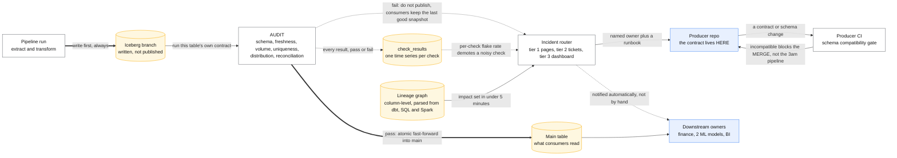
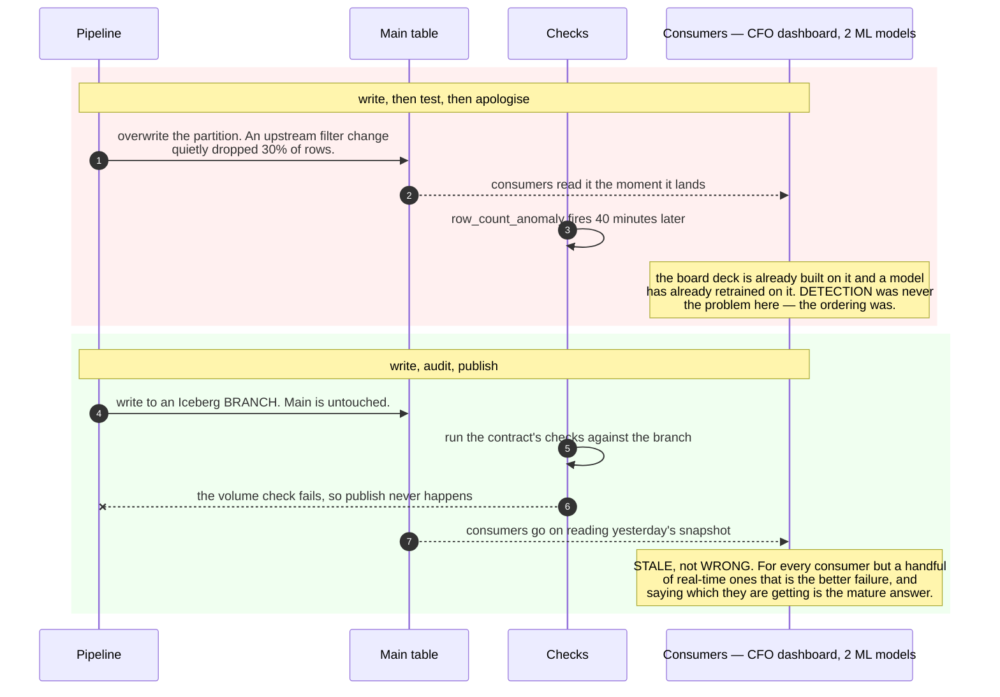

# Design data quality, contracts and SLAs

> A platform-level system that stops bad data reaching consumers, and tells you which
> upstream broke a dashboard.
> **The hard part:** it's mostly an *organisational* design. The tests are easy; getting
> producers to own their output is the system.

## 1. Clarify

| Question | Assumed answer |
|---|---|
| Scale of the estate? | 2,000 tables, 300 pipelines, 40 producing teams |
| Who consumes? | BI, ML training/serving, finance reporting, external customer-facing metrics |
| Blast radius of bad data? | Finance and customer-facing metrics = incident. Exploratory tables = annoyance |
| Do we control producers? | Same company, different teams — influence, not authority |
| Existing tooling? | Airflow/dbt, Iceberg lakehouse |

**Non-goals:** master data management, a full data catalogue product, org restructuring.

## 2. Requirements

**Functional**
- Declare expectations per table (schema, freshness, volume, semantics) and enforce them
- Block bad data from being published to consumers, not just detect it afterwards
- Column-level lineage to answer "what upstream caused this?" in minutes
- Per-table SLAs with owners and a paging path

**Non-functional**

| Target | Value |
|---|---|
| Detection latency | < 1 pipeline run after a defect appears |
| False positive rate | Low enough that people don't mute the alerts (**the real constraint**) |
| Overhead | Checks < 10% of pipeline runtime |
| Coverage | 100% of tier-1 tables; best effort below |

## 3. Estimates

Organisational, not computational:

```
2,000 tables × ~6 checks = 12,000 checks per full cycle
   If 1% flake → 120 false alarms/day → everyone mutes everything → the system is worthless
   ⇒ tier tables and only page on tier-1; everything else is a dashboard/ticket   ← the design
Tier 1 (finance, customer-facing): ~50 tables → ~300 checks. Page on these.
Check cost: a full-table uniqueness check on 5B rows is expensive → sample or use
   incremental checks on the new partition only.
```

> [!info] The scary number
> **Alert fatigue.** A quality system whose alerts get muted is worse than none, because it
> creates false confidence. Every design decision below flows from that.

## 4. API / contract

A data contract, versioned in the **producer's** repo:

```yaml
table: orders.line_items
owner: team-checkout            # a team, never a person
tier: 1                         # 1 = page, 2 = ticket, 3 = dashboard only
sla:
  freshness: 30m                # max age of the newest row
  completeness: 99.99%          # vs the source system's own count
schema:
  - {name: order_id,   type: string, nullable: false, unique: true}
  - {name: amount_minor, type: long, nullable: false, min: 0}
  - {name: currency,   type: string, accepted: [USD, EUR, GBP]}
semantics:
  grain: "one row per line item per order"
  pii: [customer_email]         # masked in silver, deleted on erasure request
tests:
  - row_count_anomaly: {vs: 7d_median, tolerance: 0.25}
  - referential: {column: order_id, references: orders.orders.id}
consumers: [finance.revenue_daily, ml.demand_forecast]   # who breaks if this breaks
```

**The contract lives with the producer and is checked in the producer's CI.** That is the
whole idea: schema changes fail the *producer's* build, not your 3am pager.

## 5. Data model

| Entity | Content |
|---|---|
| `contracts` | The YAML above, versioned |
| `check_results` | (table, check, run_id, status, observed, expected, ts) — a time series |
| `lineage_edges` | (upstream_column → downstream_column, transform_ref) |
| `incidents` | Detected defect → impact set (via lineage) → owner → resolution |
| `table_metadata` | Tier, owner, SLA, freshness, last good run |

`check_results` as a time series is what lets you do anomaly detection on the *checks*
themselves (this check has flaked 40 times this month → fix or delete it).

## 6. Architecture

Two gates, drawn: one in the producer's CI, one between the branch and the table.



### Deep dive A — write-audit-publish

The single most valuable pattern here. Instead of "write, then test, then apologise":

1. **Write** the new data to an Iceberg branch (or a staging table).
2. **Audit** — run the contract's checks against the branch.
3. **Publish** — atomically fast-forward into the main table only if checks pass.

Consumers never see bad data; they see *stale* data, which is almost always the better
failure. Say that trade explicitly: **stale beats wrong**, for every consumer except a few
real-time ones who should be told which they're getting. The same defect, both ways round:



### Deep dive B — what to check

| Class | Examples | Cost |
|---|---|---|
| **Schema** | Column exists, type, nullability | Free — metadata only |
| **Freshness** | max(updated_at) within SLA | Cheap |
| **Volume** | Row count within N% of the 7-day median for this weekday | Cheap, and catches the most real incidents |
| **Uniqueness / referential** | PK unique, FKs resolve | Expensive on big tables → run on the new partition only |
| **Distribution** | Null rate, category share, numeric range drift | Medium; the class that catches subtle upstream logic changes |
| **Reconciliation** | Totals match the source system or the finance ledger | Expensive, and non-negotiable for tier 1 |
| **Business rules** | `discount ≤ price`, `refund ≤ payment` | Cheap and high-value — ask domain experts for these |

> [!warning] Trap
> Only checking "did the job run?" Job success is not data success. The most damaging
> incidents are green pipelines producing wrong numbers — an upstream filter change that
> silently drops 30% of rows leaves every job green.

### Deep dive C — lineage and impact analysis

- Parse lineage automatically from dbt manifests, SQL ASTs and Spark logical plans. **Manual
  lineage documentation is always stale** — don't design a process that depends on it.
- Column-level, not just table-level: "revenue is wrong" should resolve to the one upstream
  column, not to a list of 40 tables.
- Use it in both directions: **upstream** for root cause, **downstream** for impact ("this
  broken table feeds the CFO's dashboard and two production ML models — notify those owners
  now"). Automating that notification is what turns a data platform from reactive to
  trustworthy.

### Deep dive D — making people actually care

The technical part is a week; this is the system.

- **Tiering** so paging is rare and meaningful.
- **Ownership at team level**, published, with a rota — orphaned tables get deprecated and
  deleted, not adopted by the platform team.
- **Producer CI checks** so most breakage never ships.
- **A quality score per team**, visible, discussed in reviews. Visibility changes behaviour
  far more reliably than a policy document.
- **Deprecation process**: mark, notify consumers, wait, delete. An estate that only grows is
  an estate nobody can keep correct.

## 7. Scale & failure

| Breaks first at 10x | Fix |
|---|---|
| Check runtime | Incremental checks on new partitions; sample big tables; parallelise |
| Alert volume | Stricter tiering, grouping, suppression during known upstream incidents |
| Lineage graph size | Column-level only for tier 1–2; table-level below |
| Contract sprawl | Templates and defaults by table type; generate, don't hand-write |

| Failure | Symptom | Mitigation |
|---|---|---|
| Checks themselves are wrong | False alarms, then muting | Track per-check flake rate; auto-demote flaky checks to non-paging |
| Quality system down | No gate | **Fail open with a loud warning** — blocking every pipeline because the checker is down is a worse outage than shipping unchecked data for an hour |
| Publish step partially applied | Consumers see half a load | Atomic branch fast-forward — this is exactly what Iceberg gives you |
| Owner left the company | Nobody responds | Team ownership, quarterly ownership audit |

## 8. Ops & cost

- **SLA:** tier-1 tables meet freshness + completeness 99.9% of days; time-to-detect < 1 run;
  time-to-notify-consumers < 5 min (automated from lineage).
- **Alert on:** tier-1 check failures (page), SLA breaches, check flake rate, tables with no
  owner, contract-less tier-1 tables.
- **Rollout:** start with the 50 tier-1 tables, prove the value with real caught incidents,
  then expand. A big-bang rollout across 2,000 tables generates exactly the alert storm that
  kills the initiative.
- **Cost:** compute for checks (keep under ~10% of pipeline cost) plus the platform team.
  Justify against incident cost: one wrong revenue report to the board pays for the year.
- **First thing I'd cut:** distribution checks on tier-3 tables, and full-table checks in
  favour of partition-scoped ones.

## On AWS and Azure

| | AWS | Azure |
|---|---|---|
| **The shape** | **AWS Glue Data Quality** (built on the open-source DeeQu framework) with rules written in **DQDL**, attached either to a Glue Data Catalog table or inside a Glue ETL job; results to S3, EventBridge and CloudWatch; Step Functions or Airflow drives write-audit-publish | **Microsoft Purview Unified Catalog** data quality — no-code/low-code rules over six dimensions (completeness, consistency, conformity, accuracy, freshness, uniqueness) with profiling and AI-generated rule suggestions; scans scheduled per data product. Databricks/dbt tests carry the in-pipeline gate |
| **What you configure** | A ruleset per table, its entry point (Catalog vs ETL), anomaly-detection analyzers, and whether the ETL job fails or routes bad rows | A data source connection (**managed identity only**), profiling scope, rules per column, scan schedule, and alert thresholds per data product |
| **The default that bites** | **The two entry points have complementary holes.** Rule *recommendations* are "Supported" for the Data Catalog and "Not supported" for ETL jobs; *identifying the records that failed* is "Not supported" for the Data Catalog and "Supported" for ETL jobs. So you get suggestions where you cannot see the bad rows, and the bad rows where you must write every rule by hand. Also: "Data quality rules can't evaluate nested or list-type data sources" — flatten first | **A maximum of 200 data quality rules per data asset**, and the Purview account and the data source **must be in the same Azure region**. Concurrency is capped too: **10 concurrent manual scans, 25 scheduled, 10 profiling jobs, 10 rule-suggestion jobs** — against this case's 2,000 tables, a full cycle is a queue, not a sweep |
| **What it costs you** | 2,000 rules per ruleset and a **65 KB ruleset size**; statistics are capped at **100,000 per account** and retained a maximum of two years — which is the ceiling on the historical baseline your anomaly rules compare against | Scans run on **Apache Spark 3.5 and Delta Lake 3.2.1**, billed per Data Governance Processing Unit. The 12,000-checks-per-cycle estimate in §3 is a compute bill with a concurrency ceiling in front of it |
| **Where neither helps** | Ownership. Neither service has an opinion about who gets paged | Purview has the catalog half — owners, domains, data products — and none of the CI half. **The contract in the producer's repo, failing the producer's build, is not a cloud feature on either side** |

The table makes the case's own thesis concrete: both clouds sell you the *checks*, which this page
calls the easy part, and neither sells you the gate in the producer's CI or the tiering that keeps
alerts un-muted. The one genuinely useful platform fact is AWS's split entry points — pick the
wrong one and you have built a detector that cannot tell you which rows are bad.

## In an LLM deployment

Two things change, one of them badly.

**Rule authoring gets cheaper and is already a product on both clouds.** Glue recommends rules from
a profile; Purview generates them with "AI-generated rules" and AI-assisted profiling. This is the
right use: a model proposes 2,000 tables' worth of starting rules in an afternoon, and a human
tiers and prunes them. But note what it multiplies — this case's central number is that **1% flake
across 12,000 checks is 120 false alarms a day**, and a generator that cheerfully produces six
plausible rules per table is a flake factory unless every generated rule is reviewed before it can
page anyone. Generated rules should land at tier 3 (dashboard only) by default and be promoted by a
human, never the reverse.

**The consumers change, and the contract has to notice.** `consumers: [finance.revenue_daily,
ml.demand_forecast]` now includes a retrieval index and a fine-tuning set, and those fail
*silently*: a schema drift that breaks a dashboard throws an error, while the same drift feeding a
prompt template produces confident wrong answers with a 200 status code. Add the derived artefacts
to the contract's consumer list so lineage-based impact analysis reaches them, and add two checks
that are new here — **a freshness SLA on the derived index** (not just the table), and a
**distribution check on the model's inputs**, because the failure you are trying to catch is
drift, not a null.

One rule survives intact: a model may propose a rule, and may never be the rule. A check whose
verdict is non-deterministic is a check you will mute.

## Referenced by

- [Data platform cases index](README.md)
- [Question bank](../07-drills/question-bank.md)
- [Repo index](../../INDEX.md)

## Sources & further reading

- Local book: `DE/Fundamentals/Practical Data Quality ... Robert Hawker, Nicola Askham.pdf`
- Local book: `DE/Warehouse-ETL/Apache Airflow Best Practices ...pdf`
- [dbt — tests and contracts](https://docs.getdbt.com/docs/build/data-tests)
- [Great Expectations](https://greatexpectations.io/)
- [Iceberg — branching and write-audit-publish](https://iceberg.apache.org/docs/latest/branching/)
- Repo notes: [../../data%20engineering/AWS/data%20testing/](../../data%20engineering/AWS/data%20testing/)

Cloud claims in §On AWS and Azure (all verified 2026-09-21):

- [AWS — Glue Data Quality](https://docs.aws.amazon.com/glue/latest/dg/glue-data-quality.html) — built on DeeQu, DQDL, 25+ out-of-the-box rule types, the Data Catalog vs ETL feature matrix (recommendations vs failed-record identification), no nested or list-type sources, 2,000 rules and 65 KB per ruleset, 100,000 statistics per account retained up to two years
- [Azure — data quality in Microsoft Purview Unified Catalog](https://learn.microsoft.com/en-us/purview/unified-catalog-data-quality) — six dimensions, AI-generated rules and AI-assisted profiling, 200 rules per data asset, same-region requirement, managed-identity-only scans, concurrency limits (10 manual / 25 scheduled / 10 profiling / 10 rule-suggestion), Apache Spark 3.5 and Delta Lake 3.2.1, DGPU billing
