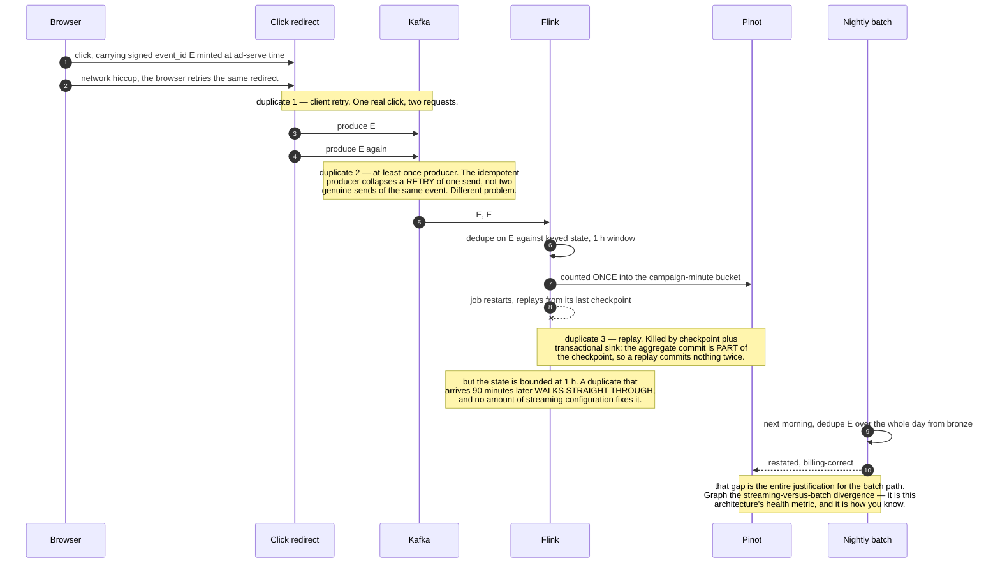

# Design real-time analytics / ad click aggregation

> Count ad clicks and impressions per campaign per minute, serve those counts to advertisers
> within seconds, and be exactly right — because this is billing.
> **The hard part:** exactly-once counting under duplicates and late events, with an OLAP
> serving layer fast enough for interactive queries.

## 1. Clarify

| Question | Assumed answer |
|---|---|
| Volume? | 10B ad events/day (~120k/s avg, 500k/s peak) |
| Query patterns? | "Clicks for campaign X per minute, last 24 h", filtered by country/device/creative |
| Freshness? | Dashboards < 1 min; billing recomputed daily and authoritative |
| Correctness? | **Billing-grade** — duplicates cost money in both directions |
| Late events? | Yes, minutes typical, hours possible from mobile |
| Retention? | Minute granularity 30 days, hourly 1 year, daily forever |

**Non-goals:** ad serving/auction, fraud detection model, the advertiser UI.

## 2. Requirements

**Functional**
- Ingest click/impression events, deduplicate, aggregate by (campaign, minute, dimensions)
- Serve aggregates with sub-second query latency
- Support backfill/restatement when late or corrected data arrives
- Distinct-user counts per campaign (reach)

**Non-functional**

| Target | Value |
|---|---|
| End-to-end freshness | < 1 min p95 |
| Query latency | p99 < 500 ms |
| Accuracy | Exact for billing; approximate acceptable for reach (HyperLogLog) |
| Availability | 99.9% query; ingest must not lose events |

## 3. Estimates

```
10B events/day ≈ 120k/s avg, 500k/s peak; event ~500 B → 5 TB/day raw
Aggregate rows: 100k campaigns × 1,440 min × ~20 dimension combos = 2.9B rows/day
   ← the aggregate can be BIGGER than the input if you cross too many dimensions
   → pre-aggregate only the combinations that are actually queried
At 1 min granularity, 30 days: 100k × 43,200 × 20 = 86B rows → must roll up aggressively
Dedup state: 500k/s × 300 s window = 150M keys in state ≈ 10–20 GB of RocksDB
Distinct users per campaign: exact = enormous sets; HLL = 12 KB/campaign, 0.81% error
```

> [!info] The scary number
> **Dimensional explosion.** Naive "aggregate by every combination" produces more rows than
> the raw events. Choosing which cuboids to materialise is the design.

## 4. API / contract

```
ingest: Kafka topic `ads.events`, key = ad_id
  {event_id, event_type: "impression"|"click", ad_id, campaign_id, user_id,
   ts_event, country, device, creative_id, cost_micros}

query:
GET /v1/reports?campaign_id=&from=&to=&granularity=minute&group_by=country,device
  → { rows: [{ts, country, device, impressions, clicks, spend_micros, reach_approx}] }
```

`event_id` is generated at ad-serve time and carried through the click redirect — that's the
deduplication key, and it must be signed so a bot cannot mint clicks.

## 5. Data model

| Layer | Store | Content |
|---|---|---|
| Raw | Kafka → Iceberg `bronze.ad_events` | Every event, replayable, the audit trail |
| Real-time aggregates | Pinot / Druid / ClickHouse | (campaign, minute, country, device) → counts |
| Batch aggregates | Iceberg `gold.ad_metrics_daily` | Recomputed nightly, **authoritative for billing** |
| Sketches | Same OLAP store | HLL per (campaign, day) for reach |

**Pre-aggregation strategy:** materialise the cuboids that are queried
(`campaign×minute`, `campaign×country×minute`, `campaign×creative×hour`) and compute the rest
on the fly from the finest materialised level. Roll up minute → hour → day on a schedule.

> [!tip] Say this
> "I'd materialise three or four cuboids based on actual query logs, not all 2^n. Then roll
> up minute data to hourly after 7 days. Storage and query cost are both dominated by that
> decision, so I'd instrument query patterns before choosing."

## 6. Architecture

The handover boundary is the two edges into the query API:

```mermaid
flowchart LR
    ad["Ad server"]
    k[["Kafka ads.events<br/>key = ad_id, 500k/s peak"]]
    fd["Flink dedupe<br/>signed event_id, ~150M keys in state"]
    fw["Flink event-time windows<br/>watermark = max event time minus 2 min"]
    hll["HLL sketches<br/>12 KB per campaign, mergeable"]
    olap[("Pinot or Druid<br/>real-time segments, upsertable")]
    bronze[("Iceberg bronze.ad_events<br/>5 TB/day, exactly-once via 2PC")]
    batch["Nightly recompute<br/>D-1, plus D-3 and D-7 restatements"]
    gold[("gold.ad_metrics_daily<br/>BILLING TRUTH")]
    api["Query API<br/>p99 under 500 ms"]

    ad ==> |"impression and click events with cost_micros"| k
    k --> |"streaming path"| fd
    k ==> |"raw, replayable, the audit trail"| bronze
    fd --> |"deduped within a bounded window"| fw
    fw --> |"upsert campaign, minute, dimensions"| olap
    fw --> |"per campaign and day"| hll
    hll --> |"reach, ~0.8% error"| olap
    bronze ==> |"full-day dedupe catches what slipped the window"| batch
    batch --> |"authoritative at D+1 06:00"| gold
    batch ==> |"backfill corrected historical segments"| olap
    olap --> |"under 24 h: real-time segments"| api
    gold --> |"beyond 24 h: batch-corrected"| api

    classDef service fill:#fff,stroke:#5f6368,color:#111
    classDef store fill:#fef7e0,stroke:#f9ab00,color:#111
    classDef queue fill:#f3e8fd,stroke:#a142f4,color:#111
    class ad,fd,fw,hll,batch,api service
    class olap,bronze,gold store
    class k queue
```



This is a **Lambda architecture**, deliberately — and here it's justified, which is worth
saying explicitly since Lambda is usually the wrong default:

> [!tip] Say this
> "I'd normally argue for Kappa, but billing needs an authoritative recomputation that can
> incorporate week-late events and fraud reversals, and the streaming path needs sub-minute
> latency. Those are genuinely different requirements, so two paths with a documented
> handover boundary — real-time for anything under 24 hours, batch-corrected beyond — is
> honest rather than lazy."

### Deep dive A — exactly-once counting

Three independent duplicate sources, and you need an answer for each:

| Source of duplicates | Mitigation |
|---|---|
| Client/network retries on the click redirect | Signed `event_id`, deduplicated in Flink state over a bounded window |
| Kafka at-least-once producer | Idempotent producer + transactional writes |
| Flink restart replaying from checkpoint | Checkpointed state + transactional sinks; the aggregate commit is part of the checkpoint |

Dedup window is bounded (say 1 hour) because state cannot grow forever. Anything later than
the window slips through the streaming path — and is **caught by the nightly batch recompute**,
which deduplicates over the full day from bronze. That's exactly why the batch path exists.

The three sources are easier to keep straight as one click's journey, because each is killed by
a different layer and the last one is not killed at all:



### Deep dive B — event time, watermarks, late data

- Aggregate on `ts_event`, never on arrival time. A minute bucket is defined by when the click
  happened.
- Watermark = max observed event time − allowed lateness (e.g. 2 min). A window fires when the
  watermark passes its end.
- Allowed lateness after firing (e.g. 1 h) → emit an **update** (upsert into the OLAP store,
  which is why the store must support upserts).
- Beyond that: side output → included in the nightly recompute. Never silently dropped;
  count them and alert if the rate rises (a rising late-event rate usually means an SDK or a
  region is broken).

### Deep dive C — the OLAP serving layer

| Store | Strength |
|---|---|
| **Apache Pinot** | Real-time ingestion from Kafka + upserts, built for user-facing analytics at high QPS |
| **Druid** | Similar; strong time-series rollups |
| **ClickHouse** | Fastest raw scan performance, simpler ops, weaker native upsert story (ReplacingMergeTree with eventual dedup) |

Choose by whether you need **upserts on real-time segments** (Pinot/Druid) or raw scan speed
(ClickHouse). Say the trade rather than naming a favourite.

Query performance levers: partition by time, sort by campaign, star-tree/pre-aggregated
indexes for common group-bys, bitmap indexes on low-cardinality dimensions, and a result cache
for dashboard queries (which repeat constantly).

### Deep dive D — approximate counts where exactness isn't required

- **HyperLogLog** for unique reach: 12 KB per sketch, ~0.8% error, and **mergeable** — so
  daily sketches roll up into weekly without touching raw data. Exact distinct counts across
  100k campaigns would be orders of magnitude more expensive.
- **Theta sketches** when you need set intersections (audience overlap).
- **t-digest** for percentile metrics.
- Rule to state: **approximate for exploration, exact for billing.** Two numbers, clearly
  labelled in the UI, is honest; one number that's sometimes wrong is a lawsuit.

## 7. Scale & failure

| Breaks first at 10x | Fix |
|---|---|
| Flink dedup state | Shorter window, key sharding, RocksDB tuning; rely more on batch dedup |
| OLAP row count | Fewer materialised cuboids, faster rollup, shorter minute-granularity retention |
| Query QPS from advertiser dashboards | Result cache, pre-computed reports, per-tenant quotas |
| Kafka throughput | More partitions (key by ad_id keeps ordering), compression |

| Component fails | Blast radius | Degraded behaviour |
|---|---|---|
| Flink job down | Real-time numbers freeze | Restart from checkpoint; show "data as of HH:MM"; **batch path still produces correct billing** |
| OLAP node down | Partial query results | Replication; better to return an explicit error than silently partial billing data |
| Kafka lag | Freshness degrades | Autoscale consumers; alert |
| Bad aggregation deploy | Wrong numbers, already served | Restate from bronze — the reason raw is retained. Version the aggregation logic so restatements are reproducible |

## 8. Ops & cost

- **SLA:** freshness p95 < 1 min; billing numbers final at D+1 06:00; streaming vs batch
  discrepancy < 0.1% (measured, graphed, and alerted — this is the health metric of a Lambda
  architecture and the reason to keep the two paths honest).
- **Alert on:** streaming/batch divergence, late-event rate, dedup state size, watermark
  stalls (a stuck watermark silently freezes all windows — the sneakiest failure here), OLAP
  ingestion lag.
- **Rollout:** aggregation changes run in shadow against the batch path for a full day before
  cutover.
- **Cost:** OLAP storage/memory dominates, then Flink state, then Kafka. Rolling up minute
  data after 7 days is usually the single biggest saving.
- **First thing I'd cut:** materialised cuboids nobody queries (measure with query logs), and
  minute-granularity retention 30 → 7 days.

## On AWS and Azure

| | AWS | Azure |
|---|---|---|
| **The shape** | Kinesis Data Streams or MSK → Managed Service for Apache Flink (dedup + event-time windows) → **two sinks**: an OLAP store for the sub-second serving layer, and S3 Tables (Iceberg) for the nightly authoritative recompute | Event Hubs → Stream Analytics / Fabric Eventstream or Databricks → **Azure Data Explorer (Kusto)** for serving, plus Delta/Iceberg in ADLS for the nightly recompute |
| **The serving layer** | **No first-party Pinot/Druid equivalent.** Redshift and Athena are warehouse-shaped, not sub-second-interactive at this cardinality, so the real answer is ClickHouse, Pinot or Druid that you run — on EKS, EC2 or a vendor's managed offering in the Marketplace | **Azure Data Explorer is exactly this product**, first-party: columnar, time-series-native, built for interactive aggregation over streaming ingest, queried with KQL. This is the sharpest first-party advantage Azure has in the whole case set |
| **What you configure** | Flink checkpoint interval (the exactly-once boundary), watermark lag, RocksDB state backend sizing for the ~150 M-key dedup window | ADX ingestion batching policy, update policies for the roll-up cuboids, caching (hot) vs retention (cold) period per table, materialized views |
| **The default that bites** | Kinesis is **1 MB/s *or* 1,000 records/s per shard, whichever comes first**. At 500 k events/s of 500-byte records the *record* limit binds long before the byte limit — 500 shards for 250 MB/s of actual data. Sizing on bytes is the mistake | **Kusto truncates every query result at 500,000 records and 64 MB**, failing with `E_QUERY_RESULT_SET_TOO_LARGE` rather than paginating. An advertiser export of minute-granularity data crosses it in under a year of one campaign; the fix is `.export`, a `summarize`, or explicitly raising `truncationmaxrecords` |
| **What it costs you** | The dedup state is yours to operate: 150 M keys in RocksDB, checkpointed to S3, restored on every restart. Restore time is a real recovery number and nobody measures it until an incident | Query timeout defaults to **4 minutes and can be raised only to 1 hour**; memory per query operator tops out at **30 GB per node**; and request concurrency defaults to **cores-per-node × 10**. The 86 B-row table this case warns about is not a storage problem on ADX, it is a per-query memory problem, and the answer is the same pre-aggregation the case argues for |

Both clouds enforce the same discipline from opposite directions: the dimensional explosion has to
be solved by choosing cuboids, because neither the query engine's memory budget nor the result cap
will let you compute it at read time. The one thing to say out loud is the serving-layer asymmetry —
on Azure you name Azure Data Explorer and move on; on AWS you are naming a product you will run.

## In an LLM deployment

Billing-grade counting and a probabilistic model are a bad combination, and the boundary is the
answer: **the model may generate the query, never the number.** Natural-language reporting
("clicks for campaign X by country last week") compiles to a KQL or SQL query against the
pre-aggregated cuboids, and the count that reaches the advertiser comes from the same authoritative
path as the invoice. Cache the generated query per question shape; the same ten questions are
asked all day.

Two guards make that safe rather than just nice. **Bound the generated query before you run it** —
a `query_range` a model wrote over 86 B rows is a denial of service, and this is exactly what the
30 GB per-operator and 500,000-record caps above exist to stop, arriving as a partial query failure
rather than as a refusal. Validate the time range, the granularity and the group-by cardinality in
your own code first. **Show the query.** An advertiser looking at a spend figure must be able to
see what was summed, because "the model said" is not an answer to a billing dispute.

Where a model earns its place with no correctness risk at all is the **cuboid decision** this case
says to make from query logs. Clustering a month of query logs to find the four combinations
actually asked for is a batch job whose output is a configuration change a human approves —
cheap, reversible, and the single highest-leverage decision on the page.

## Referenced by

- [Batch vs streaming](../comparisons/batch-vs-streaming.md)
- [Data platform cases index](README.md)
- [Question bank](../07-drills/question-bank.md)
- [Repo index](../../INDEX.md)
- [Stream processing semantics](../fundamentals/stream-processing-semantics.md)

## Sources & further reading

- Local book: Alex Xu vol. 2 — ad click event aggregation chapter (`AI/ML-Foundations/`)
- [Apache Pinot — real-time upserts](https://docs.pinot.apache.org/)
- [Flink — event time and watermarks](https://nightlies.apache.org/flink/flink-docs-stable/docs/concepts/time/)
- [HyperLogLog paper](https://algo.inria.fr/flajolet/Publications/FlFuGaMe07.pdf)
- Related: [../03-backend-cases/metrics-monitoring.md](../03-backend-cases/metrics-monitoring.md)

Cloud claims in §On AWS and Azure (all verified 2026-09-21):

- [AWS — Kinesis Data Streams quotas and limits](https://docs.aws.amazon.com/streams/latest/dev/service-sizes-and-limits.html) — 1 MB/s or 1,000 records/s per shard, whichever binds first
- [AWS — working with Amazon S3 Tables and table buckets](https://docs.aws.amazon.com/AmazonS3/latest/userguide/s3-tables.html) — Iceberg table buckets with automatic maintenance, for the batch recompute layer
- [Azure — Kusto query limits](https://learn.microsoft.com/en-us/azure/data-explorer/kusto/concepts/querylimits) — 500,000-record and 64 MB result truncation with `E_QUERY_RESULT_SET_TOO_LARGE`, 4-minute default query timeout raisable to 1 hour, 30 GB `maxmemoryconsumptionperiterator`, request concurrency of cores-per-node × 10
- [Azure — Event Hubs quotas and limits](https://learn.microsoft.com/en-us/azure/event-hubs/event-hubs-quotas) — throughput units and partition limits for the ingest tier
