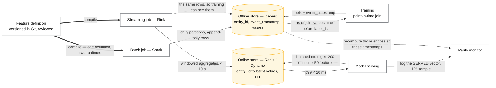
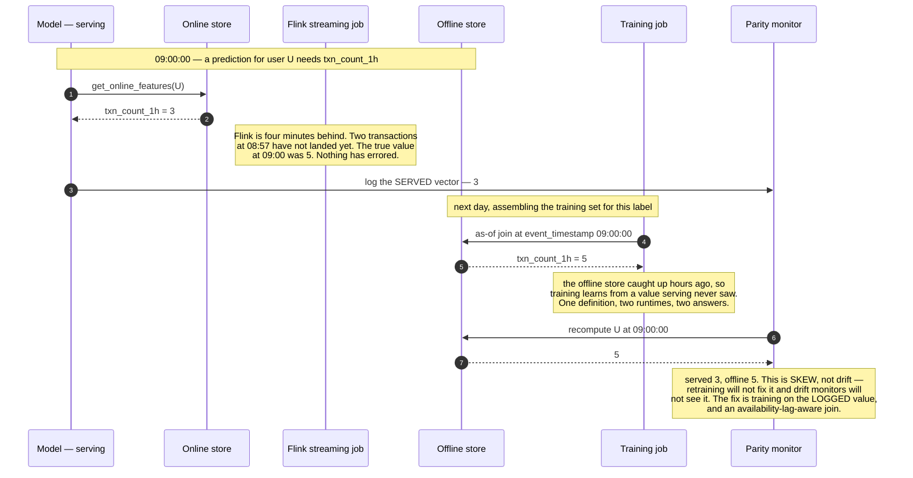

# Design a feature store

> One place to define features once and get them **both** in training (historical, correct as of
> a past moment) and in serving (fresh, in milliseconds).
> **The hard part:** point-in-time correctness and online/offline parity. Everything else is
> plumbing.

## 1. Clarify

| Question | Assumed answer |
|---|---|
| Who uses it? | 30 ML teams, ~50 models in production |
| Feature count? | ~2,000 features across ~100 entities |
| Serving latency? | p99 < 20 ms for a batch of 200 entities |
| Freshness tiers? | Batch (daily), streaming (seconds), on-demand (request-time) |
| Backfill? | Yes — a new feature must be computable over 2 years of history |

**Non-goals:** the models themselves, experiment tracking, the training orchestrator.

## 2. Requirements

**Functional**
- Define a feature once (transformation + entity + freshness) and serve both paths from it
- **Point-in-time-correct** historical retrieval for training sets
- Low-latency online retrieval by entity key, batched
- Feature discovery, ownership, lineage and versioning
- Monitoring: drift, null rate, freshness, and **online/offline value parity**

**Non-functional**

| Target | Value |
|---|---|
| Online p99 | < 20 ms for 200 entities × 50 features |
| Online availability | 99.99% — it's on every model's critical path |
| Offline correctness | Zero future leakage, provable |
| Freshness | Streaming features < 10 s; batch by SLA |

## 3. Estimates

```
Online store: 100M entities × 50 features × 20 B = 100 GB, hot subset in RAM
   QPS: 50 models × 5k rps × 1 batched call = 250k feature-fetch calls/s
        each returning 200 × 50 = 10k values → ~10 M values/s          ← columnar or bust
Offline store: 2,000 features × 100M entities × 2 years of daily snapshots
   = huge. Store as event-time rows in Iceberg, not snapshots per day.
Backfill: recomputing one feature over 2 years ≈ hours of Spark. Must be routine, not a project.
```

> [!info] The scary number
> 10M feature values per second on the online path. That forces batched, columnar reads and a
> memory-resident hot set — not per-feature KV round trips.

## 4. API / contract

**Definition** (the artefact that makes parity possible — one definition, two runtimes):

```python
@feature_view(
    entities=["user_id"],
    source=stream("transactions"),
    mode="streaming",
    ttl="7d",
    owner="team-risk",
)
def user_txn_velocity(txns):
    return {
        "txn_count_1h":  count(txns, window="1h"),
        "txn_amount_24h": sum_(txns.amount, window="24h"),
    }
```

**Serving:**
```python
# online — serving
store.get_online_features(
    features=["user_txn_velocity:txn_count_1h", "user_profile:tenure_days"],
    entity_rows=[{"user_id": u} for u in batch],      # batched, one round trip
)

# offline — training, point-in-time correct
store.get_historical_features(
    entity_df=labels_df,        # MUST include an event_timestamp column
    features=[...],
)
```

## 5. Data model

| Layer | Store | Content |
|---|---|---|
| Registry | Postgres / Git | Feature definitions, entities, owners, versions, lineage |
| **Offline** | Iceberg on object storage | `(entity_id, event_timestamp, feature values…)` — append-only |
| **Online** | Redis / DynamoDB / Scylla | `entity_id → latest feature values`, TTL'd |
| Streaming | Kafka + Flink | Windowed aggregations feeding the online store |
| Monitoring | Time-series | Distributions, nulls, freshness, parity samples |

**The offline table stores event-time rows, not daily snapshots.** Snapshots are what break
point-in-time correctness — with a snapshot you can only ask "what was true at midnight", and
your training rows are at arbitrary timestamps.

## 6. Architecture

The single compiled definition is the whole point: two code paths written by hand *will* diverge,
and the divergence is invisible until model quality quietly drops.



### Deep dive A — point-in-time correctness (the core of the case)

You have a label event at time `T`. The training row must contain feature values **as they were
just before T**, never later.

```
Naive (WRONG):  JOIN features ON entity_id                 → uses today's values. Leakage.
Correct:        AS-OF JOIN on (entity_id, event_timestamp) → last value with
                feature_ts <= label_ts, respecting TTL
```

Two subtleties worth raising unprompted:

1. **Feature availability lag.** A feature computed by a job that finishes at 02:00 was *not*
   available to a 01:30 prediction, even though its `event_timestamp` is 01:00. Model the
   *availability* time as well as the event time, or you leak.
2. **TTL.** A value from 30 days ago probably shouldn't be joined onto today's label — expiry is
   part of the definition, and it must be applied identically in both paths.

> [!tip] Interview line
> "Point-in-time joins are an as-of join on entity plus timestamp, respecting both TTL and the
> feature's availability lag. Getting this wrong is the single most common cause of a model that
> looks excellent offline and mediocre in production."

### Deep dive B — online/offline parity

Even with one definition, values can diverge: different execution engines, floating-point
differences, late data, or a streaming job that fell behind.

**How you'd actually detect it** (this is the answer that separates people who've operated one):

- **Log the served feature vector** on a sample of requests (say 1%).
- Recompute those same features offline for the same entities and timestamps.
- Alert on distributional divergence and on per-feature mismatch rate.

That parity monitor is more valuable than any amount of pipeline code review. One feature, one
entity, one timestamp — and two different answers:



### Deep dive C — the three freshness modes

| Mode | Path | Example | Cost |
|---|---|---|---|
| **Batch** | Spark → online store | 30-day spend, lifetime orders | Cheap; stale by up to a day |
| **Streaming** | Flink → online store | Clicks in the last 5 minutes | Medium; seconds fresh |
| **On-demand** | Computed at request time from request payload + fetched values | `amount / avg_amount_30d`, distance between request IP and home | Free to store; must be defined once so training reproduces it exactly |

On-demand features are where skew loves to hide — they're often written twice (once in the
serving app, once in the training notebook). The definition must own them too.

### Deep dive D — governance at 30 teams

- **Ownership** per feature view, with an on-call. Unowned features get deprecated.
- **Versioning**: changing a feature's logic creates `v2`; models pin a version. Silently
  changing a feature under a live model is a production incident.
- **Discovery**: search by entity, owner, freshness, and *usage* — the feature catalogue is only
  useful if people can find what already exists instead of writing their own copy.
- **Cost attribution** per feature view: some features are enormously expensive and used by one
  model that no longer ships.

## 7. Scale & failure

| Breaks first at 10x | Fix |
|---|---|
| Online store QPS/memory | Shard by entity hash, tier cold entities, compress (int8/fp16) |
| Point-in-time join runtime | Partition + sort offline tables by (entity, time), incremental training sets |
| Streaming job state | TTLs, key sharding, coarser windows |
| Registry contention / sprawl | Feature deprecation policy driven by usage metrics |

| Component fails | Blast radius | Degraded behaviour |
|---|---|---|
| Online store down | **Every model degrades at once** — the shared-fate risk of a feature store | Per-model default/imputed values + local cache; models must have a no-feature fallback |
| Streaming job lags | Stale fresh-tier features | Serve stale with an age flag; alert on feature age, not just job health |
| Batch job fails | Yesterday's values persist | Serve last-known-good; alert on staleness against the feature's declared SLA |
| Bad feature definition shipped | Silent quality drop across models | Parity + drift monitors, staged rollout of definition changes, version pinning |

## 8. Ops & cost

- **SLO:** online p99 < 20 ms, 99.99% availability, freshness per declared tier, parity mismatch
  rate < 0.1%.
- **Alert on:** per-feature null/default rate, feature age vs SLA, parity divergence, online store
  latency and hit rate, streaming lag, definition-deploy failures.
- **Rollout:** definition changes are code — reviewed, versioned, canaried against parity checks
  before models consume them.
- **Cost:** online store memory and streaming compute dominate. The biggest lever is **deleting
  unused features** — usage tracking typically reveals a large fraction of features feed nothing.
- **First thing I'd cut:** unused feature views, and the freshness tier of features whose models
  don't actually need seconds.

## On AWS and Azure

| | AWS | Azure |
|---|---|---|
| **The shape** | **SageMaker Feature Store** — online store + offline store in S3 (Iceberg or Glue table) from one feature-group definition; Kinesis/Flink writes streaming features; Glue/EMR backfills; `BatchGetRecord` on the serving path | **Azure ML managed feature store** over an online store (Azure Managed Redis) and an offline store (ADLS Gen2, Delta); Spark feature-set definitions materialised to both; Databricks or Fabric for backfill |
| **What you configure** | Feature group per entity, TTL, online store type (Standard vs InMemory), provisioned vs on-demand RCU/WCU, whether the offline store is Iceberg | Feature set specs with `source_lookback` and `temporal_join_lookback`, materialisation schedules per set, online/offline store connections |
| **The default that bites** | **A single record identifier is capped at 2,400 read units/s and 500 write units/s.** A shared entity — a popular merchant, a hot campaign — is a hot key with a hard per-key ceiling, and no amount of provisioned capacity on the feature group lifts it | **Azure Cache for Redis "announced its retirement timeline for all SKUs"**, so the managed online store's default backing service is mid-migration to Azure Managed Redis. Plan the online store on Managed Redis and note that its in-memory SKUs above **350 GB are in preview** |
| **What it costs you** | The serving arithmetic does not fit the managed API. `BatchGetRecord` "can contain as many as 100 records and can query up to 100 feature groups" against a **soft limit of 500 TPS** — this case wants **250,000 batched calls/s of 200 entities each**. That is 500× the API quota and 2× the per-call record cap, so the online path is your own columnar service over Redis/DynamoDB, with Feature Store as the registry and offline half | Azure ML **managed online endpoints cap at 500 requests/s and 5 MBPS of bandwidth per endpoint** (both raisable by support ticket) — so a feature service fronted by one is off by orders of magnitude too. The online store is read directly by the serving process, never through an endpoint |
| **The limits worth knowing** | 100 feature groups per account (soft), **2,500 feature definitions per feature group**, 350 KB record, 40,000 RCU/WCU per feature group and 80,000 per Region | 100 endpoints and 500 deployments per subscription per Region; **180-second maximum request timeout** at endpoint level |

The honest conclusion, and it is the same on both clouds: **the managed feature store is a
definition registry, a materialisation engine and an offline store — the 10 M-values/second online
path is yours.** Say that, and say why: the per-key and per-API ceilings are set for hundreds of
models doing thousands of lookups, not for fifty models doing a quarter of a million batched
fetches a second.

## In an LLM deployment

A feature store and a vector index are the same architecture with a different value type, and the
point-in-time rule transfers exactly: **the embedding you retrieve for a training example must be
the embedding that existed at the label's timestamp**, or you have leaked the future into the
training set in a way no schema check will catch. If an item's description was rewritten last
Tuesday and you re-embedded it, a training row from last Monday that retrieves today's vector is
leaking. Version the vector by `(entity_id, model_version, valid_from)` and the historical join is
the same as-of join this case already specifies.

Online/offline parity gets a new and worse failure mode. Today parity breaks when two
implementations of the same transformation disagree; with embeddings it breaks when the **model
version**, the **tokeniser**, or even the **truncation length** differ between the batch job and
the serving path — and the symptom is not an exception, it is slightly worse retrieval that nobody
notices for a month. Pin the embedding model version in the feature definition, serve it from the
same artefact, and add cosine similarity between the online and offline vector for the same entity
to the parity monitor alongside the value comparison.

The economics change one operational habit. A backfill here is "recompute one feature over 2 years
of history", which this case rightly says must be routine; re-embedding 100 M entities is a
**billed inference job**, so it is routine in the sense of rehearsed, not routine in the sense of
cheap. Budget it before you promise a feature owner they can change an embedding model at will.

## Referenced by

- [Data engineering design playbook](../05-data-cases/data-playbook.md)
- [Design a recommender system](recommender.md)
- [Design ML monitoring, evaluation and retraining](ml-monitoring-and-eval.md)
- [Design real-time fraud detection](fraud-detection.md)
- [Engineering blogs and case studies](../10-resources/engineering-blogs.md)
- [ML and GenAI cases index](README.md)
- [ML system design playbook](ml-playbook.md)
- [Question bank](../07-drills/question-bank.md)

## Sources

- Local book: `DE/Warehouse-ETL/Designing machine learning systems — Chip Huyen.pdf` — features and skew
- [Uber — Michelangelo ML platform](https://www.uber.com/blog/michelangelo-machine-learning-platform/)
- [Feast — feature store docs](https://docs.feast.dev/)
- Related: [ml-playbook.md](ml-playbook.md), [../05-data-cases/data-playbook.md](../05-data-cases/data-playbook.md)

Cloud claims in §On AWS and Azure (all verified 2026-09-21):

- [AWS — SageMaker Feature Store quotas, naming rules and data types](https://docs.aws.amazon.com/sagemaker/latest/dg/feature-store-quotas.html) — 2,400 RRU/s and 500 WRU/s per record identifier, 100 feature groups per account (soft), 2,500 feature definitions per group, 350 KB record, 40,000/80,000 RCU and WCU, `BatchGetRecord` 100 records and 100 feature groups per call at a 500 TPS soft limit
- [Azure — manage resources and quotas for Azure Machine Learning](https://learn.microsoft.com/en-us/azure/machine-learning/how-to-manage-quotas) — 500 requests/s, 500 active connections and 5 MBPS per managed online endpoint, 180-second request timeout, 100 endpoints and 500 deployments per subscription per Region
- [Azure — What is Azure Cache for Redis?](https://learn.microsoft.com/en-us/azure/azure-cache-for-redis/cache-overview) — retirement announced for all SKUs
- [Azure — What is Azure Managed Redis?](https://learn.microsoft.com/en-us/azure/redis/overview) — tier sizes; in-memory tiers above 350 GB in preview
