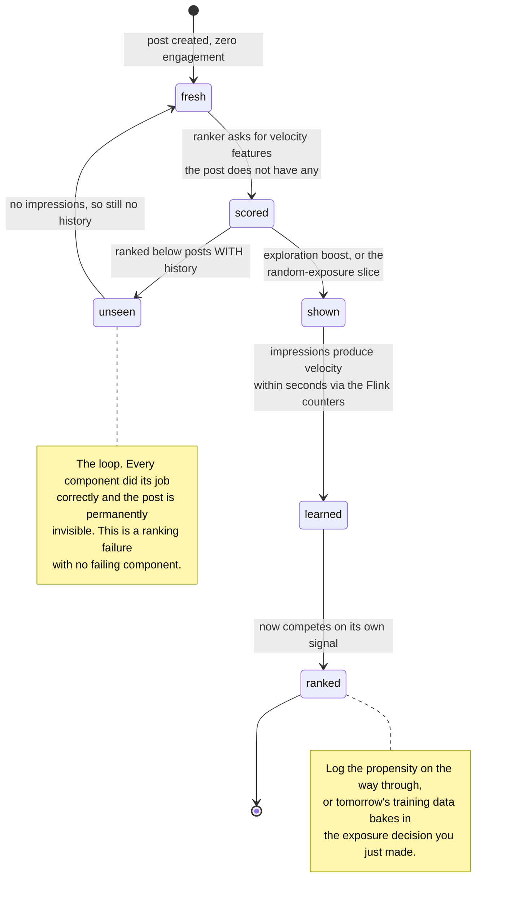

# Design feed ranking

> The ML half of [../03-backend-cases/news-feed.md](../03-backend-cases/news-feed.md): given a few
> hundred candidate posts, order them.
> **The hard part:** real-time features (a post minutes old with no engagement history), multi-
> objective optimisation, and doing it in ~50 ms.

## 1. Clarify

| Question | Assumed answer |
|---|---|
| Optimise for what? | A weighted combination of meaningful interactions, not raw clicks |
| Candidate set size? | ~500 per request after retrieval |
| Latency for ranking? | 50 ms of a 200 ms page budget |
| Feature freshness? | Post-level engagement counters within seconds |
| Do we control retrieval? | Yes, but it's a separate stage (see the backend case) |

**Non-goals:** fanout/storage, ads auction, integrity/moderation models (mentioned as a filter).

## 2. Requirements

**Functional**
- Score ~500 candidates and return an ordered list
- Multi-objective: predict several engagement types, combine into one value score
- Apply diversity, freshness, integrity and "already seen" constraints after scoring

**Non-functional**

| Target | Value |
|---|---|
| Ranking p99 | < 50 ms for 500 candidates |
| Throughput | 150k rps peak (from the backend case) |
| Feature freshness | Post counters < 10 s; user features < 5 min |
| Availability | 99.99% — **must** degrade to chronological |

## 3. Estimates

```
150k rps × 500 candidates = 75M item-scorings/second      ← the number that shapes everything
   A 1 ms/item model is 75,000 cores. So: batch all 500 in one forward pass,
   keep the model small, and push heavy computation offline into embeddings.
Features: 500 candidates × 150 features = 75k values per request, batched fetch ~10 ms
Model: ~10 ms for 500 items batched on CPU (small NN / GBDT) or a shared GPU tier
Training: 1B impressions/day, downsampled to ~100M rows for daily retraining
```

> [!info] The scary number
> **75M scorings/second.** Everything in this design — embedding precomputation, batching,
> model size, candidate cap — exists to make that arithmetic work.

## 4. API / contract

```
rank(user_id, candidates[500], context) → [(post_id, score, per_head_scores)]

Logged per impression:
  request_id, model_version, user_id, post_id, position, per_head_predictions,
  feature_snapshot_ref, and the eventual outcomes (click, dwell_ms, like, share, hide, report)
```

Logging the **feature values actually served** (or a reference to them) is what makes
training–serving skew detectable and gives you unbiased training data. Say it.

## 5. Data model

**Features, by freshness tier:**

| Tier | Examples | Where |
|---|---|---|
| Static | Author ID, media type, language | In the candidate payload |
| Daily | User's long-term topic affinity embedding, author quality | Batch → online KV store |
| Minutes | User's session activity, recent topics | Streaming aggregation |
| **Seconds** | This post's likes/comments/hides in the last 10 min, velocity | **Streaming counters — the hardest tier** |

The seconds tier is the interesting one: a post that is 3 minutes old has almost no history, so
early engagement velocity is the strongest signal you have, and it must reach the ranker in
seconds. That means a streaming aggregation path (Kafka → Flink → online store), not a batch job.

**Labels:** multi-headed and each with its own delay — click (instant), dwell (seconds), like
(minutes), hide/report (rare, valuable), long-term retention (weeks, unusable as a direct label).
Negatives are impressions without engagement, corrected for position and viewport.

## 6. Architecture

Every edge here is sized by the 75M-scorings-per-second arithmetic above:

```mermaid
flowchart LR
    ret["Retrieval<br/>separate stage, backend case"]
    fa["Feature assembly<br/>one columnar multi-get"]
    on[("Online store<br/>user + post features")]
    fk["Flink counters<br/>likes, hides, velocity per post"]
    lc[("Per-ranker local cache<br/>hot posts, TTL 1 to 5 s")]
    mdl["Multi-task ranker<br/>click, like, share, hide, dwell heads"]
    val["Value combine<br/>weighted sum, weights set by product"]
    rr["Re-rank<br/>diversity, author cap, integrity"]
    cl["Client"]
    lg[("Impression log<br/>served features + outcomes")]

    ret --> |"500 candidates"| fa
    on --> |"75k values in one round trip, ~10 ms"| fa
    fk -.-> |"engagement velocity, < 10 s old"| on
    lc --> |"viral post counters, removes the hot key"| fa
    fa --> |"one batched forward pass over 500 items"| mdl
    mdl --> |"5 calibrated probabilities per item"| val
    val --> |"scored list"| rr
    rr --> |"top N, p99 < 50 ms of a 200 ms page"| cl
    rr -.-> |"per-head predictions + feature snapshot ref"| lg
    lg -.-> |"~100M downsampled rows, daily retrain"| mdl

    classDef client fill:#e8f0fe,stroke:#4285f4,color:#111
    classDef service fill:#fff,stroke:#5f6368,color:#111
    classDef store fill:#fef7e0,stroke:#f9ab00,color:#111
    classDef cache fill:#fce8e6,stroke:#ea4335,color:#111
    class cl client
    class ret,fa,fk,mdl,val,rr service
    class on,lg store
    class lc cache
```



### Deep dive A — multi-task scoring

One model, several heads sharing a trunk. Buys: shared representation, one forward pass, and
better estimates for rare events (hide/report) via shared learning.

The combination is where product and ML meet:

```
value = w_click·p(click) + w_dwell·E[dwell] + w_share·p(share) − w_hide·p(hide) − …
```

Say clearly: **the weights are a product decision**, tuned by A/B test, not learned end-to-end —
because the thing you actually care about (long-term retention) is unobservable at ranking time.
Negative weights on hide/report are what stop the system optimising into engagement bait, and
volunteering that is the strongest signal you can give in this case.

**Calibration** matters because the heads are combined: p(click) must mean an actual probability
or the weighted sum is meaningless. Use Platt scaling / isotonic regression, and monitor
calibration drift, not just AUC.

### Deep dive B — real-time features without a stampede

- Streaming counters per post keyed `post:{id}:{window}` with time-decayed windows (1 min, 10 min,
  1 h) maintained in Flink and written to the online store.
- **Hot posts are hot keys** — a viral post is read by millions of ranking requests per minute.
  Cache it locally in each ranker process with a 1–5 s TTL; the staleness is irrelevant at that
  timescale and it removes the hotspot entirely.
- **Cold-start posts**: no engagement history, so lean on author features, content embeddings,
  and an exploration boost. Without a deliberate boost, new posts never get impressions and never
  accumulate the signal they need — a self-fulfilling ranking failure worth naming.

### Deep dive C — making 50 ms work

| Technique | Saving |
|---|---|
| Precompute item and user embeddings offline; the ranker consumes vectors, not raw text | Huge |
| One batched forward pass over 500 items, not 500 calls | 10–50x |
| Feature fetch as a single multi-get, columnar, in one round trip | ~40 ms → ~10 ms |
| Quantised model / distilled student | 2–4x |
| Early exit: cheap model prunes 500 → 150, expensive model ranks the rest | 2–3x |
| Cap candidates by budget: adaptive N under load | Graceful degradation |

### Deep dive D — the feedback loop

The ranker decides what gets seen, which decides what gets trained on. Mitigations:
log propensities, reserve a small random-exposure slice for unbiased evaluation, and keep a
**chronological holdback** cohort — it's the only honest baseline for "is ranking actually
helping?" and it answers a question interviewers love to ask.

A new post's life is the loop in its smallest form. Nothing in it is broken:



## 7. Scale & failure

| Breaks first at 10x | Fix |
|---|---|
| Model compute | Distillation, early exit, fewer candidates, GPU batching tier |
| Feature fetch volume | Local caches, embedding compression, fewer features (measure importance) |
| Streaming counter volume | Sampling for low-engagement posts, coarser windows |
| Training data volume | Downsample negatives, incremental training |

| Component fails | Blast radius | Degraded behaviour |
|---|---|---|
| Ranker down | No personalised order | **Chronological feed** — worse, still a product |
| Real-time features stale | Slightly worse ranking | Serve with older windows; alert on feature age |
| One head misbehaving after a deploy | Skewed value scores | Per-head monitoring + automatic rollback on guardrail breach |
| Feature nulls spike | Silent quality collapse | Alert on default rate per feature — **the most important ML alert there is** |

## 8. Ops & cost

- **SLO:** ranking p99 < 50 ms; feature default rate < 0.5%; no guardrail metric regressed.
- **Alert on:** per-head prediction distributions, calibration error, feature null rates, feature
  age, per-segment CTR/hide rate, model-version split.
- **Rollout:** offline (NDCG + per-head AUC, sliced by segment) → shadow → 1% → 5% → 50% with
  guardrails (hide rate, report rate, session length, next-day return). Automatic rollback.
- **Cost:** ranking compute dominates, then the feature store. Distillation and candidate caps
  are the biggest levers. Quote a $/1k-requests figure.
- **First thing I'd cut:** candidate count and the number of features (feature importance is
  extremely long-tailed — half of them usually earn nothing).

## On AWS and Azure

| | AWS | Azure |
|---|---|---|
| **The shape** | Ranking service on EKS/ECS (the model is *in-process*, not behind an endpoint); features from ElastiCache and DynamoDB; seconds-tier counters from Kinesis → Managed Service for Apache Flink; training on SageMaker, artefacts in the Model Registry | Ranking service on AKS; features from Azure Managed Redis and Cosmos DB; seconds-tier counters from Event Hubs → Stream Analytics or Databricks; training in Azure ML, artefacts in its registry |
| **What you configure** | Batch size for the forward pass, model server threads, feature-fetch fan-out, the Flink watermark for the 10-second counter tier | The same, plus AKS node pools sized for the CPU model rather than GPU |
| **The default that bites** | **SageMaker's managed endpoint is not where this model goes.** `InvokeEndpoint` caps the request body at **6,291,456 bytes** and states that "a customer's model containers must respond to requests within 60 seconds" — fine per se, but the per-Region **10,000 InvokeEndpoint requests/second** ceiling is below this case's 150 k rps before you count the network hop. Ranking runs in-process | **An Azure ML managed online endpoint is capped at 500 requests per second and 5 MBPS of total bandwidth**, both per endpoint and both raisable only by support ticket. At 150 k rps with 75 k feature values per request, that is off by about three orders of magnitude on each axis |
| **What it costs you** | 75 M item-scorings/second is a fleet-sizing problem no managed inference product solves: the arithmetic only works because all 500 candidates go through one batched forward pass in the same process that fetched the features | Same. The cloud contribution here is the *streaming* tier and the *training* tier, not the serving tier |
| **The seconds tier** | Kinesis is **1 MB/s or 1,000 records/s per shard**, whichever binds first — engagement events are small, so the record limit binds and the shard count is set by event rate, not bytes | Event Hubs **1 TU = 1 MB/s or 1,000 events/s**, Standard capped at 40 TUs and 32 partitions; the sub-10-second counter tier is where the partition count actually matters |

The useful thing to carry from the table is negative and specific: **every managed inference
product on both clouds is built for a request-per-prediction shape, and this case is
500-predictions-per-request at 150 k rps.** Naming the endpoint quotas is how you show you know
why the model is co-located with the feature fetch instead of behind an HTTP hop.

## In an LLM deployment

Nothing in the 50 ms budget becomes a language model, and the reason is arithmetic that is already
on the page: 75 M scorings/second against a model that costs milliseconds per *item* is impossible
by four orders of magnitude. What changes is where the *representations* come from.

**Embeddings move upstream and get better.** A post's content embedding — computed once, offline,
by a large model at publish time — is a feature like any other: 128–1024 floats in the candidate
payload, fetched in the same batched read, scored by the same small network. That is the standard
way an LLM shows up in ranking: as a **precomputed feature**, never as an online call. It also
fixes cold start for content, since a three-minute-old post with no engagement history now has a
content vector even though its counters are empty.

**The seconds tier stays exactly as it is, and that matters.** Early engagement velocity is still
the strongest signal on a new post, and no embedding substitutes for it. Resist the temptation to
replace a streaming counter with a model.

Two new obligations. **A model-version bump is a full feature backfill**: every item embedding must
be recomputed, and until it is, the ranker is comparing vectors from two different spaces — which
is silently wrong, not loudly broken. Version the embedding field and keep both during the
migration. And **the logging contract grows**: `feature_snapshot_ref` must now pin the *embedding
model version* alongside the ranker version, or training–serving skew becomes undetectable for
exactly the features that carry the most information.

Where a large model earns its cost outright is offline: labelling content topics and quality,
generating the evaluation sets, and explaining ranking decisions to the humans tuning the
multi-objective weights. All batch, all off the 50 ms path.

## Referenced by

- [Design a news feed](../03-backend-cases/news-feed.md)
- [Design a recommender system](recommender.md)
- [ML and GenAI cases index](README.md)
- [Question bank](../07-drills/question-bank.md)
- [Repo index](../../INDEX.md)

## Sources & further reading

- Vendor: `10-resources/vendor/applied-ml/README.md` — ranking/feed case studies
- [Meta engineering — how the feed is ranked](https://engineering.fb.com/)
- Local book: `DE/Warehouse-ETL/Designing machine learning systems — Chip Huyen.pdf` — ch. on features and monitoring
- Backend counterpart: [../03-backend-cases/news-feed.md](../03-backend-cases/news-feed.md)

Cloud claims in §On AWS and Azure (all verified 2026-09-21):

- [AWS — `InvokeEndpoint` API reference](https://docs.aws.amazon.com/sagemaker/latest/APIReference/API_runtime_InvokeEndpoint.html) — 6,291,456-byte maximum request body, model containers must respond within 60 seconds
- [AWS — SageMaker endpoints and quotas](https://docs.aws.amazon.com/general/latest/gr/sagemaker.html) — 10,000 `InvokeEndpoint` requests per second per Region (not adjustable)
- [Azure — manage resources and quotas for Azure Machine Learning](https://learn.microsoft.com/en-us/azure/machine-learning/how-to-manage-quotas) — 500 requests/s and 5 MBPS per managed online endpoint, 180-second request timeout
- [AWS — Kinesis Data Streams quotas and limits](https://docs.aws.amazon.com/streams/latest/dev/service-sizes-and-limits.html) — 1 MB/s or 1,000 records/s per shard
- [Azure — Event Hubs quotas and limits](https://learn.microsoft.com/en-us/azure/event-hubs/event-hubs-quotas) — throughput units, 40 TUs and 32 partitions on Standard
