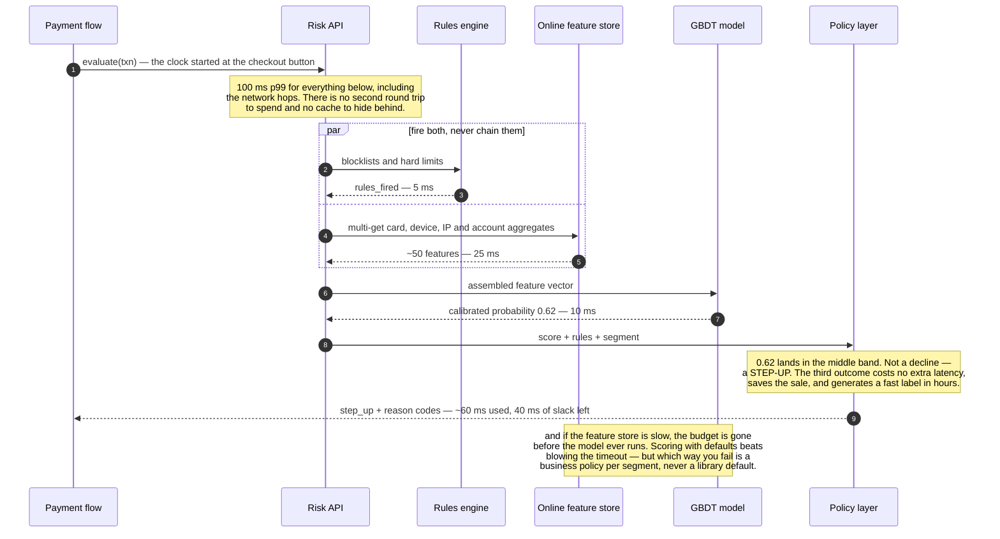

# Design real-time fraud detection

> Score every transaction in under 100 ms and decide approve / review / decline.
> **The hard part:** extreme class imbalance, labels that arrive 60 days late, an adversary who
> adapts to your model, and a threshold decision that is a business decision, not an ML one.

## 1. Clarify

| Question | Assumed answer |
|---|---|
| Decision or score? | Score + policy → approve / step-up (3DS/OTP) / review / decline |
| Latency budget? | < 100 ms p99 — it's inline in the payment flow |
| Volume? | 10k transactions/s peak; fraud rate ~0.1% |
| Cost asymmetry? | A missed fraud costs the transaction value; a false decline costs the sale **and** the customer |
| Labels? | Chargebacks (30–90 days), manual review outcomes (hours), customer reports |
| Adversarial? | Yes — fraudsters probe and adapt continuously |

**Non-goals:** the payment rails ([../03-backend-cases/payments-ledger.md](../03-backend-cases/payments-ledger.md)),
the manual review tooling, AML/sanctions screening (adjacent, rule-driven, different system).

## 2. Requirements

**Functional**
- Score each transaction with entity features (card, device, IP, merchant, account)
- Emit a decision plus a reason code (regulatory and operational necessity)
- Support rules alongside the model — instant blocking of a known-bad pattern
- Feed manual review outcomes back as fast labels

**Non-functional**

| Target | Value |
|---|---|
| p99 latency | < 100 ms including feature fetch |
| Availability | 99.99% — **fail-open or fail-closed is a business policy per segment** |
| Auditability | Every decision reproducible: model version, features, rules fired |
| Fairness | No disparate impact on protected attributes; documented and monitored |

## 3. Estimates

```
10k tps × 100 ms budget:
   feature fetch (entity aggregates, ~50 features)     ~25 ms
   model inference (GBDT, batched where possible)      ~10 ms
   rules engine                                        ~5 ms
   network + orchestration                             ~20 ms
   slack                                               ~40 ms                ← keep it
Labels: 10k tps × 86,400 = 864M txns/day, ~0.1% fraud = 864k positives/day
   but chargeback labels lag 30–90 days → today's model trains on ~2-month-old fraud   ← the design
Features: entity counters (card: txns in 1h/24h/7d; device: distinct cards; IP: velocity)
   → streaming aggregation, 100s of millions of keys, TTL'd
Cost of errors: false negative = txn value (avg $80); false decline = lost sale + churn risk
```

> [!info] The scary number
> The **label delay**, not the throughput. You are always training on a stale picture of an
> adversary who has already moved. Every design choice below follows from that.

## 4. API / contract

```http
POST /v1/risk/evaluate
  { txn_id, amount_minor, currency, card_token, merchant_id, device_fingerprint,
    ip, email_hash, billing_address_hash, ts }
  → 200 { decision: "approve"|"step_up"|"review"|"decline",
          score: 0.0-1.0, reason_codes: ["velocity_card_1h", "new_device"],
          model_version, rules_fired: [...], evaluation_id }

POST /v1/risk/label  { txn_id, label: "fraud"|"legit", source: "chargeback"|"review"|"report", ts }
```

`evaluation_id` + a stored feature snapshot make every decision auditable and disputable — a
regulatory requirement in most jurisdictions, and a strong thing to volunteer.

## 5. Data model

| Store | Content | Purpose |
|---|---|---|
| Online feature store | Entity aggregates keyed by card/device/IP/account/merchant | Sub-25 ms fetch |
| Streaming aggregator | Windowed counters (1 m, 1 h, 24 h, 7 d, 30 d) | Velocity features |
| Graph store (optional) | Entity links: shared device/card/address | Ring detection |
| Decision log | Every evaluation + features + outcome | Audit, training, backtesting |
| Label store | txn_id → label + source + timestamp | Training, with maturity windows |

**Feature families** — say these by name, they're the substance of the case:

| Family | Examples |
|---|---|
| **Velocity** | Transactions per card per hour; distinct cards per device per day; amount sum per account per 24 h |
| **Deviation** | Amount vs this account's historical distribution; new country/merchant category |
| **Entity reputation** | Merchant chargeback rate; IP/ASN risk; email domain age |
| **Graph** | Number of accounts sharing this device; is this card in a component with known fraud |
| **Context** | Time of day vs the account's normal, checkout latency, keystroke/behavioural signals |

## 6. Architecture

Drawn out, the loop from decision log back onto the hot path is the part worth seeing:

```mermaid
flowchart LR
    pay["Payment request<br/>10k tps peak"]
    api["Risk API"]
    rules["Rules engine<br/>blocklists, hard limits"]
    fs[("Online feature store<br/>card, device, IP, account aggregates")]
    mdl["GBDT ensemble<br/>calibrated probability"]
    pol["Policy layer<br/>score + rules + segment threshold"]
    k[["Kafka<br/>decision log"]]
    fk["Flink<br/>windowed counters, 1 m to 30 d"]
    lake[("Lakehouse<br/>decisions, features, outcomes")]
    lbl[("Label store<br/>chargebacks 30 to 90 d, reviews in hours")]
    tr["Training + backtest<br/>time-split only"]
    reg["Registry, canary, holdback"]

    pay --> |"txn, card token, device, IP"| api
    api --> |"deterministic checks, ~5 ms"| rules
    api --> |"batched multi-get, ~25 ms"| fs
    fs --> |"~50 entity aggregates"| mdl
    mdl --> |"p of fraud, ~10 ms"| pol
    rules --> |"rules_fired + reason codes"| pol
    pol --> |"approve, step-up, review or decline — p99 < 100 ms"| pay
    pol -.-> |"evaluation_id + feature snapshot"| k
    k -.-> |"seconds"| fk
    fk --> |"velocity features back onto the hot path"| fs
    k -.-> |"every decision, for audit and backtest"| lake
    lbl -.-> |"join on txn_id as labels mature"| lake
    lake ==> |"matured labels, plus fast labels for the second model"| tr
    tr ==> reg
    reg -.-> |"champion and challenger"| mdl

    classDef client fill:#e8f0fe,stroke:#4285f4,color:#111
    classDef service fill:#fff,stroke:#5f6368,color:#111
    classDef store fill:#fef7e0,stroke:#f9ab00,color:#111
    classDef queue fill:#f3e8fd,stroke:#a142f4,color:#111
    class pay client
    class api,rules,mdl,pol,fk,tr,reg service
    class fs,lake,lbl store
    class k queue
```



### Deep dive A — imbalance, thresholds, and the business

- **Never optimise accuracy.** Use PR-AUC and, above all, the **operating point**: what
  precision/recall do we get at the threshold we'd actually ship?
- **The threshold is an economic decision:**
  `expected_cost(t) = FN(t)·avg_txn_value + FP(t)·(margin + churn_cost)`. Choose *t* to minimise
  it. Say this explicitly — it converts a modelling question into a business one, which is
  exactly the seniority signal here.
- **Different thresholds per segment**: a $5 digital good and a $5,000 electronics order deserve
  different bars. Segment by amount, merchant category and customer tenure.
- **Three outcomes, not two.** The middle band ("step up" — 3DS, OTP, or manual review) is where
  most value lives: it converts a hard binary decision into a cheap extra check, and it also
  generates *fast labels*.
- Handle imbalance in training with class weights or focal loss and careful negative sampling —
  but note that **resampling changes calibration**, so recalibrate afterwards.

The 100 ms is not a target, it is a customer standing at a checkout. Spending it:



### Deep dive B — delayed labels

- **Label maturity**: a transaction isn't confidently "legit" until the chargeback window closes.
  Training on immature labels teaches the model that recent fraud is legitimate — a
  quietly catastrophic bug.
- **Practical approach:** train the main model on matured labels (90 days old), and run a second,
  fast-adapting model on **fast labels** (manual review outcomes within hours, customer reports,
  hard declines) to catch new attack patterns quickly.
- **Backtesting must be time-based**, always. Random splits leak future information and make
  offline numbers meaningless.
- **Rules exist for the gap**: when a new attack pattern appears today, a human writes a rule
  today. The model catches up at the next retrain. **Rules and models are complements, not
  competitors** — say this; candidates who dismiss rules as unsophisticated get marked down.

### Deep dive C — adversarial adaptation

- Fraudsters probe with small transactions to learn your thresholds. Randomised thresholds within
  a band, and rate-limiting per entity, blunt this.
- **Concept drift is adversarial and fast** — weekly or continuous retraining, drift monitors on
  feature distributions and score distributions, and an on-call analyst workflow.
- Prefer features that are **expensive for the attacker to change** (behavioural, graph, funding
  history) over cheap ones (user agent, email address).
- Don't expose granular reason codes to end users — they're a free tutorial for the adversary.
  Detailed codes go to internal tooling; users see a generic message.

## 7. Scale & failure

| Breaks first at 10x | Fix |
|---|---|
| Feature store QPS | Local caching for hot merchants, fewer features, colocation |
| Streaming aggregator state (100M+ keys) | TTLs, coarser windows, key sharding, approximate counters |
| Graph features latency | Precompute component-level risk offline; skip graph on the hot path |
| Model latency at higher feature counts | Feature pruning by importance, quantised GBDT |

| Component fails | Blast radius | Degraded behaviour |
|---|---|---|
| Model service down | No score | **Policy decision, per segment**: fail-open (approve, flag for review) below an amount threshold, fail-closed above it. Never a global default — state the trade |
| Feature store down | Degraded features | Score with defaults + widen rules; alert loudly; consider raising step-up rate |
| Streaming lag | Stale velocity features | Alert on feature age; velocity gaps are exactly what attackers exploit |
| Label pipeline broken | Model silently rots | Alert on **label arrival rate**, not just job status |

## 8. Ops & cost

- **SLO:** p99 < 100 ms; 99.99% availability; fraud $ loss rate under target; false-decline rate
  under target. Both error rates are business SLOs and both must be graphed.
- **Alert on:** score distribution shift, approval-rate shift by segment, feature null/age,
  chargeback rate by cohort, review-queue depth, rule hit rates (a rule that suddenly fires 100x
  more is either an attack or a bug).
- **Rollout:** shadow scoring first (score everything, act on nothing, compare), then a champion/
  challenger split with a permanent holdback. Model changes here move money — treat rollouts
  like payments rollouts, not like feed rollouts.
- **Cost:** inference is cheap; the real cost is **fraud loss + false declines + manual review
  labour**. Optimising the review queue's precision is usually worth more than any infrastructure
  saving. Say that — it reframes cost around what the system is for.
- **First thing I'd cut:** graph features on the synchronous path (precompute instead), and
  low-importance features.

**Fairness and compliance, briefly but unprompted:** monitor decision rates across protected
segments, avoid proxies for protected attributes, keep reason codes explainable (SHAP or a
monotonic model where regulation requires it), and retain decisions for audit.

## On AWS and Azure

| | AWS | Azure |
|---|---|---|
| **The shape** | Risk API on ECS/EKS with the GBDT in-process or on a SageMaker endpoint; entity aggregates in SageMaker Feature Store or DynamoDB; velocity counters from Kinesis → Managed Service for Apache Flink; decision log to S3/Iceberg; Neptune for the entity graph | Risk API on Container Apps/AKS with the model in-process or on an Azure ML managed online endpoint; aggregates in Azure Managed Redis; counters from Event Hubs → Stream Analytics or Databricks; decision log to ADLS Gen2; Cosmos DB for Gremlin for the entity graph |
| **What you configure** | Window sizes on the Flink aggregator, feature TTLs, endpoint instance type and autoscaling, the fail-open/fail-closed policy per segment | The same, plus the endpoint request timeout and per-deployment instance count |
| **The default that bites** | **A SageMaker model container "must respond to requests within 60 seconds"**, and the endpoint round trip is a network hop inside a 100 ms budget with only ~40 ms of slack. The quota that actually constrains you is upstream: **2,400 read units/s per Feature Store record identifier**, and a busy merchant or a shared device fingerprint is exactly a hot key — the entity types this case builds its velocity features on are the ones most likely to concentrate | **An Azure ML managed online endpoint's default request timeout is 180 seconds** — an eternity against a 100 ms p99, so the timeout that protects the payment flow has to be *yours*, on the client. And the endpoint is capped at **500 requests/s**: this case's 10 k tps needs 20 endpoints, or the model in-process |
| **What it costs you** | Sub-25 ms feature fetch across card / device / IP / account / merchant is four or five keyed reads, so the per-key ceiling above is hit per *entity type*, not per transaction. Shard hot entities (`merchant_id#bucket`) exactly as the DynamoDB write-sharding guidance says | `5 MBPS` of bandwidth per endpoint is the other hard stop; feature payloads at 10 k tps cross it long before the CPU does |
| **The audit obligation** | Decision log in Iceberg with the feature snapshot, model version and rules fired — the schema this case already specifies, which is also the training set | Same, plus Purview lineage if the estate is governed there |

Both clouds push the model into your own process for the same reason: a 100 ms inline budget does
not survive an HTTP hop to a managed endpoint with a 60–180 second timeout designed for a different
shape of workload. The managed products earn their place in *training*, *registry* and *streaming
aggregation* — not on the decision path.

## In an LLM deployment

The hot path stays a GBDT, and saying so confidently is the right answer: 10 k tps at a 100 ms p99
with a reason code and a reproducible audit trail is the opposite of what a generative model
offers. But three places around it change materially.

**Entity resolution and narrative features.** A model is genuinely good at the fuzzy joins this
case's graph store exists for — "is this shipping address the same as that one", "is this merchant
descriptor the same business" — run offline, materialised as a feature, never called inline.

**The label delay gets a partial workaround, not a fix.** Chargebacks take 30–90 days; a model
reading the manual-review analyst's notes can convert hours-old review outcomes into structured
fast labels at scale, which is the one place this case says fast labels exist. It does not make
the adversary slower, and the maturity-window discipline stays.

**Reason codes are the trap.** A regulator-facing explanation generated *after the fact* by a model
that did not make the decision is a plausible story about a decision, not a reason for it. Reason
codes must be derived from the model's actual attributions and the rules that fired; a model may
render them into a sentence for the customer, and may never author them. This is the same boundary
[payments-ledger](../03-backend-cases/payments-ledger.md) draws around the write path.

And one new attack surface: **an adversary who knows a model reads free text will write to it.**
Merchant descriptors, memo fields and support messages are attacker-controlled inputs; if any of
them reaches a prompt, prompt injection is now a fraud vector. Treat every such field as untrusted
data, never as instruction, and keep the decision in the deterministic path.

## Referenced by

- [ML and GenAI cases index](README.md)
- [Question bank](../07-drills/question-bank.md)
- [Repo index](../../INDEX.md)

## Sources

- Local book: `DE/Warehouse-ETL/Designing machine learning systems — Chip Huyen.pdf` — imbalance, delayed labels, drift
- Vendor: `10-resources/vendor/applied-ml/README.md` — fraud/abuse case studies
- Related: [feature-store.md](feature-store.md), [../03-backend-cases/payments-ledger.md](../03-backend-cases/payments-ledger.md)

Cloud claims in §On AWS and Azure (all verified 2026-09-21):

- [AWS — `InvokeEndpoint` API reference](https://docs.aws.amazon.com/sagemaker/latest/APIReference/API_runtime_InvokeEndpoint.html) — model containers must respond within 60 seconds, 6,291,456-byte maximum body
- [AWS — SageMaker Feature Store quotas](https://docs.aws.amazon.com/sagemaker/latest/dg/feature-store-quotas.html) — 2,400 read units/s and 500 write units/s per record identifier, `BatchGetRecord` limits
- [AWS — using write sharding to distribute workloads evenly](https://docs.aws.amazon.com/amazondynamodb/latest/developerguide/bp-partition-key-design.html) — per-partition ceilings and the sharded-key remedy
- [Azure — manage resources and quotas for Azure Machine Learning](https://learn.microsoft.com/en-us/azure/machine-learning/how-to-manage-quotas) — 180-second default endpoint request timeout, 500 requests/s and 5 MBPS per managed online endpoint
