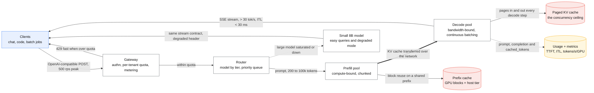
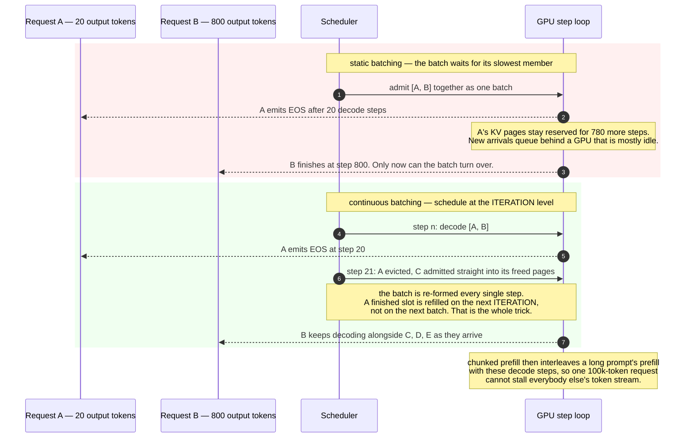

# Design an LLM serving platform

> Serve open-weight LLMs to internal products: chat, code assistance, batch summarisation.
> **The hard part:** GPU memory is the bottleneck and it's consumed by the **KV cache**, which
> grows with every token of every concurrent request. Everything here is about keeping GPUs busy
> without running out of memory.

## 1. Clarify

| Question | Assumed answer |
|---|---|
| Self-hosted or API? | Self-hosted open-weight models, plus a hosted-API path for the hardest queries |
| Models? | One 70B-class chat model, one 8B fast model, one embedding model |
| Traffic? | 500 rps peak, mixed prompt lengths (200 to 100k tokens) |
| Latency? | Interactive: TTFT < 500 ms, > 30 tokens/s per stream. Batch: throughput only |
| Multi-tenant? | Yes — many internal teams, need quotas and isolation |
| SLO tiers? | Interactive vs batch, with different guarantees |

**Non-goals:** training/fine-tuning infrastructure, the applications themselves.

## 2. Requirements

**Functional**
- OpenAI-compatible chat/completions API with streaming
- Multiple models, versioned; routing by tier and task
- Per-tenant quotas, rate limits, and usage accounting
- Batch endpoint for offline jobs at lower priority

**Non-functional**

| Target | Value |
|---|---|
| TTFT (interactive) | p95 < 500 ms |
| Inter-token latency | < 30 ms (≈ 33 tok/s) |
| GPU utilisation | > 70% — **this is the cost metric** |
| Availability | 99.9%, degrade to a smaller model |

## 3. Estimates

```
Model weights: 70B params × 2 B (fp16) = 140 GB → doesn't fit one 80 GB GPU
   → tensor parallelism across 2–4 GPUs, or fp8/int8 quantisation (70 GB / 35 GB)

KV cache — the thing that actually limits concurrency:
   ≈ 2 (K and V) × layers × heads_kv × head_dim × 2 B × tokens
   For a 70B-class model, roughly 0.1–0.5 MB per token of context (GQA reduces this a lot).
   At ~0.2 MB/token:
      one 8k-token conversation ≈ 1.6 GB of KV
      80 GB GPU − 70 GB weights (fp8) = ~10 GB free → ~6 concurrent 8k conversations  ← ouch
      Quantise weights to int4 (~35 GB) → ~45 GB for KV → ~28 concurrent            ← the lever

Throughput: prefill is compute-bound (parallel over tokens), decode is memory-bandwidth-bound
   (one token at a time). They have opposite bottlenecks — which is why they get separated.

Cost: H100-class GPU ≈ $2–5/hour on demand.
   16 GPUs ≈ $30–60k/month. Utilisation is the whole game.
Comparison anchor: a hosted frontier API (e.g. Claude Opus 5 at $5/M input, $25/M output)
   — always compute the break-even before assuming self-hosting is cheaper.
```

> [!info] The scary number
> **KV cache per concurrent request.** It, not FLOPs, sets your concurrency ceiling, and it's why
> PagedAttention exists.

## 4. API / contract

```http
POST /v1/chat/completions
  { model, messages, max_tokens, stream: true, temperature, tenant_id }
  → SSE token stream, then usage {prompt_tokens, completion_tokens, cached_tokens}

POST /v1/batch          # lower priority, higher throughput, no latency SLO
GET  /v1/models
GET  /v1/usage?tenant=  # accounting and chargeback
```

Return `cached_tokens` — tenants can only optimise prompt reuse if you tell them it's happening.

## 5. Architecture

Drawn out, with the rates and payloads on the edges:



### Deep dive A — the four techniques that make this affordable

| Technique | Problem it solves | Effect |
|---|---|---|
| **Continuous batching** | Static batching wastes slots: the batch waits for its slowest sequence | Schedule at the *iteration* level — finished sequences leave, new ones join immediately. Large throughput gain; the foundational trick (from Orca) |
| **PagedAttention** | KV cache fragmentation — reserving worst-case contiguous memory per request wastes most of it | Page the KV cache like virtual memory, in fixed blocks. Near-zero waste, enables prefix sharing |
| **Chunked prefill** | A long prefill blocks all decodes, spiking inter-token latency for everyone | Split prefill into chunks and interleave with decode steps. Smooth ITL under mixed loads |
| **Prefix caching** | The same system prompt / RAG context is re-prefilled per request | Reuse KV blocks for shared prefixes — big saving for RAG and agents, where prefill dominates |

Together these are why a modern serving stack handles several times the traffic of a naive
`model.generate()` loop on identical hardware.

Continuous batching is the one worth drawing, because the gain is invisible until you look at
what a finished sequence does to the slot it leaves behind:



### Deep dive B — prefill/decode disaggregation

Prefill and decode have **opposite bottlenecks**: prefill is compute-bound and parallel over the
prompt; decode is memory-bandwidth-bound and strictly sequential. Co-locating them means each
interferes with the other — a long prefill stalls everyone's token stream.

**PD disaggregation** puts them on separate GPU pools: prefill nodes process prompts and transfer
the resulting KV cache over the network to decode nodes.

- **Buys:** independent scaling (RAG workloads are prefill-heavy; chat is decode-heavy),
  predictable inter-token latency, better hardware fit per pool.
- **Costs:** KV cache transfer bandwidth between pools, a scheduler that must place and track
  requests across two tiers, and more operational surface.
- **Status:** by 2026 this is the industry-standard architecture, supported across the major
  serving frameworks (vLLM, SGLang, TensorRT-LLM, LMDeploy, NVIDIA Dynamo) and deployed at scale
  by large providers. Say it by name — it's the current state of the art and a strong signal.

> [!tip] Interview line
> "I'd start co-located with continuous batching and chunked prefill, and move to prefill/decode
> disaggregation when the workload mix makes interference the dominant latency problem — which
> for RAG-heavy traffic it will, because prefill is most of the work."

### Deep dive C — memory and quantisation

Order of levers when you run out of GPU memory:

1. **Quantise weights** — fp16 → fp8 → int4. 2–4x memory freed for KV cache, small measured
   quality cost. Gate on an eval set, not vibes.
2. **KV cache quantisation** (fp8/int8) — directly multiplies concurrency.
3. **GQA / MQA models** — grouped-query attention shrinks KV per token dramatically; a model
   architecture choice with an enormous serving consequence.
4. **Tensor parallelism** across GPUs for weights; **pipeline parallelism** across nodes when a
   model doesn't fit a single node.
5. **Cap max context per tier** — a 200k-token context request consumes the KV budget of dozens of
   normal ones. Price and quota it accordingly.
6. **Preemption/eviction**: under memory pressure, evict a low-priority sequence's KV cache and
   recompute later. Better than OOM-killing the server.

### Deep dive D — routing and quality/cost trade

- **Model routing**: a small model handles the easy majority; escalate hard queries to the large
  model or a hosted frontier API. Typically the largest single cost lever, often 5–10x.
- **Speculative decoding**: a small draft model proposes tokens, the large model verifies several
  at once — 1.5–3x decode speedup with identical output distribution when done correctly.
- **Structured output / constrained decoding** for JSON, so downstream parsing doesn't need retries.
- **Semantic answer caching** upstream of the model — the cheapest token is the one never generated.
- **Build vs buy:** compute honestly. Self-hosting wins on sustained high volume with a fixed
  model; a hosted API wins on spiky traffic, frontier quality, and zero ops. Saying "here's the
  break-even in tokens/month" is a much better answer than picking a side.

## 6. Data model / state

Mostly stateless per request, but three pieces of state matter:

| State | Where | Note |
|---|---|---|
| KV cache | GPU memory, paged | The scarce resource; sized and monitored |
| Prefix cache | GPU + optional CPU/host tier | Shared system prompts and RAG contexts |
| Conversation history | **Client/application side**, resent per request | The serving tier stays stateless and horizontally scalable |
| Usage records | Warehouse | Per-tenant accounting and chargeback |

## 7. Scale & failure

| Breaks first at 10x | Fix |
|---|---|
| KV cache memory | Quantisation, GQA models, context caps, PD disaggregation |
| Prefill compute (long RAG prompts) | More prefill nodes, prefix caching, shorter contexts |
| Queue depth for interactive traffic | Priority queues, admission control, autoscaling, shed batch first |
| GPU availability/cost | Spot for batch, reservations for interactive, multi-region |

| Component fails | Blast radius | Degraded behaviour |
|---|---|---|
| A GPU node dies | In-flight requests on it fail | Retry on another node (requests are stateless); drain on health failure |
| Large model unavailable | Interactive quality drops | **Route to the small model** with a header noting degradation |
| Overload | Latency collapse for everyone | Admission control + queue timeouts: reject fast with 429 rather than accept work you can't finish |
| One tenant floods the platform | Everyone suffers | Per-tenant token-rate quotas at the gateway, separate queues per tier |

## 8. Ops & cost

- **SLO:** TTFT p95 < 500 ms, ITL p95 < 30 ms, 99.9% availability, GPU utilisation > 70%.
- **Alert on:** queue depth and wait time, KV cache utilisation, preemption rate, TTFT/ITL by
  tier, tokens/s/GPU, per-tenant token spend anomalies, OOM/eviction counts.
- **Rollout:** model or engine version changes go through an eval suite (quality) plus a load
  test (throughput/latency), then canary by traffic percentage per tenant tier.
- **Cost:** GPU hours dominate; everything else is noise. Track **$/1M tokens served** and
  **tokens/s/GPU**. Levers, biggest first: routing to smaller models, quantisation, batching
  efficiency, prefix caching, spot instances for batch work, and raising utilisation by mixing
  batch traffic into interactive troughs.
- **First thing I'd cut:** max context length per tier, and interactive capacity reserved for
  overnight troughs (fill it with batch).

## On AWS and Azure

| | AWS | Azure |
|---|---|---|
| **Self-hosted (the case as written)** | vLLM on EKS over P5/P4d or Inferentia, behind an ALB; **SageMaker real-time endpoints** are the managed alternative and now expose **`RoutingStrategy: PREFIX_AWARE` with an `X-Amzn-SageMaker-Prefix-Aware-Id` header — "the service routes requests with the same prefix and the same identifier to the same instance"**, which is prefix-cache-aware routing as a platform feature | vLLM on AKS over ND/NC-series GPUs behind Front Door, or Azure ML managed online endpoints. GPU quota is per VM family and **"specialized VM families like NCasT4\_v3, NC\_A100\_v4, or NDv2 series start with a default of zero cores"** — the capacity conversation starts at zero |
| **Hosted API (the escape hatch)** | **Amazon Bedrock**, metered per model per Region in **tokens per minute, input and output combined** on the `bedrock-runtime` endpoint | **Azure OpenAI**, metered in **TPM with a fixed requests-per-minute ratio attached** per model version |
| **What you configure** | Tensor-parallel degree, `--max-model-len`, GPU memory utilisation fraction, chunked prefill, prefix-cache size; on Bedrock, Provisioned Throughput model units versus on-demand | The same self-hosted knobs; on Azure OpenAI, deployment type (Standard / Global Standard / Data Zone / Provisioned) and PTU count |
| **The default that bites** | **A model's quota is shared across every inference API**: "Although the quota names refer to `InvokeModel`, they aren't per-API" — `InvokeModel`, `Converse`, `Responses` and Chat Completions all draw on one bucket, while the `bedrock-mantle` endpoint is counted **separately for the same underlying model**. Output tokens burn down at a **model-specific rate**, and `max_tokens` affects the deduction — so an over-generous `max_tokens` costs quota you never used | **The RPM-to-TPM ratio changes between model *versions*.** `gpt-chat-latest` versions `2026-05-05` through `2026-06-24` allow **10 RPM per 1,000 TPM**; version `2026-08-06` allows **1 RPM per 1,000 TPM**. Upgrading a model version can cut your request headroom by 10× with no change to your token quota |
| **What it costs you** | RPM quotas are model-specific and some models have none at all, governed purely by tokens — so a capacity plan written in requests per second is not portable across models. Daily caps also exist: max tokens per day defaults to the per-minute quota × 1,440 | **32 standard deployments per resource** and **100,000 PTUs per deployment**; global batch quota is denominated in **enqueued tokens**, which count against you until the job reaches a terminal state — a stuck batch holds quota it is not using |
| **Where the case's own numbers land** | The KV-cache ceiling is unchanged by either cloud. What both give you is the *multi-tenant metering* this case's gateway has to implement, and a per-model quota that already thinks in tokens rather than requests | Same |

Two things are worth saying out loud. **Both clouds meter in tokens, not requests**, which is the
same conclusion this case reaches from GPU memory — and it means a per-tenant quota expressed in
rps is wrong on the platform *and* wrong on the passthrough. And **prefix-aware routing is now
purchasable on AWS**, which is the routing half of §Deep dive B arriving as a header.

## In an LLM deployment

This case *is* the LLM deployment, so the useful thing this section can do is name which of the
corpus's mechanisms change shape here, and how — the same mapping every other page makes in
miniature.

**The economics invert, and the inversion has a number on this page already.** A cache miss costs
a prefill: at ~$2–5 per H100-class GPU-hour, a 4-second prefill recomputed for every request that
misses the prefix cache is the dominant cost line, which is why
[cache-failure-modes](../fundamentals/cache-failure-modes.md) reads differently here than
anywhere else. A deploy empties the prefix cache and reloads 140 GB of weights, so **you schedule
your own cold start every rollout** — drain, warm with representative prefixes, and never roll all
replicas at once.

**The unit of work is enormous and variable.** A 200-token request and a 100 k-token request share
a queue, and every assumption built on uniform millisecond requests breaks: load balancing by
connection count is wrong, p99 latency without conditioning on prompt length is meaningless, and a
timeout that is generous for one tier is absurd for the other. This is why prefill and decode get
separated — they have opposite bottlenecks — and why the priority queue is not optional.

**The state is huge and warm.** KV cache, prefix cache and weights all have to be resident, so an
eviction, a restart or a scale-out costs far more than it does for a stateless service. Autoscaling
that assumes a new replica is useful the moment it is `Ready` will route traffic to a cold GPU;
gate readiness on a warm-up probe that has actually run a prefill.

The one thing that does *not* change: everything in the corpus about queues, backpressure, retry
budgets and shedding applies unaltered. A retry storm against a GPU fleet is the same metastable
failure, only each retry costs a dollar instead of a disk seek.

## Referenced by

- [8-week study plan](../07-drills/8-week-plan.md)
- [Books already on this machine](../10-resources/books-on-this-machine.md)
- [Design a RAG assistant over company documents](rag-assistant.md)
- [Engineering blogs and case studies](../10-resources/engineering-blogs.md)
- [Microsoft, Apple, Netflix and other big tech](../09-company-styles/microsoft-apple-netflix.md)
- [ML and GenAI cases index](README.md)
- [ML system design playbook](ml-playbook.md)
- [Question bank](../07-drills/question-bank.md)
- [Repo index](../../INDEX.md)

## Sources & further reading

- [Inside vLLM: anatomy of a high-throughput inference system](https://vllm.ai/blog/2025-09-05-anatomy-of-vllm)
- [vLLM — PagedAttention and continuous batching explained](https://www.runpod.io/articles/guides/vllm-pagedattention-continuous-batching)
- [LLM serving optimization: continuous batching, PagedAttention, chunked prefill on H100 (2026)](https://www.spheron.network/blog/llm-serving-optimization-continuous-batching-paged-attention/)
- [FlowKV: disaggregated inference with low-latency KV cache transfer (arXiv)](https://arxiv.org/pdf/2504.03775)
- Local book: `AI/LLM-Apps/AI Engineering — Chip Huyen (2025).pdf` — inference optimisation chapters
- Local book: `AI/MLOps/LLM Engineer's Handbook.epub`
- Related: [rag-assistant.md](rag-assistant.md), [../02-primitives/cost-engineering.md](../02-primitives/cost-engineering.md)

Cloud claims in §On AWS and Azure (all verified 2026-09-21):

- [AWS — quotas for the `bedrock-runtime` endpoint](https://docs.aws.amazon.com/bedrock/latest/userguide/quotas-runtime.html) — per-model per-Region TPM combining input and output, quotas shared across `InvokeModel`/`Converse`/`Responses`/Chat Completions, `bedrock-mantle` counted separately, model-specific RPM (some models have none), daily cap defaulting to per-minute × 1,440, output-token burndown rates and the effect of `max_tokens`
- [AWS — quotas for Amazon Bedrock](https://docs.aws.amazon.com/bedrock/latest/userguide/quotas.html) — token-based quota model and the two inference endpoints
- [AWS — `InvokeEndpoint` API reference](https://docs.aws.amazon.com/sagemaker/latest/APIReference/API_runtime_InvokeEndpoint.html) — `PrefixAwareId` and the `PREFIX_AWARE` routing strategy, 60-second container response requirement
- [Azure OpenAI quotas and limits](https://learn.microsoft.com/en-us/azure/ai-foundry/openai/quotas-limits) — RPM-per-1,000-TPM ratios by model version, 32 standard deployments per resource, 100,000 PTUs per deployment, global batch quota in enqueued tokens
- [Azure — manage resources and quotas for Azure Machine Learning](https://learn.microsoft.com/en-us/azure/machine-learning/how-to-manage-quotas) — specialized GPU VM families default to zero cores
- [vLLM — automatic prefix caching](https://docs.vllm.ai/en/latest/features/automatic_prefix_caching.html)
- [Anthropic — prompt caching](https://docs.claude.com/en/docs/build-with-claude/prompt-caching) — 5-minute sliding TTL with a 1-hour option
