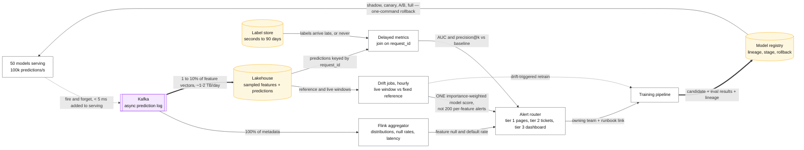
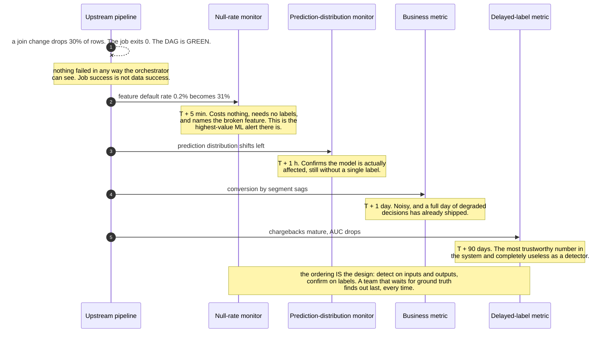

# Design ML monitoring, evaluation and retraining

> The platform layer that keeps 50 production models honest: detects degradation, evaluates
> changes, retrains safely, and rolls back fast.
> **The hard part:** the ground truth arrives late or never, so you have to detect problems from
> inputs and outputs alone — and then prove a fix actually helped.

## 1. Clarify

| Question | Assumed answer |
|---|---|
| How many models, owned by whom? | ~50 models, 15 teams |
| Label delay? | Varies: seconds (clicks) to 90 days (chargebacks); some have no labels at all |
| Retraining cadence? | Per-model: daily to monthly, plus drift-triggered |
| Who is on call for model quality? | The owning team; the platform provides detection |
| Do we run online experiments? | Yes — a shared A/B platform exists |

**Non-goals:** the models, the feature store ([feature-store.md](feature-store.md)), the training
compute platform.

## 2. Requirements

**Functional**
- Log every prediction with features, model version and context
- Detect data drift, concept drift and skew per model; alert the owner
- Compute delayed-label metrics as labels arrive
- Run offline evaluation on every candidate model, sliced by segment
- Support shadow, canary, A/B and holdback deployment patterns; one-click rollback
- Maintain a model registry with lineage: data → features → code → model → deployment

**Non-functional**

| Target | Value |
|---|---|
| Detection latency | Drift detected within 1 hour of onset |
| Logging overhead | < 5 ms added to prediction latency |
| False alarms | Low enough that alerts aren't muted — **the binding constraint** |
| Retention | Predictions 90 days; aggregates 2 years |

## 3. Estimates

```
50 models × avg 2k rps = 100k predictions/s
   Full logging: 100k/s × 2 KB (features + prediction + context) = 200 MB/s = 17 TB/day  ← too much
   → sample: 100% of metadata (cheap), 1–10% of full feature vectors, 100% for money/safety models
   → ~1–2 TB/day, tiered to object storage
Drift computation: per model × per feature × per hour
   50 models × 200 features × 24 = 240k distribution comparisons/day — trivial in aggregate,
   but a naive per-feature alert would page someone 240k times. Aggregate first.       ← the design
```

> [!info] The scary number
> Not the data volume — the **alert volume**. 50 models × 200 features is 10,000 things that can
> individually "drift". Alerting per feature guarantees the system gets muted within a week.

## 4. API / contract

```python
# instrumentation (in the serving path, async, non-blocking)
monitor.log_prediction(
    model="fraud_v7", request_id=..., features={...},
    prediction=0.83, decision="review", latency_ms=42, ts=...,
)
monitor.log_label(request_id=..., label=1, source="chargeback", ts=...)

# registry
registry.register(model, metrics=..., training_data_ref=..., feature_refs=..., code_sha=...)
registry.promote("fraud_v8", stage="canary", traffic_pct=5)
registry.rollback("fraud")            # must be one command, and rehearsed
```

Logging is **async and fire-and-forget** — monitoring must never add latency to, or take down,
the prediction path.

## 5. Data model

| Store | Content | Retention |
|---|---|---|
| Prediction log | request_id, model_version, features (sampled), prediction, decision, context | 90 days |
| Label store | request_id → label, source, arrival timestamp | 2 years |
| Metrics store (time-series) | Per-model, per-feature distributions and summary stats | 2 years aggregated |
| Model registry | Versions, lineage, eval results, deployment state, owner | Forever |
| Eval sets | Golden/held-out sets, versioned | Forever |

Joining predictions to labels on `request_id` is the whole point of the schema — without a shared
ID assigned at prediction time, you cannot compute a single delayed metric.

## 6. Architecture

With the volumes and the sampling decisions on the edges:



### Deep dive A — what to monitor, in priority order

The ordering is the answer: you almost never have fresh labels, so monitor inputs and outputs
first.

| Priority | Signal | Detects |
|---|---|---|
| 1 | **Feature null / default rate** | Broken upstream pipeline. **The highest-value ML alert there is** — models degrade silently and immediately when features go missing |
| 2 | **Prediction distribution shift** | Something changed: input drift, a bad deploy, or an upstream bug. Cheap, needs no labels |
| 3 | **Feature distribution drift** | Input drift, per feature, aggregated to a model-level score |
| 4 | **Serving latency / error rate** | Ordinary reliability |
| 5 | **Business metric by segment** | The thing you actually care about, but noisy and slow |
| 6 | **Delayed-label metrics** | Ground truth — most trustworthy, arrives last |

One real defect, and when each layer finds out about it:



**Drift tests:** PSI or KL divergence for numeric features, chi-square for categorical, and a
KS test for continuous distributions. Compare a rolling live window against a **fixed reference**
(the training distribution) *and* against last week (seasonality-aware). Report a per-model
drift score built from feature importances so the alert says "this model has drifted", not
"feature 147 moved" — that aggregation is what keeps alert volume survivable.

**Skew vs drift** — different root causes, different fixes:
- *Data drift*: the input distribution moved. Retraining usually helps.
- *Concept drift*: the input→label relationship moved. Retraining on **recent** data helps;
  retraining on everything doesn't.
- *Training–serving skew*: a bug. Retraining does nothing; fix the pipeline.

Saying which of the three you'd suspect from which symptom is a strong deep-dive answer.

### Deep dive B — evaluation before deployment

1. **Offline eval** on a time-split held-out set, **sliced by segment** — new users, each region,
   mobile, high-value customers. An aggregate improvement that hides a segment regression is the
   classic silent failure, and slicing is what catches it.
2. **Backtesting** on a historical window with point-in-time-correct features.
3. **Shadow mode**: run the candidate on live traffic, serve nothing, compare predictions and
   latency against the champion. Catches skew and performance problems with zero user risk.
4. **Online A/B** with proper sample-size math, a fixed duration decided in advance (no peeking
   until significance), guardrail metrics that can abort the test, and per-segment results.
5. **Holdback**: keep a small permanent cohort on the old model to measure long-run effects an
   A/B test can't see (novelty decay, ecosystem effects).

### Deep dive C — retraining

| Trigger | Use when |
|---|---|
| Scheduled (daily/weekly) | Stable domains, cheap training |
| **Drift-triggered** | Volatile domains — retrain when the drift score crosses a threshold |
| Metric-decay-triggered | You have reasonably fresh labels |
| Data-volume-triggered | Cold-start systems accumulating their first data |

Non-negotiables to state: the pipeline is **reproducible** (pinned data snapshot, code SHA,
config, seed), the new model must **beat the incumbent on the eval suite** before it can be
promoted, and promotion is automated but **gated** — auto-train, auto-evaluate, *human or
metric-gated* promotion for anything that touches money or safety.

**Continuous training pitfall to raise:** a model retrained on data its predecessor generated
locks in its own biases. Keep exploration traffic and a random-exposure slice so you retain an
unbiased sample to train and evaluate on.

### Deep dive D — keeping alerts trustworthy

- **Tier models**: revenue/safety-critical models page; experimental models write to a dashboard.
- Aggregate feature-level signals into one model-level drift score before alerting.
- Every alert names the owning team and links a runbook. No owner → the model gets deprecated.
- Track per-alert **precision** (did it correspond to a real problem?) and retire alerts that
  never do. An alert nobody acts on is worse than no alert — it manufactures false confidence.

## 7. Scale & failure

| Breaks first at 10x | Fix |
|---|---|
| Prediction log volume | Sample harder (keep 100% of metadata, less of features), compress, tier |
| Drift job runtime | Sketches (t-digest, HLL) instead of raw distributions; incremental computation |
| Alert volume | Stricter tiering, aggregation, suppression during known incidents |
| Registry/experiment metadata | Standard database scaling; not the hard part |

| Component fails | Blast radius | Degraded behaviour |
|---|---|---|
| Logging pipeline down | Blind to quality | **Serving unaffected** (async by design); alert on log-arrival rate |
| Label pipeline broken | Metrics silently freeze | Alert on **label arrival rate** — a frozen metric looks like a healthy metric |
| Drift job fails | No detection | Alert on job absence; a monitoring system must monitor itself |
| Registry down | Can't deploy or roll back | Cache last-known-good deployment state locally so rollback still works |

## 8. Ops & cost

- **SLO:** drift detected < 1 h; alert precision > 50%; 100% of tier-1 models have an owner, a
  runbook and a rollback path.
- **Alert on:** feature null rates, model drift scores, prediction distribution shifts, delayed
  metrics vs baseline, label arrival rate, monitoring job health.
- **Rollout:** shadow → canary → A/B → full, with automatic rollback on guardrail breach. Rollback
  must be **one command and rehearsed** — an untested rollback is not a rollback.
- **Cost:** log storage and drift compute. Levers: sampling rates, retention tiers, sketch-based
  statistics. Keep it well under the cost of the models it protects, and say what fraction that is.
- **First thing I'd cut:** full feature logging for non-critical models (metadata only), and raw
  prediction retention 90 → 30 days.

## On AWS and Azure

| | AWS | Azure |
|---|---|---|
| **The shape** | **SageMaker Model Monitor** over data captured at the endpoint into S3, with Clarify for bias and explainability drift; **SageMaker Model Registry** for versions and approval state; CloudWatch for metrics and alarms; Athena/Iceberg for the prediction↔label join | **Azure ML model monitoring** over data collected from managed online endpoints into ADLS Gen2, with Azure Monitor for metrics and alerts; the Azure ML registry for versions and stages; Fabric or Databricks for the join |
| **What you configure** | Data-capture sampling percentage on the endpoint, a baseline from the training set, monitoring schedule, constraint thresholds per feature | Data collector on the deployment, signals (data drift, prediction drift, data quality, feature attribution drift), lookback windows and per-signal thresholds |
| **The default that bites** | **Data capture is a property of the endpoint**, so the moment the model moves in-process — which this track's other cases show is where every high-throughput model ends up — Model Monitor captures nothing and the logging is yours. The capture sampling percentage is also set per endpoint, not per model criticality, so "100% for money models, 1% elsewhere" is a deployment decision, not a policy | **The 5 MBPS bandwidth cap per managed online endpoint applies to captured data too**, because it is measured at the endpoint. And Azure Monitor's Prometheus store caps an Azure Monitor workspace at **1,000,000 active time series** — one model's 200 features across a handful of segments is thousands of series, so 50 models is a cardinality budget, not a rounding error |
| **What it costs you** | 100 k predictions/s × 2 KB is 17 TB/day if you capture everything; both clouds make you sample, and neither samples *by model tier* for you | **20 rules per Prometheus rule group, not increasable**, and 500 rule groups per workspace. This case's alerting design — aggregate first, alert on a model-level summary rather than per feature — is also the only design that fits inside those limits |
| **Retention** | Predictions to S3 with lifecycle rules to Glacier; the 90-day/2-year split is a storage-class policy | Prometheus retention is **18 months, and that limit "can't be increased"**; a query is capped at a **32-day time range**, so a two-year aggregate trend is stitched, not queried |

Both clouds monitor the *endpoint*, and this track's other six cases all put the model somewhere
else — in-process behind a feature fetch, in a Flink operator, in a batch job. That is the mismatch
worth naming: managed model monitoring is excellent for the deployment shape it assumes, and
silently inert for the one you will actually ship at scale. The platform you build here is the
logging contract, not the dashboards.

## In an LLM deployment

Everything on this page still applies and **the ground-truth problem gets worse, not better**: for
a generative system there is often no label at all, not even a late one. That is the whole
difference, and it forces three changes.

**The proxies change.** You cannot compute accuracy, so you monitor what you can see: refusal
rate, response length distribution, citation rate, tool-call success rate, latency and token
counts per route, and thumbs/edit-rate from users. A model that has started answering badly still
emits perfect infrastructure metrics — see
[metrics-monitoring](../03-backend-cases/metrics-monitoring.md), which structurally cannot catch
this — so the proxies are the only early signal.

**Evaluation becomes a model, and needs the same governance as one.** LLM-as-judge is the standard
answer for offline eval, and it is a model that drifts, has a version, and must itself be
validated against human judgements on a golden set. Treat the judge as a registered model with its
own lineage; pin its version when you compare two candidates, or you are measuring the judge.

**The A/B math is harder and the retraining loop is shorter.** Quality differences are small,
noisy and often per-segment, so the sample sizes are larger than for a click-through metric — and
the cheapest changes (a prompt, a retrieval parameter, a routing rule) ship far more often than a
retrain. The registry has to version **prompt, retrieval config and model together**, because a
rollback that restores the model weights and leaves yesterday's prompt in place has rolled back
nothing.

One number to keep the cost honest: at 100 k predictions/s, a judge model invoked on even 0.1% of
traffic is 100 evaluations per second, billed. Sample by tier — 100% of a safety-critical route,
a trickle elsewhere — and compute the bill before you turn it on.

## Referenced by

- [Books already on this machine](../10-resources/books-on-this-machine.md)
- [Design a metrics and alerting system](../03-backend-cases/metrics-monitoring.md)
- [Design a RAG assistant over company documents](rag-assistant.md)
- [Design a recommender system](recommender.md)
- [ML and GenAI cases index](README.md)
- [Question bank](../07-drills/question-bank.md)
- [Repo index](../../INDEX.md)

## Sources & further reading

- Local book: `DE/Warehouse-ETL/Designing machine learning systems — Chip Huyen.pdf` — the monitoring and continual-learning chapters
- Local book: `AI/MLOps/2023-10-EB-Big-Book-of-MLOps-2nd-Edition.pdf`
- Local book: `DE/System-Design/Implementing MLOps in the Enterprise.pdf`
- Related: [feature-store.md](feature-store.md), [../02-primitives/observability-and-delivery.md](../02-primitives/observability-and-delivery.md)

Cloud claims in §On AWS and Azure (all verified 2026-09-21):

- [AWS — `InvokeEndpoint` API reference](https://docs.aws.amazon.com/sagemaker/latest/APIReference/API_runtime_InvokeEndpoint.html) — `InferenceId` is "added to the captured data when you enable data capture on the endpoint", i.e. capture is an endpoint property
- [Azure — manage resources and quotas for Azure Machine Learning](https://learn.microsoft.com/en-us/azure/machine-learning/how-to-manage-quotas) — 5 MBPS bandwidth and 500 requests/s per managed online endpoint
- [Azure — Azure Monitor service limits](https://learn.microsoft.com/en-us/azure/azure-monitor/fundamentals/service-limits) — 1,000,000 active time series per Azure Monitor workspace, 20 rules per rule group (not increasable), 500 rule groups, 18-month retention that cannot be increased, 32-day maximum query time range
- [AWS — Amazon Managed Service for Prometheus service quotas](https://docs.aws.amazon.com/prometheus/latest/userguide/AMP_quotas.html) — active-series and ingestion quotas for the metrics half
