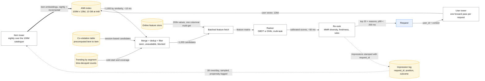
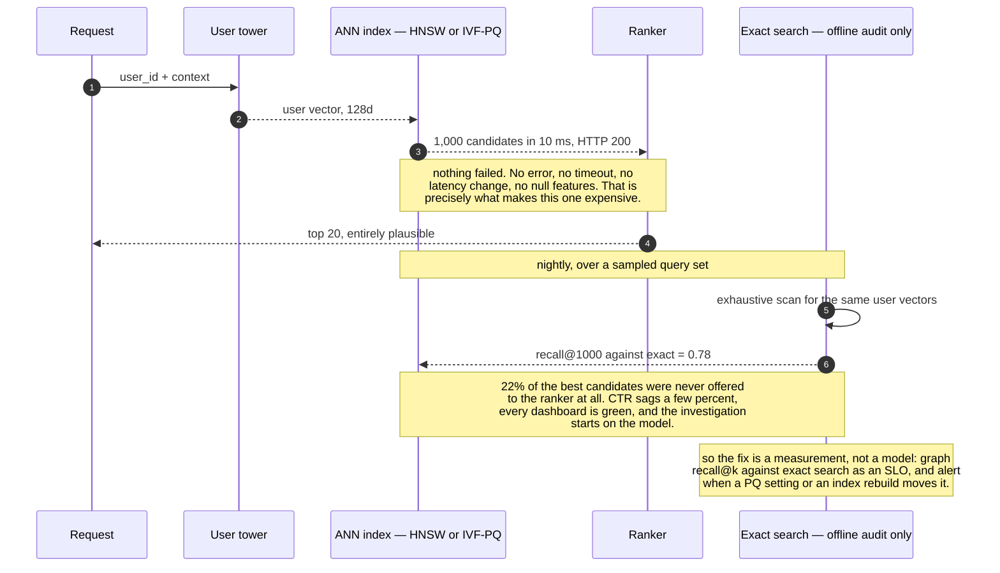

# Design a recommender system

> "Recommended for you" on a catalogue of 100M items for 200M users.
> **The hard part:** you cannot score 100M items in 100 ms, so the whole design is
> **candidate generation → ranking**, plus cold start and the feedback loop that biases your
> training data.

## 1. Clarify

| Question | Assumed answer |
|---|---|
| What are we recommending, and where? | Homepage rows + "more like this" on an item page |
| Business metric? | Long-term engagement (watch time / repeat visits), not raw CTR |
| Catalogue size / user base? | 100M items, 200M users, 20M DAU |
| Latency? | p99 < 200 ms for the homepage |
| Freshness? | New items discoverable within an hour; user actions reflected within minutes |
| Personalisation depth? | Yes, plus context (device, time of day, session) |

**Non-goals:** the content ingestion pipeline, ads, pricing.

## 2. Requirements

**Functional**
- Return a ranked, deduplicated, diverse list of N items per user per surface
- Handle new users and new items (cold start)
- Support "because you watched X" explanations

**Non-functional**

| Target | Value |
|---|---|
| p99 latency | < 200 ms end to end |
| Throughput | 20M DAU × 20 requests/day ≈ 5k rps, 15k peak |
| Freshness | User signal < 5 min; new item < 1 h |
| Availability | 99.9% — degrade to popularity, never fail the page |

**Guardrails:** diversity (not 10 near-identical items), freshness (not all catalogue classics),
and a hard rule that engagement optimisation must not tank long-term retention.

## 3. Estimates

```
Scoring cost: 15k rps × 100M items = impossible. Two-stage is not optional.
   Candidate generation: 100M → ~1,000 via ANN + heuristics    ~10 ms
   Ranking: 1,000 items × ~200 features, GBDT/small NN         ~50 ms
Embeddings: 100M items × 128 dims × 4 B = 51 GB (fp32) → 13 GB at int8   ← fits in RAM
   200M user embeddings × 128 × 4 B = 102 GB → sharded, or computed at request time
Feature fetch: 1,000 items × 200 features = 200k values per request
   → must be a batched, columnar lookup, not 1,000 KV round trips           ← the real risk
Training data: 20M DAU × 50 impressions = 1B rows/day. Sample negatives.
```

> [!info] The scary number
> Feature fetch for 1,000 candidates inside a 50 ms slice. This, not model accuracy, is what
> makes or breaks the latency budget — and it's the part most candidates forget.

## 4. API / contract

```http
GET /v1/recommendations?surface=home&user_id=&context={device,locale}&limit=20
  → 200 { items: [{item_id, score, reason: "because you watched X", debug_id}], model_version }

POST /v1/feedback  { user_id, item_id, event: "impression"|"click"|"complete"|"dismiss", ts, request_id }
```

**`request_id` on both sides** ties impressions to the exact model version, candidate set and
feature values used — without it you cannot debug ranking or train unbiased models.

## 5. Data model

| Store | Content | Why |
|---|---|---|
| Vector index (ANN) | 100M item embeddings | Candidate generation by similarity |
| Online feature store (KV) | User features, item features, counters | Ranking-time lookup, < 10 ms batched |
| Offline feature store (lakehouse) | Point-in-time-correct historical features | Training without leakage |
| Interaction log | Every impression + outcome + context + request_id | Training labels and offline eval |
| Model registry | Versioned models + metadata + eval results | Rollout and rollback |

**Labels:** implicit and biased. A click is positive; a non-click on something shown is a
"negative" only if it was actually seen (log viewport/position). Correct for **position bias** —
item 1 gets clicked because it's item 1 — with position as a training feature that's set to a
constant at inference, or with inverse-propensity weighting.

## 6. Architecture

The same shape as components. Note that only the *user* tower is on the request path:



### Deep dive A — candidate generation

| Source | Mechanism | Covers |
|---|---|---|
| **Two-tower embeddings** | User tower and item tower trained to place engaged pairs close; serve with ANN (HNSW/IVF-PQ) | The personalised bulk |
| **Item-to-item co-visitation** | "Users who watched X also watched Y", precomputed | Session context, new users |
| **Trending / popular** | Time-decayed counts per segment | Cold start, coverage, fallback |
| **Rules / editorial** | Curated rows, new releases | Business needs, launch content |

**Two-tower is the workhorse and worth explaining precisely:** the item tower runs offline (embed
the whole catalogue nightly, incrementally for new items), and only the *user* tower runs at
request time — one small forward pass, then an ANN lookup. That asymmetry is what makes
100M-item retrieval feasible at 10 ms.

**ANN trade-offs to name:** HNSW gives excellent recall/latency at high memory; IVF-PQ compresses
hard (int8/PQ) at some recall cost. Say you'd measure **recall@k against exact search** — an ANN
index silently losing 20% recall is a common, invisible failure. It is worth walking through why
it is invisible, because every instinct points at the ranker instead:



### Deep dive B — ranking

- Features: user (history, demographics, long-term preference embeddings), item (metadata,
  quality, age, popularity), **user×item interaction** (has the user watched this genre, past
  engagement with this creator), and context (device, hour, session position).
- Model: **GBDT is a strong default** for tabular; a DNN wins when you need embeddings and
  multi-task heads. **Multi-task** matters: predict click *and* completion *and* long-term value,
  then combine — optimising click alone produces clickbait, which is exactly the guardrail
  failure the interviewer wants you to anticipate.
- Calibration matters if scores are combined with business values (expected revenue = p(click) ×
  value). Uncalibrated scores make blending meaningless.

### Deep dive C — cold start

| Cold | Approach |
|---|---|
| **New user** | Popularity by inferred segment (locale, device, referrer), onboarding preference picker, fast adaptation within the first session using in-session signals |
| **New item** | Content-based embedding from metadata/text/image (no interaction data needed), plus **deliberate exploration** — give new items forced impressions and measure |
| **New user + new item** | Content features on both sides; two-tower handles this naturally if towers use content features, not just IDs |

**Exploration is a design requirement, not a nicety:** without it you only ever learn about items
you already show, and the catalogue's tail stays permanently invisible. Epsilon-greedy or
Thompson sampling on a small traffic slice, with logged propensities so you can train unbiased
models later.

### Deep dive D — diversity and the feedback loop

- **MMR / determinantal-style re-ranking**: trade relevance against dissimilarity so the list
  isn't ten variations of one thing.
- **Filter bubbles / popularity bias**: popular items get shown, get more interactions, get more
  popular. Counter with exploration, popularity-debiased training (down-weight by exposure), and
  diversity constraints in the re-rank.

## 7. Scale & failure

| Breaks first at 10x | Fix |
|---|---|
| Feature fetch for candidates | Fewer candidates, feature caching, colocated feature service, int8 features |
| ANN index memory | Quantisation (PQ/int8), sharded index, tiered by item popularity |
| Ranking latency | Smaller model, distillation, early-exit, fewer candidates |
| Training data volume | Negative sampling, downsampling impressions, incremental training |

| Component fails | Blast radius | Degraded behaviour |
|---|---|---|
| Ranking service | No personalisation | **Serve candidate order / popularity** — always have this path |
| Feature store slow | Ranking degrades | Serve with default/imputed features, and **alert on the default rate** — silent feature nulls are the classic invisible quality regression |
| ANN index stale | Missing new items | Fall back to co-visitation + trending; alert on index age |
| Model registry deploy bad model | Quality drop across the product | Canary + automatic rollback on guardrail metrics |

## 8. Ops & cost

- **SLO:** p99 < 200 ms; recommendation availability 99.9%; feature default rate < 1%.
- **Alert on:** prediction score distribution shift, feature null/default rates, ANN recall
  proxy, CTR by segment, index freshness, model-version traffic split.
- **Rollout:** offline eval (NDCG/recall on a time-split set, sliced by segment) → shadow →
  1% A/B with guardrails → ramp. Keep a **permanent holdback** on the old model so you can
  measure long-run effects that A/B tests miss.
- **Cost:** ranking compute and the feature store dominate; the ANN index is memory-heavy but
  cheap per query. Levers: candidate count, model size, caching recommendations for low-activity
  users, precomputing the head and computing the tail live.
- **First thing I'd cut:** candidate count (1,000 → 400) and recomputation frequency for
  inactive users.

## On AWS and Azure

| | AWS | Azure |
|---|---|---|
| **The shape** | Two-tower training on SageMaker; item embeddings into **OpenSearch Serverless** (or Aurora `pgvector`) as the ANN index; features from ElastiCache/DynamoDB; ranker in-process on ECS/EKS; interaction log to S3/Iceberg | Two-tower training in Azure ML or Databricks; item embeddings into **Azure AI Search** (vector index) or Cosmos DB for NoSQL vector search; features from Azure Managed Redis; ranker in-process on AKS; interaction log to ADLS Gen2 |
| **What you configure** | ANN algorithm and parameters (HNSW `m`/`ef_search`), embedding dimensionality and quantisation, shard/replica count, refresh interval for new items | Vector profile and algorithm, dimensions, partitions and replicas (search units), indexer schedule or push-API writes |
| **The default that bites** | The ANN index is a **shard-count and heap decision, not a slider**. OpenSearch caps shard size at **65 GiB** on most families with Multi-AZ standby, Java heap at **50% of memory up to 32 GiB**, and — on OpenSearch 2.17 and above — shards at **"1000 per every 16 GB of heap to a max of 4000", with a default that "can't be changed."** A 51 GB fp32 embedding set is a cluster-sizing exercise before it is a recall exercise | **Azure AI Search enforces a vector quota per partition as a hard limit** — 35 GB per partition on a current S1 — and "further indexing attempts once the limit is exceeded result in failure." The 51 GB fp32 index needs 2 partitions on S1 or int8 quantisation; 13 GB at int8 fits one. Quantisation stops being an optimisation and becomes a provisioning decision |
| **What it costs you** | The ANN index is a cluster you size, patch and re-shard; new-item freshness is a refresh-interval trade against query latency | Capacity is fixed blocks: **S1 is 12 partitions × 160 GB and 12 replicas, capped at 36 search units**, and there is no autoscale. The "new item searchable within an hour" SLA collides with the **5-minute minimum indexer schedule** only if you use an indexer — push new items directly |
| **The part neither sells you** | Feature fetch for 1,000 candidates inside 50 ms. This case names it as the real risk, and it is a batched columnar read from your own online store on both clouds | Same, with the added note that an Azure ML managed online endpoint (**500 rps, 5 MBPS**) is not where the ranker goes |

The split is consistent with the rest of the ML track: both clouds sell a good vector index and
neither sells the ranking tier. The genuinely different fact is *how* the index is sized — a
cluster with shard and heap ceilings on AWS, a fixed quota per partition that fails writes on
Azure — and it decides whether you quantise before you have measured recall.

## In an LLM deployment

The two-stage shape survives; what changes is where the embeddings come from and what cold start
costs.

**Content embeddings solve the item cold-start problem outright.** A brand-new item has no
interactions, so collaborative signal is empty — but its title, description and thumbnail produce a
vector immediately, and it lands in the same ANN index the collaborative embeddings live in. That
is the single biggest thing a large model adds to this design, and it is entirely offline. The
user side does not get the same gift: a new user has no history to embed, and the honest answer is
still popularity plus onboarding signals.

**"Because you watched X" becomes generated rather than templated** — and this is where the design
has to be careful. The explanation must be derived from the *actual* retrieval reason (the nearest
neighbour that produced the candidate), not asked of a model that has only seen the final list, or
you are shipping plausible fabrications about your own system. Pass the reason; let the model
phrase it.

**The re-embedding migration is the real operational cost.** Changing the embedding model means
recomputing 100 M item vectors and rebuilding the ANN index, during which two vector spaces coexist
and cannot be compared. Run the new index alongside the old, shadow-evaluate recall, and cut over —
the same shadow pattern [ml-monitoring-and-eval](ml-monitoring-and-eval.md) prescribes for models,
applied to an index.

One thing gets worse. The feedback loop this case already warns about tightens: if generated
descriptions or model-chosen thumbnails influence what gets clicked, the model is now shaping the
training data for the next model. Keep a holdback that never sees generated presentation, or you
lose the ability to tell whether recommendations improved or the copy just got better.

## Referenced by

- [Design video streaming (YouTube / Netflix)](../03-backend-cases/video-streaming.md)
- [ML and GenAI cases index](README.md)
- [Question bank](../07-drills/question-bank.md)
- [Repo index](../../INDEX.md)

## Sources & further reading

- Local book: `DE/Warehouse-ETL/Designing machine learning systems — Chip Huyen.pdf`
- Vendor: `10-resources/vendor/applied-ml/README.md` — recommendation case studies from real companies
- [YouTube — Deep Neural Networks for YouTube Recommendations](https://research.google/pubs/pub45530/)
- [Netflix Tech Blog — recommendations](https://netflixtechblog.com/)
- Related: [feed-ranking.md](feed-ranking.md), [feature-store.md](feature-store.md)

Cloud claims in §On AWS and Azure (all verified 2026-09-21):

- [AWS — Amazon OpenSearch Service quotas](https://docs.aws.amazon.com/opensearch-service/latest/developerguide/limits.html) — 65 GiB maximum shard size, Java heap 50% of memory up to 32 GiB, shard-count quota by engine version and the non-adjustable default on OpenSearch 2.17+
- [Azure AI Search — service limits for tiers and SKUs](https://learn.microsoft.com/en-us/azure/search/search-limits-quotas-capacity) — vector quota per partition as a hard limit with indexing failure on exceeding it, 35 GB per partition on a current S1, 12 partitions × 160 GB and 36-SU cap, 5-minute minimum indexer schedule
- [Azure — manage resources and quotas for Azure Machine Learning](https://learn.microsoft.com/en-us/azure/machine-learning/how-to-manage-quotas) — 500 requests/s and 5 MBPS per managed online endpoint
