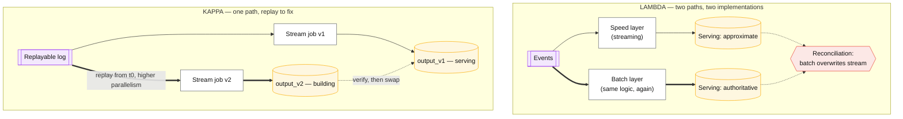
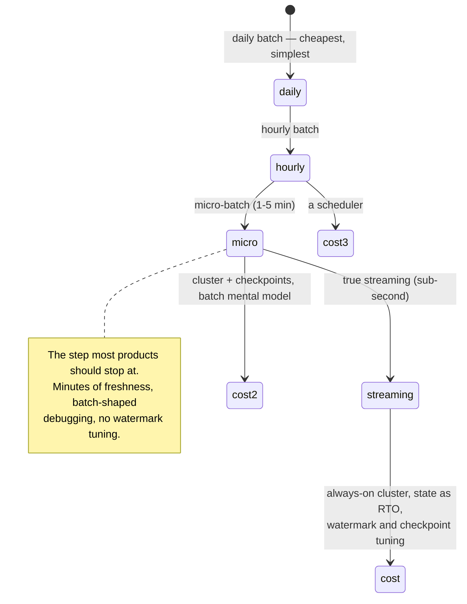

# Batch vs streaming

## Core concept

The choice is a trade between **freshness** and **everything else** — cost, operational surface,
reproducibility, and the number of people who can debug it at 3am. Batch sees all its input before
answering; streaming never does, so it must guess when a window is complete
([../fundamentals/stream-processing-semantics.md](../fundamentals/stream-processing-semantics.md)),
carry state between runs, and handle late data explicitly.

The recommendation this page commits to: **start with batch, move to micro-batch when someone can
name a decision that minute-old data changes, and move to true streaming only when they can name
one that second-old data changes.** Most "real-time" requirements are satisfied by a five-minute
schedule, and the honest question is not "how fresh can we be?" but *"what decision changes if this
is 5 minutes old instead of 5 seconds?"* — if nobody can answer, the requirement is aesthetic.

## The comparison

| | **Batch** (hourly/daily) | **Micro-batch** (Spark Structured Streaming) | **True streaming** (Flink) |
|---|---|---|---|
| **Freshness** | Hours | Seconds to minutes | Sub-second to seconds |
| **Correctness model** | Complete input; trivially reproducible | Event-time capable; batch mental model | Event time, watermarks, exactly-once state |
| **State** | None between runs | Checkpointed per micro-batch | **Continuous, large, and your real RTO** |
| **Failure recovery** | Re-run the job | Re-run the batch | Restore state, replay from checkpoint |
| **Reproducibility** | Perfect — same input, same output | Good | Requires event time and deterministic logic |
| **Late data** | Naturally included in the next run | Handled, with watermarks | Explicit: drop / side output / retract |
| **Operational surface** | A scheduler | A cluster and checkpoints | Cluster, checkpoints, state backend, watermark tuning, rescaling |
| **Who can debug it** | Everyone | Most of the data team | The two people who set it up |
| **Cost** | Bursty; cheap on spot capacity | Medium | Always-on |
| **Choose when** | Freshness need is hours — **the default** | Minutes is genuinely required | Seconds is a product requirement |

### Lambda vs Kappa, and why Kappa usually wins now

Lambda's cost is not the extra infrastructure — it is that **every business rule exists twice**, in
two languages, on two schedules, maintained by people who will eventually let them drift. The
divergence is discovered when the batch layer overwrites the speed layer's numbers and someone asks
why the dashboard changed.

Kreps's argument is that reprocessing does not need a second implementation: run a **second
instance of the same stream job** from the start of retained history, write to a new output table,
raise parallelism to catch up quickly, then switch. That is the same build-verify-swap discipline
as [../patterns/backfill-and-reprocessing.md](../patterns/backfill-and-reprocessing.md), and it is
why Kappa became the default where retention allows it.

**When Lambda still wins:** a regulatory or contractual requirement for an independently computed
authoritative number, or a history longer than any log you are willing to retain.

### The freshness ladder, priced

## Numbers that matter

| Quantity | Value | Confidence |
|---|---|---|
| End-to-end latency, true streaming | `watermark delay + window size + checkpoint alignment` — **often minutes**, not the per-record figure vendors quote | See [../fundamentals/stream-processing-semantics.md](../fundamentals/stream-processing-semantics.md) |
| Micro-batch latency | Seconds to a few minutes, set by the trigger interval | Vendor-configurable |
| Batch latency | The schedule, plus runtime | Definitional |
| State restore time (streaming) | ~minutes per 100 GB — **this is your recovery objective** | Order of magnitude |
| Cost shape | Batch: bursty, spot-friendly. Streaming: always-on, reserved | Structural |
| Sliding-window state multiplier | `size ÷ slide` — a 1 h window sliding every 1 min holds **60×** the state | Arithmetic |
| Lambda maintenance cost | **Every rule implemented twice**, forever | Structural — the reason Kappa exists |
| Retention needed for Kappa | ≥ the history you may need to reprocess; tiered storage changes the economics | See [../fundamentals/log-vs-queue.md](../fundamentals/log-vs-queue.md) |
| Uber's real-time platform | Petabyte-scale streaming with **millions of events/s**, built on Kafka + Flink + Pinot | [Uber, SIGMOD 2021](https://www.uber.com/blog/real-time-data-infrastructure-at-uber/) |

**The arithmetic that reframes the requirement.** A "real-time dashboard" with 5-minute tumbling
windows, 30 s of allowed lateness and 60 s checkpoints has an end-to-end latency of ~5.5 minutes
for a *complete* answer. That is slower than a 5-minute micro-batch job, and considerably harder to
operate. **The window size dominates the framework choice**, and teams routinely buy streaming
infrastructure to deliver batch-shaped latency.

## Where the choice goes wrong

1. **Buying streaming for a batch requirement.** If the window is 5 minutes, a 5-minute job gives
   the same freshness with a fraction of the operational surface.
2. **Quoting per-record latency as end-to-end.** Watermark delay plus window size plus checkpoint
   alignment is the number the user experiences.
3. **Adopting Lambda by accident.** It usually happens gradually: a streaming job for the dashboard,
   a batch job for the "real" numbers, and nobody decided.
4. **Aggregating in processing time.** It is easier and it makes results irreproducible — a
   backfill produces different numbers, which is fatal for anything audited.
5. **Ignoring state as an operational object.** Restore time is your recovery objective; rescaling
   is a stop-restore-redistribute operation, not an autoscale.
6. **Assuming Kappa without checking retention.** Replay is the whole recovery story, and it
   requires retention you may not have.
7. **Not asking what decision changes.** "Real-time" that nobody acts on within the hour is a cost
   with no benefit — the strongest question available in this argument.

## Real-world examples

- **Kreps, *Questioning the Lambda Architecture*** — the argument against two implementations and
  the reprocessing recipe that made Kappa practical.
- **Uber (SIGMOD 2021)** — a documented petabyte-scale real-time platform on Kafka + Flink +
  Pinot, with the requirements (surge pricing, fraud, ETAs) that genuinely justify seconds.
- **Netflix Keystone** — streaming as a platform with a router, so most teams consume a managed
  pipeline rather than operating Flink.
- **Spark Structured Streaming** — micro-batch as the pragmatic middle: event-time semantics with a
  batch mental model, on infrastructure teams already run.
- **dbt + a warehouse on a schedule** — the batch answer that quietly serves the large majority of
  "analytics in real time" requirements at a fraction of the cost.

## Staff-level follow-ups

1. A stakeholder asks for "real-time" dashboards. Give the three questions that determine whether
   they need streaming, micro-batch or a 15-minute batch job.
2. Compute end-to-end latency for a Flink pipeline with 5-minute windows, 30 s lateness and 60 s
   checkpoints. Compare it to a 5-minute micro-batch and choose.
3. Your team has drifted into Lambda. Describe the migration to a single path, and what you would
   keep from the batch layer.
4. When is Lambda still correct? Name the requirement, and say what you do to stop the two
   implementations diverging.
5. Estimate the log retention needed for Kappa on a pipeline that may need to reprocess 90 days,
   then price it with and without tiered storage.

## See also

- [../fundamentals/stream-processing-semantics.md](../fundamentals/stream-processing-semantics.md) — watermarks, windows, checkpoints, state
- [../patterns/backfill-and-reprocessing.md](../patterns/backfill-and-reprocessing.md) — the replay recipe Kappa depends on
- [messaging-matrix.md](./messaging-matrix.md) — the transport under either architecture
- [../patterns/materialized-views-and-derived-data.md](../patterns/materialized-views-and-derived-data.md) — what both approaches are ultimately maintaining
- [../05-data-cases/realtime-analytics.md](../05-data-cases/realtime-analytics.md) — a full design that makes this choice

## Referenced by

- [Comparisons index](README.md)
- [Messaging matrix](messaging-matrix.md)
- [Technology selection tables](../08-reference/tech-selection.md)
- [Topic manifest](../topics/manifest.md)

## Sources

- [Kreps — Questioning the Lambda Architecture (2014)](https://www.oreilly.com/radar/questioning-the-lambda-architecture/)
- [Uber — Real-time data infrastructure at Uber (SIGMOD 2021)](https://www.uber.com/blog/real-time-data-infrastructure-at-uber/)
- [Akidau et al. — The Dataflow Model (VLDB 2015)](https://research.google/pubs/pub43864/)
- [Apache Flink — event time and checkpointing](https://nightlies.apache.org/flink/flink-docs-stable/docs/concepts/time/)
- [Spark — Structured Streaming programming guide](https://spark.apache.org/docs/latest/structured-streaming-programming-guide.html)
