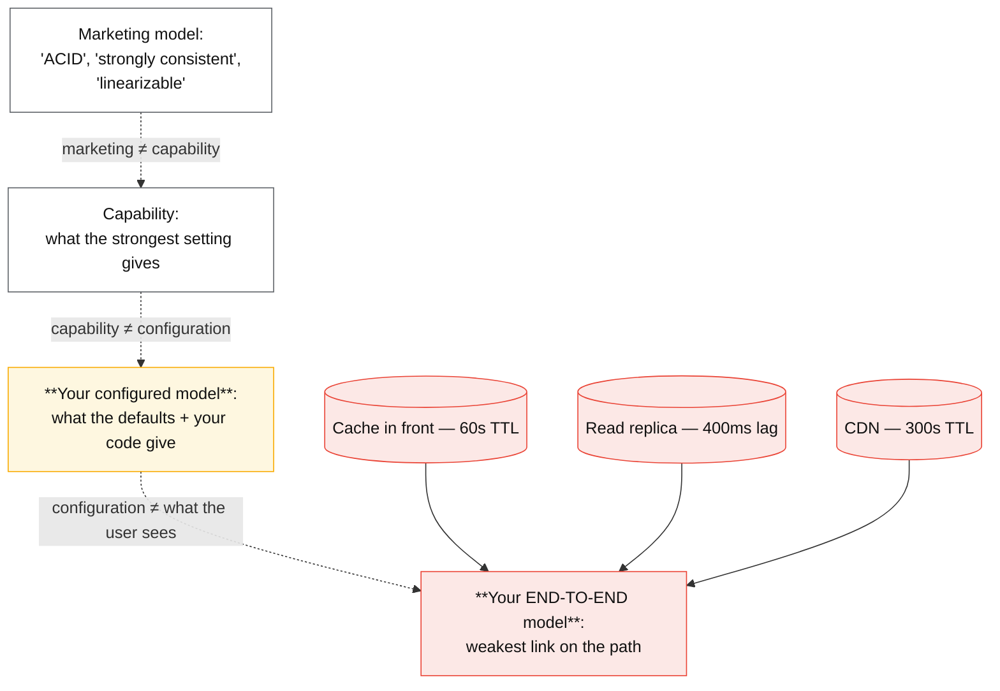
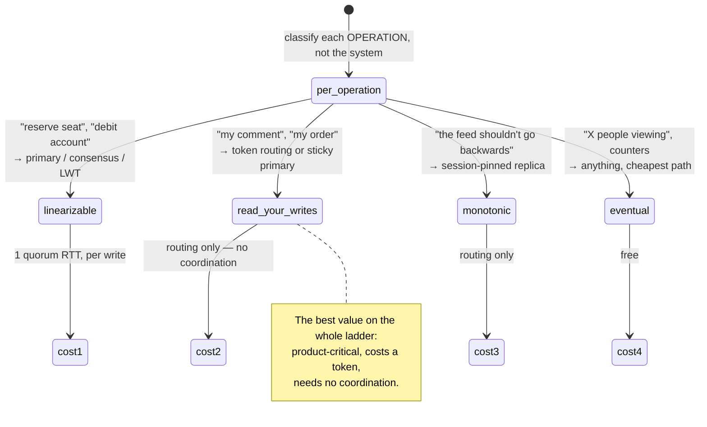

# Consistency model matrix

## Core concept

Two questions get conflated, and separating them is most of the value of this page:

1. **What is this system capable of guaranteeing?** — usually a lot, at a price.
2. **What does it guarantee in your configuration, which is probably the default?** — usually much
   less.

Every system here can be configured toward strong consistency. Almost none does so by default,
because defaults optimise for the benchmark and the demo. So the recommendation this page commits
to: **write down the read and write settings for each operation, and test the anomaly you care
about.** A system's marketing model is not a design input; its configured model is.

The mechanics behind the vocabulary live in
[../fundamentals/consistency-models.md](../fundamentals/consistency-models.md) — this page places
real systems on that ladder and prices each rung.

## The comparison

| System | **Default** | Strongest available | PACELC | What the strong setting costs |
|---|---|---|---|---|
| **PostgreSQL / MySQL** (single primary) | Strong on the primary; **replicas lag** | Sync replication / `remote_apply` | PC/EL by default → PC/EC when synchronous | An extra RTT per commit; a stalled replica blocks or degrades |
| **PostgreSQL replicas** | Read-your-writes **not** guaranteed | Route by LSN/GTID, or read the primary | — | Router complexity, or primary load |
| **MongoDB** | `w: majority` since 4.x, but `readConcern: local` — **majority-durable, not majority-visible** | `w: majority` + `readConcern: majority`; `linearizable` reads | PC/EC when configured; PA/EL with weaker concerns | Latency per operation; linearizable reads need a `maxTimeMS` |
| **Cassandra / ScyllaDB** | `ONE` — eventual | `QUORUM` / `LOCAL_QUORUM`; LWT for linearizable ops | PA/EL → EC as R+W>N | `LOCAL_QUORUM` = 1 extra replica wait; LWT ≈ 4 round trips |
| **DynamoDB** | **Eventually consistent reads** | `ConsistentRead=true`; transactions | PA/EL → EC per request | **2× RCU**, single-AZ read, no cross-partition strength |
| **CockroachDB / Spanner / TiDB** | **Serializable / strict serializable** | Same — it is the default | PC/EC | 1 consensus RTT per write; 60–150 ms if the quorum spans regions |
| **Kafka (as a store)** | Per-partition total order; `acks=1` | `acks=all` + `min.insync.replicas=2` | — | A follower ack per write; two broker losses stop writes |
| **Redis** | Async replication — **acknowledged writes can be lost on failover** | WAIT / Redis Enterprise variants | PA/EL | Latency; and Redis is a cache unless you have decided otherwise |
| **S3 / object storage** | **Strong read-after-write** (since Dec 2020) | Same | — | Nothing — this changed and old advice is stale |

### The two traps this table exists to expose

**Trap one: defaults.** MongoDB's write concern default moved to `w: majority` in 4.x, which makes
writes majority-*durable* — but the default read concern remains `local`, so a read can still see
data that has not been majority-committed and could be rolled back. Cassandra defaults to `ONE`.
DynamoDB defaults to eventually consistent reads. None of these are wrong; all of them are
different from what people assume.

**Trap two: the end-to-end model.** A strictly serializable database behind a 60-second cache is a
60-second-stale system. The consistency model your users experience is the weakest link on the
path, and the path includes the CDN, the cache, the replica and the client's own store.

### Placing a design on the ladder

## Numbers that matter

| Quantity | Value | Confidence |
|---|---|---|
| DynamoDB strong read | **2× RCU**, and unavailable if that AZ is partitioned | [AWS docs](https://docs.aws.amazon.com/amazondynamodb/latest/developerguide/HowItWorks.ReadConsistency.html) |
| Cassandra `LOCAL_QUORUM` vs `QUORUM` cross-region | `QUORUM` adds a **cross-region RTT (60–90 ms)** to every operation | Arithmetic |
| Cassandra LWT | ~4 round trips | Order of magnitude |
| Consensus write (Cockroach/Spanner), same region | 1–5 ms | Order of magnitude |
| Consensus write, quorum spans regions | **60–150 ms** | Arithmetic from RTT |
| Spanner TrueTime commit wait | ≈ 2ε, typically < 7 ms of uncertainty | [Spanner OSDI 2012](https://research.google/pubs/pub39966/) |
| Postgres async replica lag | p50 5–50 ms, p99 to seconds; **minutes** under bulk writes | Order of magnitude |
| Read-your-writes via token routing | ~0 extra latency; **< 1%** of reads need the primary | The cheapest guarantee available |
| S3 read-after-write | Strongly consistent since **December 2020** | AWS-documented; a fact that invalidated a decade of interview answers |

**The arithmetic that decides multi-region designs.** `QUORUM` across two regions 70 ms apart puts
a cross-region round trip on *every* read and write. `LOCAL_QUORUM` keeps operations in-region and
gives up cross-region freshness. There is no third option that is both — and stating that clearly,
with the number attached, is the whole multi-region consistency conversation.

## Where the choice goes wrong

1. **Quoting the marketing model.** "It's ACID" / "it's strongly consistent" describes a capability.
   Name the settings.
2. **Believing durability implies visibility.** `w: majority` makes a write durable; a `local` read
   concern can still return data that has not been majority-committed.
3. **Choosing one model for the whole system.** The unit is the operation. Seat reservation needs
   linearizability; the "X people viewing" badge does not, and paying for it there is pure cost.
4. **Forgetting the cache and the CDN.** They are part of the consistency boundary, and they are
   usually the weakest link.
5. **Using `QUORUM` across regions by accident.** It works and it puts an ocean on every request.
6. **Skipping session guarantees.** Read-your-writes and monotonic reads are routing problems, not
   coordination problems — the best value on the ladder, and the most commonly missing.
7. **Trusting old facts.** S3 became strongly read-after-write consistent in 2020; anyone still
   designing around eventual S3 consistency is solving a problem that no longer exists.

## Real-world examples

- **Jepsen's consistency map** — the reference hierarchy, including which models remain available
  under partition; the vocabulary the rest of this page uses.
- **MongoDB read/write concerns** — the clearest example of durability and visibility being
  separate dials, and of defaults that changed across major versions.
- **Cassandra `LOCAL_QUORUM`** — the multi-region default, and an explicit trade of cross-region
  freshness for latency.
- **DynamoDB** — consistency as a per-request, priced choice: 2× RCU for a strong read makes the
  CAP trade a line item on the invoice.
- **Spanner / CockroachDB** — strict serializability by default, with the latency cost documented
  rather than hidden.
- **Amazon S3** — strong read-after-write since 2020: a reminder that these facts have dates.

## On AWS and Azure

This is the page where the two clouds have made the **opposite** design choice, and naming that is worth more in an interview than any single limit: AWS prices consistency **per request**, Azure configures it **per account**.

| | AWS | Azure |
|---|---|---|
| **The dial** | DynamoDB `ConsistentRead`, a per-request boolean, **default `false`** | An account-level default consistency level, overridable per request — but the traditional override *"can only be **relaxed**"*. Strengthening it means changing the account, or using the preview `ReadConsistencyStrategy` (Java v4.69+, .NET v3.46+) |
| **What strong costs** | **2× the read units**, and the read is served from a single AZ | 2× the RUs: Strong and Bounded Staleness read from two replicas of a four-replica set, so *"read throughput for strong and bounded staleness is half that of the other consistency levels"* |
| **The default** | Eventually consistent reads. Global tables default to **multi-Region eventual consistency (MREC)**, resolving conflicts by *"the modification with the latest internal timestamp... a 'last writer wins' conflict resolution method"* | **Session.** *"This level is the default level applied to Azure Cosmos DB accounts"* — read-your-writes and write-follows-reads inside one client session |
| **Strong across regions** | **MRSC** global tables: exactly three Regions (or two replicas plus a witness), synchronous replication, RPO zero — and **no TTL, no LSIs, no transactions**, and converting an existing table requires it to be **empty** | Strong is offered but **cannot be combined with multi-region writes**, and is *"blocked by default"* beyond 5,000 miles. Multi-region strong writes cost *"two times round-trip time (RTT) between any of the two farthest regions, plus 10 milliseconds at the 99th percentile"* |
| **Session guarantees** | Not a product feature — read-your-writes is yours to build with token routing | Built in: the SDK issues a session token per **partition** after every write and replays it on reads |
| **The default that bites** | On an MREC global table, a strongly consistent read is **only strong in the Region that took the write**: it *"may return stale data if the item was last updated in a different Region."* `ConsistentRead=true` reads like a global guarantee and is a regional one — the exact failure this page's first trap describes, sold as the fix for it | **Session consistency degrades to eventual, silently, whenever the token is missing.** *"If the client is re-created, its cache of session tokens is also re-created... read operations follow the same behavior as Eventual Consistency."* Every deploy, every new pod, every second app instance, every load balancer that doesn't pin — and the docs are explicit that with a round-robin balancer *"you could end up with inconsistent read results for a while"* |

Both bottom-row entries are the same lesson from opposite ends. AWS gives you a switch that is genuinely per-request and whose scope is narrower than its name. Azure gives you a guarantee that is genuinely useful and whose *precondition* — a session token, carried by one client — is the part nobody deploys. In both cases the configured model differs from the model your users experience, which is the whole argument of this page.

One fact worth updating in the table above: DynamoDB global tables now offer **MRSC**, so "eventual across regions, always" is no longer the complete answer for DynamoDB — it is the default, with a strongly consistent three-Region mode available at creation time and never after.

## In an LLM deployment

The consistency boundary grows two new members, and neither publishes a bound.

The first is the retrieval index, and it breaks **read-your-writes** in the most visible way a product can. A user uploads a document and immediately asks about it; the correct answer requires that document chunked, embedded and indexed, and the pipeline is seconds to minutes. A concrete number: **Azure AI Search indexers have a minimum schedule of 5 minutes on every tier**, so on the default pull-based ingest path, "ask about the file I just uploaded" is a five-minute-stale read unless you push the document through the indexing API directly on the upload path. No session token in any SDK covers that gap. The design answer is the one this page already ranks best value — route the writer's own read differently — but here "differently" means answering from the raw uploaded text until the index catches up, and saying so in the UI.

The second is stranger: **monotonic reads has no meaning for a generated answer.** Above `temperature: 0`, asking the same question twice returns different text from identical state, so "the answer went backwards" is not a consistency violation and cannot be detected as one. The guarantee you can actually offer is about the **retrieved context**, not the response — "every answer in this session was grounded in documents at least as fresh as your last upload" is falsifiable; "the same question gives the same answer" is not a property of the system at all. Classify the operations the way this page's ladder does, and the one that needs linearizability is almost never the generation: it is the tool call that moves money, and that one belongs on the primary with a condition expression, exactly as it would without a model in front of it.

## Staff-level follow-ups

1. Take a product you know and classify five operations by the consistency they actually need.
   Which ones are currently over-paying?
2. Explain the difference between `w: majority` and `readConcern: majority`, and give the anomaly
   that appears when you set only the first.
3. Your database is strictly serializable and users still see stale data. Walk the path and find
   the weakest link.
4. Compare `QUORUM` and `LOCAL_QUORUM` for a two-region deployment on latency and on failure
   behaviour, then say which you would choose and what the product must tolerate.
5. Design read-your-writes for a service with 50 k reads/s and 2 k writes/s without sending
   everything to the primary. What do you carry, and where does it fall back?

## See also

- [../fundamentals/consistency-models.md](../fundamentals/consistency-models.md) — the ladder and what each rung costs
- [../fundamentals/replication-lag-and-session-guarantees.md](../fundamentals/replication-lag-and-session-guarantees.md) — the cheap guarantees, in detail
- [../fundamentals/quorums-and-anti-entropy.md](../fundamentals/quorums-and-anti-entropy.md) — why `R + W > N` is weaker than it sounds
- [oltp-database-matrix.md](./oltp-database-matrix.md) — the engines these settings belong to
- [../fundamentals/caching-strategies.md](../fundamentals/caching-strategies.md) — the layer that usually defines the real model

## Referenced by

- [Comparisons index](README.md)
- [OLTP database matrix](oltp-database-matrix.md)
- [SQL vs NoSQL vs NewSQL](sql-vs-nosql-vs-newsql.md)
- [Technology selection tables](../08-reference/tech-selection.md)
- [Topic manifest](../topics/manifest.md)

## Sources

- [Jepsen — consistency models](https://jepsen.io/consistency)
- [Abadi — Consistency tradeoffs in modern distributed database design (PACELC)](https://www.cs.umd.edu/~abadi/papers/abadi-pacelc.pdf)
- [MongoDB — read concern and write concern](https://www.mongodb.com/docs/manual/reference/read-concern/)
- [AWS — DynamoDB read consistency](https://docs.aws.amazon.com/amazondynamodb/latest/developerguide/HowItWorks.ReadConsistency.html) and [S3 strong consistency (2020)](https://aws.amazon.com/s3/consistency/)
- [Cassandra — configuring consistency levels](https://cassandra.apache.org/doc/latest/cassandra/architecture/dynamo.html)
- [CockroachDB — transactions and consistency guarantees](https://www.cockroachlabs.com/docs/stable/architecture/transaction-layer)
- [AWS — How DynamoDB global tables work](https://docs.aws.amazon.com/amazondynamodb/latest/developerguide/V2globaltables_HowItWorks.html) — MREC default, last-writer-wins, regional scope of `ConsistentRead`, MRSC constraints, verified 2026-09-20
- [Azure — Consistency levels in Azure Cosmos DB](https://learn.microsoft.com/en-us/azure/cosmos-db/consistency-levels) — five levels, session-token behaviour, 2× RU cost of strong reads, strong-with-multi-region-writes restriction
- [Azure — Manage consistency levels in Azure Cosmos DB](https://learn.microsoft.com/en-us/azure/cosmos-db/how-to-manage-consistency) — Session is the account default; overrides can only relax
- [Azure — AI Search service limits](https://learn.microsoft.com/en-us/azure/search/search-limits-quotas-capacity) — 5-minute minimum indexer schedule on every tier
