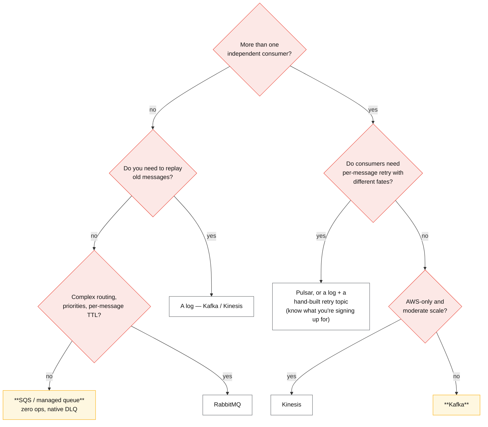

# Messaging matrix

## Core concept

Every one of these systems moves messages from producers to consumers. They differ on five axes
that decide which one you regret:

1. **Who owns the read position** — the broker (queue) or the consumer (log).
2. **Whether the data survives being read** — replay or no replay.
3. **What per-message retry costs you** — free in a queue, your code on a log.
4. **What ordering is guaranteed and at what granularity** — per queue, per partition, per message
   group.
5. **Who operates it** — and this axis frequently dominates the other four.

The recommendation this page commits to: **SQS unless you can name a second consumer or a replay
requirement.** Most "we need a message bus" requirements are a work queue, and the work queue with
zero operations wins on every axis that is not replay or fan-out.

## The comparison

| | **SQS** | **RabbitMQ** | **Kafka** | **Pulsar** | **Kinesis** |
|---|---|---|---|---|---|
| **Model** | Queue | Queue + routing | Log | **Both** (queue and log semantics) | Log |
| **Read position owned by** | Broker | Broker | Consumer group | Either, per subscription type | Consumer (per shard) |
| **Replay** | No — ack deletes | No | **Yes** — reset offsets | Yes | Yes, within retention |
| **Retention** | 4 days default, **14 max** | Until acked (queues are not storage) | Days → **infinite with tiered storage** | Native tiered storage | 24 h default, up to 365 days |
| **Ordering** | None (standard); per message group (FIFO) | Per queue | **Per partition** | Per key/partition | Per shard |
| **Per-message retry / DLQ** | **Native** — visibility timeout, receive count, redrive | Native | **Your code** — retry topic, attempt counts | Native (negative ack, retry topics) | Your code |
| **Consumer scaling** | Unlimited | Unlimited per queue | Capped by **partition count** | Decoupled from storage | Capped by shard count |
| **Throughput ceiling** | Effectively unlimited (standard); **300/s per message group** FIFO | Tens of thousands/s per queue | 100 MB/s–1 GB/s per broker | Similar; separates serving from storage | **1 MB/s or 1 000 records/s per shard** |
| **Ops burden** | **None** | Moderate (clustering, memory, queues as storage) | High (partitions, ISR, rebalances, retention) | Highest (brokers + BookKeeper + metadata store) | Low; shard management and resharding friction |
| **Choose when** | One consumer, no replay | Routing topologies, priorities, RPC-ish patterns | Multiple consumers, replay, stream processing | Genuinely need both models, multi-tenancy | AWS-native, moderate scale, managed |

### The decision, in the order it should be asked



### The axis that decides more than throughput: what happens when the consumer falls behind

```mermaid
sequenceDiagram
    autonumber
    participant P as Producers
    participant B as Broker
    participant C as Consumers

    Note over P,C: consumers slow down
    P->>B: keep producing
    C--xB: consuming below the produce rate

    rect rgb(255,240,240)
    Note over B: MEMORY-BOUND queue (Redis-backed, RabbitMQ under pressure)
    B->>B: memory fills
    B--xP: cannot enqueue
    B--xC: dequeue ALSO needs memory → wedged
    Note over B,C: Slack 2016: the queue locked in both directions;<br/>resolving the database contention did NOT unwedge it
    end

    rect rgb(240,255,240)
    Note over B: DISK-BOUND log (Kafka, Kinesis, SQS)
    B->>B: backlog grows on disk
    P->>B: producers unaffected
    C->>B: consumers catch up later, or replay
    end
```

That contrast is the most useful thing on this page. Slack's 2016 incident is the canonical
account: a database slowdown became a job-execution slowdown, which filled Redis to its memory
limit, at which point **new jobs could not be enqueued and existing jobs could not be dequeued** —
because dequeuing also required free memory. Fixing the original database contention did not
release the system; it took extensive manual intervention. Slack's response in 2017 was not to
replace Redis but to **put Kafka in front of it**, converting a memory-bound buffer into a
disk-backed one while keeping the existing enqueue/dequeue interfaces.

The generalisation: **a memory-bound queue has a cliff and a metastable failure at the cliff; a
disk-backed log degrades into a backlog.** See
[../fundamentals/cascading-and-metastable-failures.md](../fundamentals/cascading-and-metastable-failures.md).

## Numbers that matter

| Quantity | Value | Confidence |
|---|---|---|
| Slack job queue at the time of the redesign | ~**33 000 jobs/s** at peak | [Slack engineering](https://slack.engineering/scaling-slacks-job-queue/) |
| Slack's fix | **Kafka in front of Redis**, not instead of it — existing interfaces preserved | Same |
| SQS retention | 4 days default, **14 days max** | [AWS docs](https://docs.aws.amazon.com/AWSSimpleQueueService/latest/SQSDeveloperGuide/sqs-basic-architecture.html) |
| SQS FIFO throughput | **300 msg/s per message group** (3 000 with batching; higher in high-throughput mode) | AWS-documented — the limit that kills naive FIFO designs |
| Kinesis shard limits | **1 MB/s or 1 000 records/s in; 2 MB/s out** per shard | AWS-documented |
| Kafka per broker | 100 MB/s–1 GB/s, sequential-IO bound | Order of magnitude |
| Kafka consumer parallelism | = partition count; **increasing partitions rehashes keys** | Structural — treat as schema |
| Kafka retention | 7 days default; effectively unbounded with tiered storage (KIP-405) | Vendor default |
| RabbitMQ | Tens of thousands msg/s per queue; **queues are not durable storage** | Order of magnitude |

**The arithmetic nobody does before choosing FIFO.** SQS FIFO gives 300 messages/s **per message
group**. If the design uses one group per topic — the intuitive choice — the whole system is capped
at 300/s. Grouping per *entity* (per order, per user) preserves the ordering that actually matters
and removes the ceiling. The same reasoning applies to Kinesis shards and Kafka partitions: the
ordering granularity you choose is the parallelism you get.

## Where the choice goes wrong

1. **Defaulting to Kafka.** "We might want replay later" is speculative; partition sizing,
   rebalance tuning and retention economics are immediate. Name the second consumer or the replay
   requirement.
2. **Rebuilding per-message retry badly on a log.** A retry topic without attempt counts and a
   terminal DLQ is an infinite loop that looks like steady traffic — and it reorders the retried
   message after its successors.
3. **Using a memory-bound queue as durable storage.** Slack's incident is the reference: the
   failure is metastable, and the trigger being fixed does not release it.
4. **One FIFO message group for everything.** 300/s, and the design looks fine until launch.
5. **Treating partition count as tunable.** In Kafka and Kinesis it is effectively schema; changing
   it breaks per-key ordering for existing keys.
6. **Ignoring retention as a recovery bound.** If a consumer can be down longer than retention, you
   have a silent data-loss path — and `auto.offset.reset=latest` makes it silent.
7. **Comparing throughput numbers instead of operating models.** The ops-burden row decides more
   real outcomes than the throughput row.

## Real-world examples

- **Slack (2016 incident, 2017 redesign)** — Redis-backed job queue wedged in both directions at
  its memory limit; the fix was Kafka in front of Redis, preserving the existing interfaces at
  ~33 k jobs/s.
- **SQS + Lambda** — the archetypal work queue: visibility timeout, receive count, redrive policy
  to a DLQ, and no brokers. Most "message bus" requirements end here correctly.
- **Kafka as the event backbone** — multiple independent consumer groups over one topic, which is
  the property no queue provides; `__consumer_offsets` is itself a compacted topic.
- **Pulsar at Yahoo** — built because queue and log workloads were both needed and running two
  systems was worse; the cost is BookKeeper plus brokers plus metadata.
- **Kinesis** — managed logs with hard per-shard limits; the resharding friction is the thing teams
  underestimate.

## Staff-level follow-ups

1. A team wants Kafka for one consumer at 200 msg/s with no replay need. Argue for SQS, then state
   the two facts that would change your mind.
2. Explain Slack's 2016 wedge precisely — why did fixing the database not release the queue? — and
   name the property of the replacement that prevents it.
3. Design per-message retry on Kafka with attempt limits and a DLQ. Which ordering guarantee did
   you just give up, and how do you tell downstream teams?
4. Your SQS FIFO queue is capped at 300/s in production. Diagnose it and give the fix, then explain
   the general principle it illustrates.
5. Compute Kafka storage for 50 k msg/s at 2 KB, RF=3, 7-day retention, then decide between tiered
   storage, shorter retention and compaction.

## See also

- [../fundamentals/log-vs-queue.md](../fundamentals/log-vs-queue.md) — the structural difference in full
- [../fundamentals/kafka-internals.md](../fundamentals/kafka-internals.md) — ISR, acks, rebalances if you choose Kafka
- [../fundamentals/delivery-semantics.md](../fundamentals/delivery-semantics.md) — what any of these can actually promise
- [../fundamentals/cascading-and-metastable-failures.md](../fundamentals/cascading-and-metastable-failures.md) — why the memory-bound cliff is metastable
- [batch-vs-streaming.md](./batch-vs-streaming.md) — what you do with the stream once it exists

## Referenced by

- [Batch vs streaming](batch-vs-streaming.md)
- [Comparisons index](README.md)
- [Technology selection tables](../08-reference/tech-selection.md)
- [Topic manifest](../topics/manifest.md)

## Sources

- [Slack — Scaling Slack's job queue (2017)](https://slack.engineering/scaling-slacks-job-queue/) — the 2016 wedge and the Kafka-in-front redesign
- [AWS — SQS FIFO throughput quotas](https://docs.aws.amazon.com/AWSSimpleQueueService/latest/SQSDeveloperGuide/FIFO-high-throughput.html) and [SQS basic architecture](https://docs.aws.amazon.com/AWSSimpleQueueService/latest/SQSDeveloperGuide/sqs-basic-architecture.html)
- [AWS — Kinesis Data Streams quotas and limits](https://docs.aws.amazon.com/streams/latest/dev/service-sizes-and-limits.html)
- [Apache Kafka documentation](https://kafka.apache.org/documentation/) · [KIP-405 tiered storage](https://cwiki.apache.org/confluence/display/KAFKA/KIP-405%3A+Kafka+Tiered+Storage)
- [Apache Pulsar — concepts and architecture](https://pulsar.apache.org/docs/concepts-architecture-overview/)
- [RabbitMQ — queues, flow control and memory alarms](https://www.rabbitmq.com/docs/memory)
