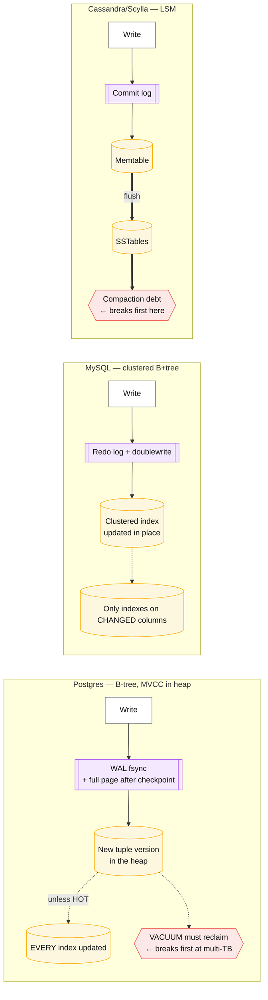
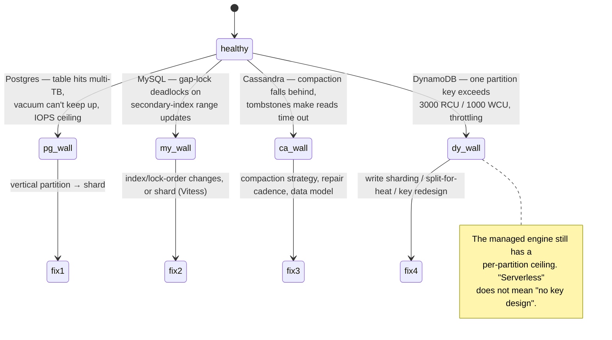

# OLTP database matrix

## Core concept

Feature checklists do not distinguish these engines — they all "support transactions", "scale
horizontally" and "offer high availability" if you read the marketing. The axes that actually
differ, and that determine which one you regret, are four:

1. **The write path** — what one write costs in fsyncs, round trips and amplification.
2. **What the default consistency actually is** — not what the strongest setting can be.
3. **What breaks first at scale** — vacuum, IOPS, compaction debt, per-partition throughput.
4. **Who carries the pager** — managed versus self-run is often a bigger difference than the data
   model.

This page commits to a recommendation: **Postgres unless you can name the property that rules it
out.** The engines below are ordered by how specific their justification needs to be.

## The comparison

| | **PostgreSQL** | **MySQL / InnoDB** | **Cassandra / ScyllaDB** | **DynamoDB** |
|---|---|---|---|---|
| **Storage engine** | Heap + B-tree, MVCC versions in the heap | Clustered B+tree, undo log | LSM | LSM (managed) |
| **Write path** | WAL fsync + page write; **full-page images after checkpoint** | Redo log + doublewrite buffer | Commit log + memtable, compaction later | Managed; replicated to 3 AZs |
| **Secondary index cost** | Index entries point at the **tuple location** → every update touches every index unless HOT applies | Index stores the **primary key** → only changed columns' indexes touched | Local indexes are a scatter-gather; global are a separate table | GSI is a **separate partitioned table** with its own capacity |
| **Default consistency** | Strong on primary; replicas lag | Same | **Eventual** (`ONE`); `QUORUM` opt-in | **Eventually consistent reads**; strong costs 2× |
| **Transactions** | Full ACID, SSI available | Full ACID, 2PL-flavoured serializable | Single-partition; LWT ≈ 4 round trips | Single-item; `TransactWriteItems` up to 100 items |
| **Breaks first at scale** | **Vacuum and IOPS on multi-TB tables**; connection count | Same, plus gap-lock deadlocks | **Compaction debt**, tombstones, repair windows | **3 000 RCU / 1 000 WCU per partition**; hot keys |
| **Ops burden** | Vacuum tuning, connection pooling, failover automation | Similar; replication topology | Repair scheduling is a permanent job | Near zero — capacity and key design only |
| **Cost shape** | Instance + storage | Instance + storage | Instances + the repair overhead | **Per request** — cheap small, expensive large |
| **Choose when** | Default. Unknown or evolving queries | Default with an existing MySQL org, or Vitess | Key-shaped, write-heavy, partition-tolerant | Key-shaped **and** you want zero ops |

### The write path, side by side

That diagram contains the single most consequential difference between the two relational engines:
**Postgres index entries point at the physical tuple, MySQL's point at the primary key.** It sets
update cost, replication volume and how much a wide primary key hurts — the mechanics are in
[../fundamentals/storage-engines.md](../fundamentals/storage-engines.md).

### What each one's "you will hit this" looks like

## Numbers that matter

| Quantity | Value | Confidence |
|---|---|---|
| Postgres/MySQL single-instance write ceiling | Tens of thousands of writes/s; low-TB working set | Order of magnitude |
| Figma's binding constraint | Highest-write tables approaching **max RDS IOPS**; multi-TB tables causing reliability impact **during vacuum** | [Figma engineering](https://www.figma.com/blog/how-figmas-databases-team-lived-to-tell-the-scale/) |
| Postgres full-page writes | First write to a page after each checkpoint writes the whole page to WAL | [Postgres docs](https://www.postgresql.org/docs/current/wal-configuration.html) — why WAL spikes after checkpoints |
| InnoDB secondary index | Stores the PK, so a wide PK inflates **every** index | Vendor behaviour |
| Cassandra/Scylla write | ~1 ms, 10 k–100 k/s per node | Order of magnitude |
| Cassandra LWT | ~4 round trips | Order of magnitude |
| Cassandra `gc_grace_seconds` | 10 days — **repair deadline**, not a preference | [../fundamentals/quorums-and-anti-entropy.md](../fundamentals/quorums-and-anti-entropy.md) |
| DynamoDB per-partition | **3 000 RCU / 1 000 WCU**; strong read = 2× RCU | [AWS docs](https://docs.aws.amazon.com/amazondynamodb/latest/developerguide/throttling-key-range-limit-exceeded-mitigation.html) |
| DynamoDB transaction | Up to 100 items, 2× cost | AWS-documented |
| Connection ceiling (Postgres) | Hundreds without a pooler; thousands with PgBouncer | Order of magnitude — the most common early wall |

**The cost-shape arithmetic that decides managed vs self-run.** DynamoDB at 5 k writes/s of 1 KB
items is 5 k WCU sustained — priced per request-unit, it is a predictable monthly line item and
zero operational headcount. The same workload on self-run Cassandra is perhaps 3–6 nodes plus a
permanent repair-scheduling responsibility. **Below a few thousand ops/s the managed option is
almost always cheaper once you price the pager; above some crossover it inverts.** Compute the
crossover for your numbers rather than arguing about it.

## Where the choice goes wrong

1. **Comparing engines on features rather than on what breaks first.** Every engine's real
   character is its failure mode at scale: vacuum, gap locks, compaction debt, per-partition
   throttling.
2. **Ignoring the index-pointer difference between Postgres and MySQL.** It decides update cost and
   replication volume, and it is invisible in any feature table.
3. **Treating DynamoDB as "no data modelling".** It has the strictest key design of anything here,
   because there is no planner to save a bad access pattern.
4. **Underestimating Cassandra's operational surface.** Repair within `gc_grace_seconds` is a
   correctness deadline; a cluster that has not completed a repair cycle is accumulating a liability.
5. **Comparing a managed service to a self-hosted one and calling it a data-model decision.** Half
   the difference is who carries the pager.
6. **Choosing Scylla purely for "C++, no GC".** It is a real advantage for tail latency, and it does
   not change the data model, the repair obligation, or the key-design constraints.
7. **Forgetting connections.** Postgres runs out of connections long before it runs out of
   throughput; the fix is a pooler, not a bigger instance.

## Real-world examples

- **Figma** — RDS Postgres to ~100× scale via vertical partitioning then horizontal sharding; the
  binding constraints were **IOPS and vacuum**, not the query engine.
- **Notion** — 480 logical shards on Postgres rather than a NoSQL migration; see
  [sql-vs-nosql-vs-newsql.md](./sql-vs-nosql-vs-newsql.md).
- **Discord** — Cassandra → ScyllaDB for a genuinely key-shaped, write-heavy workload; the move was
  *within* the family, driven by GC-induced tail latency and hot partitions.
- **Uber** — the widely cited Postgres → MySQL move, driven by secondary-index write amplification
  and its replication consequences; read with the HOT-update caveat in
  [../fundamentals/storage-engines.md](../fundamentals/storage-engines.md).
- **Amazon DynamoDB** — the managed extreme: no planner, no joins, explicit per-partition limits,
  and correspondingly little to operate.

## Staff-level follow-ups

1. Given an app with 20 k writes/s, 4 TB, and queries that change every quarter, choose an engine
   and defend it against the two strongest alternatives.
2. Explain why the same update pattern costs more on Postgres than on InnoDB, then give the
   condition under which it does not.
3. What breaks first on each of the four engines here? Give the metric that warns you and the
   mitigation.
4. Compute the crossover where self-run Cassandra becomes cheaper than DynamoDB for your workload,
   including operational headcount.
5. A team wants Scylla for tail latency. What do they gain, what do they still have to do, and what
   would you check before agreeing?

## See also

- [sql-vs-nosql-vs-newsql.md](./sql-vs-nosql-vs-newsql.md) — the family-level decision that precedes this one
- [consistency-model-matrix.md](./consistency-model-matrix.md) — what each engine's default guarantees
- [../fundamentals/storage-engines.md](../fundamentals/storage-engines.md) — B-tree vs LSM internals
- [../fundamentals/indexing-and-query-planning.md](../fundamentals/indexing-and-query-planning.md) — the index-cost differences in detail
- [../fundamentals/hot-shard-mitigation.md](../fundamentals/hot-shard-mitigation.md) — per-partition ceilings and what to do about them

## Referenced by

- [Comparisons index](README.md)
- [Consistency model matrix](consistency-model-matrix.md)
- [SQL vs NoSQL vs NewSQL](sql-vs-nosql-vs-newsql.md)
- [Technology selection tables](../08-reference/tech-selection.md)
- [Topic manifest](../topics/manifest.md)

## Sources

- [Figma — How Figma's databases team lived to tell the scale (2024)](https://www.figma.com/blog/how-figmas-databases-team-lived-to-tell-the-scale/)
- [AWS — DynamoDB partition throughput and adaptive capacity](https://docs.aws.amazon.com/amazondynamodb/latest/developerguide/burst-adaptive-capacity.html)
- [PostgreSQL — WAL configuration and full page writes](https://www.postgresql.org/docs/current/wal-configuration.html)
- [MySQL — InnoDB index and locking behaviour](https://dev.mysql.com/doc/refman/8.0/en/innodb-locking.html)
- [Cassandra — compaction and repair](https://cassandra.apache.org/doc/latest/cassandra/operating/compaction/index.html)
