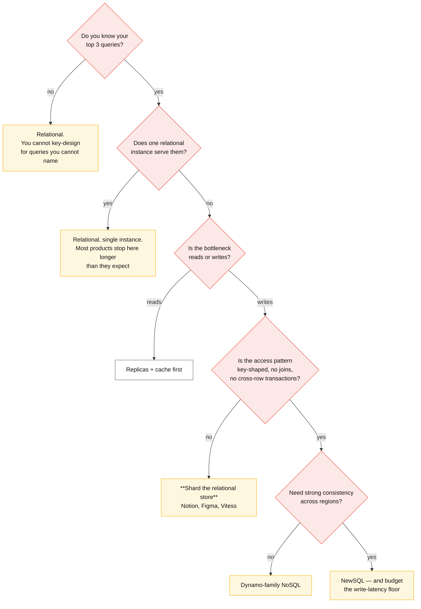
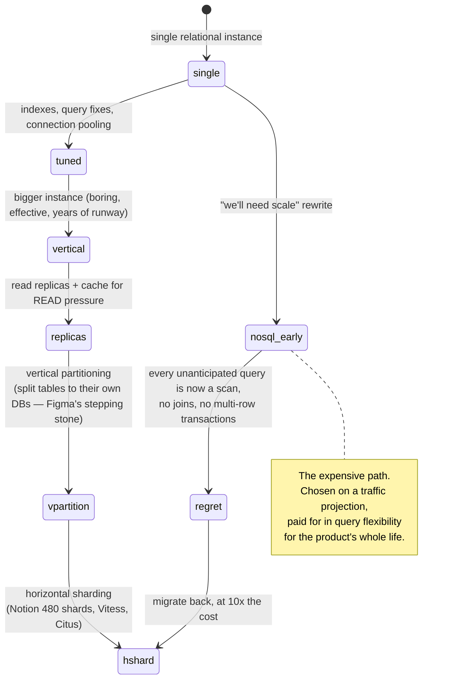

# SQL vs NoSQL vs NewSQL

## Core concept

The question is almost never "SQL or NoSQL". It is **"can my access patterns be served by one
relational instance, and if not, do I shard it or replace it?"** — and the published evidence from
teams who hit the wall points overwhelmingly at *shard it*. Notion sharded Postgres into 480
logical shards rather than migrating to a NoSQL store. Figma vertically partitioned and then
horizontally sharded Postgres on RDS, growing the stack ~100× without leaving it.

That is the recommendation this page commits to: **default to a relational store, and treat
"we need NoSQL for scale" as a claim requiring an access-pattern argument, not a traffic number.**
NoSQL earns its place when the access pattern is genuinely key-shaped and the write volume genuinely
exceeds what a sharded relational fleet does comfortably — and when you can give up joins, ad-hoc
queries and multi-row transactions without a fight.

**What each choice actually costs:** SQL costs you a sharding project eventually. NoSQL costs you
every query you did not design for. NewSQL costs you latency on every write, forever, plus a much
smaller operational community when something goes wrong at 3am.

## The comparison

| | **Relational (Postgres, MySQL)** | **NoSQL** (Dynamo/Cassandra-family, document) | **NewSQL / distributed SQL** (Spanner, Cockroach, TiDB, Yugabyte) |
|---|---|---|---|
| **Access pattern it serves** | Anything — including queries you have not thought of yet | The ones in your key design. Others are scans | Anything, with a distributed cost |
| **Write path** | Single primary; scale by vertical, then partitioning, then sharding | Horizontal by construction | Consensus per shard: **≥ 1 quorum round trip per write** |
| **Transactions** | Full ACID, multi-row, cheap | Single-partition or LWT (~4 round trips) | Full ACID, cross-shard via 2PC over consensus |
| **Joins** | Free, planned, indexed | Your application's problem | Supported; expensive across shards |
| **Consistency** | Strong on primary; replica lag | Tunable, eventual by default | Strict serializable / snapshot |
| **Scale ceiling** | Very high **once sharded** (Notion, Figma, Vitess-era YouTube) | Effectively unbounded | High, at a latency floor |
| **Operational maturity** | Enormous — every failure mode has a blog post | Mature for the big two | Newest; smaller community, fewer war stories |
| **What it costs you** | A sharding project, and vacuum/IOPS ceilings before it | Every unanticipated query; secondary-index consistency | Write latency and a commit protocol you must understand |
| **Where it wins outright** | Default. Unknown or evolving query patterns | Key-shaped access at very high write volume | Multi-region strong consistency without hand-rolling it |

### The decision procedure

The step people skip is the second: **most products never reach the branch below it.** A modern
single Postgres instance handles tens of thousands of writes/s and terabytes; the interesting
question is what breaks first, and it is usually vacuum behaviour, IOPS, or connection count — not
the query engine.

## Numbers that matter

| Quantity | Value | Confidence |
|---|---|---|
| Notion, 2021 | Sharded Postgres into **480 logical shards across 32 physical instances** (15 logical each) | [Notion engineering](https://www.notion.com/blog/sharding-postgres-at-notion) |
| Notion's stated lesson | **"Shard earlier"** — they waited until the monolith was strained, which made every migration step harder | Same |
| Figma, 2024 | ~**100×** database growth since 2020; vertical partitioning first, then horizontal sharding on RDS Postgres | [Figma engineering](https://www.figma.com/blog/how-figmas-databases-team-lived-to-tell-the-scale/) |
| Figma's binding constraint | Highest-write tables approaching the **maximum IOPS supported by RDS**; multi-TB tables causing reliability impact **during vacuums** | Same |
| Horizontal sharding project size | **~9 months** for a team that had already built the tooling | Figma; the number to quote when someone proposes sharding casually |
| Single-instance relational ceiling | Tens of thousands of writes/s; low-TB working set | Order of magnitude — measure yours |
| NewSQL write latency | ≥ 1 consensus round trip: 1–5 ms same region, **60–150 ms** across regions | See [../fundamentals/consensus-raft-paxos.md](../fundamentals/consensus-raft-paxos.md) |
| Cassandra lightweight transaction | ~4 round trips — an order of magnitude slower than a normal write | Use for the 1%, never the hot path |
| DynamoDB per-partition ceiling | 3 000 RCU / 1 000 WCU | [../fundamentals/hot-shard-mitigation.md](../fundamentals/hot-shard-mitigation.md) |

**The arithmetic that reframes the debate.** A "we need NoSQL" proposal usually cites a write rate.
Divide it by what a sharded relational fleet does per shard: at 5 000 writes/s per shard — a
conservative figure for Postgres on decent hardware — **100 k writes/s is 20 shards**, which Notion
and Figma both demonstrate is a tractable engineering project rather than a rewrite. The honest
NoSQL argument starts an order of magnitude above that, or at an access pattern that is genuinely
key-only.

## Where the choice goes wrong

### Where staff engineers get this wrong

1. **Choosing on write volume instead of access pattern.** Volume is solved by sharding; an access
   pattern you cannot express is solved by nothing.
2. **Skipping vertical partitioning.** Figma's account is explicit that splitting tables onto their
   own databases was cheap, bought significant runway, and built the tooling and operational muscle
   the harder horizontal project then needed.
3. **Sharding too late.** Notion's own headline lesson: waiting until the database is strained means
   every migration must be done frugally, under load, with no slack.
4. **Treating NewSQL as free strong consistency.** It is a consensus round trip on every write; in a
   multi-region deployment that is 60–150 ms, on every write, forever.
5. **Assuming NoSQL means no schema work.** It means the schema is your key design, decided earlier
   and changed later at greater cost — see
   [../fundamentals/partitioning-strategies.md](../fundamentals/partitioning-strategies.md).
6. **Ignoring the operational community.** At 3am the size of the community that has already hit
   your failure mode is a real engineering property. Postgres and MySQL have decades of it.
7. **Comparing a managed service to a self-hosted one.** DynamoDB versus self-run Cassandra is
   mostly a comparison of who carries the pager, not of data models.

## Real-world examples

- **Notion (2021)** — sharded Postgres into 480 logical shards over 32 instances, zero-downtime
  migration, with "shard earlier" as the stated lesson. Chose to keep the relational model.
- **Figma (2024)** — vertical partitioning as a deliberate stepping stone, then a ~9-month
  horizontal sharding project on RDS Postgres, driven by RDS IOPS limits and vacuum impact on
  multi-TB tables. Built DBProxy rather than adopting a distributed SQL engine.
- **YouTube / Vitess** — the original proof that MySQL shards to enormous scale with a routing
  layer; now the substrate under Slack and others.
- **Discord** — the counterexample that proves the rule: a genuinely key-shaped, write-heavy
  workload (messages by channel) that belongs in the Cassandra family, and moved *within* it to
  ScyllaDB. See [../fundamentals/partitioning-strategies.md](../fundamentals/partitioning-strategies.md).
- **Spanner / CockroachDB** — where multi-region strong consistency is a product requirement rather
  than a preference, and the latency cost is accepted explicitly.

## Staff-level follow-ups

1. A team proposes migrating to Cassandra because writes will reach 60 k/s next year. Compute what
   that is in relational shards and make the counter-argument — then say what would change your
   mind.
2. Explain vertical partitioning as a stepping stone to horizontal sharding. What does the first
   step teach you that makes the second cheaper?
3. Your Postgres instance is at its RDS IOPS ceiling with multi-TB tables. Rank your options and
   justify the order.
4. When is NewSQL the right answer rather than sharded Postgres? Give the requirement that decides
   it, and the latency you are accepting.
5. Take a product you know and argue *against* its current database choice as strongly as you can.
   What would the migration cost, and would you actually do it?

## See also

- [oltp-database-matrix.md](./oltp-database-matrix.md) — engine-by-engine comparison once the family is chosen
- [consistency-model-matrix.md](./consistency-model-matrix.md) — what each system's default actually guarantees
- [../fundamentals/partitioning-strategies.md](../fundamentals/partitioning-strategies.md) — how to shard once you decide to
- [../fundamentals/storage-engines.md](../fundamentals/storage-engines.md) — B-tree vs LSM, the layer under this choice
- [../patterns/expand-contract-migration.md](../patterns/expand-contract-migration.md) — how the migration is actually executed

## Referenced by

- [Comparisons index](README.md)
- [OLTP database matrix](oltp-database-matrix.md)
- [Technology selection tables](../08-reference/tech-selection.md)
- [Topic manifest](../topics/manifest.md)

## Sources

- [Notion — Herding elephants: lessons learned from sharding Postgres (2021)](https://www.notion.com/blog/sharding-postgres-at-notion)
- [Figma — How Figma's databases team lived to tell the scale (2024)](https://www.figma.com/blog/how-figmas-databases-team-lived-to-tell-the-scale/) and [The growing pains of database architecture](https://www.figma.com/blog/how-figma-scaled-to-multiple-databases/)
- [Vitess — architecture and sharding](https://vitess.io/docs/concepts/shard/)
- [Corbett et al. — Spanner (OSDI 2012)](https://research.google/pubs/pub39966/)
- Local book: `DE/System-Design/Designing Data Intensive Applications.pdf` ch.2
