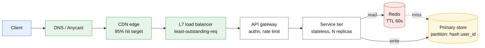
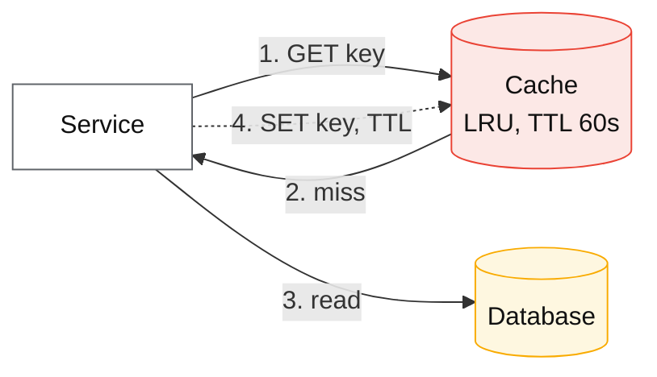
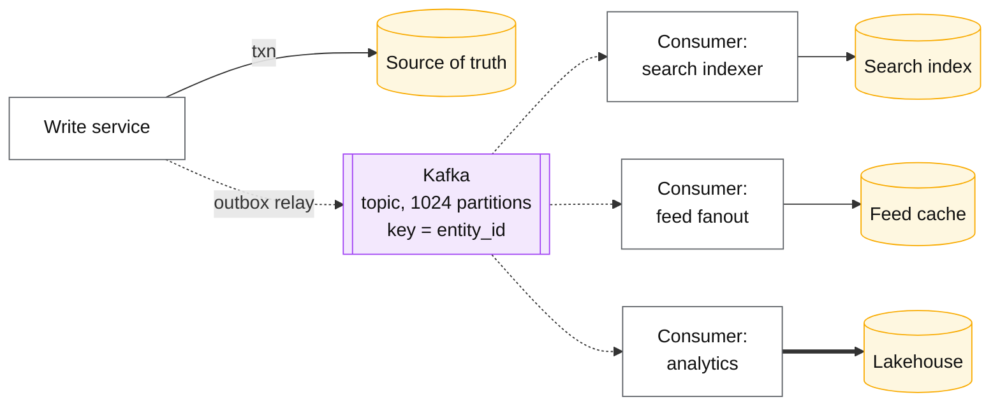
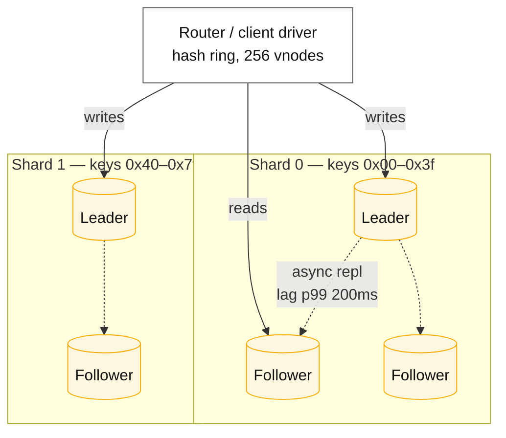
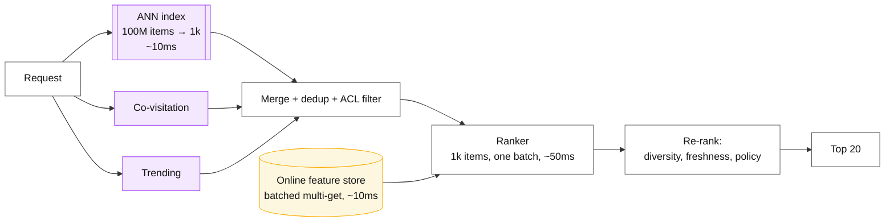
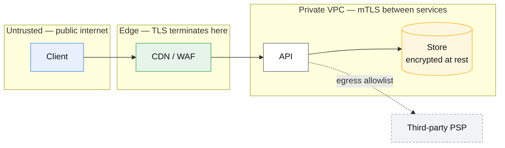
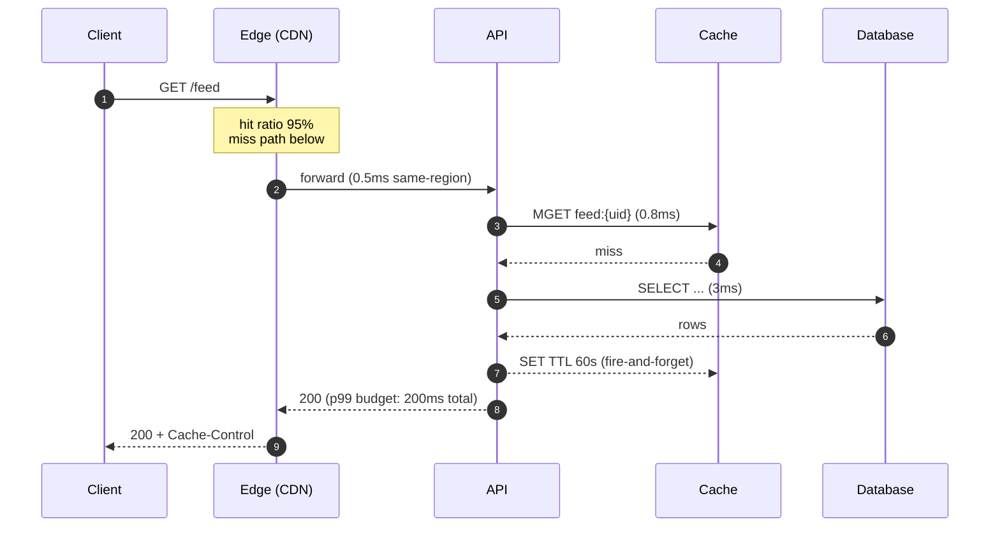
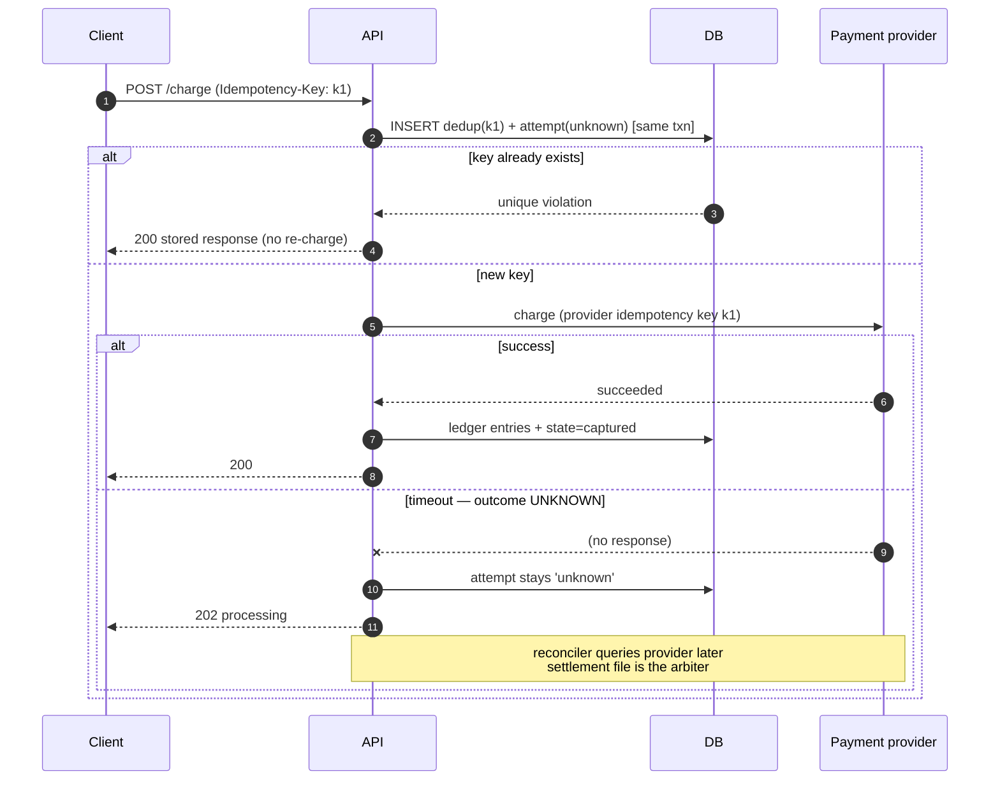
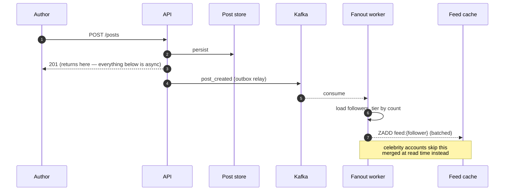
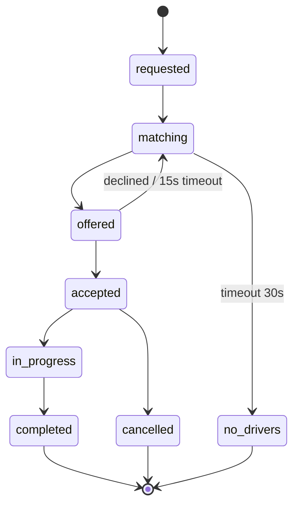

# Diagram component library

Shared visual vocabulary. **Every diagram in this repo reuses these snippets** — same shapes,
same names, same colours — so a reader who has seen one architecture diagram can read all of
them without re-learning the notation.

Mermaid, because it is plain text: git-diffable, reviewable in a PR, and it renders natively on
GitHub, GitLab, Obsidian and VS Code with no plugin or export step.

---

## 1. Which diagram type, when

| Use | Type | Because |
|---|---|---|
| Component layout — what talks to what | `flowchart LR` | Shows topology and data flow direction |
| Request flow — ordering, round trips, latency | `sequenceDiagram` | Makes round-trip count and blocking explicit; the one that exposes latency budget |
| Lifecycle — order, payment, session, model rollout | `stateDiagram-v2` | Legal transitions and terminal states |
| Data model — entities, keys, cardinality | `erDiagram` | Where the partition key argument lives |
| Timeline — replication lag, watermarks, label delay | `gantt` (sparingly) | Only when time-ordering is the point |

**A case file should carry at least two types** — one architecture, one sequence. A single generic
box diagram per topic is the anti-pattern this library exists to kill.

---

## 2. Style conventions

| Rule | Value |
|---|---|
| Direction | `LR` for request paths, `TB` for layered/tiered systems |
| Node id | short lowercase (`lb`, `api`, `cache`), label carries the readable name |
| Label format | `Name<br/>detail` — put the technology and the one number that matters in the detail line |
| Arrow: synchronous | `-->` with a verb label (`--> |read|`) |
| Arrow: asynchronous | `-.->` (dotted) — **always** dotted, so async is visible at a glance |
| Arrow: bulk/batch | `==>` (thick) |
| Boundary | `subgraph` for trust, region, or tier boundaries |
| Colour | Only via the `classDef` set below. Never inline `style` |

### The palette (copy this block into any flowchart)

```
classDef client   fill:#e8f0fe,stroke:#4285f4,color:#111
classDef edge     fill:#e6f4ea,stroke:#34a853,color:#111
classDef service  fill:#fff,stroke:#5f6368,color:#111
classDef store    fill:#fef7e0,stroke:#f9ab00,color:#111
classDef cache    fill:#fce8e6,stroke:#ea4335,color:#111
classDef queue    fill:#f3e8fd,stroke:#a142f4,color:#111
classDef external fill:#f1f3f4,stroke:#9aa0a6,color:#111,stroke-dasharray:4 3
```

Meaning: **blue** = client, **green** = edge/network, **white** = your stateless compute,
**amber** = durable state, **red** = cache (volatile — losing it is survivable), **purple** =
async boundary, **grey dashed** = something you don't control.

---

## 3. Reusable snippets

### 3.1 The standard request spine

Start here and delete what the requirements don't justify.



### 3.2 Cache-aside



### 3.3 Async boundary — log, consumers, derived stores

The shape behind feeds, search indexes, analytics and CDC. Dotted arrows mark where the
response has already been returned to the caller.



### 3.4 Sharded + replicated store



### 3.5 Two-stage retrieval + ranking (ML)



### 3.6 Trust / region boundary



---

## 4. Sequence diagram templates

### 4.1 Latency budget — annotate every hop

The point of a sequence diagram here is the **round-trip count and the budget**, not the boxes.



### 4.2 Idempotent write with an ambiguous outcome

The shape every money/side-effect design needs.



### 4.3 Async fanout — where the response returns early



---

## 5. State and data model templates

### 5.1 Lifecycle



### 5.2 Data model — circle the partition key in the label

```mermaid
erDiagram
    CONVERSATION ||--o{ MESSAGE : contains
    USER ||--o{ CONVERSATION_MEMBER : joins
    CONVERSATION ||--o{ CONVERSATION_MEMBER : has

    CONVERSATION {
        uuid conversation_id PK "PARTITION KEY"
        bigint last_seq
    }
    MESSAGE {
        uuid conversation_id PK "PARTITION KEY"
        bigint seq CK "sort key — total order per conversation"
        uuid client_msg_id UK "idempotency"
        text body
    }
    CONVERSATION_MEMBER {
        uuid conversation_id PK
        uuid user_id PK
        bigint last_read_seq
    }
```

---

## 6. Rules

1. **Reuse these snippets.** Copy, rename nodes, change the detail lines. Do not invent a new
   shape or colour for a component that already exists here.
2. **Numbers in labels.** A box that says `Redis` is decoration; `Redis — 2.4 TB, TTL 24h`
   is a design.
3. **Dotted = async, always.** A reader must be able to find the async boundary in one glance.
4. **One diagram, one question.** If a diagram answers both "what is the topology" and "what is
   the request order", split it into a flowchart and a sequence diagram.
5. **Add a snippet here** when a shape recurs in three or more files, and link back to it.

## See also

- [../CONVENTIONS.md](../CONVENTIONS.md) — file format contract
- [topics manifest](../topics/manifest.md) — the canonical topic list

## Sources

- [Mermaid documentation](https://mermaid.js.org/intro/)
- [GitHub — including diagrams in Markdown](https://docs.github.com/en/get-started/writing-on-github/working-with-advanced-formatting/creating-diagrams)
