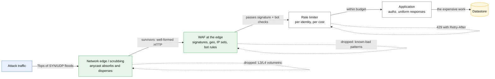

# Abuse and DDoS

## Core concept

Three different problems share one word and have three different answers.

- **Volumetric DDoS** — more bits than your pipe holds. You cannot solve this at the
  application; it is absorbed upstream, by a network with more capacity than the attacker.
- **Application-layer abuse** — requests that are individually legitimate and collectively
  ruinous: a scraper, a credential-stuffing run, a search endpoint called a thousand times a
  second with expensive filters. The defence is per-identity cost accounting, not bandwidth.
- **Enumeration** — using your own correctness against you. Valid requests that reveal which
  usernames exist, which order ids are real, which coupon codes work. There is no traffic anomaly
  to find; the defence is designing the response so the information is not there.

The mistake that recurs is treating all three as a rate-limiting problem. Rate limiting stops the
second, does nothing for the first, and *only sometimes* slows the third.

## Mechanics & internals

### Where each defence lives



**Every layer must drop what it can drop, as early as it can.** The design principle is
*cost asymmetry*: an attacker should spend more per request than you do. A request dropped at the
edge costs you a packet; the same request reaching a database query costs you a hundred thousand
times more. Anything expensive — a search, a report, a model inference — must be behind something
cheap.

### Rate limiting that actually works

Naive per-IP limits fail in both directions: a corporate NAT or mobile carrier shares one address
across thousands of legitimate users, while a botnet has more addresses than your rule can hold.

| Dimension | Good for | Weakness |
|---|---|---|
| Per IP | Crude volumetric shaping | NAT false positives; IPv6 makes addresses free |
| Per /24 or /64 | Botnet clusters, cloud ranges | Collateral damage on shared hosting |
| Per account / API key | The honest unit for authenticated APIs | Useless pre-login, which is where credential stuffing lives |
| Per session / device fingerprint | Anonymous browsing | Fingerprints are forgeable and privacy-sensitive |
| **Per cost, not per request** | The real answer for expensive endpoints | Requires you to price your own operations |

**Price requests, don't count them.** A request that triggers a full-text search across a year of
data is not the same unit as a static asset fetch. Give each identity a budget in *cost units* and
charge each endpoint its weight; a 100/minute limit is meaningless when one endpoint is a thousand
times heavier than another. The mechanics of the counters themselves are in
[../03-backend-cases/rate-limiter.md](../03-backend-cases/rate-limiter.md).

**Fail closed on the limiter's own failure only if you can afford it.** If the rate-limit store is
down, allowing everything invites the outage; refusing everything *is* the outage. The usual
answer is a conservative local fallback limit per node.

### Bot defence, in ascending order of cost to the attacker

1. **Signature and reputation** — known-bad IP ranges, known crawler user agents, threat-intel
   feeds. Free, and catches the unsophisticated majority.
2. **Behavioural** — request ordering, timing, mouse/touch signals, whether the client fetched the
   CSS. Catches naive automation; a headless browser defeats it.
3. **Proof of work / JS challenge** — make the client execute something. Costs an attacker CPU at
   scale and costs you almost nothing. The best cost-asymmetry lever available.
4. **CAPTCHA** — costs real humans real time and has accessibility consequences. Reserve for
   high-signal moments (signup, password reset), never as a general gate.
5. **Attestation** — device or platform attestation. Strongest, and excludes legitimate users on
   unusual platforms.

**Good bots need a path.** Search crawlers, uptime monitors, partner integrations and payment
webhooks all look like automation. An allowlist verified by reverse DNS or signed requests is part
of the design; without one, the first incident is "we deindexed ourselves".

### Enumeration, which rate limiting does not fix

The vulnerability is a *difference* in your responses:

- "No account with that email" vs "wrong password" → a username oracle.
- A 404 for a missing order and a 403 for someone else's order → an existence oracle.
- A fast negative and a slow positive → a timing oracle, even when the bodies match.

The fix is structural, not volumetric: **identical responses, identical status codes, and
comparable timing** for "does not exist" and "not yours". Then add unguessable identifiers — a
random UUID or opaque token instead of a sequential integer — so there is nothing to walk. This is
the same argument the [url-shortener](../03-backend-cases/url-shortener.md) case makes about
sequential codes, and it generalises.

## Numbers that matter

```
Volumetric scale:  large attacks are measured in Tbps and hundreds of Mpps.
  No origin survives this. It is absorbed by anycast dispersion across PoPs,
  which is the same mechanism described in dns-and-anycast.md.

Cost asymmetry, the number that decides the design:
  request dropped at the edge          ~microseconds of CPU, one packet
  request reaching an unindexed query  ~100 ms of database CPU
  request reaching a model inference    ~1-30 SECONDS of accelerator time
  → ratio of 1e6 or worse. Expensive endpoints MUST sit behind cheap gates.

Amplification: an attacker with 1 Gbps of upstream can produce tens of Gbps
  through reflective amplification. Never expose a UDP service that answers
  a small request with a large response.

Body inspection is bounded: a WAF typically inspects only the FIRST 8-64 KB
  of a request body. A payload that hides past that boundary is not scanned —
  the rule did not fail, it never saw the bytes.

Credential stuffing: attackers work at a few requests per account, spread across
  thousands of IPs. Per-IP limits see nothing. Per-ACCOUNT failed-login counting
  is the detection that works.
```

## Failure modes

| Failure | Looks like | Why |
|---|---|---|
| **Rate limit blocks real users** | Support tickets from one company | Per-IP limiting behind a corporate NAT |
| **Limiter becomes the bottleneck** | The limiter falls over before the service does | Centralised counter on the hot path with no local fallback |
| **WAF blocks legitimate traffic** | A feature breaks after a managed-ruleset update | Managed rules updated by the vendor; deploy in detection mode first, always |
| **Permissive custom rule disables everything** | WAF reports healthy, attacks get through | An `Allow` custom rule matched first, and matching stops further evaluation — including the managed rule set |
| **Body inspection limit** | WAF passes an obviously malicious payload | The payload was past the inspection ceiling |
| **Retry storm after a block** | Blocking increases total traffic | 429 without `Retry-After`, and clients retry immediately. **Always send `Retry-After`** |
| **Scraper indistinguishable from a partner** | Blocking the scraper breaks an integration | No verified allowlist for legitimate automation |
| **Enumeration via error codes** | No traffic anomaly at all, then a breach | Different responses for "absent" and "forbidden" |
| **Defence only at the edge** | Direct-to-origin attack bypasses everything | Origin reachable by IP. Lock the origin to the edge's ranges, or use a signed origin header |

**The one to volunteer:** your origin must not be reachable except through the edge. Every WAF,
rate limiter and scrubbing layer is decoration if an attacker can resolve the origin IP from an
old DNS record, a certificate-transparency log, or an email header.

## Trade-offs vs alternatives

| Control | Stops | Costs |
|---|---|---|
| **Edge absorption (anycast)** | Volumetric | A CDN/edge provider; it is not a build-it-yourself item |
| **WAF managed rules** | Known exploit classes | False positives; needs a detection-mode soak before enforcement |
| **Rate limiting** | Abusive volume per identity | Tuning, and NAT collateral |
| **Proof of work / JS challenge** | Cheap automation at scale | A little latency; breaks non-browser clients |
| **CAPTCHA** | Determined automation | Real user friction and accessibility harm |
| **Hard quotas per account** | Cost blowouts | Legitimate spikes get refused — which is sometimes correct |
| **Opaque identifiers** | Enumeration | Nothing. Do this by default |

**Detection mode before prevention mode is not optional.** Every WAF ruleset blocks something
legitimate on first contact with a real application. Run it in log-only, measure what *would* have
been blocked, fix the rules, then enforce.

## Real-world examples

- **Reflective amplification** over open UDP services is the standard way small upstreams produce
  enormous floods; the mitigation is that the services should never have been publicly reachable.
- **Credential stuffing** is economically viable precisely because it is low-rate per account —
  it is a detection problem at the account level, not a traffic problem at the edge.
- **"We blocked our own crawler"** is a routine incident whenever a bot ruleset is enforced without
  an allowlist, and it costs search ranking for weeks after the config is fixed.

## On AWS and Azure

| | AWS | Azure |
|---|---|---|
| **The service** | AWS Shield (Standard automatic, Advanced paid) for volumetric; AWS WAF for L7, attached to CloudFront, ALB, API Gateway; Firewall Manager for org-wide policy | Azure DDoS Protection for volumetric; Azure Web Application Firewall on Front Door (global edge) or Application Gateway (regional); Firewall Manager for policy at scale |
| **What you configure** | Web ACL with rules, rate-based rules, IP sets, managed rule groups, body-inspection limit; WCU budget | WAF policy attached at profile / domain / route scope, in Detection or Prevention mode; custom rules, Default Rule Set, Bot Manager rule set |
| **The default that bites** | **WAF inspects only the first 8 KB of a request body for ALB and AppSync, and 16 KB by default for CloudFront (raisable to 64 KB).** Anything past the boundary is not examined — the rule did not fail to match, it never saw the data. Rate-based rules also have a **minimum rate of 10** and track at most **10,000 unique IP addresses per rule**, so a wide botnet exceeds what one rule can hold | **Custom rules are processed before managed rules, and once a rule matches, no lower-priority rules are evaluated.** A broad custom `Allow` therefore silently disables the entire Default Rule Set for that traffic — the WAF stays green while doing nothing. The documented exception is the HTTP DDoS ruleset, which is evaluated *before* custom rules and which `Allow` rules do not bypass |
| **What it costs you** | A web ACL is capped at **5,000 WCUs**, and **using more than 1,500 WCUs costs extra** — so your rule budget is a literal budget, and managed rule groups consume it. Also **10 rate-based rules per web ACL**, **10,000 CIDRs per IP set**, and **50 country codes per geo-match statement** | **Front Door Standard supports only custom rules** — the Azure-managed Default Rule Set and the Bot Manager rule set require **Premium**. A Standard-tier deployment has a WAF with no managed protection at all. Note also the bot defaults: bad bots blocked, good allowed, **unknown bots only logged**, and rate limiting is evaluated over a **one-minute** window |

Both vendors bury the same lesson in their own quota tables: **the WAF is a budget, not a
switch.** Capacity units, body-inspection ceilings, rule-count caps and tier gating all mean some
traffic is never inspected — so the application still owns authorisation, idempotency and uniform
error responses. A WAF raises the attacker's cost; it does not make the endpoint safe.

## In an LLM deployment

This is the workload where cost asymmetry is at its most extreme, and it changes the defaults:

- **One request can cost seconds of accelerator time.** A rate limit expressed in requests per
  minute is close to meaningless; the unit must be **tokens**, or better, estimated cost. An
  attacker sending 4,000-token prompts at the same request rate as a normal user consumes twenty
  times the capacity while looking identical on every traffic dashboard.
- **Abuse looks like use.** Scraping a model endpoint to distil its outputs is a sequence of
  entirely well-formed, individually reasonable requests. The signals are *distributional* —
  prompt diversity, coverage of your domain, response-length profile — not per-request.
- **Prompt-injection is an application-layer attack that a WAF cannot see.** The payload is
  natural language; there is no signature. The controls are on the other side: least-privilege
  tools, human confirmation for side effects, and never letting retrieved content act as
  instructions.
- **Queue-depth abuse is a denial of service with no traffic spike.** Because each request
  occupies a worker for seconds, a modest request rate can saturate the fleet. Admission control
  by estimated cost, plus per-tenant concurrency caps, is the control that matters — not bandwidth.
- **Fail closed on spend.** A hard per-tenant budget that refuses requests is the only defence
  against a compromised key running up an unbounded bill overnight. Refusing service is the
  correct outcome here.

## Staff-level follow-ups

1. Your API is being scraped by requests that are individually indistinguishable from real use.
   What signals would you build, and what would you do with them?
2. A WAF managed-rules update starts blocking a legitimate feature at 2am. Walk me through the
   response and then the process change.
3. Design rate limiting for an endpoint whose per-request cost varies by 1,000×. What is the unit,
   where is the counter, and what happens when the counter store is unavailable?
4. Your login endpoint leaks which emails are registered. Give me three fixes, ranked, and say what
   each one costs the product.
5. An attacker has your origin IP. Everything above is bypassed. What did you fail to do, and what
   do you do now?

## See also

- [../03-backend-cases/rate-limiter.md](../03-backend-cases/rate-limiter.md) — the counter
  mechanics this page assumes
- [load-shedding-and-admission-control.md](load-shedding-and-admission-control.md) — what to do
  when the traffic is legitimate and still too much
- [cdn-and-edge-caching.md](cdn-and-edge-caching.md) — the layer that absorbs volumetric load and
  the place cheap gates belong
- [dns-and-anycast.md](dns-and-anycast.md) — anycast dispersion as the volumetric defence
- [multi-tenancy-isolation.md](../02-primitives/security-and-multitenancy.md) — per-tenant quotas
  as the blast-radius control

## Referenced by

- [CDN and edge caching](cdn-and-edge-caching.md)
- [Design a CDN](../03-backend-cases/cdn.md)
- [Fundamentals index](README.md)
- [Topic manifest](../topics/manifest.md)

## Sources

- [AWS — AWS WAF quotas](https://docs.aws.amazon.com/waf/latest/developerguide/limits.html) — 8 KB body inspection for ALB and AppSync, 16 KB default (64 KB maximum) for CloudFront, API Gateway, Cognito, App Runner and Verified Access; 5,000 WCUs per web ACL with costs beyond 1,500; 10 rate-based rules per web ACL; minimum rate-based rule rate of 10; 10,000 unique IP addresses rate-limited per rate-based rule; 10,000 CIDRs per IP set; 50 geo-match country codes per statement
- [Azure — What is Azure Web Application Firewall on Azure Front Door?](https://learn.microsoft.com/en-us/azure/web-application-firewall/afds/afds-overview) — "For Azure Front Door Standard, only custom rules are supported"; custom rules are processed before managed rule sets and a match stops evaluation of lower-priority rules; the HTTP DDoS ruleset is evaluated before custom rules and `Allow` rules do not bypass it; Detection vs Prevention modes; bot defaults of bad blocked / good allowed / unknown logged; rate limiting over a one-minute duration
- [AWS — CloudFront quotas](https://docs.aws.amazon.com/AmazonCloudFront/latest/DeveloperGuide/cloudfront-limits.html) — 100 associations per web ACL, 250,000 requests/second and 150 Gbps per distribution
