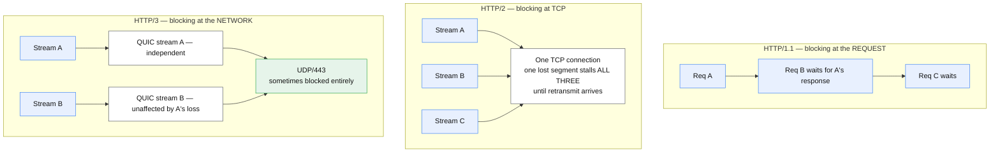

# Application protocols

## Core concept

HTTP/1.1, HTTP/2 and HTTP/3 solve the same problem at three different layers, and each one moves
the bottleneck rather than removing it. HTTP/1.1 blocks at the **request** level, so browsers open
six connections per host to work around it. HTTP/2 multiplexes streams onto one connection and
moves the block down to **TCP**, where a single lost segment stalls every stream. HTTP/3 replaces
TCP with QUIC so loss recovery is per-stream, and the block moves to **the network**, where UDP is
sometimes simply dropped.

The staff-level content is knowing which blocking you are actually experiencing, and that
**gRPC's streaming semantics live on HTTP/2 whether you asked for it or not** — which is why a
proxy that downgrades to HTTP/1.1 silently breaks streaming RPCs while unary calls keep working.

## Mechanics & internals

### Head-of-line blocking, three times



- **HTTP/1.1**: one request in flight per connection (pipelining is dead in practice). Browsers
  open ~6 connections per origin, which is why domain sharding used to help and now hurts.
- **HTTP/2**: many streams on one connection, binary framing, HPACK header compression, server
  push (now effectively abandoned — browsers removed support because it wasted bandwidth more
  often than it helped). The catch: TCP guarantees in-order delivery of the *byte stream*, so a
  lost segment holds back every stream behind it.
- **HTTP/3**: QUIC over UDP. Streams are independent at the transport layer, the crypto handshake
  is folded into the transport handshake (1 RTT, 0 on resumption), and a **connection ID** rather
  than the 4-tuple identifies the connection — so a client switching from Wi-Fi to cellular keeps
  it. QPACK replaces HPACK to avoid reintroducing cross-stream ordering dependence.

### gRPC, briefly and precisely

gRPC is HTTP/2 plus protobuf plus four call shapes: unary, server-streaming, client-streaming and
bidirectional. The consequences worth stating:

- **It requires HTTP/2 end to end.** Any hop that terminates as HTTP/1.1 breaks the streaming
  shapes. Unary calls often still work, which makes the failure confusing — half your API is fine.
- **Load balancing is connection-level by default and that is wrong for gRPC.** One long-lived
  HTTP/2 connection carries all the requests, so an L4 balancer pins a client to one backend
  forever. You need an L7 balancer that balances per *stream*, or client-side balancing.
- **gRPC-Web exists because browsers cannot speak raw gRPC** — no access to HTTP/2 frames — so it
  needs a translating proxy and loses client-streaming.

### Choosing a real-time transport

| Need | Use | Why not the others |
|---|---|---|
| Server → client updates only | **SSE** | A plain HTTP response that never ends. Auto-reconnects, works through proxies, trivial to operate |
| Bidirectional, low latency | **WebSocket** | Full duplex, but now you own a connection tier — see [long-lived-connections.md](../02-primitives/networking-and-edge.md) for capacity in connections, not rps |
| Request/response, many calls | **HTTP/2 or gRPC** | Multiplexing removes the need for a persistent custom protocol |
| Media, peer-to-peer, lowest latency | **WebRTC** | Enormous complexity; only when you genuinely need sub-100 ms media |
| Nothing better available | Long polling | Works everywhere; wastes a connection and a round trip per message |

**SSE is underused.** Most "we need WebSockets" requirements are one-directional notification
streams, and SSE gets them with no new infrastructure.

## Numbers that matter

```
HTTP/1.1 browser concurrency:  ~6 connections per origin
  → 30 assets = 5 sequential rounds of 6. This is what HTTP/2 removed.

Header overhead:  ~500-800 B of headers per request uncompressed.
  HPACK/QPACK take repeat requests to tens of bytes — on an API doing
  1000 req/s with 700 B of headers that is ~0.7 MB/s of pure overhead saved.

Handshake:  HTTP/2 over TLS 1.3 = 2 RTT (TCP + TLS). HTTP/3 = 1 RTT, 0 resumed.
  At 120 ms RTT that is 240 ms vs 0 ms before the first byte.

Loss sensitivity: at 2% packet loss, HTTP/2's single TCP connection stalls all
  streams on each loss; HTTP/3 stalls only the affected stream. This is why the
  mobile/lossy case is where HTTP/3 wins and the datacentre case is where it
  barely matters.

UDP blocking: a measurable fraction of enterprise and mobile networks drop UDP/443.
  Clients fall back to TCP silently — so HTTP/3 is always an optimisation on top
  of a working HTTP/2 path, never a replacement for one.
```

## Failure modes

| Failure | Looks like | Why |
|---|---|---|
| **gRPC streaming broken, unary fine** | Half the API works | A proxy in the path downgraded to HTTP/1.1 |
| **One backend gets all the gRPC traffic** | Uneven load, one hot pod | L4 balancing of a long-lived HTTP/2 connection |
| **HTTP/2 slower than HTTP/1.1 on a lossy link** | Mobile users worse after the upgrade | TCP head-of-line blocking across all multiplexed streams |
| **HTTP/3 silently unused** | No error, no improvement | UDP/443 blocked; client fell back and told nobody |
| **Streaming response never reaches the client** | Works locally, buffers in production | An intermediary buffers the whole response — reverse proxies do this by default for chunked bodies |
| **Chunked response rejected or truncated** | Large streamed payloads fail | Some edges cap chunked-transfer responses; the limit is not always in the error |
| **Server push wasted bandwidth** | Worse performance after "optimising" | Pushed resources the client already had cached. The feature is deprecated for this reason |
| **HPACK table desync** | Connection-level protocol error, all streams die | Rare, but it is a *connection* failure, not a request failure — the blast radius is everything on it |

## Trade-offs vs alternatives

| Move | Take it when | Costs |
|---|---|---|
| **1.1 → HTTP/2** | Many small resources per page; API with high request rate | Connection-level failures now affect every stream; L4 balancing assumptions break |
| **HTTP/2 → HTTP/3** | Mobile-heavy, lossy networks, connection migration matters | More CPU per byte in most stacks, UDP blocking, thinner tooling |
| **REST → gRPC** | Internal service-to-service, schema discipline wanted, streaming needed | Not browser-native, needs L7 balancing, harder to debug with curl |
| **REST → GraphQL** | Many clients with divergent data needs | Caching gets much harder (one POST endpoint), and query cost control becomes your problem |
| **Polling → SSE** | One-directional updates | One held connection per client — capacity is measured in connections |
| **SSE → WebSocket** | Genuinely bidirectional | You now operate a stateful connection tier |

## Real-world examples

- **Domain sharding** was the standard HTTP/1.1 optimisation and became an *anti*-pattern under
  HTTP/2: extra origins mean extra connections and extra handshakes, defeating multiplexing.
  Optimisations have expiry dates, and this is the canonical example.
- **HTTP/2 server push** shipped in browsers, was measured, and was removed. A feature that solves
  a real problem can still lose because it cannot know what the client already has.
- **QUIC connection migration** is the reason a phone handing off networks mid-download no longer
  restarts it — the connection ID survives the address change.

## On AWS and Azure

| | AWS | Azure |
|---|---|---|
| **The service** | CloudFront (viewer HTTP/1.1, HTTP/2, HTTP/3), ALB for HTTP/2 and gRPC target groups, API Gateway | Azure Front Door for HTTP/1.1 and HTTP/2 at the edge, Application Gateway for HTTP/2 and WebSocket, Container Apps / AKS ingress for gRPC |
| **What you configure** | "Supported HTTP versions" on the distribution, security policy (which gates the versions), target-group protocol (`HTTP2` or `GRPC`) on ALB | Front Door route and rules engine, Application Gateway listener protocol, backend protocol settings |
| **The default that bites** | **HTTP/2 requires the viewer to support TLSv1.2 or later *and* SNI; HTTP/3 requires TLSv1.3 *and* SNI.** So the protocol you think you enabled is gated by the security policy you chose on a different screen — pick `TLSv1_2016` for compatibility and your HTTP/3 setting does nothing for anyone | **Front Door strips `Content-Length`, `Transfer-Encoding`, `Accept`, `Accept-Charset`, `Accept-Language` and `Vary` from requests to the origin when caching is enabled.** An origin that negotiates on `Accept` or `Accept-Language` therefore cannot — the protocol-level content negotiation you designed is removed by a caching setting |
| **What it costs you** | CloudFront does support **HTTP/3 connection migration**, so the mobile hand-off case is real and not theoretical — but only for viewers on TLS 1.3, which is again the security policy | **If the origin uses chunked transfer encoding, Front Door does not support responses greater than 8 MB**, and compression is unsupported for CTE responses entirely. Streaming a large chunked body through it is a design that fails at a size boundary rather than at deploy time |

Both bites share a shape worth remembering: **the protocol is decided by a setting that is not
named after the protocol.** On AWS it is the TLS security policy; on Azure it is the caching
configuration. Check the whole path, not the one checkbox.

## In an LLM deployment

- **Token streaming is SSE in almost every production API**, not WebSockets — one direction, plain
  HTTP, survives proxies, reconnects on its own. Choosing WebSockets here buys bidirectionality
  nobody uses and a connection tier you must operate.
- **Buffering proxies are the classic incident.** A reverse proxy that buffers the response body
  turns a streaming completion into a single delayed blob: time-to-first-token becomes
  time-to-*last*-token, the API looks broken, and nothing in the logs says so. Disable response
  buffering explicitly on every hop in the streaming path.
- **The 8 MB chunked-transfer ceiling above is directly in this path.** A long completion, an
  agent trace, or a document generation response streamed as CTE can exceed it.
- **gRPC bidirectional streaming fits multi-turn agent traffic well** internally, and not at all
  for browsers — which is why the public API is SSE and the internal one is gRPC, in almost every
  model platform built so far.

## Staff-level follow-ups

1. After moving to HTTP/2, mobile p99 got worse. Explain what you would look at, in order, and
   what you expect to find.
2. Your gRPC service has one pod at 90% CPU and nine near idle. Diagnose it, then fix it two
   different ways and say which you would ship.
3. A streaming endpoint works in staging and buffers in production. Walk the request path and name
   every place that could be responsible.
4. Argue for and against adopting HTTP/3 for an internal datacentre API, then for a consumer
   mobile app. Why are the answers different?
5. You need server-to-client updates for 500,000 concurrent users. SSE or WebSocket — pick, and
   state what capacity unit you would plan against.

## See also

- [tls-and-connection-setup.md](tls-and-connection-setup.md) — the handshake these run on, and the
  security policy that gates which versions are available at all
- [dns-and-anycast.md](dns-and-anycast.md) — everything before the connection exists
- [cdn-and-edge-caching.md](cdn-and-edge-caching.md) — where protocol termination usually happens
- [tech-selection.md](../08-reference/tech-selection.md) — REST / gRPC / GraphQL as an API contract
  decision rather than a transport one

## Referenced by

- [Fundamentals index](README.md)
- [TLS and connection setup](tls-and-connection-setup.md)
- [Topic manifest](../topics/manifest.md)

## Sources

- [AWS — CloudFront distribution settings](https://docs.aws.amazon.com/AmazonCloudFront/latest/DeveloperGuide/DownloadDistValuesGeneral.html) — "For viewers and CloudFront to use HTTP/2, viewers must support TLSv1.2 or later, and Server Name Indication (SNI)"; "For viewers and CloudFront to use HTTP/3, viewers must support TLSv1.3 and Server Name Indication (SNI)"; CloudFront supports HTTP/3 connection migration
- [Azure — caching with Azure Front Door](https://learn.microsoft.com/en-us/azure/frontdoor/front-door-caching) — `Content-Length`, `Transfer-Encoding`, `Accept`, `Accept-Charset`, `Accept-Language` and `Vary` are not forwarded to the origin when caching is enabled; chunked-transfer-encoding responses greater than 8 MB are not supported and compression is unsupported for CTE
- RFC 9110 / 9112 / 9113 / 9114 (HTTP semantics, HTTP/1.1, HTTP/2, HTTP/3), RFC 9000 (QUIC, including connection migration)
