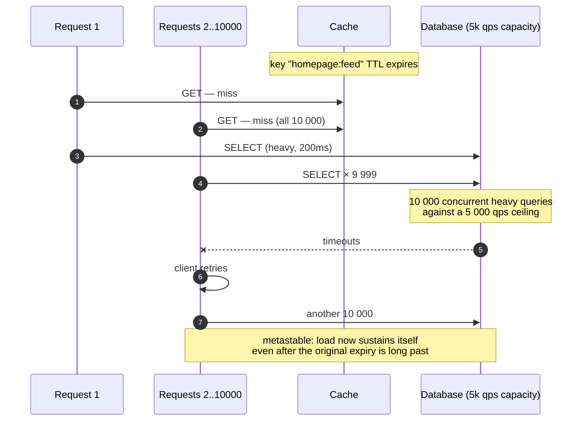
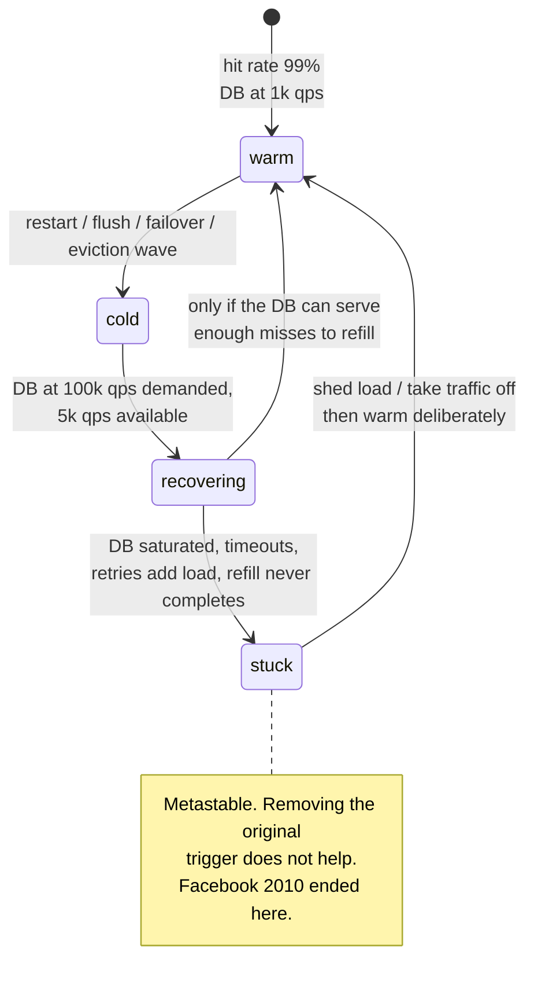

# Cache failure modes

## Core concept

Caches do not fail by returning wrong answers. They fail by **removing themselves at the worst
possible moment** and handing the full, unshaped load to a system sized for 1% of it. Every failure
in this page is the same shape: the cache stops absorbing, and the database discovers what its real
traffic looks like.

The property that makes these dangerous rather than merely bad is **metastability**. A stampede is
not a spike that passes; it is a spike that *sustains itself*, because every failed request
produces more requests. Systems in that state do not recover when the trigger is removed — they
recover only when load is removed, which is why the canonical incident in this space ended with
engineers turning a website off.

## Mechanics & internals

### The four disasters

| Disaster | Trigger | Why it self-sustains |
|---|---|---|
| **Stampede / dogpile** | A hot key expires | N concurrent misses all query the database; slow responses hold connections; more requests queue and miss |
| **Hot key** | One key exceeds one node's capacity | Retries against the saturated node add load; the shard cannot be split — see [hot-shard-mitigation.md](./hot-shard-mitigation.md) |
| **Penetration** | Requests for keys that do not exist | Nothing is ever cached, so every request is a database query — and an attacker can generate them for free |
| **Cold start** | Restart, flush, deploy, failover | Hit rate 0%, database at 100× normal read load, and it cannot serve fast enough to refill the cache |

### Stampede, and why locks are the wrong first instinct

The fixes, and what each is actually good for:

| Fix | Mechanism | Best for |
|---|---|---|
| **Single-flight / request coalescing** | One in-flight computation per key; everyone else waits on it | **The default.** No configuration, no staleness, works for any key |
| **Lease** (Facebook memcache) | The cache issues one token per key; only the holder may recompute, others retry briefly or serve stale | Distributed correctness — coalesces across *processes*, not just within one |
| **Probabilistic early expiry** | Each reader recomputes with probability rising as expiry approaches: refresh when `now − δ·β·ln(rand()) ≥ expiry` | Smooths refresh so expiry is never simultaneous; the [XFetch algorithm](https://cseweb.ucsd.edu/~avattani/papers/cache_stampede.pdf) |
| **`stale-while-revalidate`** | Serve the stale value immediately; refresh in the background | Anything where a few seconds of staleness beats a latency spike. **The best UX answer** |
| **Distributed lock + wait** | One holder recomputes; others block | Works, but adds a lock service to the read path and a new failure mode — see [leases-locks-and-fencing.md](./leases-locks-and-fencing.md) |

Single-flight first: it is a library-level change with no operational surface. Reach for a
distributed lock only when the recomputation is expensive enough that coalescing *per process*
still overloads the source.

**Staggered TTLs matter more than they look.** If 10 000 keys are populated during a cold start
with an identical 300 s TTL, they all expire in the same second, forever, in synchronised waves.
Add jitter — `TTL × (1 ± 0.1)` — at write time. This one line prevents a recurring self-inflicted
incident that is very hard to diagnose after the fact.

### Penetration: caching the absence

A request for a key that does not exist misses the cache by definition and reaches the database
every time. Left alone it is a performance bug; pointed at deliberately it is a denial-of-service
that costs the attacker nothing.

- **Negative caching** — store a `NOT_FOUND` sentinel with a **short** TTL (5–60 s). Long enough to
  absorb a flood, short enough that a newly created entity appears promptly.
- **Bloom filter of existing keys** — reject impossible lookups before touching either tier.
  Memory is `~1.2 GB per billion keys at 1% false positives` (≈10 bits/key), and a false positive
  only costs one normal lookup. False negatives are impossible, which is exactly the guarantee you
  need here.
- **Validate the key shape first.** Most enumeration traffic requests malformed or out-of-range
  identifiers; rejecting those at the edge costs nothing.

### Cold start: the outage you schedule yourself

A cache tier restarting is not a degraded state, it is an inverted one: the database now receives
**100× its normal read rate** at the exact moment nothing is available to absorb it. The
arithmetic is brutal and simple — at a 99% hit rate, an empty cache multiplies database read load
by 100.

The controls, in the order you should build them:

1. **Never flush the whole cache.** Version the key namespace instead (`v7:` → `v8:`) so old
   entries age out while new ones populate gradually.
2. **Rolling restarts**, one node at a time, so the miss rate rises a few percent rather than to
   100%.
3. **Warm-up** before taking traffic — replay a top-key list, or copy from a peer node.
4. **Admission control on the miss path** — cap concurrent database queries and shed or queue the
   rest. A degraded response beats an unavailable database.
5. **Know the survivable miss rate.** If the answer to "what happens at 0% hit rate" is "the
   database dies", the cache is a hard dependency and should be treated as one in the
   architecture diagram.

### Layer-specific traps

- **Eviction wave** — memory pressure evicts the working set, hit rate slides, database load
  climbs, latency rises, more requests are in flight, memory pressure worsens. Alert on **eviction
  rate and hit ratio**, never on memory used, which stays flat until the moment it doesn't.
- **Invalidation storm** — a bulk update invalidates millions of keys at once, which is a stampede
  with extra steps. Rate-limit invalidations, or warm the new values before invalidating the old.
- **Serialization poisoning** — a schema change makes every cached entry undeserializable; every
  request becomes a miss *plus* an exception. Version the key namespace with the schema.

## Numbers that matter

| Quantity | Value | Confidence |
|---|---|---|
| Database load multiplier at 0% hit rate | `1 / (1 − hit_rate)` — **100×** at 99%, 20× at 95% | Arithmetic; the single most important number here |
| Concurrent misses on one expired hot key | Equal to in-flight request concurrency — thousands | Measured by your own concurrency limits |
| Single-flight effect | N concurrent misses → **1** database query | Structural |
| Negative-cache TTL | 5–60 s | Convention; trades absorption against create-visibility delay |
| Bloom filter memory | ~10 bits/key ⇒ ~1.2 GB per billion keys at 1% FP | Standard sizing |
| TTL jitter | ±10% at write time | Convention; prevents synchronised expiry waves |
| Cold-start refill time | Working set ÷ (DB spare read capacity) — often **hours** | Compute it before you need it |
| Facebook 2010 outage | **4 hours**; recovery required taking the site offline | [Meta engineering](https://engineering.fb.com/2010/09/23/uncategorized/more-details-on-today-s-outage/) |

**The calculation to do before the incident.** 30 GB working set, 2 KB objects = 15 M keys.
Database spare read capacity 3 k qps. Refill time = `15 M / 3 000 ≈ 5 000 s ≈ 83 minutes` — during
which the cache is partially cold and the database is saturated. If that number is unacceptable,
the design needs warm-up or a replicated cache tier, and finding that out during a restart is the
expensive way.

## Failure modes

| Failure | Symptom | Mitigation |
|---|---|---|
| **Stampede on expiry** | Periodic database spikes exactly one TTL apart | Single-flight, `stale-while-revalidate`, probabilistic early expiry, TTL jitter |
| **Synchronised TTL waves** | Load spikes on a fixed period nobody can explain | Jitter at write time |
| **Metastable retry storm** | Load stays high after the trigger is gone | Retry budgets, backoff with jitter, load shedding, circuit breaking. **Removing the trigger is not enough** |
| **Penetration / enumeration** | Database read load uncorrelated with cache hit rate | Negative caching, bloom filter, key validation, per-client rate limits |
| **Cold start** | Restart becomes an outage | Never flush; rolling restarts; warm-up; admission control on misses |
| **Eviction wave** | Hit rate slides over hours; nobody notices until the database alerts | Alert on hit ratio and eviction rate |
| **Invalidation storm** | Bulk update triggers mass misses | Rate-limit invalidations; warm before invalidating |
| **Error cached as data** | A transient error is stored and served for a full TTL | Never cache errors as values; cache *absence* deliberately, errors never |
| **Client-side repair loops** | Every client independently tries to "fix" the same problem | Centralise repair; never let N clients repair one shared value |

**Documented incident.** Facebook, 23 September 2010 — the reference case for all of this. A change
to a persistent configuration value was read as invalid; **every client** independently attempted
to repair it by querying the database cluster, which was immediately overwhelmed at hundreds of
thousands of queries per second. Then the loop closed: each failed query was itself interpreted as
an invalid value, so the client **deleted the cache key and retried**. The system kept generating
its own load after the original bad value was corrected, and the only way out was to **take the
site down** — roughly four hours end to end.

Three design rules fall out of it, and all three generalise beyond caching:

1. **An error is never a cacheable value, and never a signal to invalidate.** Distinguish "this
   value is wrong" from "I could not fetch this value".
2. **Client-side self-repair, multiplied by every client, is a DDoS against your own backend.**
   Repair belongs in one coordinated place, rate-limited.
3. **If recovery requires zero traffic, you have no recovery path.** Design for recovery *while
   serving*, or accept that the runbook's first step is "turn it off".
([Meta engineering](https://engineering.fb.com/2010/09/23/uncategorized/more-details-on-today-s-outage/))

## Trade-offs vs alternatives

| Protection | Cost | Staleness | When it is the right first move |
|---|---|---|---|
| **Single-flight** | Library change; parked callers wait | None | Almost always. Start here |
| **`stale-while-revalidate`** | Must retain the expired value | Seconds | User-facing reads where latency matters more than freshness |
| **Probabilistic early expiry** | A little wasted recomputation | None (refresh is early) | Expensive-to-compute hot keys |
| **Lease** | Requires cache-server support | None | Coalescing across processes at scale |
| **Distributed lock** | A lock service on the read path | None | Recomputation so expensive that per-process coalescing is insufficient |
| **Negative caching** | Short-lived wrong answers for new entities | 5–60 s | Any public-facing lookup by ID |
| **Bloom filter** | Memory, plus rebuild on key churn | None | Very large key spaces, hostile traffic |
| **Warm standby cache tier** | Double the cache cost | None | Cold-start refill time is unacceptable |
| **Make the DB survive 100%** | Overprovisioning | None | The most robust answer, and the most expensive |

### Where staff engineers get this wrong

1. **Treating a stampede as a spike.** It is a feedback loop. Capacity does not fix it; breaking
   the loop does.
2. **Reaching for a distributed lock first.** Single-flight solves most of it with no new
   dependency; a lock adds a service that can itself fail on the read path.
3. **Ignoring TTL jitter.** Synchronised expiry produces a recurring, periodic incident that looks
   like a mystery in dashboards.
4. **Alerting on cache memory.** Memory is flat until the working set stops fitting. Hit ratio and
   eviction rate move first, and the database feels them immediately.
5. **Caching errors.** A 500 stored as a value serves that 500 for a full TTL; a 500 treated as
   "invalid, delete and retry" builds the Facebook 2010 loop.
6. **Never testing the cold path.** "What happens if the cache is empty" is a question with a
   number, and the only way to know it is to measure — in a game day, not in an incident.
7. **Assuming a cache tier can be restarted casually.** At a 99% hit rate it is a hard dependency
   with a nice name.

## Real-world examples

- **Facebook 2010** — the canonical cache-driven metastable outage: invalid config value, N clients
  self-repairing, error-as-invalidation feedback loop, four hours, recovery required zero traffic.
- **Facebook memcache (NSDI 2013)** — **leases** as the productionised answer to both stale sets
  and stampedes: one recompute token per key per window.
- **Netflix EVCache** — multi-AZ replication so that losing one zone's cache does not produce an
  origin event; explicit warm-up as a standard operation.
- **Go `singleflight` / Caffeine / Guava `LoadingCache`** — request coalescing as a library
  primitive; the reason this is a two-line fix in most codebases.
- **HTTP `stale-while-revalidate` / `stale-if-error`** — the same protections standardised at the
  edge: serve stale rather than stampede, serve stale rather than fail.
- **Discord** — request coalescing in a service tier in front of the database, specifically to make
  a viral hot key produce one query (see [hot-shard-mitigation.md](./hot-shard-mitigation.md)).

## Staff-level follow-ups

1. Your homepage feed key expires and 10 000 requests miss simultaneously. Give three independent
   protections, say which you would ship first, and explain why a distributed lock is not it.
2. Compute cold-start refill time for a 30 GB working set of 2 KB objects with 3 k qps of spare
   database capacity, then design a restart procedure that keeps the tier serving throughout.
3. An attacker requests random non-existent user IDs at 50 k/s. Walk through what happens, then
   design the defence in layers — and say what each layer costs a legitimate new user.
4. Explain metastability using the Facebook 2010 incident, then identify the equivalent feedback
   loop in a system you have operated. What breaks it?
5. Your database load has a spike every 300 seconds and nobody knows why. Diagnose it, then give
   the one-line fix and explain why it works.

## See also

- [caching-strategies.md](./caching-strategies.md) — layer placement, patterns, hit-rate arithmetic
- [cache-invalidation.md](./cache-invalidation.md) — invalidation storms and the stale-set race
- [hot-shard-mitigation.md](./hot-shard-mitigation.md) — the hot-key half, at the storage layer
- [leases-locks-and-fencing.md](./leases-locks-and-fencing.md) — what a distributed lock on the read path costs
- [../02-primitives/reliability-patterns.md](../02-primitives/reliability-patterns.md) — shedding, breakers, retry budgets

## Referenced by

- [Cache invalidation](cache-invalidation.md)
- [Caching](../02-primitives/caching.md)
- [Caching strategies](caching-strategies.md)
- [Fundamentals index](README.md)
- [Topic manifest](../topics/manifest.md)

## Sources

- [Meta — More details on today's outage (23 September 2010)](https://engineering.fb.com/2010/09/23/uncategorized/more-details-on-today-s-outage/)
- [Nishtala et al. — Scaling Memcache at Facebook, NSDI 2013](https://www.usenix.org/system/files/conference/nsdi13/nsdi13-final170_update.pdf) — leases
- [Vattani, Chierichetti, Lowenstein — Optimal probabilistic cache stampede prevention (VLDB 2015)](https://cseweb.ucsd.edu/~avattani/papers/cache_stampede.pdf)
- [Bronson, Aghayev et al. — Metastable failures in distributed systems (HotOS 2021)](https://sigops.org/s/conferences/hotos/2021/papers/hotos21-s11-bronson.pdf)
- [MDN — `Cache-Control: stale-while-revalidate`](https://developer.mozilla.org/en-US/docs/Web/HTTP/Headers/Cache-Control)
- [Go — `golang.org/x/sync/singleflight`](https://pkg.go.dev/golang.org/x/sync/singleflight)
