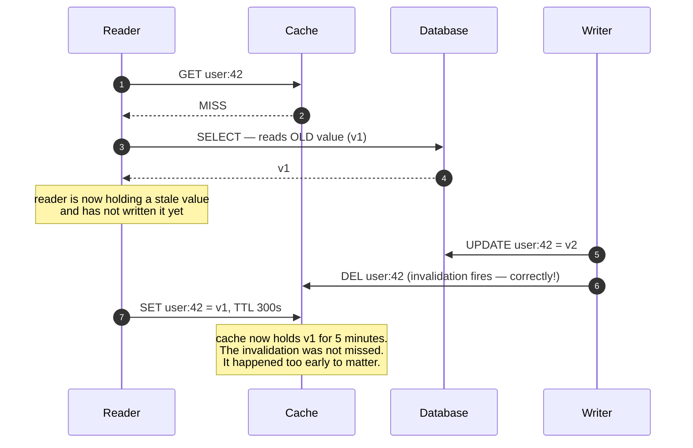
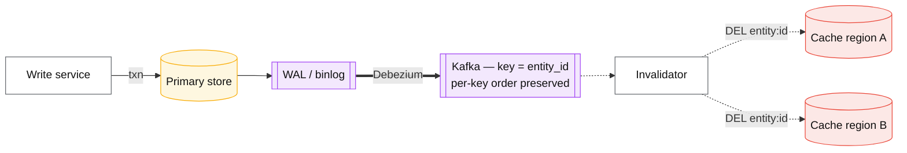

# Cache invalidation

## Core concept

The hard part of invalidation is not deciding *when* a cached value is wrong. It is that the read
path and the write path race, and the loser writes a stale value into the cache where it survives
for a full TTL. The bug is not a missed invalidation — the invalidation fires correctly and the
stale value lands **after** it.

Which gives the ranking that should drive every design: **prefer strategies with no race at all**
(TTL, versioned keys) over strategies that must win one (delete-on-write). And when a race is
unavoidable, prefer *detecting* inconsistency to *assuming* it cannot happen — Meta measures cache
consistency as an SLO precisely because at scale a one-in-a-million race is thousands of wrong
answers per day.

## Mechanics & internals

### The delete-on-write race, as an interleaving

This is the mechanism every engineer should be able to draw on demand.

The window is small — the gap between a reader's database read and its cache write — and at
100 k reads/s a small window is a constant stream of incidents. Four fixes, in order of how much
they actually buy:

| Fix | Mechanism | Verdict |
|---|---|---|
| **Versioned keys** (`user:42:v7`) | The write bumps a version; the stale key is never read again and ages out by TTL | **No race exists.** The strongest fix; costs a version lookup or a monotonic field |
| **Leases** (Facebook memcache) | On a miss, the cache issues a token; only the token holder may set, and the token is **invalidated by any intervening delete** | Directly kills stale sets; requires cache-server support |
| **Delayed double delete** | Delete, write, sleep ~the read window, delete again | Heuristic. Reduces the window; does not close it |
| **Short TTL only** | Accept the race, bound the damage | Legitimate, and often correct — say the number out loud |

Facebook's leases are the cleanest general answer: a `get` on a miss returns a lease token, a
`delete` invalidates outstanding tokens for that key, and a `set` carrying an invalidated token is
**rejected**. The stale reader's write simply does not land. The same mechanism also rate-limits
stampedes, since only one lease is issued per key per window.

### The strategies, ranked

| Strategy | Staleness bound | Race? | Cost | Use |
|---|---|---|---|---|
| **TTL** | The TTL | None | Wasted refreshes; bounded staleness always present | **Start here.** Self-healing, no coordination, survives bugs |
| **Versioned key** | Immediate for new reads | None | A version read or an embedded `updated_at` | Objects with a natural version; the best default beyond TTL |
| **Delete on write** | Immediate, usually | **Yes** | Cheap, everywhere, subtly wrong | Only with leases or a very short TTL |
| **Update on write (write-through)** | Immediate | Yes — concurrent writes can land out of order | Writes cache data nobody reads | Rarely; and see below |
| **CDC-driven invalidation** | Replication lag | No — the log is ordered | Kafka/Debezium pipeline, ordering per key | Many services caching one dataset; the scalable answer |

**Invalidate, do not update.** This is Facebook's explicit design choice and the reasoning is
worth memorising: a delete is **idempotent and commutative**, so it can be retried, reordered and
duplicated without harm. An update carries a value, so two concurrent updates can land in the
wrong order and leave the cache permanently wrong with no self-healing. Deletes converge; updates
diverge.

### CDC-driven invalidation

Three properties make this the strongest option at scale, and one caveat kills naive versions:

- **No application code can forget to invalidate.** Every committed change produces an event by
  construction — the single biggest source of invalidation bugs disappears.
- **Ordering per key is preserved** if the topic is keyed by entity ID, so out-of-order
  invalidation cannot happen for a given object.
- **It fans out for free** to every cache region and every derived store.
- **Caveat:** the invalidation now lags by the CDC pipeline (typically 100 ms–2 s). That is a
  staleness budget, and it must be stated. If the product needs immediacy, pair CDC with a
  synchronous local delete and let CDC be the backstop that fixes what the local delete missed.

### Cache key design is invalidation design

You cannot invalidate what you cannot name. Two failure shapes:

- **Too coarse:** caching a composed page object means any change to any component invalidates
  everything. Hit rate collapses on write-heavy components.
- **Too fine:** caching every field separately means a page render is 40 round trips, and no
  single invalidation is meaningful.

Cache **at the granularity that changes together**, and include everything that varies the answer
in the key — user, locale, permissions, feature-flag cohort, API version. A key missing the
permission dimension is not a stale-data bug, it is an authorisation bug that leaks one user's
data to another.

### CDN and client tiers: purge is not invalidation

At the edge the options change shape:

- **Purge** — supported by every CDN, but propagation is seconds to minutes and it is rate-limited.
  Do not design a per-write purge.
- **Versioned URLs** — `/asset.a1b2c3.js`, cache forever, never invalidate. The correct answer for
  anything immutable, and the reason build tooling hashes filenames.
- **`stale-while-revalidate`** — serve stale, refresh in the background. Converts an invalidation
  problem into a latency-hiding one.
- **The browser is unreachable.** Anything you sent with a long `max-age` is out there until it
  expires. This is why HTML gets a short TTL and assets get immutable URLs.

## Numbers that matter

| Quantity | Value | Confidence |
|---|---|---|
| The stale-set race window | The gap between a reader's DB read and its cache write — typically 1–20 ms | Order of magnitude; multiply by read rate for incidents/s |
| Stale entries per day, 100 k reads/s, 5 ms window, 1 k writes/s | Hundreds to thousands | Arithmetic — small windows are not rare events at scale |
| Meta TAO cache consistency | Improved from **99.9999% (6 nines) to 99.99999999% (10 nines)** with Polaris | [Meta engineering](https://engineering.fb.com/2022/06/08/core-infra/cache-made-consistent/) |
| CDC invalidation lag | 100 ms–2 s end to end | Order of magnitude; measure yours |
| CDN purge propagation | Seconds to minutes, globally | Vendor-dependent; never assume instant |
| Typical TTL for user objects | 30–300 s | Convention — the product decides |
| Cost of a version lookup | One extra cache read, ~0.5 ms, or free if embedded in the object | Cheap relative to the bug class it removes |

**The arithmetic that justifies leases or versioning.** At 100 k reads/s with a 5 ms race window
and 1 k writes/s, the expected number of stale sets per day is in the thousands. "It's a narrow
race" is true and irrelevant: narrow races at scale are a steady rate of wrong answers, which is
exactly why Meta built a system to *measure* the rate rather than argue about it.

## Failure modes

| Failure | Symptom | Mitigation |
|---|---|---|
| **Stale set** | One key wrong for a full TTL; unreproducible; "the cache is lying" | Versioned keys or leases; never bare delete-on-write with a long TTL |
| **Missed invalidation path** | One of five write paths forgets to invalidate | CDC-driven invalidation removes the class; or funnel writes through one repository |
| **Out-of-order updates** | Two concurrent writes; cache keeps the older value permanently | **Invalidate, don't update** |
| **Invalidation storm** | A bulk update invalidates millions of keys; every one becomes a miss; the database is hit at full read rate | Rate-limit invalidations, stagger TTLs, warm before invalidating; see [cache-failure-modes.md](./cache-failure-modes.md) |
| **Key missing a dimension** | User A sees User B's data, or a translated page in the wrong locale | Include every varying dimension in the key; treat this as a security review item |
| **Schema change poisons entries** | Deserialization errors on every hit | Version the key namespace on every schema change |
| **Purge treated as instant** | Code assumes the CDN is clean immediately after purge | Versioned URLs for anything that must change atomically |
| **Nobody measures consistency** | Inconsistency is invisible until a customer finds it | A Polaris-style checker: subscribe to invalidations, read replicas back, report violations |

**Documented case.** Meta's *Cache made consistent* (2022) treats cache inconsistency as a
measurable SLO rather than an accepted hazard. **Polaris** acts as a client of the cache — it
subscribes to invalidation events, then queries cache replicas as an ordinary client and flags any
replica still returning a stale version, with **consistency tracing** logging state transitions so
a flagged anomaly comes with the evidence needed to diagnose it. It assumes no knowledge of
service internals, which is why it integrates with dozens of Meta systems. The result was TAO's
cache consistency moving from **six nines to ten nines**.

The staff-level takeaway is methodological: at sufficient scale, "this race is too narrow to
matter" is an untested hypothesis, and the mature move is to build the detector — the same
argument as Jepsen finding a nine-year-old Postgres SSI bug in
[transaction-isolation-levels.md](./transaction-isolation-levels.md).
([Meta engineering](https://engineering.fb.com/2022/06/08/core-infra/cache-made-consistent/))

## Trade-offs vs alternatives

| Approach | Correctness | Complexity | Staleness | Choose when |
|---|---|---|---|---|
| **TTL only** | No races; bounded staleness always | Trivial | = TTL | Default. Most data, most of the time |
| **Versioned keys** | No races | Low — needs a version source | ~0 for new reads | Objects with a natural version or `updated_at` |
| **Leases** | Kills stale sets *and* stampedes | Needs cache-server support | ~0 | Memcached-family deployments at scale |
| **Delete on write** | Racy | Trivial | ~0 when it wins | Short TTLs, low write rate, tolerant data |
| **CDC-driven** | No missed paths, ordered per key | Pipeline to operate | = CDC lag | Many services, many regions, one dataset |
| **Don't cache** | Perfect | None | None | Small load, or data where staleness is unacceptable |

### Where staff engineers get this wrong

1. **Believing invalidation is a coverage problem.** Adding the missing `DEL` call does not fix the
   stale-set race — the race happens with correct code.
2. **Updating the cache instead of deleting it.** Deletes are idempotent and commutative; updates
   are neither. This one sentence prevents a whole bug class.
3. **Long TTL plus delete-on-write.** The two worst properties combined: a race you can lose, and a
   long window in which to lose it.
4. **Forgetting a key dimension.** Permissions, locale, and API version belong in the key.
   Omitting permissions is a security bug, not a caching bug.
5. **Assuming CDN purge is instant.** It is eventually consistent, rate-limited, and
   vendor-specific. Immutable versioned URLs sidestep it entirely.
6. **Never measuring.** If you cannot state your cache's inconsistency rate, you do not know it is
   low — you know nobody has reported it.

## Real-world examples

- **Meta TAO + Polaris** — cache consistency as an SLO, measured from the outside, taken from six
  to ten nines; consistency tracing for diagnosis.
- **Facebook memcache (NSDI 2013)** — **leases** to prevent stale sets and thundering herds;
  **invalidation rather than update**; remote markers for cross-region read-after-write (see
  [replication-lag-and-session-guarantees.md](./replication-lag-and-session-guarantees.md)).
- **Debezium + Kafka** — the standard CDC invalidation pipeline: keyed topics preserve per-entity
  ordering, and consumers fan invalidations out to every region.
- **Fastly / Cloudflare surrogate keys** — tag-based purge, so one product update purges every
  page referencing it. The nearest thing to real invalidation at the edge, still not instant.
- **HTTP `ETag` / `If-None-Match`** — revalidation instead of invalidation: the client asks "is my
  copy still good?" and gets a 304. Shifts the problem from push to pull, and is why it scales.

## Staff-level follow-ups

1. Draw the stale-set interleaving and then fix it three different ways, stating what each fix
   costs and which one you would ship for a 10-service, 3-region deployment.
2. Your cache has a 300 s TTL and delete-on-write. Estimate the number of stale entries per day at
   80 k reads/s and 2 k writes/s, then decide whether to fix it and defend the decision.
3. Design CDC-driven invalidation for a dataset cached in three regions. Address ordering,
   replay after an outage, the lag budget, and what happens when the consumer falls behind.
4. A bulk backfill updates 40 M rows. Describe what happens to your cache and the database behind
   it, then design the backfill so it is a non-event.
5. How would you measure your cache's inconsistency rate in production without trusting the
   application code? Sketch the Polaris-equivalent for your system and its false-positive sources.

## See also

- [caching-strategies.md](./caching-strategies.md) — where and how to cache in the first place
- [cache-failure-modes.md](./cache-failure-modes.md) — invalidation storms and stampedes
- [consistency-models.md](./consistency-models.md) — the cache is part of the consistency boundary
- [../05-data-cases/cdc-pipeline.md](../05-data-cases/cdc-pipeline.md) — building the CDC path this relies on
- [../02-primitives/caching.md](../02-primitives/caching.md) — the bundled note being split

## Referenced by

- [Cache failure modes](cache-failure-modes.md)
- [Caching](../02-primitives/caching.md)
- [Caching strategies](caching-strategies.md)
- [Fundamentals index](README.md)
- [Topic manifest](../topics/manifest.md)

## Sources

- [Meta — Cache made consistent (2022)](https://engineering.fb.com/2022/06/08/core-infra/cache-made-consistent/) — Polaris, consistency tracing, six→ten nines
- [Nishtala et al. — Scaling Memcache at Facebook, NSDI 2013](https://www.usenix.org/system/files/conference/nsdi13/nsdi13-final170_update.pdf) — leases, invalidate-don't-update
- [Debezium — change data capture connectors](https://debezium.io/documentation/reference/stable/index.html)
- [Fastly — surrogate keys and purging](https://developer.fastly.com/reference/http/http-headers/Surrogate-Key/)
- [MDN — HTTP conditional requests (`ETag`, `If-None-Match`)](https://developer.mozilla.org/en-US/docs/Web/HTTP/Conditional_requests)
