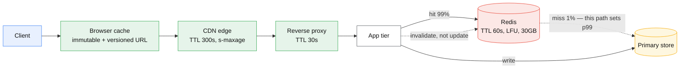
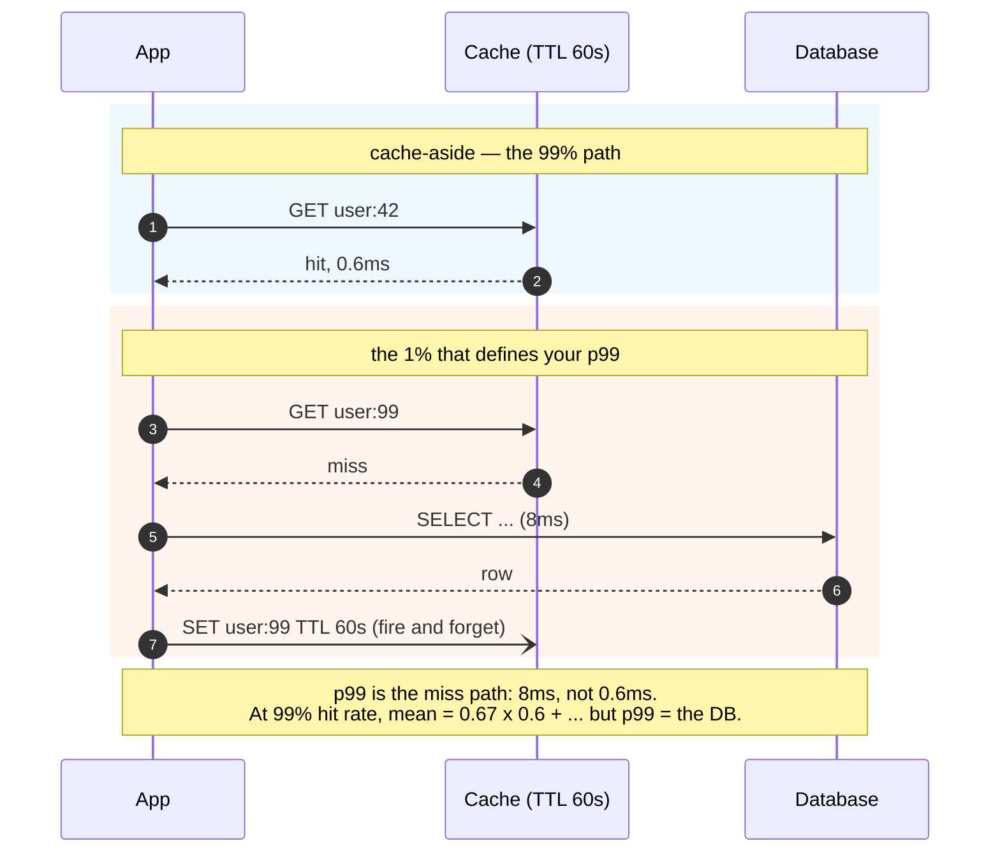

# Caching strategies

## Core concept

A cache is a deliberate consistency downgrade bought in exchange for latency and load. That is the
whole trade, and it is why "should we cache this?" is a product question wearing an engineering
costume: the answer depends on how stale an answer is allowed to be, not on how slow the database
is.

The second-order point that separates a staff answer: **a cache's value is set by the miss path,
not the hit path.** A 99% hit rate means the 1% of requests that miss define your p99, and the
system's behaviour when the cache is empty defines whether you survive a restart. Designs are
routinely justified by average latency and killed by the miss path.

## Mechanics & internals

### Where to cache — each layer is ~10× cheaper and ~10× harder to invalidate

| Layer | Latency | Invalidation | Right for |
|---|---|---|---|
| Client / browser | 0 | **Impossible** — you cannot reach it | Immutable assets with versioned URLs only |
| CDN edge | 10–50 ms | Hard; purge is minutes and global | Static, and cacheable dynamic responses |
| Reverse proxy (Varnish, nginx) | ~1 ms | Medium; local purge | Full-page and per-path |
| **Shared application cache** (Redis, Memcached) | 0.5–2 ms | Easy — one authoritative copy | Objects, query results, computed views |
| Local in-process (LRU) | ~100 ns | Hard — **N copies**, one per instance | Tiny hot config, feature flags, compiled artefacts |
| Database buffer pool | µs | Automatic | Free; already working for you |

Worst-case staleness for that stack is `300 + 30 + 60 = 390 s`, not 300 — **layers add**.

The rule: **cache as far out as the freshness requirement allows**, and know that every step
outward converts an invalidation problem into a TTL-shaped staleness budget. The near-universal
mistake is a local in-process cache with a long TTL: fifty instances now hold fifty independently
stale copies, and nothing can invalidate them.

### The patterns, and what each actually commits you to

| Pattern | Mechanism | Real cost |
|---|---|---|
| **Cache-aside** (lazy) | App reads cache; on miss reads DB, populates | Default. First request per key is slow; the populate races with concurrent writes |
| **Read-through** | Cache library owns the miss path | Same semantics, less duplicated code, harder to instrument |
| **Write-through** | Write to cache and DB synchronously | Cache never stale for that key; every write pays cache latency; caches data nobody reads |
| **Write-behind** | Write to cache, flush to DB asynchronously | Fast writes, **data loss when the cache node dies** — this is a database now, not a cache |
| **Refresh-ahead** | Refresh hot keys before expiry | Hides the miss entirely for hot keys; wasted work on keys that go cold |

**Write-behind deserves a warning.** The moment writes are acknowledged from cache before reaching
durable storage, the cache holds the only copy of committed data and inherits every requirement of
a database: replication, durability, failover, backup. Teams adopt it for write latency and
discover they have built an unreplicated primary store.

### Hit rate is logarithmic, and that decides your budget

Cache hit rate against memory follows a long-tail distribution: the hot 20% of keys generate ~80%
of requests, so a small cache captures most of the value and each additional nine costs
disproportionately.

| Hit rate | Requests reaching the DB (per 100 k) | Relative memory |
|---|---|---|
| 50% | 50 000 | 1× |
| 90% | 10 000 | ~3–5× |
| 95% | 5 000 | ~2× more again |
| 99% | 1 000 | often **2–4×** the 95% memory |

Going 90% → 99% removes 90% of the *remaining* database load, which is usually the difference
between one database and three. Going 99% → 99.9% typically doubles memory to remove load the
database never noticed. **Size for the working set — the hot fraction of one day's data — not for
the dataset.**

The load arithmetic that matters more than the ratio itself: at 100 k reads/s, a hit rate moving
from 99% to 95% takes database load from **1 k/s to 5 k/s**. A four-point hit-rate drop is a 5×
database load increase. This is why eviction-rate and hit-ratio alerts matter more than memory
utilisation alerts — memory looks fine right up until the working set no longer fits.

### Eviction

| Policy | Behaves well when | Fails when |
|---|---|---|
| **LRU** | General purpose | A large scan evicts the working set ("scan pollution") |
| **LFU** (Redis `allkeys-lfu`) | Popularity is stable and skewed | Popularity shifts fast; needs decay |
| **TTL / random** | Simplicity, avoiding LRU pathologies | Nothing protects the hot set |
| **Segmented LRU / W-TinyLFU** | Both — admission control keeps one-hit wonders out | More complex; what Caffeine implements |

Redis's `maxmemory-policy` is a design decision with a default that is often wrong:
`noeviction` returns errors when memory fills — correct if Redis is a store, an outage if Redis is
a cache. Choose it explicitly and say which role Redis is playing.

### Multi-layer caching and negative caching

Real systems stack: browser → CDN → app cache → buffer pool. Two rules keep the stack honest:

- **The staleness budget is the sum, not the max.** A 60 s CDN TTL in front of a 60 s Redis TTL is
  a 120 s worst case. Write the budget down per layer; someone will otherwise "just add" one more.
- **Cache negatives too.** Missing keys that are requested repeatedly (deleted users, bad IDs,
  enumeration attacks) otherwise reach the database every time. Cache "not found" with a **short**
  TTL — long enough to absorb the load, short enough that a newly created entity appears promptly.

## Numbers that matter

| Quantity | Value | Confidence |
|---|---|---|
| Redis/Memcached op over the network | 0.5–2 ms round trip | Order of magnitude |
| Redis throughput per node | ~100 k simple ops/s; pipelining raises it 5–10× | Order of magnitude — single-threaded command loop |
| Local in-process cache | ~100 ns | Order of magnitude |
| Realistic hit rate, well-chosen keys | 90–99% | Below 80%, question the key design, not the size |
| Memory for 100 M objects at 200 B | ~20 GB **× ~1.5 overhead** ≈ 30 GB | Redis per-key overhead is real: ~50–100 B/key |
| Cost ratio, cache vs database read | Roughly 10–100× cheaper per request | Order of magnitude; the reason caches exist |
| DB load at 100 k reads/s, 99% vs 95% hit | 1 k/s vs 5 k/s | Arithmetic — a 5× swing from four points |
| Cold-start recovery time | Minutes to hours for a large working set | The number that decides whether you can restart the tier |

**The sizing calculation to do out loud.** 50 M users, 20% active daily, 2 KB profile object:
working set is `50M × 0.2 × 2 KB = 20 GB`, plus ~50% Redis overhead ≈ 30 GB, so a single 32 GB
node is marginal and two 16 GB shards are safer. Doing this arithmetic is the difference between
"we'll put Redis in front" and a design.

## Failure modes

| Failure | Symptom | Mitigation |
|---|---|---|
| **Cache tier down** | Database takes 100% of traffic and dies within seconds | Design the DB to survive the miss rate, or shed load; never assume the cache is available |
| **Cold start after deploy/restart** | Empty cache, full traffic to the DB, the classic self-inflicted outage | Rolling restarts, warm-up jobs, admission control; **never flush the whole cache** |
| **Working set outgrows memory** | Hit rate slides, eviction rate climbs, DB load multiplies | Alert on **hit ratio and evictions**, not memory used |
| **Scan pollution** | A batch job or crawler evicts the hot set under LRU | LFU or W-TinyLFU; separate cache for batch workloads |
| **Serialization schema change** | Deserialization errors on every hit; poison entries | Version the key namespace (`user:v3:42`) on every schema change |
| **Write-behind node loss** | Committed writes vanish | Do not use write-behind without replication and durability |
| **`noeviction` on a cache** | Writes start erroring when memory fills | Set `maxmemory-policy` deliberately per role |
| **Cached the wrong granularity** | One field changes, a huge composed object is invalidated constantly | Cache at the granularity that changes together |

**Documented incident.** Facebook, 23 September 2010 — a four-hour outage that is the canonical
cache failure. A change to a persistent configuration value was interpreted as invalid, so **every
client** tried to fix it by querying the database cluster; that cluster was overwhelmed by
hundreds of thousands of queries per second; and every failed query was itself interpreted as an
invalid value, causing the client to **delete the cache key and try again**. The feedback loop
sustained itself after the original bad value was fixed — the system could not recover while
serving traffic, and engineers had to **take the site offline** to break the cycle.

The transferable lessons are about the miss path, not about caching: an error must never be
cacheable-as-invalid, a client-side "repair" action multiplied by every client is a distributed
denial of service against your own database, and **a system whose recovery requires zero traffic
has no recovery path**. See [cache-failure-modes.md](./cache-failure-modes.md) for the
stampede mechanics and
[../02-primitives/reliability-patterns.md](../02-primitives/reliability-patterns.md) for the
metastability that makes it unrecoverable.
([Meta engineering](https://engineering.fb.com/2010/09/23/uncategorized/more-details-on-today-s-outage/))

## Trade-offs vs alternatives

| Alternative to caching | Buys | Costs | Prefer when |
|---|---|---|---|
| **Read replicas** | Fresh-ish data, no invalidation logic, SQL still works | Replication lag, more database instances | Query variety is high and staleness must be bounded by lag not TTL |
| **Materialised view / derived store** | Precomputed answers, no per-request compute | Rebuild pipeline, staleness contract | The expensive part is computation, not lookup |
| **Better index or query** | No staleness at all, no new component | Engineering time; ceiling exists | The query is slow because it is bad — check first, always |
| **Denormalisation** | One read instead of five | Write amplification, consistency risk | Read/write ratio is extreme |
| **Bigger database** | Zero complexity added | Cost; vertical ceiling | Under ~10 k reads/s this is genuinely the right answer |
| **Cache** | 10–100× cheaper reads, latency | Staleness, invalidation bugs, a new failure domain | Read-heavy, tolerant of bounded staleness, hot-key skew |

### Where staff engineers get this wrong

1. **Caching to hide a bad query.** A cache in front of a query that should have an index converts
   a fixable problem into a permanent one — with a stampede risk attached.
2. **Designing for the hit path.** The hit path is easy. Every real decision — capacity,
   restart procedure, degradation — is determined by the miss path.
3. **Not knowing the survivable miss rate.** "What happens if the cache is empty?" should have a
   number attached. If the answer is "the database dies", the cache is a single point of failure
   with extra steps.
4. **Local in-process caches with long TTLs.** N instances, N stale copies, no invalidation path.
   Use them only for data that is immutable or genuinely refresh-on-a-timer.
5. **Adding a layer without adding to the staleness budget.** Layers compose additively and nobody
   tracks the total until a user complains about two-minute-old data.
6. **Alerting on memory instead of hit ratio.** Memory is flat right up to the moment the working
   set stops fitting; the hit ratio moves first and the database feels it immediately.

## Real-world examples

- **Facebook memcache (NSDI 2013)** — the reference architecture: cache-aside with **invalidation
  rather than update** (deletes are idempotent and commutative, so they are safe to reorder and
  retry), leases to control stampedes and stale sets, regional pools.
- **Netflix EVCache** — memcached with multi-AZ replication and explicit warm-up for the
  cold-start problem, on the argument that a cold cache in one AZ must not become an origin event.
- **Meta TAO** — a graph cache in front of MySQL that is the *default* read path for the social
  graph, with consistency measured and reported rather than assumed (see
  [cache-invalidation.md](./cache-invalidation.md)).
- **Redis** — single-threaded command execution, so one `KEYS *` blocks every client; rich data
  structures (sorted sets, HLL, bitmaps) that let you cache *computations* rather than rows.
- **CDNs** — the same patterns at the edge: `stale-while-revalidate` is refresh-ahead,
  `stale-if-error` is graceful degradation, and cache-key design is the whole engineering job.

## On AWS and Azure

| | AWS | Azure |
|---|---|---|
| **The shared cache** | ElastiCache (Valkey / Redis OSS / Memcached); DAX in front of DynamoDB | **Azure Managed Redis** — Azure Cache for Redis has a published retirement path, so name the new one |
| **The pattern you get managed** | **DAX is write-through**: `PutItem`/`UpdateItem`/`DeleteItem` go to DynamoDB first, then the DAX item cache, and the operation "is successful only if the data is successfully written to *both*" | None. There is no managed read-through cache in front of an Azure store — cache-aside is yours to write |
| **The eviction knob** | `maxmemory-policy` (only in a custom parameter group — default groups are immutable), `reserved-memory-percent`, default **25** | `maxmemory-policy`; `maxmemory-reserved` and `maxfragmentationmemory-reserved`, each ~10% of memory by default, clamped to the range 10–60% |
| **Cluster shape** | Cluster mode **disabled** is one shard plus up to 5 replicas and does not partition at all; cluster mode enabled is 1–500 shards | Every instance is internally clustered — `OSS`, `Enterprise` or `Non-clustered` policy. **You cannot set the shard count**; the SKU does |
| **The edge layer** | CloudFront cache policy: min / default / max TTL, plus the cache key (headers, cookies, query strings) | Front Door route caching plus Rules Engine: *Honor origin*, *Override always*, *Override if origin missing* |
| **The default that bites** | `maxmemory-policy` defaults to **`volatile-lru`** — only keys carrying a TTL are eligible for eviction. Every key written without `EXPIRE` is pinned forever, and the node fills and starts erroring rather than evicting | The same `volatile-lru` default, with the consequence stated out loud: *"If no keys have a TTL value, the system doesn't evict any keys."* And at the edge, if the origin sends no `Cache-Control`, **Front Door "randomly determines a cache duration between one and three days"** — a staleness budget you did not choose and cannot predict |

Two things this table is really saying. First, the eviction default is the same mistake on both clouds and it is the one that turns a cache into a store: a cache whose keys have no TTL cannot evict, so "working set outgrows memory" does not show up as the hit-rate slide described in *Failure modes* — it shows up as write errors. Choose `allkeys-lru` deliberately, or put a TTL on every write, and say which role Redis is playing.

Second, DAX is the only place on either cloud where the write-through row of the pattern table is a managed product rather than your code — and it ships with a *second* cache whose rules are different. That half is in [cache-invalidation.md](./cache-invalidation.md). Stampede protection, Origin Shield and cold-start behaviour are in [cache-failure-modes.md](./cache-failure-modes.md) §On AWS and Azure and are not repeated here.

## In an LLM deployment

The layer table at the top of this page still holds, but the layers have **different key shapes**, and that — not their TTLs — is what makes the staleness budget hard to write down. The GPU's KV/prefix cache keys on a token prefix. The provider's prompt cache keys on an exact byte prefix. A response cache keys on an embedding. Only the first two compose; the third is answering a different question.

The number that decides whether the middle layer works at all is a **minimum, not a TTL**. Bedrock will not create a cache checkpoint until the cumulative prefix reaches the model's floor — **512 tokens for Claude Opus 5, 1,024 for Claude Sonnet 5, 4,096 for Claude Haiku 4.5** — and below it, *"your inference still succeeds, but your prefix isn't cached."* A 2,000-token system prompt therefore caches on Sonnet and silently does not cache on Haiku: the cheapest model has the highest bar, so moving a workload down the model ladder to save money can quadruple the input tokens you pay full price for. Nothing errors; the only signal is `cacheReadInputTokens` sitting at zero.

Refresh-ahead is the one pattern that transfers cleanly. The prompt-cache TTL **resets on every hit**, so a low-rate keepalive against a hot prefix inside the 5-minute window keeps it resident the same way refresh-ahead keeps a hot key warm. Write-behind has no analogue here and should not be invented.

## Staff-level follow-ups

1. Your cache tier is unavailable for ten minutes. Walk through exactly what happens to the
   database, the user experience, and the recovery — then say what you would change so the answer
   is boring.
2. Size a cache for 50 M users, 20% daily active, 2 KB objects, with a target hit rate of 95%.
   Show the arithmetic, then say what you would measure to check the estimate in production.
3. Argue for read replicas over a cache for a specific workload you have built, and then the
   reverse. What property of the data decides it?
4. Design the cold-start procedure for a 200 GB cache tier so that a full restart is a routine
   operation rather than an incident.
5. A team proposes write-behind caching to cut write latency. State precisely what they are now
   responsible for, and offer the design that gets most of the benefit without that liability.

## See also

- [cache-invalidation.md](./cache-invalidation.md) — keeping it correct
- [cache-failure-modes.md](./cache-failure-modes.md) — stampede, hot key, penetration, cold start
- [replication-lag-and-session-guarantees.md](./replication-lag-and-session-guarantees.md) — the other source of staleness on the same path
- [indexing-and-query-planning.md](./indexing-and-query-planning.md) — check this before adding a cache
- [../02-primitives/caching.md](../02-primitives/caching.md) — the bundled note being split

## Referenced by

- [Cache failure modes](cache-failure-modes.md)
- [Cache invalidation](cache-invalidation.md)
- [Caching](../02-primitives/caching.md)
- [Consistency model matrix](../comparisons/consistency-model-matrix.md)
- [Fan-out on write vs read](../patterns/fanout-write-vs-read.md)
- [Fundamentals index](README.md)
- [Graceful degradation](../patterns/graceful-degradation.md)
- [Indexing and query planning](indexing-and-query-planning.md)
- [Materialized views and derived data](../patterns/materialized-views-and-derived-data.md)
- [Tail latency](tail-latency.md)
- [Topic manifest](../topics/manifest.md)

## Sources

- [Nishtala et al. — Scaling Memcache at Facebook, NSDI 2013](https://www.usenix.org/system/files/conference/nsdi13/nsdi13-final170_update.pdf)
- [Meta — More details on today's outage (23 September 2010)](https://engineering.fb.com/2010/09/23/uncategorized/more-details-on-today-s-outage/)
- [Netflix — EVCache: caching at global scale](https://netflixtechblog.com/caching-for-a-global-netflix-7bcc457012f1)
- [Redis — key eviction policies](https://redis.io/docs/latest/develop/reference/eviction/)
- [AWS — ElastiCache engine-specific parameters](https://docs.aws.amazon.com/AmazonElastiCache/latest/dg/ParameterGroups.Engine.html) — `maxmemory-policy` default `volatile-lru`, `reserved-memory-percent` default 25, verified 2026-09-20
- [AWS — ElastiCache cluster mode disabled vs enabled](https://docs.aws.amazon.com/AmazonElastiCache/latest/dg/Replication.Redis-RedisCluster.html) — 1 shard vs 1–500 shards
- [AWS — DAX: how it works](https://docs.aws.amazon.com/amazondynamodb/latest/developerguide/DAX.concepts.html) — write-through, item cache TTL
- [Azure — Azure Managed Redis architecture](https://learn.microsoft.com/en-us/azure/redis/architecture) — cluster policies, shard count not user-settable
- [Azure — Azure Cache for Redis memory management best practices](https://learn.microsoft.com/en-us/azure/azure-cache-for-redis/cache-best-practices-memory-management) — `volatile-lru` default, reserved-memory defaults
- [Azure — Caching with Azure Front Door](https://learn.microsoft.com/en-us/azure/frontdoor/front-door-caching) — one-to-three-day default cache duration, cache behaviour modes
- [AWS — Amazon Bedrock prompt caching](https://docs.aws.amazon.com/bedrock/latest/userguide/prompt-caching.html) — per-model checkpoint token minimums, TTL reset on hit
- [MDN — HTTP caching, `stale-while-revalidate` and `stale-if-error`](https://developer.mozilla.org/en-US/docs/Web/HTTP/Caching)
- Local book: `DE/System-Design/Designing Data Intensive Applications.pdf` ch.11
