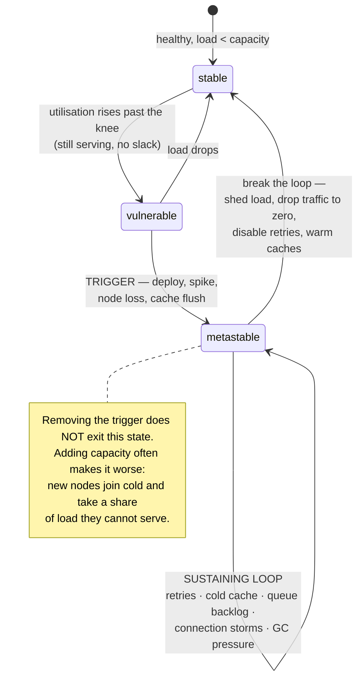
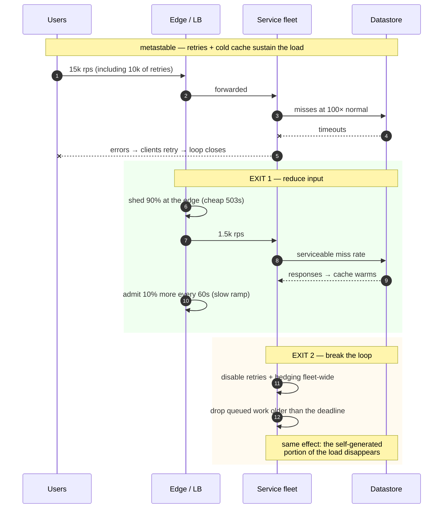

# Cascading and metastable failures

## Core concept

A **metastable failure** is one where the system stays down after the thing that knocked it over is
gone. The trigger — a deploy, a traffic spike, a network blip — is transient. The *sustaining
effect* is not: retries, cold caches, queue backlogs and connection churn generate enough load on
their own to keep the system in the failed state indefinitely, even at normal input load.

Bronson et al. name the structure precisely: a system has a **stable** state (healthy, load
absorbed) and a **metastable** state (failed, and self-sustaining). A trigger pushes it across;
a **sustaining feedback loop** keeps it there. The practical test is diagnostic and brutal:

> **If removing the trigger does not restore service, you are in a metastable failure, and adding
> capacity will not help either.**

That is why so many major outages end with "we had to take traffic off" or "we restarted very
slowly over several hours". Those are not recovery failures — they are the only two ways out of a
self-sustaining loop: **reduce the input**, or **break the loop**.

## Mechanics & internals

### The shape

The middle state matters as much as the failure. A system running at 85% utilisation is *stable*
but **vulnerable**: it has no slack to absorb the extra work that any trigger creates. The same
trigger applied at 50% utilisation is a blip. This is why capacity headroom is not waste — it is
the distance between a blip and a four-hour incident.

### The sustaining loops, and what breaks each

| Loop | Mechanism | What breaks it |
|---|---|---|
| **Retry amplification** | Failures cause retries; retries cause more failures | Retry budgets, client-side throttling, **disabling retries entirely during recovery** |
| **Cold cache** | Cache empty → database at 100× load → too slow to refill the cache → cache stays empty | Shed load so the database can serve misses; warm from a peer; admission control on the miss path |
| **Queue backlog** | Requests queue past their deadline; server does work nobody waits for; the queue never drains | CoDel / queue-age shedding; **drop the backlog** rather than drain it |
| **Connection storms** | Clients reconnect en masse; the handshake cost exceeds the serving cost | Jittered reconnect, connection limits, slow admit |
| **GC / memory pressure** | Queued work holds memory → GC pressure → slower service → more queuing | Bound queues; shed to reduce live set |
| **Health-check flapping** | Overloaded nodes fail checks → removed → remaining nodes get more load → they fail checks | Minimum-healthy floor; never let health checks remove the last N nodes |
| **Rebalance / redistribution** | A node leaves; its work moves to peers; peers overload and leave | Rate-limit rebalancing; damping |
| **Full-mesh state rebuild** | Every node must talk to every other; restarting many at once re-triggers the failure | Staged, slow restarts — the Kinesis recovery |

The recurring shape: **the failure state creates work that the healthy state did not**. Retries,
cold misses, reconnects and rebuilds are all *new* load that only exists because you failed.

### Why adding capacity often makes it worse

The instinct during an incident is to scale out. In a metastable state this frequently deepens the
failure:

- New instances start **cold** — empty caches, cold JIT, empty connection pools — and immediately
  take a share of traffic they cannot serve, so they time out and add to the failure rate.
- Registration and health-check churn adds control-plane load exactly when it is scarce.
- In systems with full-mesh or shared state, new members trigger the very rebuild that is
  saturating the fleet.

**Shed first, then scale.** Capacity added into a stabilised system helps; capacity added into a
loop feeds it.

### Recovery: the two exits

Both exits are deliberate, both are painful, and **both must be built before the incident** — a
kill switch for retries, an edge-level shed control with a ramp, and a documented order of
operations. Reaching for them for the first time during an outage is how four-hour incidents
happen.

The ramp matters as much as the shed: restoring traffic all at once re-enters the loop, because a
cold system at full load is exactly the state you just escaped. Ramp in steps with a hold at each
level until latency and cache hit rates recover.

## Numbers that matter

| Quantity | Value | Confidence |
|---|---|---|
| Utilisation where a trigger becomes an incident | Above the knee, ~**80–90%** | See [queueing-theory-basics.md](./queueing-theory-basics.md) |
| Retry amplification, 3 layers × 3 attempts | **27×** | Arithmetic |
| Cold-cache load multiplier at 99% hit rate | **100×** database read load | `1/(1−hit_rate)` |
| Load reduction typically needed to exit | **80–95%** — not 10% | Order of magnitude; the loop must fall below the drain rate |
| Traffic restoration ramp | 10–20% steps, hold minutes per step | Convention; hold until cache hit rate and latency recover |
| AWS Kinesis, 25 Nov 2020 | **~17 hours**; recovery required slow, staged restarts | [AWS post-event summary](https://aws.amazon.com/message/11201/) |
| Facebook, 23 Sep 2010 | **~4 hours**; recovery required taking the site offline | [Meta engineering](https://engineering.fb.com/2010/09/23/uncategorized/more-details-on-today-s-outage/) |
| Time for autoscaling to add capacity | Minutes — **slower than the collapse** | Order of magnitude |

**The exit arithmetic.** A service with 10 k rps capacity sitting in a loop that generates 40 k rps
of offered load cannot be rescued by 2× capacity — 20 k is still below 40 k, so the loop persists
and you have doubled the bill. Shedding 80% brings offered load to 8 k, below capacity, and the
loop unwinds. **The lever is the load, not the capacity**, and the required reduction is usually
far larger than instinct suggests.

## Failure modes

| Failure | Symptom | Mitigation |
|---|---|---|
| **Retry storm** | Load stays high after the trigger clears | Retry budgets; a fleet-wide retry kill switch |
| **Cold-cache lock-in** | Cache never refills because the database cannot serve the misses | Shed to create headroom; warm from peers; admission control on misses |
| **Backlog that never drains** | Queue depth flat or rising for hours; every response is past its deadline | **Drop the backlog.** Draining is only possible if arrivals fall below drain rate |
| **Scaling into the loop** | New instances make error rates worse | Shed first, stabilise, then scale, then ramp |
| **Health-check death spiral** | Nodes removed for being slow, remaining nodes overload | Minimum-healthy floor; load-based checks with hysteresis |
| **Restart storm** | Restarting the fleet re-triggers the failure (state rebuild, mesh reconnect) | Staged restarts with hold-and-verify — the Kinesis pattern |
| **Monitoring depends on the failed system** | You cannot see the incident you are in | Independent monitoring path — the Roblox lesson from [consensus-raft-paxos.md](./consensus-raft-paxos.md) |
| **No kill switches** | Every mitigation requires a code deploy during an outage | Runtime flags for retries, hedging, shedding thresholds and non-critical features |
| **Recovery at full traffic** | Service comes back, immediately falls over again | Ramp in steps with holds |

**Documented incident.** AWS Kinesis, **25 November 2020**, us-east-1 — 17 hours. The trigger was
routine: adding capacity to the front-end fleet. Because every front-end server maintains a
connection to every other and **dedicates a thread per connection**, the larger fleet exceeded the
operating system's thread limit, and the front-end tier failed. Dependent services — CloudWatch,
Cognito, EventBridge, IoT Core and others — degraded within the hour.

The recovery is the part that makes this a metastable case study rather than a capacity story.
Kinesis could not simply be restarted: bringing front-end servers back required each to rebuild
full-mesh state, and doing that quickly would have re-triggered the same saturation. AWS restored
capacity **slowly and deliberately over many hours**, verifying at each step. Three lessons
generalise well beyond AWS: a **routine capacity addition is a change with the same blast radius as
a deploy**; an architecture where every node talks to every other has an `O(n²)` failure mode
waiting at some scale; and **if bootstrap is expensive, your recovery time is bounded by bootstrap,
not by fixing the bug**.
([AWS post-event summary](https://aws.amazon.com/message/11201/))

## Trade-offs vs alternatives

| Defence | Prevents | Cost | Priority |
|---|---|---|---|
| **Headroom (≤ 80% utilisation)** | Entering the vulnerable state at all | Idle capacity you pay for | **First.** Everything else is cheaper if you have slack |
| **Retry budgets + jitter** | The most common sustaining loop | Almost none | **First.** Highest ratio of protection to effort |
| **Load shedding with criticality** | Goodput collapse; provides the exit lever | Engineering + testing | **First.** It is also your recovery control |
| **Kill switches (runtime flags)** | Needing a deploy mid-incident | Flag hygiene, flag debt | High — cheap to add, invaluable at 3am |
| **Cell / shuffle-shard isolation** | Blast radius: one cell's loop cannot reach others | Routing complexity, capacity fragmentation | High for large multi-tenant systems |
| **Circuit breakers** | Resource exhaustion against dead dependencies | Tuning; needs fallbacks | Medium |
| **Bounded queues everywhere** | Backlogs that cannot drain | Rejections under burst | Medium — but unbounded queues are indefensible |
| **Autoscaling** | Growth | Minutes of lag | **Not an overload control.** Useful after stabilisation |
| **Chaos / game days** | Discovering all of the above during a real incident | Real time and organisational will | High — untested recovery paths do not work |

### Where staff engineers get this wrong

1. **Diagnosing by trigger.** The trigger explains how it started, never why it continues. Ask
   what work the failure itself is generating.
2. **Scaling into a loop.** Cold instances add errors. Shed, stabilise, then scale.
3. **Under-shedding.** Cutting 10% of load when the loop generates 4× is theatre. The required
   reduction is usually 80%+.
4. **Draining a doomed backlog.** If arrivals exceed drain rate, drop it. Requests past their
   deadline are worthless by definition.
5. **Building mitigations that need a deploy.** During a metastable failure the CI/CD path is often
   degraded too. Runtime flags, not code changes.
6. **Restoring traffic at once.** The system is cold; full load re-enters the loop. Ramp with
   holds.
7. **Assuming failures are independent.** Shared dependencies (a coordination store, a metadata
   service, DNS) correlate everything. Independence is an assumption to test, not a property to
   assume.

## Real-world examples

- **AWS Kinesis, Nov 2020** — thread-limit saturation in a full-mesh front-end fleet; 17 hours,
  recovery bounded by staged bootstrap rather than by the fix.
- **Facebook, Sep 2010** — clients treating a database error as an invalid cache value, deleting
  the key and retrying: an error-as-invalidation loop that required taking the site offline
  ([cache-failure-modes.md](./cache-failure-modes.md)).
- **Roblox, Oct 2021** — 73 hours; Consul streaming plus a BoltDB pathology, made far worse because
  the monitoring stack depended on the failing system
  ([consensus-raft-paxos.md](./consensus-raft-paxos.md)).
- **Bronson et al., HotOS 2021** — the paper that named the pattern, arguing metastable failures
  are a distinct class deserving their own vocabulary rather than being filed under "cascading".
- **Google SRE** — the *Addressing Cascading Failures* chapter: the canonical operational playbook,
  including the explicit advice to drop traffic to zero and ramp back.

## Staff-level follow-ups

1. Give the diagnostic that distinguishes a metastable failure from a capacity shortfall, then
   describe how the response differs in the first ten minutes.
2. Your service is in a retry-driven loop at 4× normal load. Compute how much you must shed to
   exit, then design the ramp back and say what you hold on at each step.
3. Identify a self-sustaining loop in a system you have operated. What generates the extra load,
   and which single control breaks it fastest?
4. Explain why adding capacity during a metastable failure can deepen it, with a concrete mechanism
   from a system you know.
5. Design the kill switches a service should ship with before its first production incident, and
   say who is allowed to flip each one and on what signal.

## See also

- [timeouts-retries-backoff.md](./timeouts-retries-backoff.md) — the most common sustaining loop
- [load-shedding-and-admission-control.md](./load-shedding-and-admission-control.md) — the exit lever, which must exist beforehand
- [queueing-theory-basics.md](./queueing-theory-basics.md) — the vulnerable state, quantified
- [cache-failure-modes.md](./cache-failure-modes.md) — cold-cache lock-in as a worked example
- [../02-primitives/reliability-patterns.md](../02-primitives/reliability-patterns.md) — breakers, bulkheads, degraded modes, DR

## Referenced by

- [Cell-based architecture](../patterns/cell-based-architecture.md)
- [Fundamentals index](README.md)
- [Load shedding and admission control](load-shedding-and-admission-control.md)
- [Queueing theory basics](queueing-theory-basics.md)
- [Reliability patterns](../02-primitives/reliability-patterns.md)
- [Timeouts, retries and backoff](timeouts-retries-backoff.md)
- [Topic manifest](../topics/manifest.md)

## Sources

- [Bronson, Aghayev, Charapko, Zhu — Metastable failures in distributed systems (HotOS 2021)](https://sigops.org/s/conferences/hotos/2021/papers/hotos21-s11-bronson.pdf)
- [AWS — summary of the Kinesis event in us-east-1 (25 November 2020)](https://aws.amazon.com/message/11201/)
- [Google SRE Book — Addressing cascading failures](https://sre.google/sre-book/addressing-cascading-failures/)
- [Meta — More details on today's outage (23 September 2010)](https://engineering.fb.com/2010/09/23/uncategorized/more-details-on-today-s-outage/)
- [Marc Brooker — on metastability and retries](https://brooker.co.za/blog/2021/06/22/eb.html)
