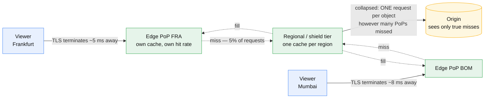

# CDN and edge caching

## Core concept

A CDN is a cache hierarchy owned by someone else, placed close to users, that you address by
DNS. Its value is two things at once — latency, because the TCP and TLS handshakes terminate a
few milliseconds away instead of across an ocean, and **origin offload**, because a 95% hit rate
means your origin sees 5% of the traffic and 5% of the egress bill.

The part that decides whether you get either is the **cache key**. A CDN is a hash map whose key
you configured, usually by accident. Include a header that varies per user and your hit rate is
zero while every dashboard says the CDN is working; forget to include the header that actually
changes the response and you serve one user's content to another. Both failures are silent, and
both are configuration, not code.

The second thing staff-level candidates are probed on is **invalidation**, because it is the one
CDN operation that is slow, rate-limited, and needed exactly when you are already in an incident.

## Mechanics & internals

### The hierarchy



**Every PoP has its own cache.** This is the fact that surprises people: a CDN with 400 PoPs can
produce 400 origin requests for one cold object, because each PoP misses independently. The
first-request-per-PoP problem is why the mid-tier exists — a **shield** or regional cache that
all PoPs fill through, so the origin sees one request per object rather than one per PoP.

Without a shield, your origin's worst moment is a cache-wide expiry on a popular object across
every PoP simultaneously. With one, it is a single request. This is
[cache stampede](cache-failure-modes.md) with geography added.

### The cache key

The key is, by default, roughly `(host, path)`. Everything else you add is a deliberate act:

| Added to the key | Effect on hit rate | When it is correct |
|---|---|---|
| Query string, all of it | Divides by however many tracking params exist | Almost never — `?utm_source=` fragments one object into thousands |
| Query string, allowlisted | Preserved | The usual right answer: name the params that change the bytes |
| `Accept-Encoding` | Halves (gzip/br variants) | Always needed, and every CDN normalises it for you |
| `Accept-Language` | Divides by locale count | Only if the origin actually varies by it |
| Cookie | Collapses to ~zero | Never for cacheable content. A cookie in the key is a per-user cache |
| Device class (mobile/desktop) | Divides by 2–3 | If you serve genuinely different markup |

**`Vary: *` or `Vary: Cookie` on a response makes it effectively uncacheable**, and origins emit
it by accident all the time — a framework adds `Set-Cookie` for session tracking and the whole
site stops caching. This is the single most common cause of "why is our hit rate 4%".

### Invalidation, and why versioned URLs win

Three ways to change what is cached, in increasing order of how much you should like them:

1. **Purge by path.** Slow (seconds to minutes to reach every PoP), rate-limited, and the
   rate limit is the problem — you cannot purge a million objects during an incident.
2. **Purge by tag / surrogate key.** Tag objects on write (`Surrogate-Key: product-123`), purge
   the tag. One call invalidates everything related. This is what a real content system does.
3. **Versioned URLs.** `/app.9f2c1a.js` — the URL *is* the version, so there is nothing to
   invalidate: you publish a new URL and the old one ages out on its own. No purge, no
   propagation delay, no rate limit, and rollback is changing one reference back.

Versioned URLs are strictly better for anything you build. Purge remains necessary for content
you do not control the URL of — a mistyped article, a takedown, a leaked page.

### Stale-while-revalidate is the control that matters

```
Cache-Control: public, max-age=60, stale-while-revalidate=600, stale-if-error=86400
```

- `max-age=60` — fresh for a minute.
- `stale-while-revalidate=600` — for ten minutes after that, **serve the stale copy instantly
  and refresh in the background**. No user waits on the origin.
- `stale-if-error=86400` — if the origin is down, keep serving the stale copy for a day.

That last directive converts an origin outage from a site outage into a staleness incident. It
is one header, it is free, and most sites do not set it.

### Edge compute

Running code at the PoP buys personalisation without an origin round trip — A/B bucket
assignment, auth checks, redirects, header normalisation, geo routing. The constraint is that
edge runtimes are deliberately tiny: small memory, short CPU budgets, and in the strictest
tier **no network access at all**, which means the edge can rewrite a request but cannot look
anything up. Know which tier you are on before designing around it.

## Numbers that matter

```
Latency saved:     origin RTT 120 ms (cross-ocean) vs PoP RTT 8 ms
                   × (1 TCP + 2 TLS round trips saved) ≈ 300 ms on a cold connection
Hit rate economics:
  10 Gbps of traffic, origin egress at ~$0.05/GB
  at 50% hit rate:  5 Gbps × 2.6 PB/month ≈ $130k/month of origin egress
  at 95% hit rate:  0.5 Gbps            ≈  $13k/month
  → each point of hit rate above 90 is worth real money. Measure it per cache key,
    not as one global number, or a single bad key hides in the average

Cold-fill fanout: 1 object × 400 PoPs = 400 origin requests without a shield, 1 with
Purge propagation: seconds to minutes. NOT a control you can rely on inside an SLA
Chunking:   large files are fetched from origin in fixed-size chunks (8 MB is typical),
            so a 4 GB video is ~500 origin range requests, and the origin MUST
            support byte ranges correctly or the optimisation silently stops working
```

## Failure modes

| Failure | What it looks like | Why it happens |
|---|---|---|
| **Cache key explosion** | Hit rate collapses, origin load 10× overnight, no deploy went out | A marketing campaign added a query param; every link is now a unique object |
| **Private data cached publicly** | User A sees user B's page | Origin emitted a cacheable response for an authenticated request. The CDN did exactly what it was told |
| **Cookie poisoning the key** | 4% hit rate, nobody knows why | Framework sets `Set-Cookie` on every response; CDN refuses to cache |
| **Thundering herd on expiry** | Origin spikes every N minutes, in phase | Every PoP's copy expires simultaneously because they were filled simultaneously |
| **Purge storm** | Purges queue, rate limit hit, stale content persists during an incident | Someone wired "purge everything" into a deploy script |
| **Stale forever** | Old bundle served days later | A long `max-age` was set once, the object has no version in its URL, and the purge did not reach one PoP |
| **Origin down, CDN passes it through** | Full outage on a 95%-cached site | `stale-if-error` was never set, so a miss became a 502 instead of a slightly old page |
| **Range-request mismatch** | Large downloads fail or truncate | Origin compresses inconsistently, so `Content-Range` disagrees between chunks |

**The one to volunteer unprompted:** caching an authenticated response. It is a privacy incident,
it is caused by a single missing header, and the CDN cannot detect it. The defence is structural
— separate routes for static and authenticated content, caching disabled on the latter by
configuration, not by hoping the origin sets the right header.

## Trade-offs vs alternatives

| Option | Buys | Costs |
|---|---|---|
| **Pull CDN** | Nothing to operate; first request fills the edge | First request per PoP pays origin latency; cold-fill fanout |
| **Push CDN** | Content is warm before anyone asks; predictable origin load | You own distribution and storage; only viable for a small, known catalogue |
| **Origin shield / regional tier** | Collapses cold fanout from N PoPs to 1 | One more hop on a miss; another thing to configure |
| **Application cache only (Redis)** | Full control, no vendor | Does nothing for latency or egress — the bytes still cross the ocean |
| **Multi-CDN** | Vendor failure is survivable; price leverage | Cache is split across vendors so hit rate drops; two configurations to keep identical, and they will drift |

**When a CDN is the wrong answer:** highly personalised, low-volume, authenticated content. You
get the extra hop and none of the offload. Use the CDN for TLS termination and transport
optimisation there, and say explicitly that caching is off.

## Real-world examples

- **Versioned asset URLs** are universal in modern build tooling precisely because the purge
  path is unreliable — the content hash in the filename is an admission that invalidation does
  not work well enough to depend on.
- **`stale-if-error`** is what keeps large news sites readable when their origin falls over
  during a traffic spike: the front page goes stale, not blank.
- **Surrogate-key purging** is the standard answer at publishers, where one article edit must
  invalidate the article, the section page, the homepage and three feeds — a path purge would
  need five calls and would miss the sixth place it appears.

## On AWS and Azure

| | AWS | Azure |
|---|---|---|
| **The service** | Amazon CloudFront, with Origin Shield; CloudFront Functions and Lambda@Edge for edge compute | Azure Front Door Standard/Premium, with its rules engine for edge logic |
| **What you configure** | Cache policy (which query strings, headers and cookies enter the key), origin request policy, TTL floor/ceiling, Origin Shield region, invalidation paths | Route caching behaviour (Honor origin / Override always / Override if origin missing), query-string behaviour, rules-engine cache overrides, purge paths |
| **The default that bites** | **Invalidation is rate-limited to 150 paths or tags per second and *one wildcard invalidation per second*.** "Purge everything, fast" is not a capability you have during an incident — which is the entire argument for versioned URLs. Also: a cache policy admits only **10 query strings, 10 headers and 10 cookies**, so a key design that needs more is telling you the design is wrong | **Front Door does not support `ETag` — only `Last-Modified`.** An origin that revalidates by entity tag gets no revalidation at all. And when the origin sends no `Cache-Control`, Front Door "randomly determines a cache duration between one and three days" — an unversioned object can therefore be stale for three days because nobody set a header |
| **What it costs you** | One distribution is capped at **250,000 requests/second and 150 Gbps** by default, and putting one distribution in front of another is limited to a chain of **2** — exceeding it returns **403**, which is how a multi-CDN experiment fails confusingly. Max cacheable object is **50 GB** | Only **`GET` is cacheable** — every other method is proxied, so a `POST`-based API gets no caching at any configuration. Large files are fetched from origin in **8 MB chunks**, and if the origin uses chunked transfer encoding, **responses over 8 MB are not supported**. Cache expiration cannot exceed **366 days** |

The two clouds disagree in a way worth remembering: CloudFront gives you a precise, explicit
cache key and a painful purge; Front Door gives you an easier purge (wildcard, query-string
agnostic) and a weaker revalidation story. Neither makes versioned URLs unnecessary.

## In an LLM deployment

Model responses look uncacheable and mostly are — but three things at the edge are worth saying:

- **Exact-prompt caching is real and small.** A tiny fraction of production prompts repeat
  verbatim (health checks, canned examples, retried requests). A cache keyed on
  `hash(model, params, prompt)` catches them for free. The hit rate will be low single digits;
  the saving per hit is a whole inference, so it still pays.
- **Semantic caching is the tempting version and the dangerous one.** "Close enough" prompts
  returning a neighbour's answer is a correctness decision disguised as a cache, and the
  similarity threshold is not a cache-tuning knob — it is a product decision about how wrong an
  answer may be. If you build it, log every hit with its distance and review them.
- **Streaming responses defeat ordinary edge caching.** A token stream is chunked transfer
  encoding, which is exactly the shape CDNs handle worst. Cache the *inputs* (embeddings, RAG
  chunks, system prompts) rather than the stream.

Non-obvious but consistently true: the biggest edge win for a model product is not caching
completions at all — it is **provider-side prompt caching**, which is keyed on a prefix of the
prompt and lives at the inference tier, not the CDN. Structure prompts so the long static part
comes first and the variable part last, and the cache key does the rest.

## Staff-level follow-ups

1. Your hit rate is 45% and you believe it should be 95%. Walk me through how you find out why,
   in order, and what you measure at each step.
2. A deploy must invalidate 2 million objects. Purge is rate-limited at 150/s. What do you do,
   and what would you have done six months ago so this was not a problem?
3. An authenticated page was cached and served to the wrong user. Explain every layer that
   should have prevented it, and which one you would add first.
4. You are asked to add a second CDN vendor for resilience. What gets worse, and how do you
   measure whether the trade was worth it?
5. Your origin is in one region, your users are global, and 30% of requests are uncacheable API
   calls. What does the CDN still do for those, and how would you prove the benefit?

## See also

- [cache-invalidation.md](cache-invalidation.md) — the stale-set race and versioned keys, which
  the CDN layer inherits wholesale
- [cache-failure-modes.md](cache-failure-modes.md) — stampede and hot keys, here multiplied by
  the number of PoPs
- [caching-strategies.md](caching-strategies.md) — where a cache belongs in the stack before you
  reach for the edge
- [dns-and-anycast.md](dns-and-anycast.md) — how a viewer reaches the nearest PoP at all
- [tls-and-connection-setup.md](tls-and-connection-setup.md) — the round trips the edge saves
- [abuse-and-ddos.md](abuse-and-ddos.md) — the edge as the place volumetric attacks are absorbed

## Referenced by

- [Abuse and DDoS](abuse-and-ddos.md)
- [Application protocols](application-protocols.md)
- [Design a CDN](../03-backend-cases/cdn.md)
- [DNS and anycast](dns-and-anycast.md)
- [Fundamentals index](README.md)
- [TLS and connection setup](tls-and-connection-setup.md)
- [Topic manifest](../topics/manifest.md)

## Sources

- [AWS — CloudFront quotas](https://docs.aws.amazon.com/AmazonCloudFront/latest/DeveloperGuide/cloudfront-limits.html) — 250,000 requests/second and 150 Gbps per distribution, 150 invalidation paths or tags per second, 1 wildcard invalidation per second, 10 query strings / headers / cookies per cache policy, 50 GB maximum cacheable file, chain of 2 distributions to origin (403 beyond)
- [AWS — restrictions on CloudFront Functions](https://docs.aws.amazon.com/AmazonCloudFront/latest/DeveloperGuide/cloudfront-function-restrictions.html) — no network, file system, environment variable or timer access
- [Azure — caching with Azure Front Door](https://learn.microsoft.com/en-us/azure/frontdoor/front-door-caching) — only `GET` is cacheable, 8 MB object chunking, chunked-transfer responses over 8 MB unsupported, `ETag` not supported (`Last-Modified` only), one-to-three-day random default TTL when the origin sends no `Cache-Control`, 366-day cache expiration ceiling, purges are case-insensitive and query-string agnostic
- RFC 9111 (HTTP Caching) for `stale-while-revalidate` and `stale-if-error` semantics
