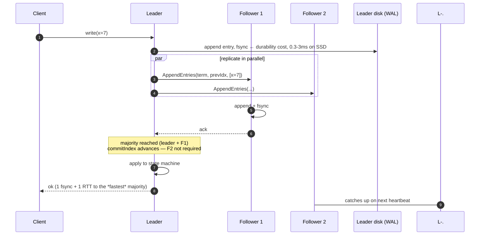
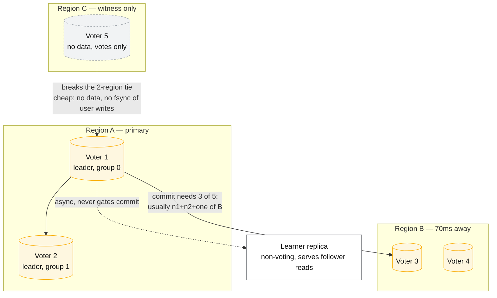

# Consensus — Raft and Paxos

## Core concept

Consensus turns a set of unreliable machines into one replicated state machine with a **totally
ordered log**. Every higher-level guarantee people ask for — leader election, membership, config
distribution, distributed locks with real mutual exclusion, linearizable writes — reduces to
"append to that log and wait for a majority". The algorithms differ mostly in how they get a leader
and how they recover from a leader that vanished mid-log; the cost model is identical and it is the
part that matters for design: **one durable write plus one round trip to a majority, per decision.**

That cost is why the correct architectural instinct is not "use Raft" but **"how do I keep this off
the consensus path?"** Consensus is a control-plane technology at metadata scale. Systems that run
user traffic through it inherit its throughput ceiling and its latency floor.

## Mechanics & internals

### Raft in the parts that get asked about

**Terms and elections.** Time is divided into terms, each with at most one leader. A follower that
misses heartbeats for a randomised election timeout increments the term and campaigns; randomisation
(e.g. 150–300 ms, or etcd's 1000 ms default with a 100 ms heartbeat) is what prevents perpetual
split votes. A candidate wins with votes from a majority, and a voter grants only if the candidate's
log is at least as up to date as its own — that single rule is what guarantees the new leader holds
every committed entry.

**Log matching.** If two logs contain an entry with the same index and term, they are identical up
to that index. `AppendEntries` carries `(prevLogIndex, prevLogTerm)`; a mismatch causes the follower
to reject and the leader to walk backwards until they agree. This is why divergent tails are
truncated rather than merged — a follower's uncommitted entries can and will be discarded.

**The commit rule everyone gets wrong.** A leader may *not* commit an entry from a previous term
just because it is replicated on a majority. It must first commit an entry from its own term
(Raft's Figure 8). Skip this and an entry that appeared committed can be overwritten by a later
leader. Most homegrown "simple Raft" implementations contain exactly this bug.

The diagram carries the two numbers that decide everything: **one fsync** and **one round trip to
the fastest majority**. The slowest replica does not gate the commit — which is why a 5-node group
tolerates one slow node gracefully and a 3-node group does not.

### Membership change is where implementations get it wrong

Raft offers two mechanisms:

- **Joint consensus** — transition through a combined configuration `C_old,new` in which decisions
  need majorities of *both* configurations. Safe for arbitrary changes.
- **Single-server change** — add or remove one node at a time, relying on the fact that majorities
  of configurations differing by one member always intersect.

In 2015 a safety bug was found in the single-server method: across term boundaries, two competing
configuration changes can produce quorums that do not overlap, allowing committed entries to be
lost. Ongaro published a fix (do not apply a new configuration until an entry from the current term
has committed). **Joint consensus was never affected.** If you are auditing a Raft implementation,
this is the first thing to check, and the reason production systems (etcd, TiKV) moved to joint
consensus or added the term-commit guard.
([raft-dev thread](https://groups.google.com/g/raft-dev/c/t4xj6dJTP6E),
[Ongaro's writeup](https://gist.github.com/ongardie/a11f32b70581e20d6bcd))

### PreVote, CheckQuorum, and the disruptive-server problem

A node partitioned away from the cluster keeps timing out and incrementing its term. When the
partition heals it arrives with a higher term and **forces the healthy leader to step down**, even
though it holds a stale log — an availability blip caused entirely by a node that was never
eligible to lead. The fixes are standard and both should be on:

- **PreVote**: campaign in a "would you vote for me?" phase without incrementing the real term.
- **CheckQuorum**: a leader that cannot reach a majority steps down on its own, rather than serving
  stale lease reads.

### Paxos, and why the family matters

Multi-Paxos and Raft are equivalent in power; Raft fixes the leader and the log to be contiguous,
which is what makes it implementable by mortals. Two variants earn their keep at staff level:

- **Flexible Paxos** — the only requirement is that the *election* quorum intersects the
  *replication* quorum, not that each is a majority. With N=5 you can replicate to 2 and elect from
  4. This buys lower write latency at the cost of a more expensive, rarer election.
- **EPaxos / leaderless variants** — commit non-interfering commands in one round trip without a
  leader; excellent for geo-distribution, notoriously hard to implement, and the reason most
  systems stayed with Raft.

**ZAB** (ZooKeeper) predates Raft and is essentially the same shape with a different recovery
protocol. **Byzantine consensus (PBFT and descendants)** solves a different problem — nodes that
lie — and costs an extra round plus 3f+1 nodes. Unless you are building a blockchain, you do not
need it, and saying so crisply is worth more than reciting PBFT.

## Numbers that matter

| Quantity | Value | Confidence |
|---|---|---|
| Nodes to tolerate `f` failures | `2f+1` — 3 tolerates 1, 5 tolerates 2 | Definitional |
| Why never 4 | 4 tolerates 1, same as 3, with more latency and more ways to fail | Definitional |
| Commit latency, 3 nodes, same region across AZs | 1–5 ms | Order of magnitude — fsync + 1 RTT |
| Commit latency, quorum spanning regions 70 ms apart | 70–150 ms | Follows from RTT; unavoidable |
| etcd sustained writes, 3-node SSD cluster, small keys | ~10 k/s order of magnitude | [etcd performance docs](https://etcd.io/docs/latest/op-guide/performance/) — metadata scale, not data scale |
| etcd default election timeout / heartbeat | 1000 ms / 100 ms | [etcd tuning docs](https://etcd.io/docs/latest/tuning/); the ratio should stay ≥ 10× |
| WAL fsync p99 to alert on | > 10 ms is a problem, > 100 ms causes elections | etcd's own guidance; this is the single most useful consensus alert |
| Practical Raft group size | 3 or 5 voters; scale reads with **learners**, not voters | Every added voter adds an fsync and a network path to the majority |

### Quorum placement arithmetic — the part that decides multi-region designs

| Layout | Survives | Write latency | Verdict |
|---|---|---|---|
| 3 nodes, 1 region, 3 AZs | 1 AZ loss | 1–5 ms | The default. Correct for almost everything |
| 3 nodes across 3 regions | 1 region loss | ≥ 1 cross-region RTT on **every** write | Honest but expensive; only if regional survival is a hard requirement |
| 2 nodes region A + 1 region B | 1 node loss | Fast while both A nodes are up; falls off a cliff when one dies | Common and defensible — say the cliff out loud |
| 2 regions, 2+2 | **Nothing** — no majority exists in either half | — | Broken. Two regions cannot form a quorum alone; you need a third failure domain, even a witness |
| 5 nodes, 2+2+1 (third region as witness) | 1 region loss, cheap third region | Majority usually within the two main regions | The standard answer for "two regions plus survivability" |

**Multi-Raft is how real systems scale.** One Raft group per shard/range (CockroachDB ranges, TiKV
regions, Kafka KRaft partitions), each with its own leader, leaders spread across nodes. Throughput
scales with the number of groups; a single group never does. If a design says "we'll put the whole
dataset in a Raft cluster", that is the ceiling conversation.

The witness is the whole trick: two regions cannot form a majority alone, and a third *region* is
expensive, but a third **failure domain** does not have to hold data.

## Failure modes

| Failure | Symptom | Mitigation |
|---|---|---|
| **Quorum loss** (2 of 3 down) | Cluster is unavailable for writes — by design, not a bug | 5 nodes for critical metadata; spread failure domains; have a documented, rehearsed unsafe-recovery procedure |
| **Slow disk, not dead node** | Leader holds leadership but every commit waits on fsync; the cluster is "up" and unusable | Alert on WAL fsync p99; treat gray failure as failure — leadership transfer on sustained slowness |
| **Election storms** | Repeated leader changes under load; throughput collapses | PreVote + CheckQuorum; election timeout ≥ 10× heartbeat; separate consensus traffic from data traffic |
| **GC / VM pause > election timeout** | Leader is deposed; on resume it briefly believes it still leads | Fencing on every downstream write — see [leases-locks-and-fencing.md](./leases-locks-and-fencing.md) |
| **Disruptive rejoining node** | A healed partition deposes a healthy leader | PreVote |
| **Unbounded log / snapshot pressure** | Disk fills, or a lagging follower forces a full snapshot transfer that saturates the link | Compaction thresholds; rate-limit snapshot streaming; keep the state machine small |
| **Membership change bug** | Committed entries disappear after a reconfiguration | Joint consensus, or the term-commit guard; never hand-roll this |
| **Consensus on the data plane** | Ceiling at ~10 k writes/s, latency floor of an RTT, no way out without a rewrite | Keep consensus for metadata; use quorum replication for data |

**Documented incident.** Roblox, 28–31 October 2021 — a **73-hour** outage affecting ~50 M users.
Two independent problems inside the Consul cluster that everything else depended on: a recently
enabled *streaming* feature caused excessive contention on Consul's write path under unusually high
read/write load, and that elevated load triggered a pathological freelist-maintenance cost in
**BoltDB**, the embedded store holding Consul's write-ahead log for leader election and replication.
Diagnosis took days partly because **the monitoring stack itself depended on Consul**. The lessons
are not about Raft: a healthy consensus algorithm on an unhealthy storage engine is an unavailable
cluster, a new feature flipped on in the coordination layer is a change to the most blast-radius-
sensitive component you own, and observability must not sit downstream of the thing it observes.
([Roblox return to service](https://about.roblox.com/newsroom/2022/01/roblox-return-to-service-10-28-10-31-2021))

## Trade-offs vs alternatives

| Option | Guarantee | Cost | Use when |
|---|---|---|---|
| **Raft** | Linearizable log, understandable, well-tooled | 1 fsync + 1 majority RTT per write | Default for new systems needing agreement |
| **Multi-Paxos** | Same | Same, harder to implement correctly | You are Google, or you inherited Chubby's lineage |
| **Flexible Paxos** | Same safety, tunable quorums | Cheaper writes, more expensive elections | Write latency dominates and elections are rare |
| **EPaxos and leaderless** | 1 RTT for non-conflicting commands, no leader bottleneck | High implementation complexity, conflict handling | Geo-distributed writes with low conflict rates |
| **Chain replication** | Strong consistency, high throughput | Reconfiguration needs an external consensus service anyway | Storage layers with a separate control plane |
| **Primary–backup + external lock service** | Simple data path | You still depend on someone's consensus (ZooKeeper, etcd) | Most systems — and the honest description of "we don't use consensus" |
| **Quorum replication without consensus (Dynamo-style)** | Availability, tunable staleness | No total order; conflicts are the application's problem | Data plane at scale — see [quorums-and-anti-entropy.md](./quorums-and-anti-entropy.md) |

### Where staff engineers get this wrong

1. **Even-sized clusters.** 4 nodes tolerate the same single failure as 3 while doubling the ways to
   lose quorum. 6 is worse than 5. This is a one-line disqualifier in a design review.
2. **A quorum spread across exactly two regions.** No majority can form inside either region, so a
   region loss is a total outage — the opposite of the intent. Three failure domains or a witness.
3. **Treating consensus as free durability.** Every commit is an fsync on a majority of nodes. If
   the workload is 100 k writes/s of user data, consensus is the wrong layer, and the answer is
   partitioning plus quorum replication.
4. **Confusing "leader elected" with "safe to act".** Between losing leadership and learning about
   it, a former leader can still issue side effects. Only fencing tokens checked by the *resource*
   close that window.
5. **Ignoring the storage engine under the algorithm.** Roblox's outage was Raft-adjacent, not
   Raft-caused. Consensus correctness assumes durable, prompt local writes; when the disk lies or
   stalls, the algorithm's assumptions are already broken.
6. **Hand-rolling membership change.** The single-server bug went unnoticed in the published
   algorithm for a year and a half. Use a library.

## Real-world examples

- **etcd** — Raft with learners, joint-consensus reconfiguration, ReadIndex and (optional) lease
  reads. The de facto control plane store; Kubernetes' entire state is one etcd keyspace.
- **CockroachDB / TiKV** — multi-Raft: one group per range, leases held by a leaseholder replica to
  serve reads without a quorum round trip; leadership rebalanced continuously by an allocator.
- **Kafka KRaft** — the controller quorum replaced ZooKeeper; metadata is a Raft log and brokers
  are replicated by ISR, deliberately *not* by Raft — a clean example of consensus for metadata,
  something cheaper for the data plane.
- **ZooKeeper (ZAB)** — the incumbent for locks, membership and config; still what a large fraction
  of "we use a distributed lock" answers actually depends on.
- **Spanner** — a Paxos group per shard, with the leader holding a lease; consensus for the log,
  TrueTime for the real-time order.

## Staff-level follow-ups

1. You need a control plane that survives the loss of one region, with writes under 20 ms p99 in the
   primary region. Place the voters, justify the count, and state exactly what happens to write
   latency and availability when the primary region fails.
2. A Raft cluster shows normal CPU, no leader changes, and write p99 has moved from 3 ms to 400 ms.
   Give your diagnosis order and the metric that confirms each hypothesis.
3. Explain why a leader may not commit an entry from a previous term on majority replication alone,
   using a concrete four-node history that loses a committed entry if you do.
4. Your system does 200 k writes/s and someone proposes routing them all through Raft for
   simplicity. Compute the implied cost, then design the alternative and name precisely which
   guarantee you gave up.
5. Compare the failure behaviour of a lease-based read (leaseholder serves locally) with a
   ReadIndex read during a network partition that isolates the leaseholder. Which one can serve a
   stale value, under what clock assumption, and how would you bound it?

## See also

- [consistency-models.md](./consistency-models.md) — what the consensus round trip buys you
- [leases-locks-and-fencing.md](./leases-locks-and-fencing.md) — leases built on top of consensus, and the zombie-holder problem
- [quorums-and-anti-entropy.md](./quorums-and-anti-entropy.md) — the data-plane alternative
- [../02-primitives/reliability-patterns.md](../02-primitives/reliability-patterns.md) — failure containment around a consensus store
- [../03-backend-cases/metrics-monitoring.md](../03-backend-cases/metrics-monitoring.md) — why the monitoring stack must not depend on the coordination store

## Referenced by

- [Consistency and consensus](../02-primitives/consistency-and-consensus.md)
- [Consistency models](consistency-models.md)
- [Fundamentals index](README.md)
- [Leases, locks and fencing](leases-locks-and-fencing.md)
- [Quorums and anti-entropy](quorums-and-anti-entropy.md)
- [Topic manifest](../topics/manifest.md)

## Sources

- [Ongaro & Ousterhout — In Search of an Understandable Consensus Algorithm (Raft)](https://raft.github.io/raft.pdf)
- [raft-dev — bug in single-server membership changes (2015)](https://groups.google.com/g/raft-dev/c/t4xj6dJTP6E) and [Ongaro's safety writeup](https://gist.github.com/ongardie/a11f32b70581e20d6bcd)
- [Howard et al. — Flexible Paxos: Quorum intersection revisited](https://arxiv.org/abs/1608.06696)
- [etcd — performance and tuning](https://etcd.io/docs/latest/op-guide/performance/)
- [Roblox — return to service, 28–31 October 2021](https://about.roblox.com/newsroom/2022/01/roblox-return-to-service-10-28-10-31-2021)
- [Spanner: Google's globally-distributed database, OSDI 2012](https://research.google/pubs/pub39966/)
- Local book: `DE/System-Design/Designing Data Intensive Applications.pdf` ch.9
