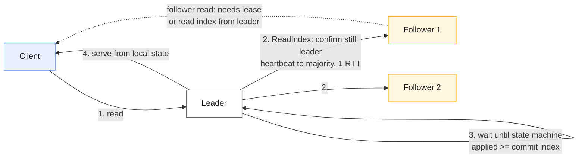
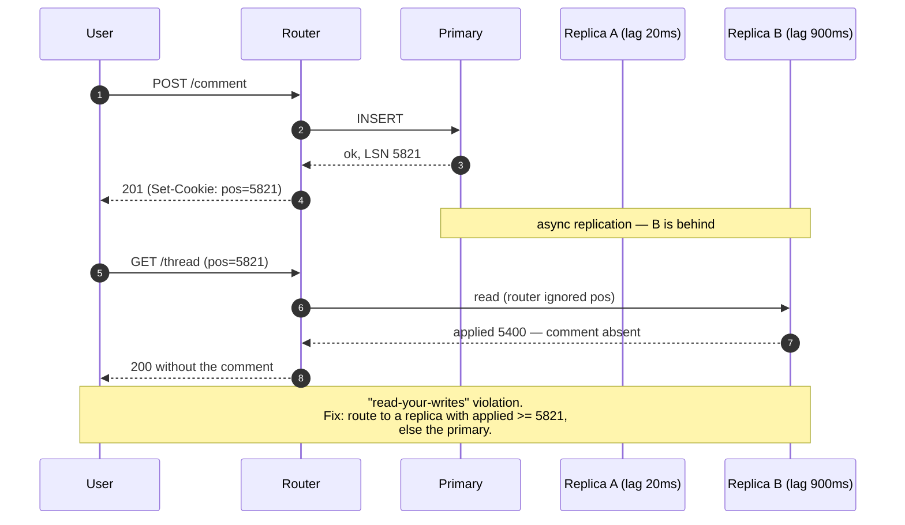

# Consistency models

## Core concept

A consistency model is a **contract about which histories the store is allowed to produce** — not
a quality setting. Two independent hierarchies get collapsed into one word in most discussions:
*replica-state* models (linearizable → sequential → causal → eventual) constrain what a single
object's reads can return, and *transaction isolation* (serializable → snapshot → read committed)
constrains what interleavings of multi-object transactions are legal. They are orthogonal:
serializable says nothing about real time, so a serializable database can legally serve you a
transaction that ran "before" a commit you already observed. Strict serializability is the
conjunction of both, and it is the only one that behaves the way people assume when they say
"strongly consistent".

The design question is never "strong or eventual" for a system. It is **which model each operation
needs**, because the price is paid per operation, in round trips.

## Mechanics & internals

### The ladder, and what each rung actually costs

| Model | Guarantee | What it costs | Composable? |
|---|---|---|---|
| **Strict serializable** | Transactions are serializable *and* the serial order respects real time | Consensus + a real-time anchor (commit wait or a lease) | Yes |
| **Linearizable** (single object) | Every read returns the value of the most recently *completed* write; operations appear to take effect at a point between invocation and response | One round trip to a majority per operation | Yes — linearizable objects compose into a linearizable system |
| **Sequential** | All nodes agree on one order; that order need not respect real time | Total-order broadcast, no real-time anchor | Yes |
| **Serializable** (transactions) | Some serial order exists | 2PL, SSI or a deterministic scheduler | **No real-time guarantee** |
| **Snapshot isolation** | Reads from a consistent snapshot; first-committer-wins on writes | MVCC, no read locks | Allows write skew |
| **Causal+ (causal + convergence)** | Happens-before is preserved; concurrent writes converge | Metadata (deps or vector clocks); **no coordination** | Yes |
| **Session guarantees** (RYW, monotonic reads/writes, writes-follow-reads) | Per-client illusions only | Routing and a token — cheapest useful guarantee in the set | Per-session only |
| **Eventual** | Converges *if writes stop* | Free; conflict resolution is now your problem | No |

The rung that matters most and is discussed least is **causal+**. Attiya, Mahajan and others proved
that real-time causal consistency is the **strongest model achievable in an always-available,
partition-tolerant system** — everything above it requires giving up availability during a
partition. So "AP but not garbage" has a precise ceiling, and it is causal, not eventual. Systems
that advertise "eventual consistency" and provide no causal metadata are sitting *below* the
achievable frontier, not at it.

### How a linearizable read is actually served

The write path is the boring part — consensus, majority, done. The read path is where designs
differ, and where the cost hides:

Four implementations of "linearizable read", in increasing cleverness:

1. **Read through the log.** Append a no-op entry, wait for commit. Correct, costs a full write.
2. **ReadIndex** (etcd, TiKV default). Record the current commit index, confirm leadership with one
   round of heartbeats to a majority, wait for the local apply to catch up, then read locally. One
   network RTT, no disk write.
3. **Lease read.** The leader holds a time-based lease and skips the heartbeat entirely — zero RTT,
   but correctness now depends on bounded clock drift between nodes. This is a **clock assumption
   smuggled into a safety property**, and it is why etcd guards lease reads behind a clock-drift
   bound and TiKV makes them optional.
4. **Follower reads with a read index.** The follower asks the leader for the current commit index
   (1 RTT to leader, not to a majority), waits for local apply, then serves. Scales read throughput
   without violating linearizability — this is how TiKV and CockroachDB serve reads off replicas.

### Getting real-time order without a global clock

Spanner's answer is TrueTime: an interval `[earliest, latest]` with bounded uncertainty ε, and a
**commit wait** of 2ε before a transaction's writes become visible. The system pays latency to buy
a global order, deliberately and measurably. CockroachDB, without atomic clocks, uses hybrid
logical clocks plus an uncertainty interval and **restarts** transactions that read inside it —
trading the deterministic wait for a probabilistic retry.

### Session guarantees are routing, not consensus

Read-your-writes usually costs nothing but bookkeeping: the client (or gateway) carries the LSN /
commit timestamp of its last write, and the router either picks a replica whose applied position is
≥ that token, or falls back to the leader. Getting this wrong is the most common source of "the UI
shows my comment disappearing".

## Numbers that matter

Coordination cost is a round-trip count multiplied by a network distance. That is the whole
arithmetic; everything else is detail.

| Quantity | Value | Source / confidence |
|---|---|---|
| Same-AZ RTT | 0.2–0.5 ms | Order of magnitude — measure yours |
| Cross-AZ RTT (same region) | 0.5–2 ms | Order of magnitude |
| Cross-region RTT (us-east ↔ us-west) | 60–80 ms | Order of magnitude |
| Cross-continent RTT (us-east ↔ eu-west) | 70–90 ms | Order of magnitude |
| Raft commit, single region, 3 nodes across AZs | 1–5 ms | Order of magnitude; dominated by fsync + 1 RTT |
| Raft commit, quorum spans regions | 60–150 ms | Follows directly from the RTT above |
| Spanner TrueTime uncertainty ε | typically < 7 ms; commit wait ≈ 2ε | [Spanner, OSDI 2012](https://research.google/pubs/pub39966/) |
| DynamoDB strongly consistent read | 1 RCU per 4 KB vs 0.5 for eventually consistent | [AWS RCU docs](https://docs.aws.amazon.com/amazondynamodb/latest/developerguide/HowItWorks.ReadWriteCapacityMode.html) — **strong reads cost exactly 2× and are single-AZ** |
| etcd sustained write throughput | ~10 k writes/s order of magnitude | Metadata scale. If your design needs consensus at 100 k/s, the design is wrong |

**The arithmetic that decides multi-region designs.** A linearizable write with a quorum spanning
two regions costs ≥ 1 cross-region RTT — call it 70 ms. At a 200 ms p99 API budget, you can afford
**two** such writes and nothing else. This single line kills most "active-active with strong
consistency everywhere" proposals faster than any argument about CAP.

**Replication lag is not a constant, it is a distribution with a tail.** A p50 of 20 ms and a p99 of
900 ms is a normal healthy MySQL/Postgres replica set under bursty write load; during a large
`UPDATE`, a schema change, or a replica restart the tail goes to minutes. Any correctness argument
of the form "lag is only a few milliseconds" is a design that fails at the p99.9.

## Failure modes

| Failure | What it looks like in production | Mitigation |
|---|---|---|
| **Read-your-writes violation** | User posts, refreshes, content is gone; support tickets say "data loss" | LSN/commit-token routing; sticky-to-primary window after a write |
| **Monotonic read violation** | Value appears, then disappears on the next refresh — two replicas at different positions behind a round-robin LB | Session stickiness to one replica, or token routing |
| **Unbounded eventual** | A replica falls hours behind and still serves reads because health checks only test the port | Health check must assert `lag < threshold`; eject on breach |
| **Lease read under clock skew** | Two nodes each believe they hold a valid lease; stale reads served as linearizable | Bound drift explicitly, monitor it, fall back to ReadIndex when drift exceeds bound |
| **Strong store behind a weak cache** | The database is linearizable; the cache in front is not; the system's real model is the cache's | Treat the cache as part of the consistency boundary, or bypass it for the operations that need the guarantee |
| **Consistency downgrade under load** | An operator "temporarily" flips reads to eventual to shed load, and an invariant that assumed strong reads silently breaks | Make consistency level a property of the operation in code, not a runtime knob |
| **Partition with an AP store and no conflict policy** | Both sides accept writes; on heal, last-write-wins silently discards one side | Choose the resolution strategy *before* the partition; LWW is a decision, not a default |

**Documented incident.** GitHub, 21 October 2018: a 43-second network partition during optical
equipment replacement let the US East data centre accept writes that never replicated west.
Orchestrator (Raft-based) still had quorum via the west coast and cloud members, failed the topology
over, and produced a split brain — 43 seconds of partition, **24 h 11 m of degraded service**, most
of it spent reconciling writes that existed on only one side. The consensus layer behaved
correctly; the *data* layer's asynchronous replication was the part with no story for a partition.
([post-incident analysis](https://github.blog/news-insights/company-news/oct21-post-incident-analysis/))

## Trade-offs vs alternatives

### CAP, stated so it survives scrutiny

CAP is a claim about **behaviour during a partition**, and only that. Partitions occur, so P is not
a choice; the choice is what you do while one is in progress: reject (CP) or serve possibly-stale
data (AP). "We chose CA" is not a position. Brewer's own 2012 retrospective calls the 2-of-3
framing misleading and notes that partitions are rare enough that the *normal-operation* trade-off
matters more — which is exactly what PACELC formalises.

**PACELC**: *if* **P**artition, choose **A** or **C**; **E**lse, choose **L**atency or **C**onsistency.
The `E` half is the one you live with 99.99% of the time.

| System | PACELC | The lever |
|---|---|---|
| Postgres, single leader, async replica | PC/EL | Sync replica flips it to EC and adds an RTT to every commit |
| Postgres/MySQL with sync replication | PC/EC | Commit blocks on the replica ack |
| DynamoDB | PA/EL by default | `ConsistentRead=true` per request → EC, 2× cost |
| Cassandra / Scylla | PA/EL | `R + W > N` moves it toward EC per query |
| MongoDB | PC/EC with `majority` write + read concern; PA/EL with defaults | Write concern and read concern are separate dials |
| Spanner / CockroachDB | PC/EC | Pays in commit latency; TrueTime wait or HLC-driven retries |

### Where staff engineers get this wrong

1. **Treating consistency as a system property.** The correct unit is the operation. "Seat
   reservation is linearizable; the seat-map preview is causal; the 'X people viewing' badge is
   eventual" is a design. "The system is strongly consistent" is a slogan that buys latency nobody
   asked for on the 99% of traffic that never needed it.
2. **Assuming serializable implies linearizable.** It does not. Under serializable-but-not-strict
   isolation, a transaction that starts after another commits may still be ordered before it. If
   an external observer (a queue message, a webhook, a second service) can see both, you need
   strict serializability, and you should say so.
3. **Buying strong consistency, then putting a cache in front.** The end-to-end model is the
   weakest link on the path. A linearizable database behind a 60-second TTL cache is a 60-second
   staleness system with a much larger bill.
4. **Using "eventual" with no staleness SLO.** Eventual with a monitored p99 lag of 200 ms is an
   engineering decision. Eventual with no lag metric is an unbounded liability that surfaces as a
   correctness bug during your next replica restart.
5. **Reaching for consensus on the data plane.** Consensus belongs on metadata — leader identity,
   shard maps, config — kilobytes at low write rates. Routing per-request user traffic through Raft
   inherits a throughput ceiling (~10 k/s order of magnitude) and a latency floor for no benefit
   that quorum replication would not have given.

## Real-world examples

- **Spanner** — strict serializability globally, implemented with Paxos groups per shard plus
  TrueTime commit wait; the latency cost is explicit and documented rather than hidden.
- **DynamoDB** — eventually consistent reads by default from any of three replicas; strongly
  consistent reads go to the leader replica, cost 2× the RCUs, and are unavailable if that AZ is
  partitioned. The pricing model exposes the CAP trade as a line item.
- **Cassandra / Scylla** — tunable per query: `ONE`, `QUORUM`, `LOCAL_QUORUM`, `ALL`. `R + W > N`
  gives strong consistency for that key *only* if no sloppy-quorum hint is involved — see
  [quorums-and-anti-entropy.md](./quorums-and-anti-entropy.md).
- **MongoDB** — `writeConcern: majority` plus `readConcern: majority` gets you a durable, majority-
  visible read; `readConcern: linearizable` additionally waits out concurrent writes and is
  documented as slow enough to require a `maxTimeMS`.
- **Kafka** — the log gives per-partition total order and nothing across partitions. Choosing the
  partition key *is* choosing the consistency boundary for downstream consumers.

## Staff-level follow-ups

1. Your service is linearizable for writes and reads from followers using a leader-issued read
   index. A network partition isolates one follower, which keeps serving reads for 30 seconds. Is
   linearizability violated? Walk through the exact mechanism that does or does not protect you.
2. You have a 200 ms p99 budget and a requirement for strict serializability across two regions
   70 ms apart. Enumerate every design that fits, including the ones that change the product
   requirement, and say which you would defend to a VP.
3. A team proposes moving reads to replicas to cut primary load by 60%. What must be true about
   the *product* for this to be safe, what token would you thread through, and what would you
   monitor to detect the day it stops being true?
4. Explain the difference between serializable and strictly serializable using a concrete
   interleaving involving a webhook, and state which real database defaults to which.
5. Under what circumstances is causal consistency strictly better than "eventual plus session
   stickiness", given that the latter is far cheaper to implement? What breaks when a user's
   session moves between devices?

## See also

- [transaction-isolation-levels.md](./transaction-isolation-levels.md) — the transaction half of the ladder
- [consensus-raft-paxos.md](./consensus-raft-paxos.md) — what a linearizable write actually pays for
- [quorums-and-anti-entropy.md](./quorums-and-anti-entropy.md) — the `R + W > N` machinery and how it lies
- [leases-locks-and-fencing.md](./leases-locks-and-fencing.md) — lease reads and the clock assumption they hide
- [../02-primitives/replication-and-partitioning.md](../02-primitives/replication-and-partitioning.md) — replication topologies that create the lag
- [../03-backend-cases/payments-ledger.md](../03-backend-cases/payments-ledger.md) — a design where the model must be strict

## Referenced by

- [Cache invalidation](cache-invalidation.md)
- [Consensus — Raft and Paxos](consensus-raft-paxos.md)
- [Consistency and consensus](../02-primitives/consistency-and-consensus.md)
- [Consistency model matrix](../comparisons/consistency-model-matrix.md)
- [Fundamentals index](README.md)
- [Leases, locks and fencing](leases-locks-and-fencing.md)
- [Quorums and anti-entropy](quorums-and-anti-entropy.md)
- [Replication lag and session guarantees](replication-lag-and-session-guarantees.md)
- [Replication topologies](replication-topologies.md)
- [Topic manifest](../topics/manifest.md)
- [Transaction isolation levels](transaction-isolation-levels.md)

## Sources

- [Jepsen — consistency models map](https://jepsen.io/consistency) — the hierarchy, including which models are available under partition
- [Brewer — CAP twelve years later](https://www.infoq.com/articles/cap-twelve-years-later-how-the-rules-have-changed/) — the author retracting the 2-of-3 framing
- [Abadi — Consistency tradeoffs in modern distributed database design (PACELC)](https://www.cs.umd.edu/~abadi/papers/abadi-pacelc.pdf)
- [Spanner: Google's globally-distributed database, OSDI 2012](https://research.google/pubs/pub39966/) — TrueTime and commit wait
- [GitHub — October 21 post-incident analysis](https://github.blog/news-insights/company-news/oct21-post-incident-analysis/) — 43 s partition, 24 h degradation
- [Terry et al. — Session guarantees for weakly consistent replicated data (Bayou)](https://dl.acm.org/doi/10.5555/645792.668302)
- Local book: `DE/System-Design/Designing Data Intensive Applications.pdf` ch.5 and ch.9
