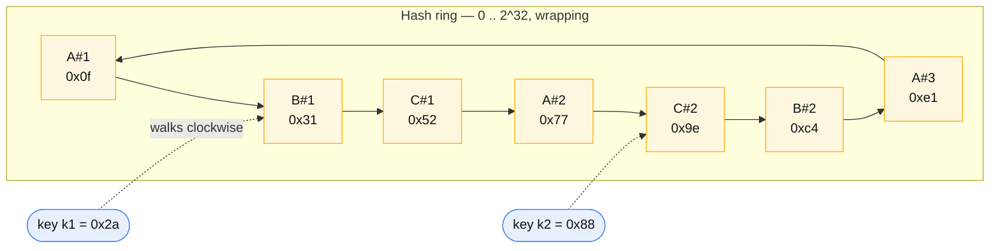
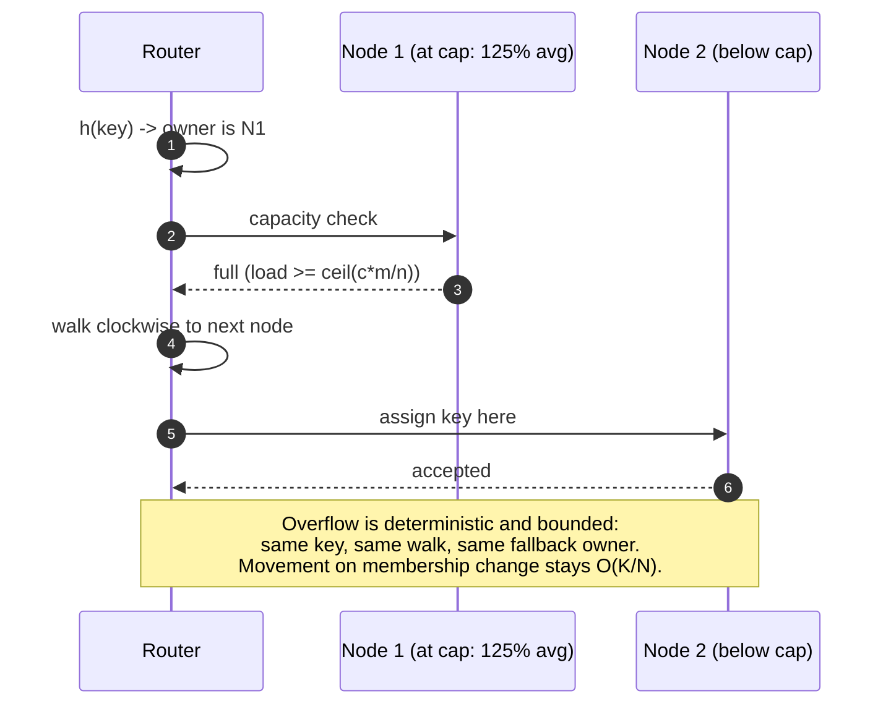

# Consistent hashing

## Core concept

Consistent hashing exists to answer one question: when the number of nodes changes, how many keys
have to move? With `hash(key) % N` the answer is "almost all of them" — changing N from 10 to 11
remaps roughly 90% of keys, which for a cache means a near-total miss storm and for a datastore
means moving the entire dataset. Consistent hashing makes the answer `K/N`: only the keys owned by
the departing or arriving node move, and every other key stays put.

The subtlety that matters at staff level is that consistent hashing solves **movement**, not
**balance**. A plain ring distributes keys badly — the variance of arc lengths is high — and it
says nothing about load, only about key count. Virtual nodes fix the first problem; bounded loads
fix the second; neither is on by default in a naive implementation, and both are what the interview
is actually probing.

## Mechanics & internals

### The ring

Hash both keys and node identifiers into the same space (typically 2^32 or 2^64, treated as a
circle). A key belongs to the first node encountered walking clockwise from the key's position.
Adding a node claims one arc from one successor; removing a node hands its arc to its successor.

**Without virtual nodes** each physical node owns one arc, and random placement produces arcs whose
sizes vary wildly — the standard result is that the largest arc is `O(log n)` times the average,
so one node can own several times its fair share. Worse, when a node dies its **entire** load lands
on a single successor, which is how one failure becomes two.

**With virtual nodes** each physical node is hashed to `V` positions (100–256 in practice). Load
variance falls as `1/√V`, and a failed node's load is spread across many successors instead of one.
The cost is memory and lookup structure size — a 100-node cluster at 256 vnodes is 25 600 ring
entries, which is trivial — plus a subtlety in datastores: vnodes fragment token ranges, which
makes streaming and repair operations touch more ranges. Cassandra reduced its default from 256 to
**16** for exactly this reason, using a token-allocation algorithm to keep balance at the lower
count.

### Bounded loads — the variant most designs should be using

Consistent hashing balances **keys**, and a key's traffic is not uniform. One popular key or one
long-lived connection can overload its node while the ring reports perfect balance. Google and
Vimeo's *Consistent Hashing with Bounded Loads* adds a capacity constraint: pick a balancing
parameter `c = 1 + ε`, cap every node at `⌈c · m/n⌉` (its share of `m` items across `n` nodes), and
when the natural owner is at capacity, walk to the next node on the ring.

The guarantee is that **no node ever exceeds `c` times the average**, while movement on
add/remove stays proportional to the change. Vimeo runs it in HAProxy with `c = 1.25` — a 25%
headroom allowance — and Google implemented it in Cloud Pub/Sub. If you are load-balancing
long-lived connections or requests of uneven cost, this is the algorithm to name.

### The alternatives, and when each wins

| Algorithm | Lookup cost | Memory | Movement on change | Weighted nodes? | Notes |
|---|---|---|---|---|---|
| **Ring + vnodes** | `O(log(nV))` binary search | `O(nV)` | Minimal | Yes — give big nodes more vnodes | The default; needs vnodes to be balanced |
| **Rendezvous (HRW)** | `O(n)` — hash key with every node, take max | `O(n)` | Provably minimal | Yes, cleanly (weighted HRW) | Simpler and better-balanced than a ring at small `n`; the `O(n)` scan is fine below ~100 nodes |
| **Jump consistent hash** | `O(log n)`, no memory at all | **Zero** | Minimal | No | Beautiful and constrained: buckets are `0..n-1` and you can only add/remove at the **end**. Great for shard counts, useless for a named node set |
| **Maglev hashing** | `O(1)` table lookup | `O(M)` lookup table (M ≫ n, prime) | Small but **not** minimal | Yes | Built for load balancers: near-perfect balance and constant-time lookup, accepting slightly more disruption |

The decision is usually: **rendezvous** if the node set is small and you want the simplest correct
thing; **ring with vnodes** if you need weights and range ownership (datastores); **Maglev** if
lookup must be O(1) at line rate (L4 load balancers); **jump hash** only when your buckets are
genuinely an integer range.

### Replication on the ring

In a datastore the ring also decides replica placement: the key's `N` replicas are the next `N`
distinct **physical** nodes clockwise. Two corrections that separate a working design from a
textbook one:

- Skip vnodes belonging to a node you already selected, or "3 replicas" can be three vnodes of the
  same machine.
- Make the walk **rack- and AZ-aware**, or all three replicas can land in one failure domain.
  Cassandra's `NetworkTopologyStrategy` exists precisely for this.

## Numbers that matter

| Quantity | Value | Confidence |
|---|---|---|
| Keys moved, `hash % N`, N: 10 → 11 | ~90% | `1 − 1/N'` — arithmetic |
| Keys moved, consistent hashing, one node added | `K/N` — ~9% at N=11 | Definitional |
| Load imbalance, ring, no vnodes | Largest arc `O(log n)` × average | Classic result; means a single node at several times its share |
| Vnodes per physical node | 100–256 typical; **Cassandra default 16** since 4.0 with token allocation | Vendor default; higher V balances better, fragments ranges more |
| Imbalance improvement | Roughly `1/√V` | Order of magnitude |
| Bounded-loads parameter | `c = 1.25` in Vimeo's HAProxy deployment | [Google Research](https://research.google/blog/consistent-hashing-with-bounded-loads/) |
| Bounded-loads guarantee | No node above `⌈c·m/n⌉` | [arXiv 1608.01350](https://arxiv.org/pdf/1608.01350) |
| Ring lookup | `O(log(nV))`; ~25 600 entries for 100 nodes × 256 vnodes | Trivial memory; do not over-think it |

**The cache arithmetic that motivates all of this.** A 20-node memcached tier at a 95% hit rate,
serving 200 k reads/s, backed by a database that can do 20 k reads/s. Lose one node: with `hash % N`
about 95% of keys remap and the miss rate jumps toward 100% — roughly 200 k reads/s at the
database, a 10× overload, and the cache tier takes the origin down with it. With consistent
hashing, ~5% of keys move and the database sees ~10 k extra reads/s, absorbed. This is the entire
reason the technique exists, and it is worth being able to say in numbers.

## Failure modes

| Failure | Symptom | Mitigation |
|---|---|---|
| **No virtual nodes** | Persistent imbalance; one node several times hotter; a death dumps its whole load on one neighbour | Vnodes (or rendezvous hashing) |
| **Balanced keys, unbalanced load** | Ring says even, one node saturated by a popular key or a fat connection | Bounded loads (`c ≈ 1.25`); plus [hot-shard-mitigation.md](./hot-shard-mitigation.md) |
| **Ring disagreement between clients** | Two clients compute different owners; writes and reads diverge; "the cache is lying" | Ring state must come from one authority (gossip converged, or a config service with a version) — and the version must be checked |
| **Flapping node** | Repeated add/remove churns ownership, causing rebalance storms and cache misses | Damping: require N consecutive failures; delay removal; never let health checks drive ring membership directly |
| **Replicas in one failure domain** | AZ loss takes all replicas of some keys | Topology-aware walk; verify with a placement audit, not by inspection |
| **Weighted nodes ignored** | A cluster of mixed instance sizes balanced as if uniform; small nodes saturate first | Vnode count proportional to capacity, or weighted rendezvous |
| **Adding capacity during an incident** | Ring change causes mass invalidation exactly when the origin is already struggling | Warm the new node before it takes ownership; add capacity before you need it |

**The classic production shape.** Ring changes and cache misses are the same event. Every
membership change — deliberate scaling, a rolling deploy, a flapping health check — converts to
origin load. The cheapest insurance is not a better hash: it is making the ring change rarely
(damping, manual approval for removals) and making the origin survivable when it does
(single-flight, request coalescing, load shedding).

## Trade-offs vs alternatives

| Approach | Movement on change | Balance | Complexity | Fits |
|---|---|---|---|---|
| **`hash % N`** | Catastrophic | Perfect while static | None | Fixed-size, never-resized sets. Rare |
| **Fixed logical partitions → nodes** | Whole partitions move; mapping is explicit | As good as the assignment | Low — a map | **Most datastores**; Kafka, Elasticsearch, Redis slots. Often better than a ring |
| **Ring + vnodes** | `K/N` | Good with enough vnodes | Moderate | Dynamo-style stores, caches |
| **Ring + bounded loads** | `K/N` | Guaranteed within `c` | Moderate + capacity tracking | Load balancers, uneven request costs |
| **Rendezvous (HRW)** | Minimal | Better than a plain ring | Very low | Small node sets; the underrated default |
| **Maglev** | Small, not minimal | Near-perfect | Higher | L4 load balancing at line rate |

**The honest observation most discussions skip:** for a datastore, a **fixed number of logical
partitions mapped to nodes** is usually simpler and better than a ring. Redis Cluster's 16 384
slots, Kafka's partition count, Elasticsearch's shard count — all of them chose an explicit map
over a hash ring, because a map can be inspected, planned, rebalanced deliberately, and made
topology-aware without touching a hash function. Consistent hashing earns its place where
membership changes *frequently and autonomously* (caches, load balancers, peer-to-peer), not where
it changes rarely under human control.

### Where staff engineers get this wrong

1. **Naming consistent hashing as a balance solution.** It bounds movement. Balance comes from
   vnodes; load balance comes from bounded loads.
2. **Assuming vnodes are free.** They fragment token ranges, which makes repair, streaming and
   bootstrap slower — the reason Cassandra's default dropped from 256 to 16.
3. **Reaching for a ring when a partition map would do.** If membership changes under human
   control, an explicit map is easier to reason about and to audit.
4. **Letting health checks drive membership.** A flapping node rewrites ownership repeatedly and
   turns a partial failure into a cluster-wide miss storm.
5. **Forgetting replica placement is part of the algorithm.** Walking to the next `N` ring entries
   without skipping same-node vnodes and same-AZ nodes silently reduces your replication factor.
6. **Ignoring uneven request cost.** Equal key counts with unequal work is the normal case;
   bounded loads exists because key-count balance is not load balance.

## Real-world examples

- **Amazon Dynamo (2007)** — consistent hashing with virtual nodes as the placement primitive,
  plus preference lists for replica placement; the paper that made this standard vocabulary.
- **Cassandra / ScyllaDB** — vnodes with `NetworkTopologyStrategy` for rack awareness; default
  vnode count reduced to 16 in 4.0 with an allocation algorithm, trading a little balance for much
  cheaper streaming and repair.
- **HAProxy at Vimeo** — bounded-load consistent hashing (`hash-balance-factor`), `c = 1.25`, for
  video traffic with highly uneven request cost.
- **Google Cloud Pub/Sub** — bounded loads applied to subscriber assignment.
- **Maglev (Google, NSDI 2016)** — O(1) table-based hashing for software load balancing at line
  rate; accepts non-minimal disruption to buy constant-time lookup and near-perfect spread.
- **memcached clients (ketama)** — the ring implementation most engineers have actually deployed,
  usually with 160 vnodes per server.

## Staff-level follow-ups

1. Compute the origin load spike when one node is lost from a 20-node cache tier, under `hash % N`
   and under consistent hashing, and say what you would do to survive the second case anyway.
2. Your ring is perfectly balanced by key count and one node is at 100% CPU. Give three distinct
   causes and the mitigation for each — only one of which is a hashing change.
3. Choose between rendezvous hashing and a ring with vnodes for a 12-node service with weighted
   instance sizes. Defend the choice, then say what changes at 500 nodes.
4. Describe how two clients could compute different owners for the same key, what the user-visible
   symptom would be, and the mechanism that prevents it.
5. Argue that your datastore should use a fixed 1024-partition map instead of a hash ring. What do
   you give up, and which operational task gets easier?

## See also

- [partitioning-strategies.md](./partitioning-strategies.md) — where placement sits in the larger decision
- [hot-shard-mitigation.md](./hot-shard-mitigation.md) — when balance is fine and one key is not
- [quorums-and-anti-entropy.md](./quorums-and-anti-entropy.md) — replica placement and repair on the ring
- [../02-primitives/caching.md](../02-primitives/caching.md) — the miss storm a ring change causes
- [../02-primitives/load-balancing-and-gateways.md](../02-primitives/load-balancing-and-gateways.md) — bounded loads in a load-balancer context

## Referenced by

- [Fundamentals index](README.md)
- [Hot shard mitigation](hot-shard-mitigation.md)
- [Partitioning strategies](partitioning-strategies.md)
- [Replication and partitioning](../02-primitives/replication-and-partitioning.md)
- [Topic manifest](../topics/manifest.md)

## Sources

- [Karger et al. — Consistent hashing and random trees (STOC 1997)](https://dl.acm.org/doi/10.1145/258533.258660)
- [Mirrokni, Thorup, Zadimoghaddam — Consistent Hashing with Bounded Loads (arXiv 1608.01350)](https://arxiv.org/pdf/1608.01350) and the [Google Research summary](https://research.google/blog/consistent-hashing-with-bounded-loads/)
- [Lamping & Veach — A fast, minimal memory, consistent hash algorithm (jump hash)](https://arxiv.org/abs/1406.2294)
- [Eisenbud et al. — Maglev: a fast and reliable software network load balancer (NSDI 2016)](https://research.google/pubs/pub44824/)
- [DeCandia et al. — Dynamo: Amazon's highly available key-value store (SOSP 2007)](https://www.allthingsdistributed.com/files/amazon-dynamo-sosp2007.pdf)
- [Cassandra — virtual nodes and token allocation](https://cassandra.apache.org/doc/latest/cassandra/architecture/dynamo.html)
