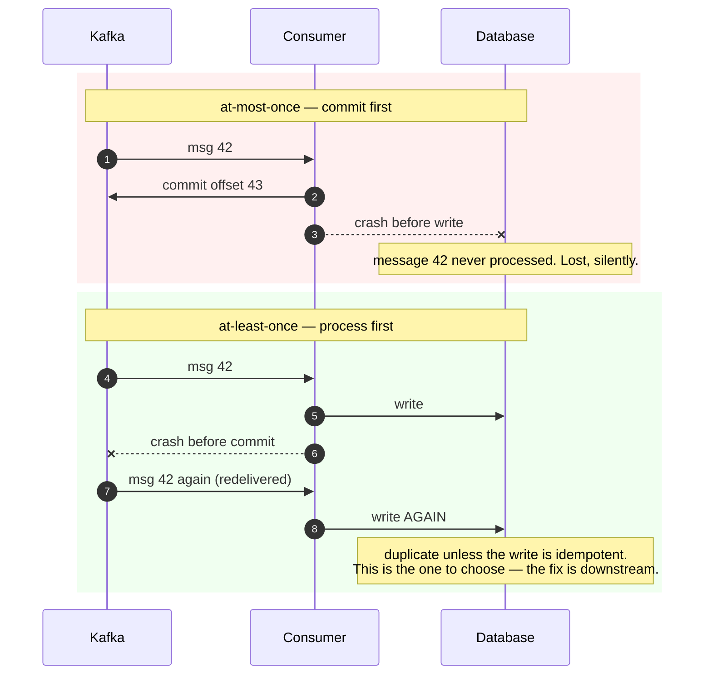
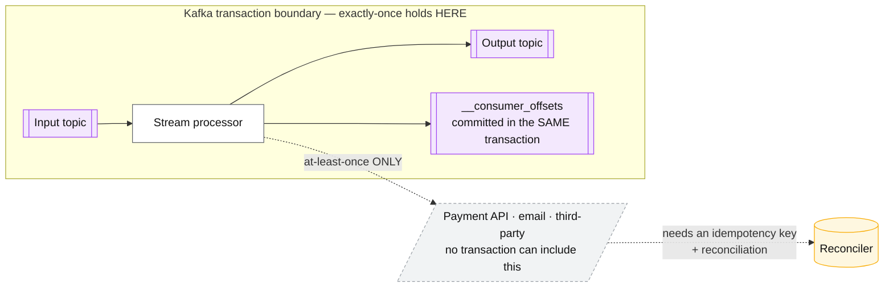

# Delivery semantics

## Core concept

**Exactly-once delivery is impossible.** Not hard — impossible, and provably so: the Two Generals
problem says two parties cannot reach certain agreement over a lossy channel, so a sender that
does not receive an acknowledgement can never distinguish "the message was lost" from "the
acknowledgement was lost". It must choose to resend (at-least-once, risking duplicates) or not
(at-most-once, risking loss).

What *is* achievable is **exactly-once effects**: the message may arrive many times, and the
observable outcome happens once. That is not a transport property — it is a property of the
receiver, built from idempotency, deduplication, or transactional atomicity between the read and
the write. Every "exactly-once" feature in every messaging system is this, and it holds only
inside a boundary the vendor controls.

The staff-level sentence: **"Exactly-once semantics inside Kafka, at-least-once at the edges,
idempotent effects everywhere it matters."**

## Mechanics & internals

### The three semantics and where the risk sits

| Semantics | Producer behaviour | Consumer behaviour | Risk |
|---|---|---|---|
| **At-most-once** | Send, do not retry | Commit offset **before** processing | Silent message loss |
| **At-least-once** | Retry until acked | Commit offset **after** processing | Duplicates — the default and the correct default |
| **"Exactly-once"** | Idempotent producer + transactions | Read-process-write in one transaction | Only within the transactional boundary |

The offset-commit ordering is the whole consumer story, and it is a two-line decision that
determines whether your failure mode is loss or duplication:

### What Kafka's exactly-once actually is

Two independent mechanisms, usually conflated:

**1. The idempotent producer** (`enable.idempotence=true`, default since 3.0). Each producer gets a
producer ID and epoch; each message carries a monotonic sequence number per partition. The broker
tracks the last sequence per producer per partition and **discards duplicates from a retry**. It
deduplicates within one producer session and one partition — it does not survive an application
restart with a new producer ID, and it says nothing about your database.

**2. Transactions** (KIP-98). A producer writes to multiple partitions plus its own consumer
offsets atomically; a transaction coordinator writes commit/abort markers to the log; consumers set
`isolation.level=read_committed` and see only committed data, bounded by the **last stable
offset**. This is what makes read-process-write pipelines (Kafka Streams `processing.guarantee=
exactly_once_v2`) genuinely exactly-once — **entirely inside Kafka**.

The boundary is the point. The moment a step calls an external service — a payment provider, an
email API, a non-transactional database — the transaction cannot include it, and you are back to
at-least-once with idempotent effects. Kafka's own documentation is explicit about this; marketing
material generally is not.

### Deduplication: where it can and cannot live

| Location | Mechanism | Window | Cost |
|---|---|---|---|
| **Broker (producer idempotence)** | Sequence numbers per producer/partition | One producer session | Free, on by default |
| **Broker (SQS FIFO)** | `MessageDeduplicationId` | **5 minutes**, fixed | Free, and that window is a hard limit |
| **Consumer, in memory** | Seen-set / bloom filter | Process lifetime | Lost on restart; useless across instances |
| **Consumer, shared store** | `INSERT ... ON CONFLICT DO NOTHING` on a message-ID table | As long as you retain keys | A write per message; the honest general answer |
| **Effect is naturally idempotent** | `SET status='paid'`, upsert by key, `PUT` to object storage | Infinite | **Free — always prefer this** |

The last row is the design lever. `balance = balance - 10` is not idempotent;
`INSERT INTO ledger(txn_id, ...)` with a unique constraint on `txn_id` is. Redesigning the effect
beats every deduplication mechanism, because it needs no state, no window, and no cleanup job.

### Deduplication windows are a lie you must size

Any dedup store needs retention, and retention is a bet about the maximum delay between duplicates.
SQS FIFO fixes it at 5 minutes. A self-built store is your choice — and a redelivery after a
week-long consumer outage, or a deliberate offset reset for a replay, will exceed any window you
chose. That is why **idempotent effects beat dedup windows**: they have no window.

## Numbers that matter

| Quantity | Value | Confidence |
|---|---|---|
| Duplicate rate under at-least-once, steady state | 0.001%–0.1% of messages | Order of magnitude; spikes to *percent* levels during rebalances and failovers |
| Duplicates during a rebalance or failover | Every in-flight batch on moved partitions | Structural — this is when dedup earns its cost |
| SQS FIFO dedup window | **5 minutes**, not configurable | [AWS docs](https://docs.aws.amazon.com/AWSSimpleQueueService/latest/SQSDeveloperGuide/FIFO-queues-exactly-once-processing.html) |
| Kafka transaction overhead | ~3–10% throughput; added latency from commit markers and the LSO | Order of magnitude; measure before assuming it is free |
| `transaction.timeout.ms` | 60 s default; a hung transaction blocks `read_committed` consumers on that partition | Kafka default |
| Dedup store write cost | One indexed insert per message — often the **most expensive part** of the consumer | Measure; it can exceed the business logic |
| Dedup key retention | Must exceed max redelivery delay — days if replays are possible | Design decision; state it |

**The cost comparison that decides the design.** At 50 k msg/s, a dedup table means 50 k indexed
inserts/s plus a TTL cleanup job — a database on its own. Making the effect idempotent (unique
constraint on a natural key you already write) costs **zero extra writes**. Dedup tables are the
fallback when the effect genuinely cannot be made idempotent, not the default.

## Failure modes

| Failure | Symptom | Mitigation |
|---|---|---|
| **Commit-before-process** | Silent message loss, discovered by a data-quality check weeks later | Process, then commit. Always, unless loss is explicitly acceptable |
| **Duplicate side effects** | Double charges, duplicate emails, doubled counters | Idempotent effects; dedup store as the fallback |
| **Dedup window too small** | Duplicates after a long outage or a deliberate replay | Size for the worst redelivery delay, or remove the window by making effects idempotent |
| **Dedup store becomes the bottleneck** | Consumer throughput limited by the dedup write, not the work | Natural idempotence; partition the dedup store by the same key |
| **"Exactly-once" assumed across a boundary** | Transaction covers Kafka but not the payment API; retries double-charge | Name the boundary explicitly in the design |
| **Non-idempotent aggregation** | `count += 1` on redelivery inflates metrics permanently | Store the contributing IDs, or accept approximate counting deliberately |
| **Hung transaction** | `read_committed` consumers stall on a partition; producer looks healthy | Alert on LSO lag; bound `transaction.timeout.ms` |
| **Zombie producer** | An old producer instance resumes after a pause and writes | Producer epoch fencing (idempotent producer / transactions) — the same zombie problem as [leases-locks-and-fencing.md](./leases-locks-and-fencing.md) |

**Documented analysis.** Jepsen's 2022 report on **Redpanda 21.10.1** — a Kafka-protocol-compatible
engine — found three liveness and **seven safety issues**, including aborted reads, inconsistent
offsets, circular information flow, and lost or stale messages. One finding is the sharpest
available illustration of how narrow "exactly-once" really is: a single transaction could process
**some but not all** of its records twice. An off-by-one let the last stable offset advance just
past committed messages, exposing data that should not yet have been visible to `read_committed`
consumers.

The transferable lesson is not that a particular vendor was buggy — most issues were fixed, and
Kafka's own transaction implementation took years to stabilise. It is that **exactly-once is a
distributed protocol with real implementation risk**, so a design that depends on it should say
which implementation, which version, and what happens if the guarantee is violated. Systems that
tolerate duplicates by construction do not have this exposure at all.
([Jepsen: Redpanda 21.10.1](https://jepsen.io/analyses/redpanda-21.10.1))

## Trade-offs vs alternatives

| Approach | Guarantee | Cost | Choose when |
|---|---|---|---|
| **At-least-once + idempotent effects** | Exactly-once *effects*, no coordination | Design work on the effect | **The default.** Robust across restarts, replays and boundaries |
| **At-least-once + dedup store** | Exactly-once effects within the key-retention window | A write per message, plus cleanup | The effect cannot be made idempotent |
| **Kafka transactions (EOS)** | Exactly-once inside Kafka | 3–10% throughput, LSO stalls, complexity | Kafka-to-Kafka stream processing |
| **At-most-once** | No duplicates, possible loss | Free | Metrics, telemetry, presence — where a lost sample is genuinely fine |
| **Two-phase commit across systems** | Atomicity across boundaries | Blocking, operationally painful | Almost never; see [../02-primitives/transactions-and-idempotency.md](../02-primitives/transactions-and-idempotency.md) |
| **Outbox + CDC** | No dual-write, at-least-once downstream | A pipeline to operate | The database and the message bus must agree |

### Where staff engineers get this wrong

1. **Saying "we use exactly-once" without naming the boundary.** Inside Kafka, yes. Through a
   payment API, no. The boundary is the answer.
2. **Choosing at-most-once by accident.** Committing the offset before processing is one line and
   it converts your failure mode from duplicates to silent loss.
3. **Building a dedup table before checking whether the effect could be idempotent.** A unique
   constraint on a natural key is free; a dedup table is a database.
4. **Sizing a dedup window for steady state.** Duplicates cluster around rebalances, failovers and
   replays — exactly the events that also produce long delays.
5. **Forgetting that retries make duplicates *more* likely under stress.** Timeouts and retries
   spike together, so duplicate rates are highest during incidents, when the effects are least
   welcome.
6. **Ignoring the zombie producer.** A paused process resuming with stale state is the same
   fencing problem as a zombie lock holder; producer epochs exist for exactly that reason.

## Real-world examples

- **Kafka idempotent producer + transactions (KIP-98)** — producer IDs and epochs for dedup,
  transaction markers plus the last stable offset for atomic read-process-write inside Kafka.
- **Kafka Streams `exactly_once_v2`** — the productised version: consumer offsets and output
  records committed in one transaction; the guarantee ends where Kafka ends.
- **SQS FIFO** — broker-side dedup with a fixed **5-minute** window and per-message-group ordering;
  a clean example of a vendor stating the window instead of implying infinity.
- **Stripe idempotency keys** — the client supplies the key, the server stores the response, and
  retries return the stored result. Exactly-once effects across an HTTP boundary where no
  transaction is possible — see [idempotency.md](./idempotency.md).
- **Jepsen: Redpanda 21.10.1** — the reminder that exactly-once is an implementation, not an
  axiom.

## Staff-level follow-ups

1. Explain why exactly-once delivery is impossible, then explain what Kafka's EOS actually
   provides and where its boundary lies — using a pipeline that ends in a third-party API.
2. Take a consumer that increments a counter and redesign it so redelivery is harmless. Give two
   designs, one with a dedup store and one without, and say which you would ship.
3. Your duplicate rate is 0.01% normally and 3% during deploys. Explain the mechanism, then decide
   whether to fix the duplicates or the deploys.
4. Size a dedup store for 30 k msg/s with a 7-day key retention. Compute storage and write load,
   then argue for or against the whole approach.
5. A team enables Kafka transactions and consumer lag on one partition grows without bound while
   the producer reports success. Diagnose it and state the configuration that bounds the damage.

## See also

- [idempotency.md](./idempotency.md) — how to build the effects this page depends on
- [kafka-internals.md](./kafka-internals.md) — ISR, acks, transactions and the last stable offset
- [log-vs-queue.md](./log-vs-queue.md) — per-message retry versus offset commits
- [leases-locks-and-fencing.md](./leases-locks-and-fencing.md) — the zombie-producer problem, generalised
- [../02-primitives/transactions-and-idempotency.md](../02-primitives/transactions-and-idempotency.md) — outbox, sagas, 2PC

## Referenced by

- [Fundamentals index](README.md)
- [Idempotency](idempotency.md)
- [Kafka internals](kafka-internals.md)
- [Log vs queue](log-vs-queue.md)
- [Messaging and streams](../02-primitives/messaging-and-streams.md)
- [Stream processing semantics](stream-processing-semantics.md)
- [Topic manifest](../topics/manifest.md)

## Sources

- [Jepsen: Redpanda 21.10.1](https://jepsen.io/analyses/redpanda-21.10.1) — seven safety issues, including partial transaction reprocessing
- [KIP-98 — exactly-once delivery and transactional messaging in Kafka](https://cwiki.apache.org/confluence/display/KAFKA/KIP-98+-+Exactly+Once+Delivery+and+Transactional+Messaging)
- [Confluent — exactly-once semantics are possible: here's how Kafka does it](https://www.confluent.io/blog/exactly-once-semantics-are-possible-heres-how-apache-kafka-does-it/)
- [AWS — SQS FIFO exactly-once processing and the deduplication window](https://docs.aws.amazon.com/AWSSimpleQueueService/latest/SQSDeveloperGuide/FIFO-queues-exactly-once-processing.html)
- [Two Generals' problem](https://en.wikipedia.org/wiki/Two_Generals%27_Problem) — why the transport guarantee cannot exist
