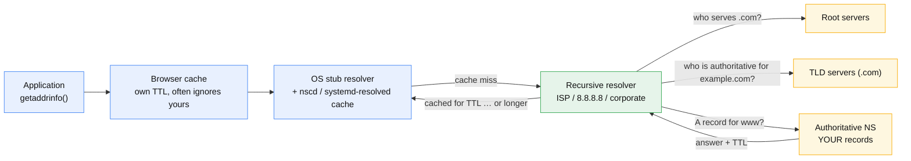

# DNS and anycast

## Core concept

DNS is the only part of your stack whose cache you do not control, cannot inspect, and cannot
purge. Everything difficult about it follows from that one sentence.

Two mechanisms steer traffic, and staff-level discussion is mostly about which one you are
actually relying on. **DNS-based steering** answers different resolvers with different addresses
— easy to reason about, capacity-aware, and slow to change because TTLs are advisory. **Anycast**
announces the same address from many locations and lets BGP pick — near-instant failover, no
client-side state, and almost no control over *which* location a given user reaches.

The trap is treating DNS as a failover mechanism with a latency you can set. You cannot. A TTL is
a request, not an instruction, and the time to move users off a broken endpoint is
`detection + propagation + client cache`, where the last term is unbounded.

## Mechanics & internals

### Resolution, and who actually caches



There are **four** caches between your record and the user, and you control exactly one of them.
Recursive resolvers honour TTLs approximately; some clamp small TTLs upward to reduce their own
load. Browsers keep their own DNS cache with their own policy. Applications that resolve once at
start-up and hold the address forever — a very common JVM and connection-pool behaviour — never
re-resolve at all. That last one is why a planned migration still sends traffic to the old IP a
week later.

### TTL is a trade, not a setting

| TTL | Buys | Costs |
|---|---|---|
| 30–60 s | Fast-ish planned moves | Query volume and resolver load; some resolvers clamp it anyway |
| 300 s | The common default | Five minutes of traffic to a dead endpoint, plus client cache |
| 3600 s+ | Cheap, resilient to a DNS outage | A change takes an hour to an afternoon to be believed |

**Lower the TTL days before a planned change, not during it.** Cutting the TTL from 3600 to 60
only takes effect after the *old* 3600-second record expires everywhere. Doing it at cutover time
changes nothing for the first hour, which is the hour you needed it.

### Steering methods

| Method | How the answer is chosen | Where it breaks |
|---|---|---|
| **Round-robin A records** | Multiple addresses, client picks | No health awareness; a dead IP is handed out until you remove it |
| **Weighted** | Answer proportional to weight | Coarse: resolver-level, not user-level, so a big resolver skews the split |
| **Latency / performance** | Nearest region by measured latency | Measured to the *resolver*, not the user — corporate and public resolvers can be continents away |
| **Geolocation** | Mapped by resolver IP or EDNS Client Subnet | Same resolver problem. ECS helps and is not universally sent |
| **Failover** | Health-checked primary/secondary | Detection plus TTL, so minutes. See below |
| **Anycast** | BGP, not DNS | No per-user control; route changes are outside your system |

### Anycast

Announce one prefix from many sites; each network's BGP picks a path by its own policy. Benefits:
no resolution-time decision, instant-ish failover by **withdrawing** the announcement, and
volumetric attack traffic is split across sites instead of concentrated.

The costs are specific and worth naming:

- **BGP optimises for AS-path length and local policy, not latency.** A user can be routed past
  a nearer site to a further one, and you cannot override another network's policy.
- **A route change can move an in-flight TCP connection** to a different site, which breaks it
  unless the service is stateless or the sites share state. Long-lived connections and anycast
  are an uneasy pair; this is why anycast is common for DNS (single-packet UDP) and needs more
  care for HTTP.
- **Withdrawal is not instant.** Convergence across the internet is tens of seconds, and some
  networks are slower. Draining a site means withdraw, wait, *then* stop serving.

## Numbers that matter

```
Resolution cost (cold, uncached): root + TLD + authoritative ≈ 3 round trips
  at 30-80 ms each  →  100-250 ms BEFORE the first TCP SYN
  A cached answer is ~0 ms. This is why the first request to a new domain feels slow.

DNS failover timeline, from a vendor's own worked example:
  probe interval          30 s
  probe timeout           10 s
  tolerated failures       3      → unhealthy only after the FOURTH consecutive failure
  detection               ≈ 2 minutes
  + DNS TTL                30 s
  + client/browser cache   unbounded
  ────────────────────────────────
  realistic user impact   2-5 minutes, with a long tail

Anycast withdrawal: seconds to tens of seconds of BGP convergence,
  and in-flight connections break rather than drain.

Scale ceilings worth knowing: a managed zone typically caps at ~10,000 records,
  and health checks are capped per account (200 is a real number) — which bounds
  how much of your failover story can live in DNS at all.
```

## Failure modes

| Failure | What it looks like | Why |
|---|---|---|
| **TTL lowered too late** | Cutover takes an hour instead of a minute | The old long TTL must expire before the new short one is seen |
| **Client never re-resolves** | Traffic to a decommissioned IP for days | Runtime cached the address at start-up; DNS is not in the loop at all |
| **Health check misconfigured so every endpoint is "degraded"** | Looks healthy in normal operation, **fails to fail over** | Several providers return all endpoints when all are degraded — a best-effort behaviour that hides a broken probe until the day you need it |
| **Existing connections keep flowing to the dead endpoint** | Errors continue long after the DNS change | DNS steering cannot touch established connections. Only the application can, by limiting session duration |
| **Resolver-based geolocation misroutes** | European users served from us-east | Resolver is in another region and EDNS Client Subnet was not sent |
| **Negative caching (NXDOMAIN) sticks** | A newly created record appears missing for minutes | NXDOMAIN is cached too, per the SOA minimum |
| **Concurrent zone edits rejected** | Automated failover script gets HTTP 400 | Providers serialise changes per zone — a second change while one is in flight is refused |
| **Registrar or DNS provider outage** | Total outage, and your status page is also down | Single provider for DNS is a single point of failure for the company |

**The one to volunteer:** *DNS is not a failover mechanism, it is a migration mechanism.* If your
recovery story has an RTO under a minute, it cannot be built on DNS. Use anycast withdrawal, a
load balancer, or a client that retries a second endpoint.

## Trade-offs vs alternatives

| Option | RTO | Control | Notes |
|---|---|---|---|
| **DNS failover** | Minutes | Coarse, resolver-level | Works everywhere, needs nothing on the client. The default for cross-region DR |
| **Anycast withdrawal** | Tens of seconds | None per-user | Needs your own AS and address space, or a provider that gives it to you |
| **Load balancer with health checks** | Seconds | Precise, per-connection | Only within its own reach; does not survive losing the LB's region |
| **Client-side multi-endpoint retry** | Immediate | Total | Requires you to own the client. Happy Eyeballs is this idea standardised |
| **Service mesh / discovery** | Sub-second | Total | Internal traffic only; does not help a browser |

**Two DNS providers** is the one redundancy decision people skip. Both serve the same zone as
authoritative; losing one leaves the other answering. It costs a zone-sync pipeline and is the
difference between a bad afternoon and a total outage.

## Real-world examples

- **Public DNS resolvers are the canonical anycast deployment** — a single memorable address
  served from hundreds of sites, where UDP's statelessness makes the "route moved mid-flow"
  problem irrelevant.
- **Large DDoS attacks against a single managed DNS provider** have taken down long lists of
  well-known sites at once — not because those sites were attacked, but because their names could
  not be resolved. The lesson stuck as "two providers", and most companies still have one.
- **"We lowered the TTL, why is traffic still going to the old region?"** is the most reliably
  recurring incident in this area, and the answer is nearly always a client that resolved once.

## On AWS and Azure

| | AWS | Azure |
|---|---|---|
| **The service** | Amazon Route 53 (authoritative, anycast), with health checks, latency/geolocation/weighted/failover routing; Global Accelerator for true anycast IPs in front of regional endpoints | Azure DNS for authoritative records; Azure Traffic Manager for DNS-level steering; Azure Front Door for anycast at the edge |
| **What you configure** | Record TTL, routing policy, health check protocol/interval/failure threshold, alias records to AWS endpoints | Routing method (Priority / Weighted / Performance / Geographic / MultiValue / Subnet), probing interval, tolerated failures, probe timeout, profile TTL |
| **The default that bites** | **Route 53 serialises changes per hosted zone**: a second `ChangeResourceRecordSets` while one is still processing is rejected with `PriorRequestNotComplete` and an HTTP 400. An automated failover script that fires concurrent updates fails exactly when it matters. Health checks are capped at **200 active per account** | **When every endpoint is Degraded, Traffic Manager "responds as if all the Degraded status endpoints actually are in an online state."** So a firewall blocking the probes produces a profile that routes traffic normally and *cannot fail over* — it looks healthy from the outside. The doc's own advice is to check the profile reads Online, not Degraded |
| **What it costs you** | 10,000 records per hosted zone by default (more is chargeable), and **100 records with the same name and type** for latency, geolocation, weighted and multivalue routing — a hard ceiling on how granular DNS steering can get | Default probing is **30 s interval, 3 tolerated failures, 10 s timeout**, so an endpoint is marked unhealthy only after the **fourth consecutive failure** — roughly two minutes before the DNS answer even changes, then the TTL on top. Fast probing is 10 s and costs extra. And "Traffic Manager works at the DNS level, it cannot influence existing connections" |

Both vendors document the same uncomfortable truth in different words: **DNS failover is measured
in minutes and cannot drain a live connection.** Design the application to bound session length
if you intend to rely on it, and reach for anycast or a load balancer when the RTO is tighter.

## In an LLM deployment

Model serving inherits one DNS property badly and one well:

- **Badly: long-lived streaming connections.** A completion stream can run for tens of seconds to
  minutes. DNS cannot move it, and under anycast a route change can sever it. Bound session
  length, make the client resume by request id, and never assume a drain will empty the fleet.
- **Well: regional steering by data residency.** Routing EU prompts to EU inference is a
  geolocation-routing problem, and it is one of the rare cases where resolver-level granularity
  is enough — you are picking a jurisdiction, not a millisecond.
- **The one to think about:** provider failover for a third-party model API. Your client resolves
  `api.vendor.com` once and holds it; when the vendor shifts capacity, your pooled connections do
  not follow. Bound connection lifetime explicitly rather than trusting DNS to reach you.

## Staff-level follow-ups

1. You need to move a service between regions with zero user-visible errors. Write the timeline,
   starting a week before, and say what you would monitor to know it is safe to proceed.
2. Your RTO is 30 seconds. Explain why DNS cannot deliver it and what you would use instead.
3. A health check is misconfigured such that all endpoints report unhealthy. Describe what the
   provider does, why that behaviour exists, and how you would detect it before an incident.
4. Anycast or DNS steering for a new global API — argue both sides, then pick, and say what you
   would need to be true about the client to change your answer.
5. Your DNS provider is having an outage. What is your position, and what would you have had to
   build beforehand for it not to be total?

## See also

- [cdn-and-edge-caching.md](cdn-and-edge-caching.md) — the layer DNS and anycast deliver users to
- [tls-and-connection-setup.md](tls-and-connection-setup.md) — the round trips that begin after
  resolution completes
- [replication-topologies.md](replication-topologies.md) — RPO and RTO arithmetic that a DNS-based
  failover plan must respect
- [../patterns/cell-based-architecture.md](../patterns/cell-based-architecture.md) — the blast-radius
  unit a regional evacuation actually moves

## Referenced by

- [Abuse and DDoS](abuse-and-ddos.md)
- [Application protocols](application-protocols.md)
- [CDN and edge caching](cdn-and-edge-caching.md)
- [Design a CDN](../03-backend-cases/cdn.md)
- [Fundamentals index](README.md)
- [TLS and connection setup](tls-and-connection-setup.md)
- [Topic manifest](../topics/manifest.md)

## Sources

- [AWS — Route 53 quotas](https://docs.aws.amazon.com/Route53/latest/DeveloperGuide/DNSLimitations.html) — 10,000 records per hosted zone, 100 records with the same name and type for geolocation/latency/multivalue/weighted routing, 200 active health checks per account, and `PriorRequestNotComplete` (HTTP 400) when a `ChangeResourceRecordSets` request arrives for a zone whose prior request is still processing
- [Azure — Traffic Manager endpoint monitoring](https://learn.microsoft.com/en-us/azure/traffic-manager/traffic-manager-monitoring) — 30 s normal / 10 s fast probing, tolerated failures default 3 (range 0–9), probe timeout default 10 s, the worked failover timeline marking an endpoint Degraded after the fourth consecutive failure, the "all endpoints degraded ⇒ treated as online" best-effort behaviour, and the statement that Traffic Manager cannot influence existing connections
- RFC 1034 / 1035 for resolution, RFC 2308 for negative caching, RFC 8499 for terminology
