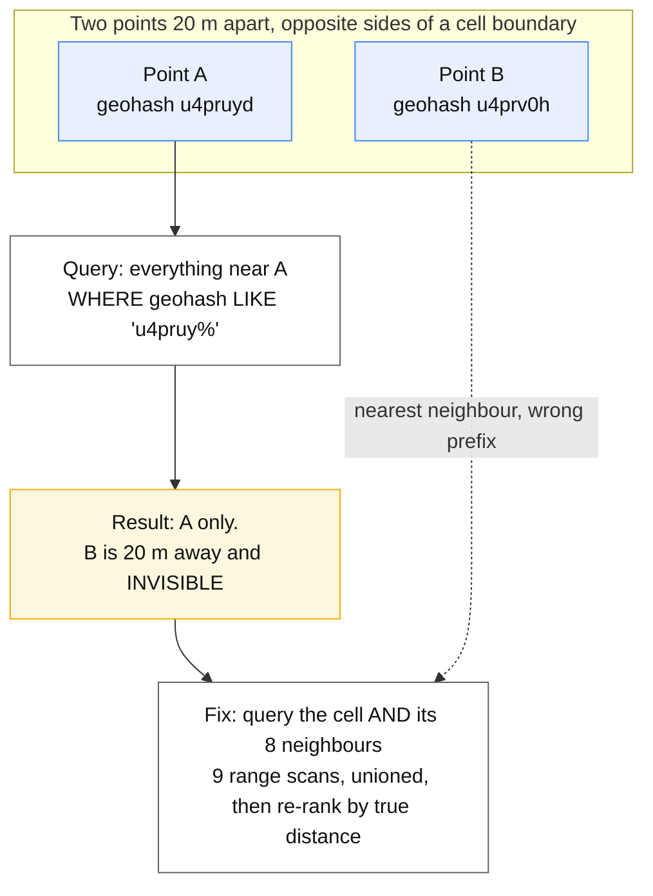

# Geospatial indexing

## Core concept

Every geospatial index is the same trick: **turn two dimensions into one**, so that an ordinary
index — a B-tree, a sorted key, a hash map — can answer a spatial question. The differences
between geohash, S2 and H3 are entirely about *how* the flattening distorts, and every one of
them distorts somewhere.

The distortion is the interview. Two points a metre apart can land in different cells with
different prefixes, so a naive "same prefix" query misses the nearest neighbour. Cells near the
poles are a different physical size from cells at the equator. Square cells have neighbours at two
different distances (edge vs corner), which makes "expand the search ring" mean two things at
once. None of this shows up in a demo with ten points in one city.

The second decision, and the one people get wrong more often, is **static versus moving**. An
index that is perfect for 50 million restaurants that never move is the wrong index for 5 million
drivers reporting position every four seconds, and vice versa.

## Mechanics & internals

### The four schemes

| Scheme | Shape | Encoding | Strength | Weakness |
|---|---|---|---|---|
| **Geohash** | Lat/lng rectangles | Interleaved bits → base32 string; prefix = containing cell | Works in any KV or B-tree store, human-readable, sortable | Cells are not square and vary hugely with latitude; **prefix boundaries are arbitrary** |
| **Quadtree** | Recursive squares | Tree, subdivided where dense | Adapts to density — one cell per ~N objects regardless of city or desert | In-memory structure, needs rebuilding, harder to shard |
| **S2** | Sphere → cube → Hilbert curve | 64-bit cell id, 31 levels | Correct spherical geometry, excellent locality, cell ids are range-queryable | Cells still square-ish, so neighbour distance is non-uniform |
| **H3** | Hexagons | 64-bit index, 16 resolutions | **Six equidistant neighbours** — ring expansion is uniform in every direction | Hexagons cannot tile a sphere perfectly: there are exactly 12 pentagons, always, and they are a real edge case |

### The prefix problem, which is the whole geohash story



**A cell prefix is a containment test, never a distance test.** Any correct proximity query is:

1. Resolve the query point to a cell at a chosen resolution.
2. Collect that cell **and its neighbour ring** — 8 for a square grid, 6 for hexagons.
3. Fetch candidates from those cells.
4. **Re-rank by true great-circle distance** and cut at the radius.
5. If too few results, expand the ring and repeat.

Step 4 is not optional. The index produces *candidates*; only real distance produces *answers*.
Skipping it is the single most common geo bug, and it is invisible in testing because the
approximate answer is usually right.

### Choosing a resolution

Resolution is a tuning parameter with a clear objective: **cells should hold tens of objects, not
thousands and not one.**

- Too coarse → each cell fetch returns thousands of candidates and step 4 becomes the bottleneck.
- Too fine → the neighbour ring must expand many times to find enough results, and you pay a
  round trip per expansion.
- Density varies by four orders of magnitude between Manhattan and the Sahara, so **one global
  resolution is wrong**. Either use a quadtree (which adapts by construction) or store objects at
  two or three resolutions and pick per query based on observed density.

### Static objects vs moving objects

This is the fork that decides the storage, not just the index.

| | Static (restaurants, hotels, stops) | Moving (drivers, deliveries, fleets) |
|---|---|---|
| Write rate | Near zero | Enormous — 5M objects × every 4 s = 1.25M writes/s |
| Data lifetime | Years | Seconds. A position 30 s old is worthless |
| Right home | A real spatial index in a database: PostGIS GiST, or a cell id in a B-tree | **In-memory cell → member map**, replicated for failover, not persisted |
| Query shape | "Within radius, filtered by cuisine and rating, ranked, paginated" | "Which few are near this point, right now" |
| Real cost | The *filter and rank*, not the geo lookup | The write path |

**A spatial database is the wrong answer for moving objects** — you would be paying durability,
indexing and WAL costs for data whose useful life is shorter than a compaction cycle. Keep current
position in memory and stream the trail to a log for anything historical.

**A hand-rolled in-memory grid is the wrong answer for static objects** — you would be
reimplementing a mature R-tree that also does the attribute filtering you need.

### Attribute filtering is usually the real problem

"Restaurants within 2 km" is easy. "Open now, Thai, rated 4+, delivers here, within 2 km, ranked
by a blend of distance and rating, page 3" is a **search** problem with a geo filter attached, not
a geo problem. The usual answer is a search engine with a geo field, or a two-stage design: geo
narrows to a few thousand candidates, then the ranking layer does the rest. Say which stage owns
which constraint.

## Numbers that matter

```
Geohash precision (approximate cell width at the equator):
  5 chars ≈ 4.9 km      6 chars ≈ 1.2 km      7 chars ≈ 153 m      8 chars ≈ 38 m
  ... and at 60° latitude these are roughly HALF as wide in longitude.
  A "±150 m" assumption from a table is wrong for half the planet.

Neighbour ring cost: square grid = 1 + 8 = 9 cell lookups for one query.
  Hexagons = 1 + 6 = 7, and all six at the SAME distance — which is why
  H3's ring expansion converges predictably and a square grid's does not.

H3 pentagons: exactly 12 per resolution, always. Distance and area maths
  around them is anomalous. In practice they fall mostly in ocean, which is
  why nobody notices until the one deployment where they do.

Moving objects: 5M active × 1 update / 4 s = 1.25M writes/s, ~30 s useful life.
  At ~50 bytes per position that is ~60 MB/s of churn and ~2 GB resident.
  Trivial in RAM, absurd in a durable spatial index.

Re-ranking: a 2 km query at a resolution holding ~50 objects/cell returns
  ~450 candidates from 9 cells. 450 haversine computations is microseconds —
  the fetch dominates, not the maths. Do not optimise the distance function.
```

## Failure modes

| Failure | Looks like | Why |
|---|---|---|
| **Boundary misses** | "The closest one isn't in the results" | Queried one cell's prefix without the neighbour ring |
| **No re-ranking** | Results are *nearly* right; the order is subtly wrong | Cell containment used as a proxy for distance |
| **One resolution globally** | Fast in the desert, times out in Manhattan | Cell occupancy varies by orders of magnitude |
| **Antimeridian and poles** | Queries near ±180° longitude return nothing or everything | Rectangular reasoning applied to a sphere. S2 handles it; naive lat/lng maths does not |
| **Hot cell** | One city centre saturates one shard | Cell id used directly as the partition key — geography *is* the skew |
| **Persisting moving positions** | Write amplification, compaction storms, cost | Durable index used for data with a 30-second lifetime |
| **Stale index after move** | An object appears in two cells, or none | Cell membership updated non-atomically on move; needs remove-then-add under one lock, or a version per object |
| **Unindexed spatial predicate** | Query works, cost is 100× expected | The spatial function ran as a scan because no spatial index covered the path |

## Trade-offs vs alternatives

| Option | Take it when | Give up |
|---|---|---|
| **Geohash in a sort key** | You have a KV store and nothing else; simplicity matters | Non-uniform cells, manual neighbour handling, no built-in distance |
| **S2 cell ranges** | You need correct spherical geometry and range scans | Square-cell neighbour asymmetry; a library dependency |
| **H3** | Ring expansion, aggregation and hexbin analytics matter | The 12 pentagons; conversion cost at high resolutions |
| **PostGIS / R-tree** | Static data, complex predicates, polygons, joins | Write throughput — this is not for moving objects |
| **Search engine geo field** | The query is mostly filtering and ranking | Another system; index freshness becomes a concern |
| **In-memory grid** | Moving objects, seconds of lifetime | Durability, and you own replication |

## Real-world examples

- **H3 came out of ride-hailing** precisely because ring expansion is the core operation of
  supply/demand matching, and hexagons make "one ring further out" a uniform statement.
- **S2 is the long-standing choice for planet-scale static geodata** because Hilbert-curve cell
  ids give both locality and range-scannability in one 64-bit integer.
- **Geohash persists in interviews and in production** because it needs no library: a base32
  string in any sorted index gets you 80% of the way, and the remaining 20% is the neighbour ring.

## On AWS and Azure

| | AWS | Azure |
|---|---|---|
| **The service** | DynamoDB with a cell id as the partition or sort key (the geohash-range pattern); Aurora/RDS PostgreSQL with **PostGIS**; OpenSearch with `geo_point`; Amazon Location Service for geofencing and tracking | Azure Cosmos DB for NoSQL with **spatial indexes** over GeoJSON; Azure Database for PostgreSQL with PostGIS; Azure AI Search with geo fields; Azure Maps |
| **What you configure** | The key schema (which cell id, at which resolution, as partition vs sort key); a GiST index on a `geography` column in PostGIS | The container's indexing policy — `spatialIndexes` with a `path` and `types` of `Point`, `Polygon`, `LineString`, `MultiPolygon`; the partition key |
| **The default that bites** | **DynamoDB has no two-dimensional range query.** There is no "between these latitudes and these longitudes" — that is the entire reason the cell id exists, and it means the neighbour ring is 9 separate queries you issue and merge yourself. Nothing warns you; the one-cell version simply returns slightly wrong answers | Cosmos DB says **"All containers include a default indexing policy that will successfully index geospatial data"** — so `ST_DISTANCE` works immediately and people ship it. A custom indexing policy that excludes paths, or one written before the location field existed, silently removes that index and the same query becomes a scan with the same results and a very different RU bill |
| **What it costs you** | The cell id is the partition key, and **geography is skewed by nature** — a Manhattan cell is not a Sahara cell. This is the hot-partition problem from [hot-shard-mitigation.md](hot-shard-mitigation.md) with a physical cause, and a uniform resolution guarantees it | A Cosmos logical partition is capped at **10,000 RU/s and 20 GB**. Partitioning by cell id therefore puts a hard ceiling on a dense city, so the partition key is usually cell id **plus** a salt or a category — not cell id alone. Note also that Entity Framework does not support spatial data for Cosmos NoSQL; you need the SDK's own spatial types |

Neither cloud gives you ring expansion for free. Both make the same point from opposite
directions: the index finds candidates, **your code computes distance**, and the partition key is
where geography turns into an operational problem.

## In an LLM deployment

Geospatial and vector search are the same shape — nearest neighbour in a metric space — and the
comparison is worth having straight, because people reach for the wrong one:

- **Two or three dimensions with a true metric: use a geo index.** Exact, cheap, and every
  distance is verifiable. A 768-dimensional embedding is a different problem with a different
  answer; see [../06-ml-cases/rag-assistant.md](../06-ml-cases/rag-assistant.md).
- **Do not embed coordinates into a vector index.** It sounds unifying and it is strictly worse:
  approximate recall, no exact radius, and no way to express "within 2 km" as a hard constraint.
  Filter geographically first, then search semantically over the survivors.
- **Filtered vector search is where the two collide.** "Restaurants like this description, within
  2 km" requires the geo filter and the ANN search to compose, and naive post-filtering destroys
  recall — you retrieve 100 nearest by embedding, then discard the 97 outside the radius. The
  filter must be pushed into the search, which is a real capability difference between vector
  stores and the thing to check before choosing one.
- **A model is not a distance function.** Asking one which of two places is nearer produces a
  fluent answer with no arithmetic behind it. Compute the distance, then let the model explain it.

## Staff-level follow-ups

1. A user reports the nearest store is missing from the results. Walk me from that report to the
   root cause, and give me the fix at the right layer.
2. Choose an index for 50 million static places *and* for 5 million moving vehicles. Justify why
   they are different answers, and what you would share between them.
3. Your cell id is the partition key and one city is 40% of traffic. Three options, with costs.
4. How would you pick the cell resolution, and how would you know later that you picked wrong?
5. "Within 2 km, open now, rated 4+, ranked by distance and rating, paginated." Which system owns
   which part, and where does pagination stability break?

## See also

- [partitioning-strategies.md](partitioning-strategies.md) — cell id as a partition key, and the
  scatter-gather cost of getting it wrong
- [hot-shard-mitigation.md](hot-shard-mitigation.md) — geographic skew is hot-shard skew with a
  physical cause
- [indexing-and-query-planning.md](indexing-and-query-planning.md) — why a spatial predicate
  silently becomes a scan
- [pagination-patterns.md](../patterns/pagination-patterns.md) — paging a distance-ranked result
  set whose contents move

## Referenced by

- [Design a proximity service](../03-backend-cases/proximity-service.md)
- [Fundamentals index](README.md)
- [Pagination patterns](../patterns/pagination-patterns.md)
- [Topic manifest](../topics/manifest.md)

## Sources

- [Azure — index and query GeoJSON location data in Cosmos DB](https://learn.microsoft.com/en-us/azure/cosmos-db/nosql/query/geospatial-index) — "All containers include a default indexing policy that will successfully index geospatial data"; `spatialIndexes` policy with `path` and `types`; `ST_DISTANCE` / `ST_WITHIN` / `ST_INTERSECTS`; Entity Framework does not support spatial data for Cosmos DB for NoSQL
- [Azure — Cosmos DB service quotas and default limits](https://learn.microsoft.com/en-us/azure/cosmos-db/concepts-limits) — 10,000 RU/s and 20 GB per logical partition
- S2 Geometry (Hilbert-curve cell ids, 31 levels) and Uber H3 (16 resolutions, 12 pentagons per resolution) library documentation
- PostGIS documentation for GiST indexing of `geography` and `geometry` columns

**Cut, not softened:** no numeric claim is made here about Amazon Location Service quotas. Its
quota page would not render when fetched on 2026-09-23, and this corpus does not publish vendor
numbers from memory.
