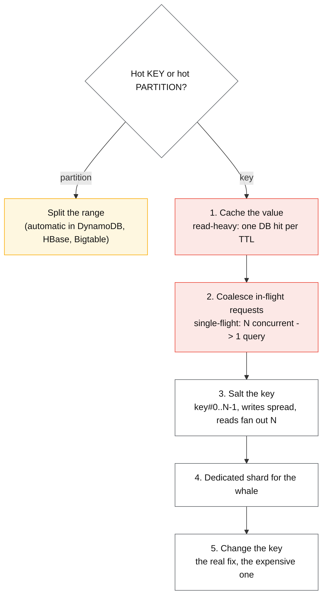
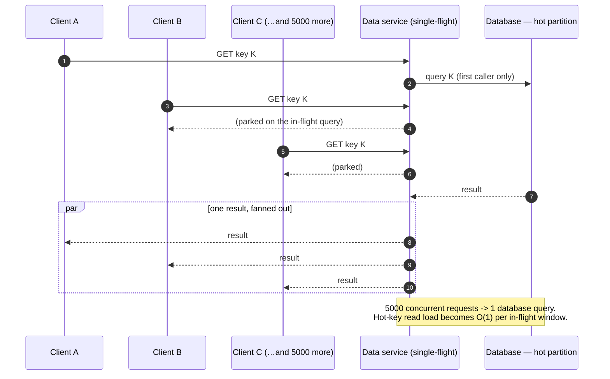

# Hot shard mitigation

## Core concept

Adding shards fixes *volume*. It does nothing for **skew**, because a hot key hashes to exactly one
partition no matter how many partitions exist. This is the failure that surprises teams: the
cluster is at 20% utilisation, one node is at 100%, and scaling out makes the graph look better
while changing nothing for the users being throttled.

Two distinct problems hide under "hot shard", and they have different fixes:

- **A hot key** — one partition-key value receives disproportionate traffic. Sharding cannot help;
  only replication of that value (cache, salt, fan-out) can.
- **A hot partition** — a range or slot receives disproportionate traffic across many keys.
  Splitting helps, and most managed stores do it automatically.

Getting this distinction wrong is the most common wasted quarter in this area: teams reshard to
fix a hot key and land exactly where they started.

## Mechanics & internals

### Detection, before it pages you

You cannot mitigate what you cannot see, and aggregate metrics are designed to hide skew. A shard
at 100% among 50 shards moves the cluster average by 2%.

| Signal | What it catches | Where |
|---|---|---|
| **Per-partition throughput distribution** (max/median ratio) | Skew, before saturation | The single most useful chart; alert on ratio > 3 |
| **Top-N key sampling** (count-min sketch on the router) | The specific offending key | Cheap: a sketch per interval, not full counting |
| **Throttled/rejected request counts by key prefix** | Skew already hurting | DynamoDB `ThrottledRequests`, Cassandra `tombstone`/timeout counters |
| **Per-key latency histograms** | Read amplification on one partition | Emit key-space bucket as a label — **watch cardinality** |
| Cluster-average CPU | Nothing. It is the metric that let this happen | — |

DynamoDB exposes this directly through CloudWatch Contributor Insights, which reports the most
accessed and most throttled keys. If your store does not, a count-min sketch on the router costs
kilobytes and answers the question in production.

### The mitigation ladder — cheapest first



**1. Cache.** For a read-hot key this is close to free and close to complete: one database read per
TTL regardless of request rate. The caveat is the stampede on expiry — a hot key is precisely the
key whose expiry causes a thundering herd, so it needs single-flight or probabilistic early
refresh, not a plain TTL.

**2. Request coalescing (single-flight).** Concurrent identical requests share one in-flight query;
the rest wait on its result. This is the highest-leverage and least-used technique in the list:
it converts a traffic spike on one key into a constant, and it requires no data-model change.
Discord built exactly this into their Rust "data services" layer in front of ScyllaDB so that a
viral message channel produces one database query rather than thousands.

**3. Salting.** Append a bucket suffix: `key#0` … `key#N-1`. Writes pick a random or
round-robin bucket; reads must query all N and merge.

```
write:  put(f"{key}#{random(0,N)}", value)
read:   merge(get(f"{key}#{i}") for i in range(N))   ← N times the read cost, forever
```

The arithmetic that decides N: salting multiplies read cost by N and divides write concentration by
N. For a **write-hot, read-rare** key (event ingestion, counters) it is excellent. For a
**read-hot** key it is actively harmful — you have turned one read into N. Choose N from the
overload ratio, not from a round number: if the key is 8× over the partition limit, N=16 gives
headroom without a 100× read penalty.

**4. Dedicated shard.** For a known whale tenant, route it to its own physical shard. Operationally
clean, requires directory-style routing, and works only when the whale is identifiable in advance —
which for B2B tenants it usually is, and for viral consumer content it never is.

**5. Change the key.** Adding a component that spreads (time bucket, region, sub-entity) is the
permanent fix and a full data migration. Do it once, deliberately, with the expand-contract
pattern.

### Split-for-heat, and its limits

Managed stores automate the *partition* case. DynamoDB monitors sustained throughput against the
per-partition ceiling and **splits for heat**: the partition divides at a sort-key boundary and its
items redistribute, doubling the available capacity for that item collection. Two limits decide
whether it saves you:

- **Time.** Adaptive capacity and splitting are not instant. Expect minutes of degraded
  performance while it reacts — fine for a business-hours ramp, useless for a flash crowd.
- **A Local Secondary Index blocks it.** LSIs constrain an item collection to 10 GB on a single
  partition, so **DynamoDB cannot split a partition that has one**. A design decision made for
  query convenience silently removes the platform's main defence against heat.

And splitting never helps a single hot key: one partition-key value cannot be divided across
partitions, which is why the platform's own guidance is to add a sharding suffix — salting, by
another name.



### The celebrity problem, which is the same problem wearing a hat

A fan-out-on-write feed design breaks on the account with 100 M followers: one write becomes
100 M inserts. The standard resolution is a **hybrid threshold** — fan out on write for normal
accounts, and for accounts above a follower threshold do nothing at write time and merge their
posts in at read time. Read-time merge is more expensive per read but bounded, and there are few
celebrities. The general principle transfers: **when one key's work is unbounded, move that key's
work to a path whose cost is bounded and paid by the many rather than concentrated on the one.**

## Numbers that matter

| Quantity | Value | Confidence |
|---|---|---|
| DynamoDB per-partition ceiling | 3 000 RCU / 1 000 WCU | [AWS docs](https://docs.aws.amazon.com/amazondynamodb/latest/developerguide/throttling-key-range-limit-exceeded-mitigation.html) — hard, independent of table capacity |
| Adaptive capacity / split-for-heat reaction | Minutes, not seconds | Vendor behaviour; plan for the gap, do not rely on it for spikes |
| Skew alert threshold | max-partition load / median > **3×** | Convention, and early enough to act |
| Salt bucket count | Derived from overload ratio, typically 4–64 | Every extra bucket is a permanent read multiplier |
| Single-flight effect on a read-hot key | N concurrent → 1 query, for the duration of one query | Structural, not statistical |
| Cache hit ratio needed to save a hot key | `1 − (partition_limit / offered_load)` | e.g. 30 k reads/s against a 3 k ceiling needs ≥ 90% hit rate |
| Celebrity fan-out threshold | 10 k–1 M followers depending on write cost | Order of magnitude; the threshold is a tuning knob, its existence is the design |

**Worked example.** A viral channel receives 30 k reads/s against a partition ceiling of 3 k.
Options: cache at ≥ 90% hit rate (one moderate cache node); single-flight, which caps database
concurrency regardless of request rate; or salt into 16 buckets, which fixes it and multiplies
*every* read of *every* channel using that access path by 16 — the wrong tool for a read-hot key.
The arithmetic picks the answer; intuition usually picks salting.

## Failure modes

| Failure | Symptom | Mitigation |
|---|---|---|
| **Scaling out to fix a hot key** | More nodes, identical throttling, higher bill | Distinguish hot key from hot partition before acting |
| **Salting a read-hot key** | Read latency and cost multiply by N; the fix makes it worse | Salt only write-hot, read-rare keys |
| **Cache stampede on the hot key** | The moment the TTL expires, thousands of requests hit one partition | Single-flight + probabilistic early expiry; never a bare TTL on a hot key |
| **LSI silently blocks split-for-heat** | Throttling that the platform "should" have fixed automatically | Know which index types disable splitting; prefer GSIs |
| **Skew invisible in dashboards** | Cluster looks healthy at 20% while users are timing out | Chart max/median per-partition load, not the average |
| **Unsalting is forgotten** | The salt outlives the hotness; every read pays N forever | Make bucket count a per-key config, revisit it |
| **Retry amplification on the hot key** | Clients retry the throttled key, multiplying its load — a metastable loop | Retry budgets, backoff with jitter, and shed the hot key specifically |
| **Hot key created by a bug** | One client polls one key in a tight loop | Per-key rate limiting at the router; the fix is upstream, not in the database |

**Documented case.** Discord's Cassandra fleet suffered **cascading latency from hot partitions**:
traffic concentrated on one partition degraded not just that partition but the cluster, because
LSM reads may consult the memtable plus several SSTables, making a hot *read* partition far more
expensive than a hot write partition — and because Cassandra's JVM garbage collection turned those
latency spikes into stalls. Their response was three-layered and worth copying: a composite
`(channel_id, bucket)` key so no channel is one unbounded partition, a data-services layer that
**coalesces concurrent identical requests** so a viral channel produces one query, and a move to a
C++ engine to remove GC from the tail-latency equation.
([Discord engineering](https://discord.com/blog/how-discord-stores-trillions-of-messages))

## Trade-offs vs alternatives

| Technique | Fixes | Costs | Reversible? |
|---|---|---|---|
| **Cache** | Read-hot keys | Staleness; stampede risk | Yes, trivially |
| **Single-flight / coalescing** | Read-hot keys, spikes | A little latency for parked callers; needs a service layer | Yes |
| **Salting** | Write-hot keys | N× read cost forever; merge logic | Painfully — requires backfill |
| **Split (automatic)** | Hot *partitions* | Minutes of lag; blocked by LSIs | N/A — platform-managed |
| **Dedicated shard** | Known whales | Routing complexity; capacity stranded per tenant | Yes, with a move |
| **Change the partition key** | Everything, permanently | Full migration with dual writes | No |
| **Rate-limit the hot key** | Protects everyone else | The hot tenant is degraded — a product decision | Yes |

### Where staff engineers get this wrong

1. **Resharding to fix skew.** More partitions do not divide one key. State which of the two
   problems you have before proposing a fix.
2. **Reaching for salting first.** It is the most-taught technique and the narrowest: correct for
   write-hot keys, harmful for read-hot ones.
3. **Relying on adaptive capacity for spikes.** It reacts in minutes. A flash crowd is over, or
   has already caused the incident, by then.
4. **Not designing for the celebrity before one exists.** The threshold-based hybrid costs little
   to build up front and is a rewrite under load.
5. **Forgetting retries.** A throttled hot key plus naive client retries is a metastable failure:
   load stays high after the original spike ends because the retries sustain it.
6. **Treating rate-limiting the whale as a technical decision.** Degrading your largest customer
   to protect the rest is a product and contractual choice; make it explicitly, with the account
   team, before the incident.

## Real-world examples

- **Discord** — composite bucketed partition key, request coalescing in a Rust data-services tier,
  and an engine change to eliminate GC-driven tail latency.
- **DynamoDB** — split-for-heat and adaptive capacity, with documented per-partition ceilings and
  the LSI caveat; Contributor Insights for top-N key detection.
- **Twitter/X feed architecture** — the canonical celebrity hybrid: fan-out on write for most
  accounts, read-time merge above a follower threshold.
- **Bigtable / HBase** — automatic range splitting; the classic anti-pattern in their own docs is a
  monotonically increasing row key concentrating writes on the last region.
- **CDN edge caching** — the same idea one layer out: a viral object is served from thousands of
  edge caches rather than the origin. "Replicate the hot thing" is the whole family.

## Staff-level follow-ups

1. A single partition key receives 40× the average traffic. Walk through your decision procedure,
   and state the one measurement that determines whether you salt or cache.
2. Design detection for a store that exposes no per-key metrics. What do you sample, where does it
   run, what does it cost, and what is the alert?
3. Your table has an LSI and is throttling on one partition. Explain why the platform is not
   splitting it, then give the migration path off the LSI including how you keep the query working
   throughout.
4. A key is salted into 32 buckets and the hotness ended six months ago. Describe the unsalting
   migration and the risk at each step.
5. Compare rate-limiting a whale tenant against giving it a dedicated shard, on cost, blast radius,
   fairness, and what you tell the customer. Which do you choose at 10 tenants, and at 10 000?

## See also

- [partitioning-strategies.md](./partitioning-strategies.md) — choosing a key that does not create this
- [consistent-hashing.md](./consistent-hashing.md) — bounded loads as a placement-level defence
- [../02-primitives/caching.md](../02-primitives/caching.md) — stampedes, single-flight, probabilistic expiry
- [../02-primitives/reliability-patterns.md](../02-primitives/reliability-patterns.md) — retry budgets and shedding around a hot key
- [../03-backend-cases/news-feed.md](../03-backend-cases/news-feed.md) — the celebrity problem in a full design

## Referenced by

- [Cache failure modes](cache-failure-modes.md)
- [Consistent hashing](consistent-hashing.md)
- [Fundamentals index](README.md)
- [Partitioning strategies](partitioning-strategies.md)
- [Replication and partitioning](../02-primitives/replication-and-partitioning.md)
- [Replication lag and session guarantees](replication-lag-and-session-guarantees.md)
- [Topic manifest](../topics/manifest.md)

## Sources

- [Discord — How Discord stores trillions of messages](https://discord.com/blog/how-discord-stores-trillions-of-messages) — hot partitions, coalescing, bucketed keys
- [AWS — key range throughput exceeded (hot partitions)](https://docs.aws.amazon.com/amazondynamodb/latest/developerguide/throttling-key-range-limit-exceeded-mitigation.html)
- [AWS — burst and adaptive capacity, split for heat](https://docs.aws.amazon.com/amazondynamodb/latest/developerguide/burst-adaptive-capacity.html)
- [AWS — using write sharding to distribute workloads evenly](https://docs.aws.amazon.com/amazondynamodb/latest/developerguide/bp-partition-key-sharding.html)
- [Google Cloud Bigtable — schema design and row-key anti-patterns](https://cloud.google.com/bigtable/docs/schema-design)
